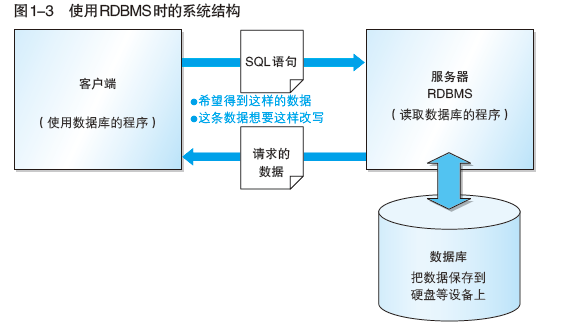
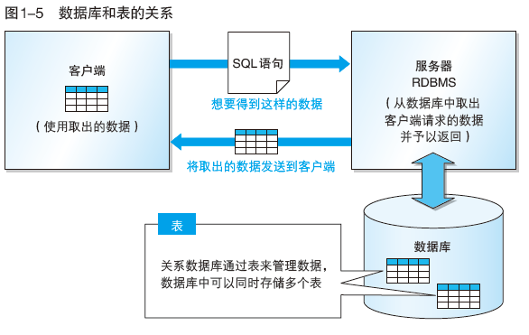
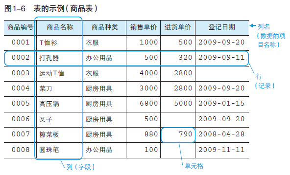

# 概念

## DB DBMS RDBMS

数据库管理系统（DBMS，Database Management System）：管理数据库的计算机系统

关系数据库管理系统（RDBMS）：关系数据库通过关系数据库管理系统进行管理

数据库（DB，Database）：数据合集

## DBMS种类

| 类型                                             | 特点                                                         |
| ------------------------------------------------ | ------------------------------------------------------------ |
| 层次数据库（Hierarchy Database，HDB）            | 数据通过层次结构（树形结构）表现出来                         |
| 关系数据库（Relational Database，RDB）           | 由行和列组成的二位表来管理数据，专门语言SQL（Structured Query Language，结构化查询语言） |
| 面向对象数据库（Object Oriented Database，OODB） | 把数据以及对数据的操作集合起来以对象为单位进行管理           |
| XML数据库（XML Database，XMLDB）                 | 对XML形式的数据进行高速处理                                  |
| 键值存储系统（Key-Value Store，KVS)              | 保存查询所用的主键和值的组合的数据库                         |

# 数据库和SQL

## 常见系统结构

客户端/服务器端（C/S类型）

## 常见表结构

用来管理数据的二维表在关系数据库中简称为表，查询语句返回的结果也是二维表的形式

表的**列**成为**字段**

表的**行**称为**记录**，**数据库以行为单位进行读写**

## SQL概要

SQL分为三类：

| 类型                                                | 说明                                                         | 指令                                                         | 对象                                   |
| --------------------------------------------------- | ------------------------------------------------------------ | :----------------------------------------------------------- | -------------------------------------- |
| **DDL（Data Definition Language，数据定义语言）**   | 创建或者删除存储数据的用的数据库以及数据库中的表等对象       | **create**：创建数据库和表等对象   **drop**:杀出数据库和表等对象  **alter**：修改数据库和表等对象的结构 | **数据库和表**                         |
| **DML（Data Manipulation Language，数据操纵语言）** | 查询和变更表中的记录                                         | **select**：查询表中的数据   **insert**：向表中插入新数据     **update**：更新表中的数据   **delete**：删除表中的数据 | **操作表中的数据**                     |
| **DCL（Data Control Language，数据控制语言）**      | 确认或取消对数据库中数据进行的变更，对RDBMS的用户是否有权限操作数据库中的对象（数据库表等）进行设定 | **commit**：确认对数据库中的数据进行的变更  **rollback**：取消对数据库中数据进行的变更     **grant**：赋予用户操作权限       **revoke**：取消用户的操作权限 | **数据变更的确认与回滚；用户操作权限** |

### SQL基本书写规则

关键字（select、表名、列名等）不区分大小写，插入的数据区分大小写

字符串和日期常熟需要使用单引号（'）括起来

数字常量无需加注单引号（直接书写数字）

