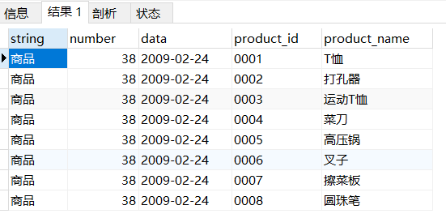
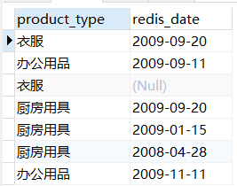
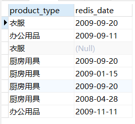
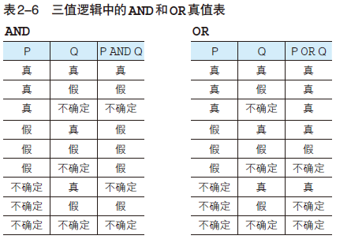

# 1. 概念

## DB DBMS RDBMS

数据库管理系统（DBMS，Database Management System）：管理数据库的计算机系统

关系数据库管理系统（RDBMS）：关系数据库通过关系数据库管理系统进行管理

数据库（DB，Database）：数据合集

## DBMS种类

| 类型                                             | 特点                                                         |
| ------------------------------------------------ | ------------------------------------------------------------ |
| 层次数据库（Hierarchy Database，HDB）            | 数据通过层次结构（树形结构）表现出来                         |
| 关系数据库（Relational Database，RDB）           | 由行和列组成的二位表来管理数据，专门语言SQL（Structured Query Language，结构化查询语言） |
| 面向对象数据库（Object Oriented Database，OODB） | 把数据以及对数据的操作集合起来以对象为单位进行管理           |
| XML数据库（XML Database，XMLDB）                 | 对XML形式的数据进行高速处理                                  |
| 键值存储系统（Key-Value Store，KVS)              | 保存查询所用的主键和值的组合的数据库                         |

# 2. 数据库和SQL

## 2.1 常见系统结构

客户端/服务器端（C/S类型）


## 2.2 常见表结构

用来管理数据的二维表在关系数据库中简称为表，查询语句返回的结果也是二维表的形式


表的**列**成为**字段**

表的**行**称为**记录**，**数据库以行为单位进行读写**


## 2.3 SQL概要

SQL分为三类：

| 类型                                                | 说明                                                         | 指令                                                         | 对象                                   |
| --------------------------------------------------- | ------------------------------------------------------------ | :----------------------------------------------------------- | -------------------------------------- |
| **DDL（Data Definition Language，数据定义语言）**   | 创建或者删除存储数据的用的数据库以及数据库中的表等对象       | **create**：创建数据库和表等对象   **drop**:杀出数据库和表等对象  **alter**：修改数据库和表等对象的结构 | **数据库和表**                         |
| **DML（Data Manipulation Language，数据操纵语言）** | 查询和变更表中的记录                                         | **select**：查询表中的数据   **insert**：向表中插入新数据     **update**：更新表中的数据   **delete**：删除表中的数据 | **操作表中的数据**                     |
| **DCL（Data Control Language，数据控制语言）**      | 确认或取消对数据库中数据进行的变更，对RDBMS的用户是否有权限操作数据库中的对象（数据库表等）进行设定 | **commit**：确认对数据库中的数据进行的变更  **rollback**：取消对数据库中数据进行的变更     **grant**：赋予用户操作权限       **revoke**：取消用户的操作权限 | **数据变更的确认与回滚；用户操作权限** |

### SQL基本书写规则

1. 关键字（select、表名、列名等）不区分大小写，插入的数据区分大小写

2. 字符串和日期常熟需要使用单引号（'）括起来

3. 数字常量无需加注单引号（直接书写数字）
4. 单词之间使用半角空格或者换行进行分隔

## 2.4 数据库

## 数据库创建

```mysql
create database <数据库名称>;
```

## 2.5 表

### 创建表

```mysql
create table <表名>
(列名1 <数据类型> <该列所需约束>，
列名2 <数据类型> <该列所需约束>，
.
.
.
<该表中的约束条件1>，<该表中的约束条件2>,...);
```

- 半角英文字母、数字、下划线（_）作为数据库、表和列的名称
- 在数据库中不能创建两个相同名称的表，在同一个表中也不能创建两个名称相同的列

#### 数据类型

#### **数字型、字符型和日期型**

| 类型    | 说明                                                         |
| ------- | ------------------------------------------------------------ |
| Integer | 存储整数的列的数据类型                                       |
| Char    | 定长字符串，存储字符串的列的数据类型，char(10)、char(20）等，指定字符串的长度（最大长度） |
| varchar | 指定存储字符串的列的数据类型（字符串类型），可变长字符串的形式保存字符串 |
| date    | 指定存储日期（年月日）的列的数据类型                         |

#### 约束的设置

除数据类型之外，对列中存储的数据进行限制或者追加条件的功能。

例如：

```mysql
not null约束
null约束
primary key(product_id)  //主键约束
```

**键**：指定特定数据时使用的列的组合

### 表的删除和更新

#### 表的删除

```mysql
drop table 表名;
```

#### 表定义的更新

- 添加列

  ```mysql
  alter table 表名 add column 列的定义;
  
  alter table product add column product_name_pinyin varchar(100) not null;
  ```

- 删除列

  ```mysql
  alter table 表名 drop column 列名;
  
  alter table product drop column product_name_pinyin;
  ```

### 表中数据

#### 插入数据

```mysql
insert into 表名 values(xxx,xxxx);

START TRANSACTION;
INSERT INTO Shohin VALUES ('0001', 'T恤' ,'衣服', 1000, 500, '2009-09-20');
INSERT INTO Shohin VALUES ('0002', '打孔器', '办公用品', 500, 320, '2009-09-11');
COMMIT;
```

#### 数据删除


#### 数据更新


# 3. 查询基础

## 3.1 select基础

- 基础的select语句

```mysql
select 列名,列名,...
from 表名
```

查询结果中列的顺序和select子句中的顺序相同

查询全部列时，使用**代表所有列的星号 *** （但是结果的显示顺序就没有办法进行设定，只能按照create tabel的定义对列进行排序）

```mysql
select * from 表名
```

- 设定别名

  使用**as关键字**为**列设定别名**，使用中文的时候，使用双引号（“）括起来。

  ```mysql
  select product_id as id,  
  	   product_name as name,
  	   purchase_price as price
  from Product;
  
select product_id as "商品编号",  
  	   product_name as "商品名称",
  	   purchase_price as "进货单价" 
  from Product;
  ```
  
- 常数的查询

  select语句书写常数，该列的值展示为常数

  ```mysql
  select '商品' as string, 38 as number,'2009-02-24' as data,product_id,product_name
  from product;
  ```

  

- distinct 

  **distinct关键字只能用在第一个列名之前**，不能使用```regist_date, distinct product_type```

  **distinct会将null视为一类数据**

  对一列数据使用distinct 	```select distinct(product_price) from product;```

  对多列数据使用distinct，将多列的数据进行组合	```select distinct product_type,regist_date from product```，product_type,regist_date相同的数据合并，只展示一条数据

  

  

- 注释的写法

  单行注释：--

  多行注释：/* */

## 3.2 算术运算符和比较运算符

### 算术运算符

| 类型 | 说明 |
| ---- | ---- |
| +    |      |
| -    |      |
| *    |      |
| /    |      |

```mysql
//SQL语句中使用运算表达式
select product_name, sale_price,sale_price*2 as 'sale_price_x2' from product;
```

数值大小比较的运算，返回结果的符号

**所有包含NULL的算术计算，结果肯定是NULL**，例如 5+NULL, 10-NULL, 1*NULL, NULL/9, NULL/0

### 比较运算符

- 比较运算符可以对字符、数字和日期等几乎所有数据类型的列和值进行比较。

- <u>对字符串类型的数据进行大小比较时，使用的是和数字比较不同的规则</u>，典型规则包括：字典序顺序等，'1'>'10'>'11'>'2'>'222'>'3'。

| 类型            | 示例                                    |
| --------------- | --------------------------------------- |
| <>    不等于    | where sale_price <> 500; /* 不等于500*/ |
| =       等于    |                                         |
| \>=    大于等于 |                                         |
| \>      大于    |                                         |
| <=    小于等于  |                                         |
| <      小于     |                                         |

- null的判断不通过比较运算符 通过 ```is null```和```is not null```

  判断是否是NULL的```is null```运算符

  判断不是NULL的运算符，```is not null```

  ```mysql
  select * from Product where purchase_price is null;
  ```

## 3.3 逻辑运算符

| 逻辑运算符                  | 说明                                                      | 例子                                                         |
| :-------------------------- | --------------------------------------------------------- | ------------------------------------------------------------ |
| NOT （等价于比较运算符 <>） | 用于否定某一条件                                          | select * from product where not price>1000;                  |
| AND                         | 查询条件组合，均成立**（AND运算符的优先级高于OR运算符）** | select * from product where type="xxx" and sale_price>=3000; |
| OR                          | 查询条件组合，只有一个成立                                | select * from product where type="xxx"  or sale_price >=3000; |
| 括号 ()                     | 对查询条件执行顺序进行调整                                | where product_type="xxx" and (regist_date='2009-08' or regist_date='2009-09'); |
| 真值（真TRUE，假FALSE）     |                                                           |                                                              |

注：

- NOT、AND、OR成为逻辑运算符，对比较运算符等返回的真值进行操作
- 比较运算符会将运算结果以真值的形式返回，例如sale_price>=3000，成立返回FALSE，不成立返回TRUE

# 4.NULL

- <u>distinct会将NULL视为一类数据</u>

- <u>所有包含NULL的算术计算，结果肯定是NULL</u>，例如 5+NULL, 10-NULL, 1*NULL, NULL/9, NULL/0

- <u>NULL的判断不通过比较运算符 通过 ```is null```和```is not null```进行数据的选中，提取</u>；如果通过比较运算符进行NULL判断，则不会取出含NULL的数据

  判断是否是NULL的```is null```运算符

  判断不是NULL的运算符，```is not null```

  ```mysql
  select * from Product where purchase_price is null;
  ```

- 除真假之外的第三种值--不确定（UNKNOWN），**SQL中的逻辑运算成为三值逻辑**

  

- 

# 5. 聚合和排序

## 5.1 聚合函数

对数据进行某种操作或计算时使用的函数，聚合函数或者聚集函数（将多行汇总为一行）。

| 名称      | 解释                         | 补充                                                         |
| --------- | ---------------------------- | ------------------------------------------------------------ |
| **count** | 计算表中的记录数（行数）     | **count(*)查找包含NULL在内的全部数据的行数；count(列名)会得到NULL之外的数据行数；** |
| **SUM**   | 计算表中数值列中数据的合计值 | **将”NULL除外”，只针对数值类型的列**                         |
| **AVG**   | 计算表中数值列中数据的平均值 | 计算时将NULL除外，不作为分母，**只针对数值类型的列**         |
| **MAX**   | 求出表中任意列中数据的最大值 | **原则上适用任意数据类型的列；**                             |
| **MIN**   | 求出表中任意列中数据的最小值 | **原则上适用任意数据类型的列；**                             |

## 5.2 表分组 group by

数据库的执行顺序决定了先进行分组，然后进行聚合函数处理

（where筛选过滤后，执行group by关键字分组，再执行select语句）

### 数据库关键字的执行顺序

执行顺序为：(标号为顺序)

from  -- on -- join -- where -- group by -- having -- select --  distinct -- order by -- limit

```mysql
(7) SELECT
(8) DISTINCT <select_list>
(3) FROM <join_type> JOIN <right_table>
(2) ON <join_condition>
(4) WHERE <where_condition>
(5) GROUP BY <group_by_list>
(6) HAVING <having_condition>
(9) ORDER BY <order_by_condition>
(10) LIMIT <limit_number>
```

### 5.2.1 Group by

进行分组，在**group by子句**中指定的列称为**聚合键和分组列**，可以通过都好分隔指定多列。

<u>聚合键中包含NULL时，结果会以”不确定“行（空行）的形式表现出来。</u>

**常见问题**：

- **使用group by子句时，把聚合键之外的列名不能出现在select子句中**

  ```mysql
  select product_name,purchase_price,count(*)
  from product
  group by purchase_prices;
  
  ERROR：列"product,product_name"必须包含在GROUP BY子句之中，或者必须在聚合函数内使用
  行1: SELECT product_name, purchase_price, COUNT(*)
  ```

- **在group by子句中，不能使用select 子句中定义的别名**

  产生的原因：group by的执行顺序在select之前，在执行分组group by时，不知道别名是什么

  ```mysql
  select product_type as pt,count(*)
  from Product
  group by pt;   //产生错误
  ```

- **group by子句结果的显示是无序的**

  对于按照特定顺序进行排序，需要在select语句中进行指定

- **只有select子句、having子句和order by子句能够使用count等聚合函数**，使用where语句会发生错误

  ```mysql
  select product_name,count(*)
  from product
  where count(*)=2    //不能在where子句中使用聚合
  group by product_type;
  ```

- 

## 5.3 聚合结果指定条件

### having子句

```mysql
select 列名1,列名2, ...
from 表名
group by 列名1,列名2,...
having 分组结果对应的条件
```

### having子句的构成要素

- 常数
- 聚合函数
- group by子句中指定的列名（即聚合键）

```mysql
SELECT product_type, AVG(sale_price)
FROM Product
GROUP BY product_type
HAVING AVG(sale_price) >= 2500;

SELECT product_type, COUNT(*)
FROM Product
GROUP BY product_type
HAVING product_name = '圆珠笔';  //报错，product_name必须要在group by子句中（即select子句中）
```

**having和where**：

- having子句 = 指定”组“的条件
- where子句 = 指定”行“所对应的条件

## 5.4 查询结果排序 order by

- **简介**

  order by 指定排列顺序

  位于select语句的末尾，对数据进行排序的操作必须在结果即将返回时执行

  order by子句中书写的列名称为**排序键**

  ```order by 列名 desc``` 降序排列，```order by 列名 asc```升序排列

  排列顺序时<u>默认会使用升序进行排列</u>

- **指定多个排序键**

  ```order by 列名1,列名2,...```

- 排序键中，部分行数据包含NULL，这些NULL会在开头或者末尾进行汇总

- **order by可以使用显示中用的别名，可正常执行**，order by的执行顺序在select子句之后执行

  ```mysql
  SELECT product_id AS id, product_name, sale_price AS sp, purchase_price
  FROM Product
  ORDER BY sp, id;
  ```

- order by子句可以使用存在于表中、但并不包含在select子句之中的列

  ```mysql
  SELECT product_name, sale_price, purchase_price
  FROM Product
  ORDER BY product_id;
  
  SELECT product_type, COUNT(*)
  FROM Product
  GROUP BY product_type
  ORDER BY COUNT(*);
  ```


