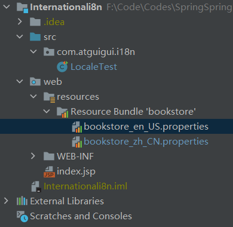
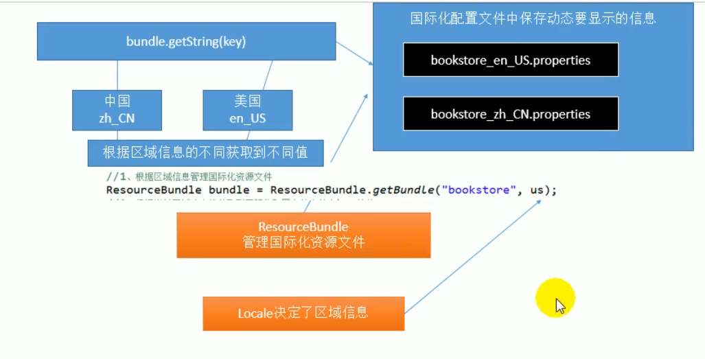
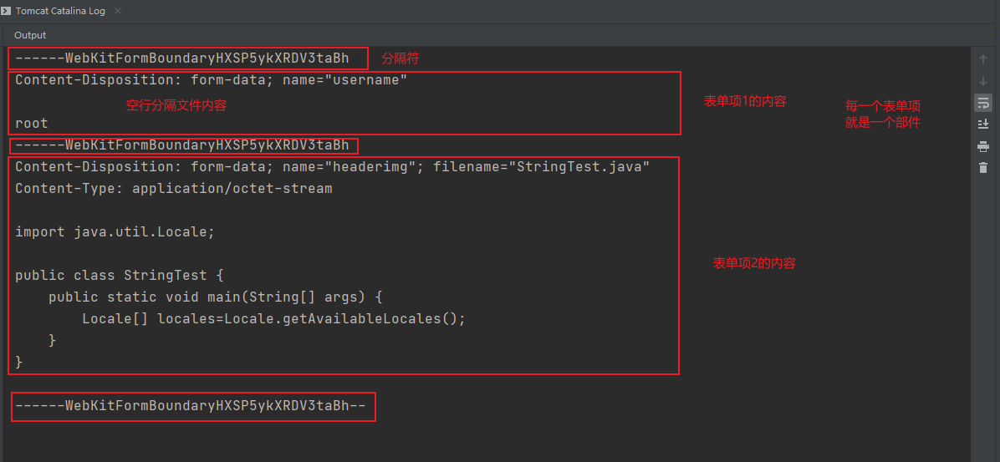
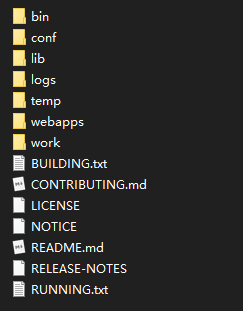
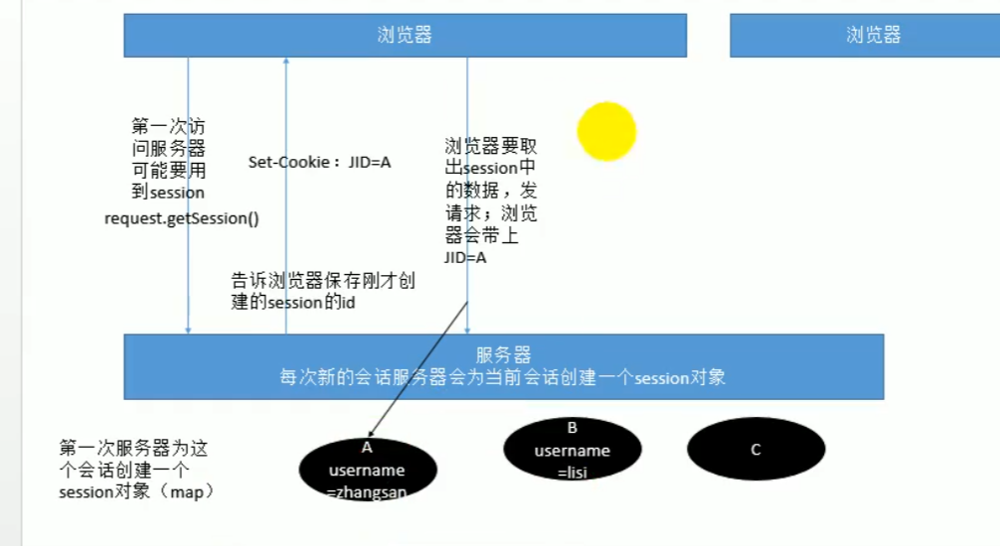
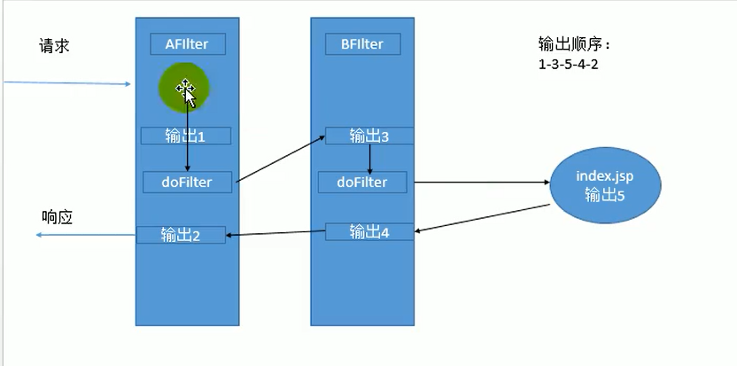
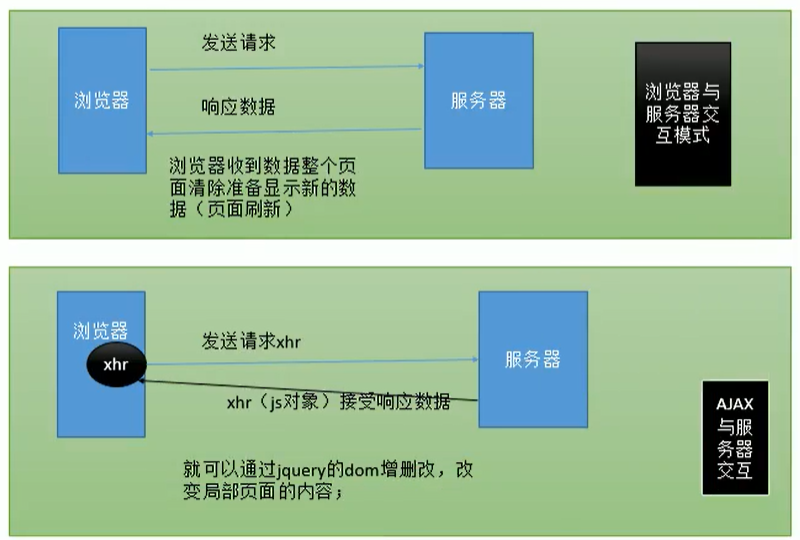

# 监听器简介和分类

## 示例项目

- `JavaWebListenerDemo`
- 

## 监听器

监听对象、监听事件、触发行为

## JavaWeb 监听器 Listener

`serverlet`，`filter`，`listener`：`JavaWeb`的三大组件

### **八个监听器**

#### 按照监听对象

分为三类：

1. 监听`ServletContext`事件

   ​	`ServletContextListener`：

   ​			作用：监听`ServletContext`生命周期（从创建到销毁的过程（服务器启动创建--服务器停止销毁））

   ​	`ServletContextAttributeListener`：

   ​			作用：监听`ServletContext`域中属性变化的；

2. 监听`HttpSession`事件

   ​	`HttpSessionListener`：

   ​			作用：监听`HttpSession`的生命周期（session第一次使用的时候创建；session超时销毁或session手动设置失效（`session.invalidate`方法））

   ​	`HttpSessionAttributeListener`：

   ​			作用：监听`HttpSession`域中属性的变化（增删改）

   ​	`HttpSessionActivitionListener`：

   ​			作用：监听某个对象随着`HttpSession`活化钝化的过程

   ​	`HttpSessionBindlingListener`：

   ​			作用：监听某个对象保存（绑定）到session中和从session中移除（解绑）

3. 监听`ServletRequest`事件

   ​	`ServletRequestListener`：

   ​			作用：监听request对象的生命周期（请求进来创建新的request，保存请求的详细信息，请求完成销毁request对象）

   ​	`ServletRequestAttributeListener`：

   ​			作用：监听request域中属性变化

#### 按照功能

1. 一类是：生命周期监听器

   **`javax.servlet.ServletContextListener`**

   |        |                                                              |
   | ------ | ------------------------------------------------------------ |
   | `void` | `contextDestroyed(ServletContextEvent sce)` <br> 销毁（服务器停止）调用<br>Receives notification that the `ServletContext` is about to be shut down. |
   | `void` | `contextInitialized(ServletContextEvent sce)`<br>初始化（服务器启动）调用<br>Receives notification that the web application initialization process is starting. |

   **`javax.servlet.http.HttpSessionListener`**

   |        |                                                              |
   | ------ | ------------------------------------------------------------ |
   | `void` | `sessionCreated(HttpSessionEvent se)`<br>session创建（第一次使用session创建）<br>Receives notification that a session has been created. |
   | `void` | `sessionDestroyed(HttpSessionEvent se)`<br>session自动失效（超时timeout）、手动设置session失效（session.invalidate）<br>Receives notification that a session is about to be invalidated. |

   **`javax.servlet.ServletRquestListener`**

   |        |                                                              |
   | ------ | ------------------------------------------------------------ |
   | `void` | `requestDestroyed(ServletRequestEvent sre)`<br> request销毁调用（当次请求结束）<br>Receives notification that a `ServletRequest` is about to go out of scope of the web application. |
   | `void` | `requestInitialized(ServletRequestEvent sre)`<br>request初始化（发起一个新请求）<br>Receives notification that a `ServletRequest` is about to come into scope of the web application. |

2. 一类是：属性监听器 监听域中属性变化

   **`javax.servlet.ServletContextAttributeListener`**

   **`javax.servlet.http.HttpSessionAttributeListener`**

   **`javax.servlet.ServletRequestAttributeListener`**

   (均含有以下三种方法）

   |        |                                                              |
   | ------ | ------------------------------------------------------------ |
   | `void` | `attributeAdded(ServletContextAttributeEvent event)`<br>Receives notification that an attribute has been added to the `ServletContext`. |
   | `void` | `attributeRemoved(ServletContextAttributeEvent event)`<br>Receives notification that an attribute has been removed from the `ServletContext`. |
   | `void` | `attributeReplaced(ServletContextAttributeEvent event)`      |

3. 一类是：对象监听器（session独有的监听器）

   **特点：不需要在`web.xml`中进行配置的监听器**

   **`javax.servlet.http.HttpSessionActivationListener 保存到session域中的对象，活化和钝化的监听器`**

   |        |                                                              |
   | ------ | ------------------------------------------------------------ |
   | `void` | `sessionDidActivate(HttpSessionEvent se)`<br>Notification that the session has just been activated.<br>监听某个对象随着`HttpSession`已经活化（活化后调用） |
   | `void` | `sessionWillPassivate(HttpSessionEvent se)`<br>Notification that the session is about to be passivated.<br>监听某个对象随着`HttpSession`将要钝化（钝化前调用） |

   **`javax.servlet.http.HttpSessionBindingListener 对象被绑定到session域中的监听器`**

   |        |                                                              |
   | ------ | ------------------------------------------------------------ |
   | `void` | `valueBound(HttpSessionBindingEvent event)`<br>Notifies the object that it is being bound to a session and identifies the session.<br>监听某个对象在session中绑定进来（保存进来） |
   | `void` | `valueUnbound(HttpSessionBindingEvent event)`<br>Notifies the object that it is being unbound from a session and identifies the session.<br>监听某个对象在session中解绑（移除） |

#### 监听器如何工作

步骤如下：

1. 接口的实现
2. 在`web.xml`中进行注册

示例：

```java
package com.atguigu.listener;
public class MyServletContextListener implements ServletContextListener{
    
    @Override
    public void contextInitialized(ServletContextEvent servletContextEvent) {
        ServletContext servletContext = servletContextEvent.getServletContext();
        System.out.println("初始化......");
        System.out.println("contextInitialized"+servletContext);

    }

    @Override
    public void contextDestroyed(ServletContextEvent servletContextEvent) {
        System.out.println("销毁......contextDestroyed");
    }
}
```

```xml
<listener>
    <!-- 配置全类名       -->
    <listener-class>com.atguigu.listener.MyServletContextListener</listener-class>
</listener>
```

#### 使用场景

1. `ServletContextListener` ：监听服务器启动停止

   - 推荐使用绝对路径

     以`/`开始的路径，要在页面使用需要加项目名 	

   - 服务器启动，做一些项目的预初始化操作（在实现`ServletContextListener`的类的`contextInitialized`方法中实现预初始化）

   - 服务器关闭，做一些善后清理工作（在实现`ServletContextListener`的类的`contextDestroyed`的方法中实现）	

2. `HttpSessionBindingListener`：监听某个对象绑定到session域中


#### **补充**

1. JSP四大作用域（范围从小到大）：`PageContext域 --> Request域 --> Session域 --> Application域`

   **生命周期：**

   page：存在page中的变量，只作用于当前的`jsp`页面，当发生跳转、重定向、定时刷新时，将随之销毁；

   request：存在request中的变量，作用于一次HTTP请求到服务器处理结束，返回响应的整个过程，该变量可以随着forward的方式跳转到多个`jsp`中，一但刷新页面，它们将重新计算；

   session：存在Session中的变量，作用于一次会话中，从打开浏览器到关闭浏览器过程中，将一直累加；（若想在再次打开浏览器时，变量仍然存在，则可以将session的JSESSIONID存到Cookie中，在给cookie一个存活时间）

   application：存在application中的变量，作用于整个应用中，即从应用启动到应用结束，如果不进行手工删除，它们将一直可以使用，而且这些变量所有用户均可使用。

   **作用范围：**

   page：用户请求的当前页面；

   request：用户请求访问的当前组件，以及和当前web组件共享同一用户请求的web组件；

   session：同一个Http会话中的web组件共享；

   application：整个web应用的所有web组件共享，即只要是同一个服务器下的均可使用。

   

2. `ServletContext  HttpSession  HttpServletRequest`

   “会话"概念：浏览器开启-->关闭

   `ServletContext`：即`application`，置入其中的域属性是整个应用范围的，可以完成跨会话共享数据

   `HttpSession`：置入其中的域属性是会话范围的，可以完成跨请求共享数据

   `HttpServletRequest`：置入其中的域属性是请求范围的，可以跨Servlet共享数据，但是这些Servlet必须在同一个请求中

3. session的生命周期

   - **创建**：
     - 第一次使用的时候创建
       - 第一次访问JSP，因为session是内置使用的，所以第一次没有session，进行session创建
   - **销毁**：
     - session自动超时失效
     - session手动设置失效 `session.invalidate()`

4. 

# 国际化

## 示例项目

- `internationalli8n`

## 简介

为了让程序可以动态适配多国环境，包括：计数法、货币单位、日期表示等

实际：多套系统适配不同的语言环境

## `Local ResouceBundle`类

语言支持，来源于两个包：

- `Locale`：
- `ResourceBundle`：

```JAVA
/**
 * Locale代表区域信息
 * 每一个区域可以使用一个Locale对象来进行表示
 */
public class LocaleTest {
    @Test
    public void Test01(){
        //获取所有的区域信息
        //zh_CN: 语言代码_国家代码
        Locale[] availableLocales = Locale.getAvailableLocales();
        for (Locale locale:availableLocales) {
            System.out.println(locale);
        }
    }
    
    /**
     * bookstore_zh_CN.properties  命名规则:自定义名称_语言代码_国家代码.properties
     * properties文件用于保存一些属性
     *
     * Locale：区域信息
     * ResourceBundle：资源绑定，管理资源
     *
     * 1.将要按照区域信息不同要动态显示的信息放在配置文件（国际化配置文件）中
     *      命名要求： 基础名_语言代码_国家代码.properties
     * 2.ResourceBundler绑定所有的国际化资源文件（管理所有的国际化资源文件）
     */
    @Test
    public void test02(){
        Locale china = Locale.CHINA;
        Locale us=Locale.US;

        //1.根据区域信息管理国际化资源文件
        ResourceBundle bundle = ResourceBundle.getBundle("bookstore",china);
        //2.根据当前区域动态的获取到国际化配置文件中某个key的值
        String string=bundle.getString("username");
        System.out.println(string);
    }
}
```






## `DateFormat NumberFormat MessageFormat`类

1. `DateFormat`日期格式化

   获取`DateFormat`实例化

   ```java
   getDateInstance();							//获取实例，类似于2019-12-13
   getDateInstance(int style,Locale aLocale); 	  // Gets the date formatter with the given formatting style for the given locale.
   										  //style：日期风格，包括FULL（完整）、LONG（长）、MEDIUM（中等）、SHORT（短）、DEFAULT（默认）
   getDateTimeInstance();					    //获取到的实例类似于 2019-12-13 12:55:12:123
   getTimeInstance();						   //获取到的实例类似于 12:55:12:123
   ```

   ```java
   public void test1(){
       Locale canada=Locale.CANADA;
       DateFormat dateInstanceataFormat = DateFormat.getDateInstance(DateFormat.SHORT, japan);
       String format = dateInstanceataFormat.format(new Date()); //20/12/17
   }
   ```

2. `NumberFormat` 数字格式化

   ```java
   double salary=123413242.987;
   NumberFormat numberFormat = NumberFormat.getInstance(italy);
   String format1 = numberFormat.format(salary); //123.413.242,987
   ```

3. `MessageFormat` 自定义消息格式化

```java
//4.消息格式化，自定义消息（文本）格式化
//示例：张三喜欢李四，但是李四喜欢王五 人名信息动态获取，“喜欢”等词，就会根据国际化进行翻译或者显示
//国际化中编写规则，{0}表示占位符：likeinfo= {0} like {1}, but {1} like {2}  索引从0开始
//ResourceBundle 获取国际化配置文件 MessageFormat对获取到的信息传递参数
//MessageFormat：支持国际化配置文件中写动态占位符
ResourceBundle bookstore = ResourceBundle.getBundle("bookstore", china);
String likeinfo = bookstore.getString("likeinfo");  //likeinfo= {0} 喜欢 {1}，但是 {1} 喜欢 {2}
System.out.println(likeinfo);

String format3 = MessageFormat.format(likeinfo, "宝宝", "蓉蓉", "哲哲");
System.out.println(format3);  //宝宝 喜欢 蓉蓉，但是 蓉蓉 喜欢 哲哲
```

## FMT标签库

支持国际化的标签库

```hmtl
<%@ taglib prefix="fmt" uri="http://java.sun.com/jsp/jstl/fmt" %>
<html>
<head>
    <title>TingHL</title>
</head>
<body>

<%--使用FMT标签库实现动态获取信息 完成以前的功能--%>
<%--
1.准备一个能够的区域信息
2.使用ResourceBundle绑定国际化资源文件
3.从国际化资源文件中获取值 可以继续格式化
        其中，两者有重要的区别
            ${requestScope.loc}==request.getAttribute("loc","")
            ${param.loc}== request.getParameter("loc")
--%>
<fmt:setLocale value="${param.loc}"/> <!-- 相当于 Locale locale=new Locale(param.loc}-->
<fmt:setBundle basename="bookstore"></fmt:setBundle>
<h1>
    <fmt:message key="welcome">
        <fmt:param>李</fmt:param>
        <fmt:param>
            <fmt:formatDate value="<%=new Date()%>"></fmt:formatDate>
        </fmt:param>
    </fmt:message>
</h1>

<form action="">
    <fmt:message key="username" />:<input /><br/>
    <fmt:message key="password"/>:<input /><br/>
    <input type="submit" value="<fmt:message key="loginBtn"/>"/>
</form>

<a href="login-change.jsp?loc=zh_CN">中文</a>
<a href="login-change.jsp?loc=en_US">English</a>

</body>
</html>
```

# 文件上传

## 示例项目

- `FileUploadAndDownload`
- `FileUploadAndDownloadDemo2`
- `FileUploadAndDownloadDemo3`

## 文件上传下载

​	上传：浏览器将本地的文件上传到服务器上，交给服务器保存

​	下载：把服务器保存的内存下载到本地

### 上传

1. 文件上传必须是`post`类型的表单提交

   ​	`get`不能携带大量数据

2. 文件上传要用的不是这个，下面是普通表单提交数据

   ```jsp
   <form action="" method="post" enctype="application/x-www-form-urlencoded"></form>
   ```

   文件上传表单：

   ```jsp
   <from action="" method="post" enctype="multipart/form-data"></from>
   ```

   其中，`enctype` 属性规定在发送到服务器之前应该如何对表单数据进行编码。

   | 值                                  | 描述                                                         |
   | ----------------------------------- | ------------------------------------------------------------ |
   | `application/x-www-form-urlencoded` | 在发送前编码所有字符（默认）                                 |
   | `multipart/form-data`               | 不对字符编码。在使用包含文件上传控件的表单时，必须使用该值。 |

3. 文件上传的表单是一种新的解析方式

   普通的表单上传来的数据如下所示，其中`request.getParameter()可用`：

   `username=xxxx&password=yyyy`

   文件上传的表单上传的数据如下所示，其中`request.getParameter()`不可用：

   ​	分隔符

   ​	部件1头信息

   ​	空行

   ​	部件1的内容

   ​	分隔符

   ​	部件2头信息

   ​	空行

   ​	部件2的内容

   ​	分隔符

   ​	。。。。

   

   示例如下，传统的获取方式失效：

   ```jsp
   
   ```
<form action="upload" method="post" enctype="multipart/form-data">
       用户名：<input type="text" name="username"/><br>
       头像：<input type="file" name="headerimg"/><br>
   	<input type="submit" value="上传"/>
   </form>
   ```
   
   ```java
String username=request.getParameter("username");
   System.out.println("username"+username);//username=null
   ```

   ```java
@Override
   protected void doPost(HttpServletRequest req, HttpServletResponse resp) throws ServletException, IOException {
       //文件以流的形式传递给服务器
       //common-io-2.0.jar简化所有流操作
       ServletInputStream inputStream = req.getInputStream();
       String s = IOUtils.toString(inputStream);
       System.out.println(s);
       resp.getWriter().write("ok...");
   }
   ```

   

4. 文件上传到服务器的步骤：

   第一步：导包（两个）

   `commons-fileupload-xx.jar`与`commons-io-x.jar`

   第二步：调方法

   ```java
       protected void doPost(HttpServletRequest req, HttpServletResponse resp) throws ServletException, IOException {
           //1.导包
           //2.解析 commons-fileupload-xx.jar中包含的方法
           FileItemFactory factory=new DiskFileItemFactory();
           ServletFileUpload upload=new ServletFileUpload(factory);
           //上传文件包含中文
           upload.setHeaderEncoding("UTF-8");
   
           try{
               List<FileItem> items=upload.parseRequest(req);
               //自定义文件上传
               parseFileItems(items,req);
           }catch (FileUploadException e){
               e.printStackTrace();
           }
   
           //文件上传后，去首页index.jsp展示图片列表 文件上传成功后重定向到首页
           resp.sendRedirect(req.getContextPath()+"/index.jsp");
       }
   
       private void parseFileItems(List<FileItem> items,HttpServletRequest request) throws IOException {
           for(FileItem item:items){
               if(item.isFormField()){
                   //
               }else{
                   //1.把上传的图片保存在当前项目的pics中
                   InputStream is=item.getInputStream();
   
                   //细节一：如何获取某个文件或文件夹在服务器中的真正位置  
                   //一个项目对应一个ServletContext
                   ServletContext servletContext=request.getServletContext();
                   String realPath = servletContext.getRealPath("/pics");
                   //自己运行环境时的真实路径：F:\Code\Codes\JavaWebPractise\FileUploadAndDownloadDemo2\out\artifacts\FileUploadAndDownloadDemo2_war_exploded\pics
                   //获取到的真实路径到pics为止
                   System.out.println("真实路径："+realPath);
   
                   //细节二： IE浏览器下获取到的文件是带路径的 为了提高兼容性 通过只获取最后一个文件名的方式获取文件名
                   //获取文件分隔符分隔的最后一个文件名 使用String类的split()方法会出错 
                   int lastIndexOf=item.getName().lastIndexOf("\\");
                   String fileName=item.getName().substring(lastIndexOf+1);
                   System.out.println("打印文件名："+fileName);
   
                   //细节三：为了防止同名文件覆盖，可以给文件名+UUID
                   fileName = UUID.randomUUID().toString().replace("-","")+fileName;
                   //传递到服务器中，在项目中不会显示
                   FileOutputStream os = new FileOutputStream(realPath + File.separator + fileName);
   
                   IOUtils.copy(is,os);
                   os.close();
                   is.close();
   
                   //使用ImgUtils工具类 将上传的文件路径保存在域中 方便获取
                   ImgUtils.addImgPath("/pics/"+fileName);
               }
           }
    }
   ```
   
   ```java
   public class ImgUtils {
       //保存了所有的图片路径
       private static List<String> paths=new ArrayList<>();
   
       public static void addImgPath(String path){
           paths.add(path);
       }
   
       public static List<String> getAllPaths(){
           return paths;
       }
}s
   ```
   
5. 中文乱码问题

   上传的文件包含中文

   ```java
   FileItemFactory factory=new DiskFileItemFactory();
   ServletFileUpload upload=new ServletFileUpload(factory);
   upload.setHeaderEncoding("UTF-8");
   ```

   下载文件的文件名包含中文

   ```java
   String file = req.getParameter("file");
   int length= UUID.randomUUID().toString().replace("-","").length();
   //获取文件名
   int lastIndexOf=file.lastIndexOf("/");
   String filename=file.substring(lastIndexOf+1);
   filename = filename.substring(length);
   
   System.out.println("最终的文件名："+filename);
   
   //解决中文文件名乱码
   filename=new String(filename.getBytes("GBK"),"ISO-8859-1");
   ```


### 下载

```xml
<%@ page import="com.atguigu.servlet.ImgUtils" %><%--  import 引入ImgUtils工具类
  Created by IntelliJ IDEA.
  User: TingHL
  Date: 2020-12-17
  Time: 21:38
  To change this template use File | Settings | File Templates.
--%>
<%@ page contentType="text/html;charset=UTF-8" language="java" %>
<%@ taglib prefix="c" uri="http://java.sun.com/jsp/jstl/core" %>
<meta http-equiv="Content-Type" content="text/html;charset=GB2312"/>
<html>
<head>
  <title>欢迎光临硅谷网上图库</title>
  <%--  规定图片的样式 提前定义 --%>
  <style type="text/css">
    img{
      width: 300px;
      height: 200px;
    }
    .imgs{
      float:left;
      width: 220px;
    }
  </style>
</head>
<body>

<h1>选择上传文件 并将上传后的文件在此提供下载链接</h1><br>
<!--上传 将相关资源上传到 通过uploadpic Servlet进行处理 并将上传到的图片全部显示在页面内中 -->
<form method="post" enctype="multipart/form-data" action="uploadpic">
  用户名：<input type="text" name="username"/>
  图片：<input type="file" name="pic"/>
  <input type="submit" value="上传"/>
</form>
<hr/>


<div>
  <%-- 遍历所有的图片   --%>
  <%-- items：要被循环的信息 var：代表当前条目的变量名称   --%>
  <c:forEach items="<%=ImgUtils.getAllPaths()%>" var="path">
    <div class="imgs">
      
      <a href="download?file=${path}">下载图片</a>
    </div>
  </c:forEach>
</div>

</body>
</html>

```

````java
public class UploadServlet extends HttpServlet {
    public UploadServlet() {
        super();
    }

    @Override
    protected void doGet(HttpServletRequest req, HttpServletResponse resp) throws ServletException, IOException {
        doPost(req,resp);
    }

    @Override
    protected void doPost(HttpServletRequest req, HttpServletResponse resp) throws ServletException, IOException {
        //1.导包
        //2.解析
        FileItemFactory factory=new DiskFileItemFactory();
        ServletFileUpload upload=new ServletFileUpload(factory);
        upload.setHeaderEncoding("UTF-8");

        try{
            List<FileItem> items=upload.parseRequest(req);
            //自定义文件上传
            parseFileItems(items,req);
            //文件上传后，去首页index.jsp展示图片列表
        }catch (FileUploadException e){
            e.printStackTrace();
        }

        //文件上传成功后重定向到首页
        resp.sendRedirect(req.getContextPath()+"/index.jsp");
    }

    private void parseFileItems(List<FileItem> items,HttpServletRequest request) throws IOException {
        for(FileItem item:items){
            if(item.isFormField()){
                String name=item.getFieldName();
                //解决普通输入项的数据的中文乱码问题
                String value=item.getString("UTF-8");
                System.out.println("formfield域中属性   输入的field："+name+" 值为："+value);
            }else{
                //1.把上传的图片保存在当前项目的pics中
                InputStream is=item.getInputStream();

                //如何获取某个文件或文件夹在服务器中的真正位置  重点细节一
                //一个项目对应一个ServletContext
                ServletContext servletContext=request.getServletContext();
                String realPath = servletContext.getRealPath("/pics");
                //真实路径：F:\Code\Codes\JavaWebPractise\FileUploadAndDownloadDemo2\out\artifacts\FileUploadAndDownloadDemo2_war_exploded\pics
                //获取到的真实路径到pics为止
                System.out.println("/pics的真实路径："+realPath);

                //细节二： IE浏览器下获取到的文件是带路径的 获取最后一个文件名
                //获取文件分隔符分隔的最后一个文件名 使用String类的split()方法会报错
                System.out.println("item.getName():"+item.getName());
                int lastIndexOf=item.getName().lastIndexOf("\\");
                String fileName=item.getName().substring(lastIndexOf+1);
                System.out.println("打印文件名："+fileName);

                //细节三：为了防止同名文件覆盖，可以给文件名+UUID
                fileName = UUID.randomUUID().toString().replace("-","")+fileName;
                //传递到服务器中，在项目中不会显示
                FileOutputStream os = new FileOutputStream(realPath + File.separator + fileName);

                IOUtils.copy(is,os);
                os.close();
                is.close();

                //使用ImgUtils工具类 将上传的文件路径保存在域中 方便获取
                ImgUtils.addImgPath("/pics/"+fileName);
            }

        }
    }
}
````

# `HTML CSS JS jquery`选择器

## HTML

- Hyper Text markup language 超文本标记语言 （掌握）

- 标签

  `<p></p>`段落标签

  `<table></table>`表格  <tr> 行 <td> 列 

  `<form></form>`表单

  ​	`<form action="提交的位置" method="GET/POST" enctype="application/x-www-form-urlencoding>  </form>"`

  ​	`enctype="application/x-www-form-urlencoding"`：默认的表单提交的编码方式

  ​	`enctype="multipart/form-data"`：文件上传

  `<script></script>` 用于定义客户端脚本，编写js或者引入js

  `<link></link>  ` 定义文档与外部资源的关系，链接外部样式表

  `<style></style>`编写样式

- 

## CSS

- casecade style Sheet，层叠样式表，了解

- 作用：

  B/S开发：

  ​	B端：结构（HTML）-表现（CSS）-行为（JavaScript）

- 常用的样式定义

  每个样式都有哪些样式，都去哪里查

  ​	W3School CSS参考手册

- 语法

  选择器{

  ​	样式名：样式值；

  ​	样式名；样式值；

  ​	.......

  }

- 

## JS

- 重点，掌握内容

- JavaScript，脚本语言

- 基本语法

  声明变量，弱类型语言

  ```js
  var temp="aaaa";
  temp=1
  ```

  声明对象

  ```js 
  var obj={
      lastName:"张三";
      age: 18
  };
  ```

  声明方法

  ```js
  var hello=function hello(){
  }
  
  //调用方法
  hello();
  ```

- 事件

  用户和浏览器交互的行为

  ```js
  window.onload=function(){
      //表示：文档加载完成;(页面里面的所有内容全部都显示成功)
  }
  //两次window.onload=function(){} 最后一次有用
  
  $function(){
      //表示：文档加载完成（dom准备就绪） 快于window.onload
  }
  ```
  

常用事件：

如何给一个元素绑定上事件

```html
  <a href="hello" id="aEle">你好</a>
  
  //按照id寻找元素
  var aEle=document.getElementById("aEle");
  aEle.onclick=function(){
  	alter("你好");
  	//取消默认行为 return false；页面取消跳转
  	return false;
  }
```

js文档；事件；每个对象的属性，去哪里查

JS内置的对象：

​	去JS --> JavaScript参考手册中有内置的对象（了解）

- 

## JQUEY

- js库 

  jQuery --- JavaScript 相当于 commons-io.jar -- Java

- 精通掌握

- 重点

  1. 选择器（一串特殊的字符串）
  2. 文档操作（对dom的增删改）
  3. 属性操作

### 选择器

**基本**

- #id：$("#btn01") 找到一个id为指定值的标签
- element：$("a") 找到所有的a标签
- .class：$(".mini") 找到所有class为mini的元素
- `*` ：`$("*")` 找到所有的元素
- selector1, selector2, selectorN ：`$('#btn01","#btn02',".big","form","#a01 *")` 表示找到id 为`btn01`，和`btn02`元素；以及class 为big 的元素，以及所有form表单，以及id 为`a01`下的所有元素
- 

**层级**

- ancestor descendant ：找后代
- parent > child：找子元素 `$("a > # btn01")` 找到a 标签下id为 btn01 的子元素
- prev + next：找下一个兄弟 `$(#btn01 + .mini)` 找到id为btn01 的下一个同级元素，并且这个元素的class 是mini
- prev ~ siblings ：找所有的同辈兄弟 `$("#deleBtn01 ~ a")` 找到id 为 deleteBtn01 元素的所有兄弟元素，但是必须是a 标签

重点：

- `:first`

- `:last`

- `:eq(index)`

  ```
  $("a:first")
  	找到第一个a标签
  $(":first")
  	找到文档中第一个标签，即<html>
  $("a :first")
  	找到a的第一个后代元素
  $("a > :first")
  	找到a的第一个子元素
  $("#btn01 > a:eq(1)")
  	找到btn01下的第二个a标签
  $("a:empty")
  	找到所有没有标签体的a元素，例如<a></a>
  
  $("a[id]"):有id属性的所有a标签
  $("a[id='btn01']")：找到id为 btn01的a，等同于$("#btn01")
  ```

:checked 找到所有选中的复选框、单选框等，不包括select中的option 
:selected：匹配所有选中的option元素
find(expr | obj | ele)：`$("div").find(".mini")` 找到所有div下的class为mini的元素
children([expr]) ：`$("div").children(".mini")` 找到div下的所有class为mini的子元素
parent([expr])：`$("#div01").parent(".mini")` 找到id 为div01 的父元素，而且父元素的class必须是mini
parents([expr])：`$("#div01").parent(".mini")` 找到所有class为mini的祖先元素

### 文档操作

**内部插入**
`append(content|fn)` 
`appendTo(content)`
`prepend(content|fn)`
`prependTo(content)`

```html
<p id="p01">张三</p>

append(content|fn): a.append(b): a里面添加b 
	$("#p01").append("<a href='hello'>hello</a>");
	其效果等于：<p id="p01">张三< a href='hello'>hello</a></p>

appendTo(content)：将前面的添加到后面的元素里面去
	$("<a href='hello'>hello</a>").appendTo($("#p01"));

$("#p01").append("<a>hello</a>").append("<b></b>")：这些可以链式调用
哪些方法可以链式调用：
	方法返回时jquery对象继续链式调用任何jquery方法：返回的是其本身
	$("#p01").append("<a>hello</a>").append("<b></b>")。clink(function(){}); 给p01绑定事件

```


**外部插入**
`after(content|fn)`
`before(content|fn)`
`insertAfter(content)`
`insertBefore(content)`
**包裹**
`wrap(html|ele|fn)`
`unwrap()`
`wrapAll(html|ele)`
`wrapInner(html|ele|fn)`
**替换**
`replaceWith(content|fn)`
`replaceAll(selector)`
**删除**
`empty()`
`remove([expr])`
`detach([expr])`
**复制**
`clone([Even[,deepEven]])`

### 属性操作

获取到一个元素的属性值，文本内容，。。。。

```html
<form>
    <input id="i01" name="username">
</form>

<a href="hello">你好</a>
```

**属性**
`attr(name|pro|key,val|fn)`  自定义属性获取和设置，推荐使用attr
`prop(n|p|k,v|f)`  标签原本自己的属性推荐使用prop，在与复选框使用时，使用prop进行属性操作

示例如下：

```html
$("#i01").attr("username"); //获取属性值，张三  
$("#i01").attr("username","李四"); //设置属性值，李四

$("#i01").prop("username"); //获取属性值，张三

$("a:first").attr("href") == $("a:first").prop("href"); 
$("a:first").attr("haha"); //自定义属性获取和使用，推荐使用attr；多选框属性选中，使用attr属性
例如：
<a href="hello" haha="xwyz"></a>
```

多选框示例

```html
<form>
    <input id="i01" name="username">
    <input type="checkbox" name="like"/>  <!-- 多选框有一个check属性 表明是否被选中-->
</form>

alter(xxx.attr("checked")); 选中，checked；未选中，undefined
alter(xxx.prop("checked")); 选中，true；未选中，false  
```


**HTML代码/文本/值**
`html([val|fn])` 
`text([val|fn])`
`val([val|fn|arr])`

**事件**

**blur([[data],fn])**
**change([[data],fn])**
**click([[data],fn])**
dblclick([[data],fn])
error([[data],fn])
focus([[data],fn])
focusin([data],fn)
focusout([data],fn)
keydown([[data],fn])
keypress([[data],fn])
keyup([[data],fn])
mousedown([[data],fn])
mouseenter([[data],fn])
mouseleave([[data],fn])
mousemove([[data],fn])
mouseout([[data],fn])
mouseover([[data],fn])
mouseup([[data],fn])
resize([[data],fn])
scroll([[data],fn])
select([[data],fn])
**submit([[data],fn])**
unload([[data],fn])

**核心函数**

用法：

1. 传入参数为【函数】时，`$(function(){})`相当于`window.onload=function(){}`

2. 选择器 `$("选择器")`  `$("#btn01")`

3. 传入参数为【HTML字符串】时，创建html元素（jquery 对象）

   ```html
   $("<a href='hello'>nihao</a>").prop("href","hello01");  //html对象.prop("")方法 更改属性
   $("<a href='hello'>nihao</a>")[0].href="hello02";   // $("<a href='hello'>nihao</a>")[0] 为dom对象，对dom进行操作修改href
   ```

4. 传入参数为【DOM对象时】：`$(this)`

可以将`dom`对象转换为`jquery`对象

```html
$(btn01).append();  //dom --> jquery
$(btn01)[0]; jquery-->dom
```


# XML

# Tomcat

## 目录结构



1. bin：可执行程序；tomcat在这里启动；`startup.bat` 启动命令（双击启动）；`shutdown.bat` （双击关闭）

2. conf：tomcat配置文件目录；

   ​	server.xml：tomcat 的配置集中地方；端口配置

   ​	web.xml：tomcat 所有web 项目都需要遵循的一个xml

3. lib：tomcat运行期间需要用到的jar包，例如el 表达式解析jar

4. logs：tomcat运行日志

5. temp：临时文件夹

6. webapps：集合tomcat中运行的项目；每一个项目都是一个文件夹的形式

7. work：存放运行期间编译的一些东西，例如jsp页面


# HTTP

1. F12 会看请求头和请求体

2. 发送请求的整个数据叫（请求报文）

   服务器传给浏览器的数据（响应报文）

   

   报文头部 	空行	报文主体

   

   请求报文：请求首行+请求头+空行+请求体

   响应报文：响应首行+响应头+空行+响应体

3. 

# Servlet

## **简介**

用来接受请求，处理请求，完成响应的一段小程序

是JavaWeb的三大组件之一（Servlet、Filter、Listener）

## **Servlet体系**

Servlet：接口

`HttpServlet`：使用

​	`doGet()`

​	`doPost()`

## **Servlet使用**

步骤：

- 编写servlet

- 在`web.xml`中进行配置

  ```xml
  <servlet>
      <servlet-name></servlet-name>
      <servlet-class></servlet-class>
  </servlet>
  
  <servlet-mapping>
      <servlet-name></servlet-name>
      <url-pattern></url-pattern>
  </servlet-mapping>
  ```

## ServletConfig

一个Servlet对应一个ServletConfig封装当前Servlet的配置信息

## ServletContext

四大域对象之一（PageContext、ServletRequest、HttpSession、ServletContext）

域对象：在域中保存一些数据，跨页面获取到保存的数据；多个资源之间共享数据的；

`ServletContext`作用：
	 1）域对象
	 2) `ServletContext` 获取当前项目信息，一个项目对应一个`ServletContext`，只是代表当前项目； `servletContext.getRealPath("/pics/aaa.jpg")` 只能获取到当前项目下的某个资源的路径 

## `HttpServletRequest`

代表请求。每一次发送请求，请求的详细信息会被`tomcat`自动封装成一个`request`对象，以后要获取当前请求的一些信息，使用`request`对象即可。

作用：

1. 获取请求参数：`request.getParameter("hello")`
2. 作为域对象保存数据；同一次请求期间可以共享数据
3. 获取到`HttpSession`对象：`request.getSession()`
4. 转发 `request.getRequestDispatcher("/index.jsp").forward(request.response);`  //将当次的请求和响应交给另一个程序处理,在服务器内部进行

服务器上保存了所有的页面和视频，动态程序等等。页面上的img，link(css)都是向服务器发送请求，`<script src="jquery.js">`给服务器发送请求

## `HttpServletResponse`

响应；交给浏览器的数据（响应首行、响应头（对浏览器的一些命令）和响应体（浏览器收到要解析的数据））；

重定向：浏览器收到重定向命令后,发起新请求
	`response.sendRedirect("重定向地址");`
	`response.sendRedirect(request.getContentPath()+"/index.jsp")`
	`request.getContentPath();` 获取项目名后，以`/`开始不已`/`结束

请求`index.jsp`页面：servlet index.jsp --> index.jsp.class --> response.getWriter().write("");
回归到底层：服务器给浏览器发送数据，都是写出字符流或者字节流

## 乱码

1. 请求乱码 浏览器发送给服务器的数据,服务器解析出来乱码

   GET POST: 页面上除过表单`method="post"`外剩下的都是get请求

   GET请求乱码

   ​	原因:所有的请求参数都是带在url地址上的,tomcat接收到这个请求就会调用默认的编码格式将其解码,并封装成request对象

   POST请求乱码

   ​	原因:请求带来的数据都在请求体中存放;tomcat并不着急解析请求体,一旦调用`request.getParameter("p")`,将整个请求体使用默认编码格式全部解析完成

2. 响应乱码 

   原因：直接写出去的数据，浏览器并不知道数据的内容类型以及编码格式等。浏览器使用默认的格式打开（UTF-8，gbk等）

   解决：给浏览器的数据说清楚是什么

   ​	`response.setContentType("text/html;charset=utf-8")`

3. 

## 路径

1. 相对路径：相对于当前资源所在的路径为标准

   不已`/`开始的路径就是相对路径

   示例：访问`http://localhost:8080/bookstore/upload/upload.jsp`，其中存在一个超链接`<a href="index.jsp">去index.jsp页面</a>`  ，将会跳转到的位置是`http://localhost:8080/bookstore/upload/index.jsp`

2. 绝对路径

   以`/`开始的路径

   示例：访问`http://localhost:8080/bookstore/upload/upload.jsp`，其中存在一个超链接`<a href="/index.jsp">去index.jsp页面</a>`，将会跳转到的位置是`http://locahost:8080/index.jsp`


区分哪些是服务器解析的路径，哪些是浏览器解析的路径：

`response.sendRedirect("/index.jsp");`  //这个路径是浏览器访问的，加上项目名

只要`html`标签里面（详见html标签列表）写的路径都是浏览器解析。除此之外都是服务器解析；`<jsp:forward></jsp:forward>`（jsp自定义的标签；目前见到的所有有前缀的标签都是服务器解析的）


服务器解析的路径：

​	`request.getRequestDispatcher("/index.jsp");`  //其效果就是当前项目下的`jsp`，项目名会自动加上去的

浏览器解析的路径：

​	在前面拼上服务器地址才是最终要去的路径；页面要写`/`开始的路径，我们需要 加上项目名

以后推荐写绝对路径，加上项目名

# JSP

`index.jsp`(翻译 -- 编译.class)

静态资源：html页面，css，img，视频

动态资源：Java代码（servlet程序）


**JSP运行原理**：

服务器的`web.xml`中有一个`org.apache.jasper.servlet.JspServlet`：拦截`*.jsp`

1. 向服务器发送请求`http://localhost:8080/4.PicStore/index.jsp`

2. `JspServlet`拦截到这个请求

3. `JspsServlet`找到这个`index.jsp`，第一次请求，将其翻译成`index_jsp.java`，编译成`index_jsp.class`

   以后每次直接去找到这个class即可

4. 利用反射调用class 中的jspSerivice方法

5. 将jsp 中的数据写出去


**4个域对象**

共享数据的范围：从小到大，`pageContent request session application`

1. `pageContent`：当前页面共享的数据在当前页面能够取出来
2. `request`：同一次请求共享的数据，同一请求期间可以共享（转发、重定向）；一旦`response`响应完成，当次请求就结束了
3. `session`：同一次会话期间数据共享（浏览器打开开始会话，浏览器关闭结束会话）
4. `application`：同一个web 应用中共享数据，只要服务器不关都可以使用


# JSTL

`Jsp Standard Tag Libray` JSP标准标签库

```html
<c:forEach items="要遍历的集合" var="每次遍历出的元素的变量名">
    ${每次遍历出的元素的变量名}
</c:forEach>

<c:if test="判断条件"></c:if>
```

# EL

简化取值操作，只能取出11个对象中的值：

- 4个域对象：

  `pageScope`：

  `requestScope`：`${requestScope.username}` 从请求域中取出username的值

  ​		`${requestScope.username}=request.getAttribute("username");`

  `sessionScope`：`${}`

  `applicationScope`

- 7个其他的：

  `param`：获取请求参数的  `${param.username}=request.getParameter("useranme");`

  `paramValues`：获取请求参数的 `${paramValues.aihao}=request.getParameters("username");` 获取多选框多选下拉列表的所有选择的内容

  `header`：请求头

  `headerValues`：

  `cookie`：获取cookie的

  `initParam`：获取`web.xml`中配置的初始化参数

# cookie

- 浏览器端保留少量数据的技术

- 特点

  1. 保存少量
  2. 都是纯文本
  3. 保存的当前网站的cookie，每次访问这个网站都会携带
  4. 默认不支持中文

- 服务器如何给浏览器发送保存cookie

  ```java
  Cookie cookie=new Cookie("username","zhangsan");
  response.addCookie(cookie);
  ```

  浏览器一旦保存cookie以后，再次访问网站都会带上这个cookie

- cookie有效时间

  默认时间：会话期间有效（浏览器只要不关，cookie就在）

  设置cookie的有效时间，以秒为单位`setMaxAge(int expiry)`

  ​		一个正数：表示多少秒后超时（cookie自动销毁）

  ​		一个负数：表示cookie就是会话cookie，随浏览器同生共死

  ​		0：立即失效

  ​		cookie删除或者修改：都是同名cookie覆盖，示例如下：

  ​		`Cookie cookie=new Cookie("username","zhansan");`

  ​		`cookie.setMaxAge(0); //同名cookie覆盖`

  ​		`response.setCookie(cookie) `

- cookie读取

  ```java
  Cookie[] cookie=request.getCookies();
  for(Cookie cookie2:cookies){
      String key=cookie2.getName();
      String value=cookie2.getValue();
      if(key.equals("username")){System.out.println(value);}
  }
  ```


# Session

- 服务器端保存当前会话大量数据的一种技术

- session保存的数据能够在一个会话期间共享

- 会话控制：为什么在别的方法给session中保存的数据，在另外一个地方能够获取出来

  预先：

  1）和服务器进行交互期间，可能需要保存一些数据，服务器就为每个会话专门创建一个map，这个map用来保存数据，这个map我们称为session

  2）100个会话就有100个map，每次创建map的时候，这个map就有一个唯一标识：（JESSSIONID：会话ID）；

  利用浏览器每次访问都会带上其所有的cookie

  服务器只需要创建一块能保存数据的map，给这个map一个唯一标识（JESSSIONID），创建好以后保存这个map的标识

  以后浏览器每次访问都会带上这个map的标识，服务器就按照标识找到这个map，取出map中的数据

- 特别：

  1. 会话关闭：默认是cookie消失：通过cookie持久化技术继续找到之前的session
  2. session失效：自动超时，手动设置失效

- 

- **令牌机制**

  访问页面的时候，生成一个令牌

  第一次访问页面生成一个令牌，只要不刷新页面，F5重新发送上一次请求，令牌不会变化，servlet 第一次收到令牌进行比对，比对完成，更换或者删除令牌；

  下一次直接去刷新发送上次的请求，由于带来的令牌还是上一次的，而这个令牌已经失效了。

  应用场景：防止表单重复提交，验证码。

  ```html
  <%
       String token=UUID.randomUUID().toString();
     	//分给两处
     	//1.移除服务器保存，可以拿到
     	seesion.setAttribute("token",token);
     //2.一处页面保存，每次发请求带上
  %>
  
  <form atciont="submint">
      <input name="token" value="<%=token%>"/>
  </form>    
  ```

  ```java
  SubmitServlet{
      //1.拿到服务器保存的令牌
      String token01=session.getAttribute("token");
      //2.拿到页面
      String token02=request.getParameter("token");
      if(token01.equals(token02)){
          //处理请求
          session.setAttribute("token","a");
      }else{
          //拒绝处理
      }
  }
  ```

- 

# Filter

Servlet、Filter、Listener（三大组件）
Servlet：处理请求
Filter：过滤拦截
Listener：监听器
三大组件基本都需要在`web.xml`中进行注册，除过Listener中的两个（活化钝化监听器，绑定解绑监听器）需要javaBean实现，不注册外，剩下的三大组件都需要注册

## 使用步骤

1. 实现`Filter`接口

2. 去`web.xml`进行配置

   ```xml
   <filter>
       <filter-name>MyFirstFilter</filter-name>
       <filter-class>com.atguigu.filter.MyFirstFilter</filter-class>
   </filter>
   <filter-mapping>
       <filter-name></filter-name>
       <url-pattern></url-pattern>
   </filter-mapping>
   ```

   `url-pattern`的三种写法：

   1. 精确匹配

      `/pics/haha.jsp`，`/hello/login`：直接拦截指定的路径

   2. 路径匹配（模糊匹配）

      `/pics/*`：拦截pics下的所有请求

   3. 后缀匹配（模糊匹配）

      `*.jsp`：拦截所有以 `.jsp`结尾的请求

      `/pics/*.jsp`：不能使用，错误

## 原理

```java
doFilter{
    //放行请求
    chain.doFilter(request,response);
}
```



# Listener

监听器8个：
`ServletRequest(2个), HttpSession(4个), ServletContext(2个)`
2个：生命周期监听器、属性变化监听器
4个：`（HttpSession）`中有两个额外的（活化钝化监听器、绑定解绑监听器）

**掌握的监听器**
`ServletContextListener`：（生命周期监听器），监听`ServletContext`的创建和销毁（监听服务器的启动、停止）；服务器启动为当前项目创建`ServletContext`对象，服务器中止停止销毁创建的`ServletContext`。

`ServletContext`：一个web项目对应一个`ServletContext`，它代表当前web项目的信息；还可以作为最大的域对象在整个项目运行期间共享数据。

**用法**

1. 实现对应的监听器接口

2. 去`web.xml`中进行配置

   注意：有两个Listener是JavaBean需要实现的接口，`(HttpSessionActivitionListener, HttpSessionBindingListener)`

# Ajax和json

## 示例项目

- `AjaxAndJson`
- 

## Json

轻量级的数据交换格式（和XML相比）

**js对象**：

`{key:value,key:value}`

value：可以有多种：

- 基本的类型（字符串、数字、布尔值）
- 数组 `{lastName:"李四", books:["西游记",{},18]}`
- 对象 

```html
  <script type="text/javascript">
    var student;
    student = {
      lastName: "张三",
      age: 18,
      car: {pp: "宝马", price: "$3000"},
      infos: [{bookName: "西游记", price: 98.98}, 18, true]
    };
    //js对象，属性操作特别方便
    alert(student.car.pp);
    alert(student.infos[2]);
      
    //json的要求和js对象是一样的，只不过key必须是字符串
    //js对象在声明的时候key是否加双引号是可以选择的
    var student2={
      "lastName":"张三",
      "age":18
    };
    alert(student2);

    //JSON(js内置的对象）：将js对象转换为json字符串（js对象的字符串表示法）
    var strJson=JSON.stringify(student2);
    alert(strJson);
  </script>
```


如果服务器返回给浏览器的数据是js对象，浏览器使用js解析就会很方便
`JSON`：`js`对象进行传输（HTTP（只能传输文本））  

## JS对象与JSON字符串转换

JS对象 --> JSON字符串
`var strJson=JSON.stringify(student2);`
JSON字符串 --> JS对象
`var student=JSON.parse(strJson)`

## Ajax

是一种无刷新页面与服务器的交互技术（页面不需要刷新就可以收到服务器响应的数据）
原来的交互：
- 发送请求
- 服务器收到请求，调用对应的servlet进行处理，servlet处理完成会有响应信息生成
- 浏览器收到了服务器的响应数据，把之前的页面清除，展示新的数据

现在的交互（`XMLHttpRequest`对象）：

- `XMLHttpRequest`对象帮我们发送请求
- 服务器收到请求，调用对应的servlet进行处理，servlet处理完成后会有响应信息生成
- `XMLHttpResquest`对象收到数据（浏览器就感受不到这个数据了，对象收到了这个数据）



原生`jquery`比较麻烦，使用`jquery`包装后的Ajax

## jquery中的Ajax


