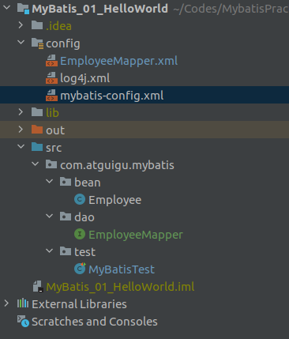
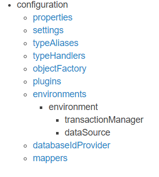
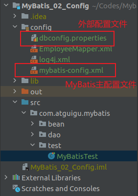
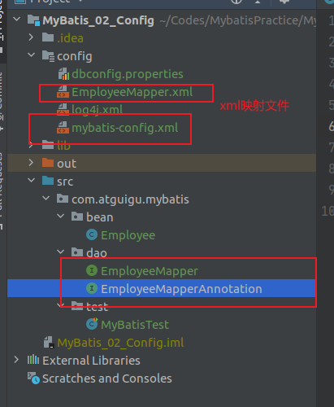
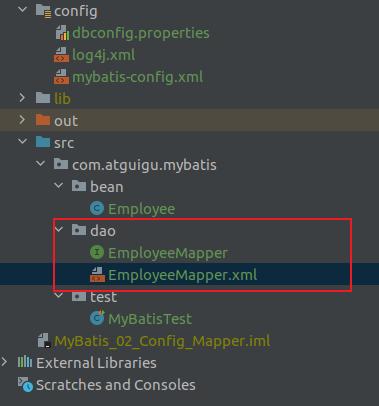
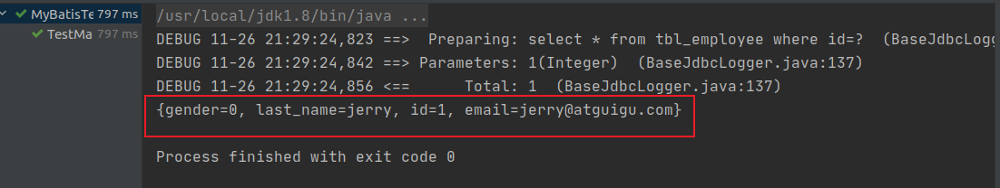
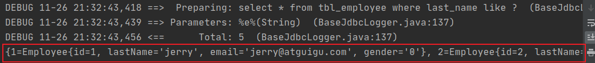

注：笔记来源于[尚硅谷 MyBatis教程 88集](https://www.bilibili.com/video/BV1bb411A7bD?from=search&seid=4039791659537805803&spm_id_from=333.788.b_636f6d6d656e74.35)

# Mybatis


# 示例一：Hello World

1. Mysql数据库mybatis ，表tbl_employee。

   ```mysql
   CREATE TABLE `tbl_employee` (
     `id` int NOT NULL AUTO_INCREMENT,
     `last_name` varchar(255) DEFAULT NULL,
     `gender` char(1) DEFAULT NULL,
     `email` varchar(255) DEFAULT NULL,
     PRIMARY KEY (`id`)
   ) ENGINE=InnoDB AUTO_INCREMENT=2 DEFAULT CHARSET=utf8mb4 		COLLATE=utf8mb4_0900_ai_ci*
   ```
	```
	| id   | last_name | gender | email            |
	| ---- | --------- | ------ | ---------------- |
	| 1    | tom       | 0      | tom@atguicom.com |
	```

2. 项目结构

   通过导入jar包的方式（没有通过maven方式）

   - Employee类对应数据库中的tbl_employee表
   - EmployeeMapper 接口类，针对MyBatis通过接口与XML动态绑定的测试
   - MyBatisTest 类，测试类
   - EmployeeMapper.xml 定义SQL语句，该文件与Employee类、数据库中的tbl_employee表相关
   - log4.xml 为了log4j正常运行，需要设置log4.xml
   - mybatis-config.xml mybatis的主配置文件，配置数据库连接池信息，事务管理器信息等。。。系统运行环境等。

   

3. Employee.class

   ```java
   public class Employee {
       private Integer id;
       private String lastName;   //lastName与数据库tbl_employee表中的last_name不对应
       private String email;
       private String gender;
       //其他 toString方法 get方法 set方法
   }
   ```
   
4. EmployeeMapper

   ```java
   //MyBatis支持接口与配置文件动态绑定  不需要实现EmployeeMapper的实现类
   public interface EmployeeMapper {
       public Employee getEmpById(Integer id);
   }
   ```

5. mybatis-config.xml

   ```xml
   <?xml version="1.0" encoding="UTF-8" ?>
   <!DOCTYPE configuration
           PUBLIC "-//mybatis.org//DTD Config 3.0//EN"
           "http://mybatis.org/dtd/mybatis-3-config.dtd">
   <configuration>
       <environments default="development">
           <environment id="development">
               <transactionManager type="JDBC"/>
   
               <dataSource type="POOLED">
                   <property name="driver" value="com.mysql.cj.jdbc.Driver"/>
                   <property name="url" value="jdbc:mysql://localhost:3306/mybatis"/>
                   <property name="username" value="root"/>
                   <property name="password" value="199512"/>
               </dataSource>
           </environment>
       </environments>
   
       <!--将写好的sql映射一定要注册到全局配置文件中  -->
       <mappers>
           <mapper resource="EmployeeMapper.xml"/>
       </mappers>
       
   </configuration>
   ```

   

6. EmployeeMapper.xml

   ```xml
   <?xml version="1.0" encoding="UTF-8" ?>
   <!DOCTYPE mapper
           PUBLIC "-//mybatis.org//DTD Mapper 3.0//EN"
           "http://mybatis.org/dtd/mybatis-3-mapper.dtd">
   <!-- namespace 名称空间 指定为接口的全类名，MyBatis会将接口与配置文件动态绑定-->
   <mapper namespace="com.atguigu.mybatis.dao.EmployeeMapper">
   
       <!--  id:唯一标识
       resultType:返回值类型（返回值会被封装成XXX类型对象）
       #{id}：从传递过来的参数中取出id值
        -->
       <!-- select * from xxx 如果数据库中的字段名称与类对象名称不一致，映射出来的类该字段结果为null -->
       <select id="selectEmp" resultType="com.atguigu.mybatis.bean.Employee">
           select * from tbl_employee where id = #{id}
       </select>
   
       <!--  通过别名方式 将查询的Employee中的lastName与数据库中的last_name相对应  -->
       <select id="selectEmpNickName" resultType="com.atguigu.mybatis.bean.Employee">
           select id,last_name lastName, email,gender from tbl_employee where id=#{id}
       </select>
   
       <!-- 动态绑定方式 -->
       <!-- 将select标签中的id设置为接口中的方法的名字 将方法与select语句绑定 -->
       <select id="getEmpById" resultType="com.atguigu.mybatis.bean.Employee">
           select * from tbl_employee where id = #{id}
       </select>
   </mapper>
   ```

   

7. MyBatisTest

   ```java
   public class MyBatisTest {
       //抽取代码公共部分 创建SqlSessionFactory
       public SqlSessionFactory getSqlSessionFactory() throws IOException{
           String resource="mybatis-config.xml";
           InputStream inputStream=Resources.getResourceAsStream(resource);
           return new SqlSessionFactoryBuilder().build(inputStream);
       }
       
       /**
        * 1.根据xml配置文件（全局配置文件，有数据源一些运行环境信息），例如：mybatis-config.xml文件 创建一个sqlSessionFactory 对象
        * 2.sql 映射文件 配置了每一个sql 以及sql的封装规则等
        * 3.将sql映射文件注册在全局配置文件中
        * 4.
        *  1）根据全局配置文件得到SqlSessionFactory
        *  2）使用sqlSessionFactory 获取sqlSession对象使用其执行增删改查
        *  3）使用sql的唯一标识告诉Mybatis执行哪一个sql。sql都保存在sql映射文件中
        * @throws IOException
        */
       @Test
       public void test() throws IOException {
           //项目的主配置文件
           String resource = "mybatis-config.xml";
           //配置文件的流
           InputStream inputStream = Resources.getResourceAsStream(resource);
           //根据配置文件创建sqlSessionFactory
           SqlSessionFactory sqlSessionFactory = new SqlSessionFactoryBuilder().build(inputStream);
   
           //2.获取sqlSession实例，能直接执行已经映射的sql语句
           SqlSession sqlSession=sqlSessionFactory.openSession();
           //selectOne 函数
           //第一个参数：唯一标识，通常使用namespace+id来标识
           //第二个参数：sql使用的参数
           try{
               //select * from tbl_employee where id = #{id} 类中的lastName与数据库中的last_name不对应 查询出来的结果lastName为null
               Employee employee=sqlSession.selectOne("com.atguigu.mybatis.EmployeeMapper.selectEmp", 1);
               System.out.println(employee);
   
               //select id,last_name lastName, email,gender from tbl_employee where id=#{id} 通过查询语句别名的方式，将类中的lastName与数据库中的last_name相对应
               employee=sqlSession.selectOne("com.atguigu.mybatis.EmployeeMapper.selectEmpNickName", 1);
               System.out.println(employee);
           }finally {
               sqlSession.close();
           }
       }
   
       /**
        * 1.接口式编程：
        *  原声：      Dao --> DaoImpl
        *  mybatis：  Mapper --> xxMapper.xml
        *
        *  2. SqlSession 代表和数据库的一次会话，用完必须关闭
        *  3. Sqlsession 和Connection一样都是非线程安全。每次使用都应该去获取新的对象，不能放在共享成员变量中
        *  4. mapper接口没有实现类，但是mybatis会为接口生成一个代理对象
        *      (将接口和XML进行绑定）
        *      EmployeeMapper empMapper=sqlSession.getMapper(EmployeeMapper.class);
        *  5.两个重要的配置文件：
        *      mybatis的全局配置文件，包含数据库连接池信息，事务管理器信息等。。。系统运行环境等
        *      sql映射文件：保存了每一个sql的映射信息，将sql抽取出来
        * @throws IOException
        */
       @Test
       public void Test01() throws IOException {
           //1.获取sqlSessionFactory对象
           SqlSessionFactory sqlSessionFactory=getSqlSessionFactory();
           //2.获取sqlSession对象
           SqlSession sqlSession=sqlSessionFactory.openSession();
   
           try{
               //3.获取接口的实现类对象
               //会为接口自动的创建一个代理对象，代理对象去执行增删改查方法
               EmployeeMapper mapper=sqlSession.getMapper(EmployeeMapper.class);
               Employee employee=mapper.getEmpById(1);
   
               System.out.println(mapper.getClass());  //class com.sun.proxy.$Proxy6
               System.out.println(employee);
           }finally {
               sqlSession.close();
           }
   
       }
   }
   ```

   


# MyBatis 全局配置文件

包含了影响MyBatis的设置settings和属性properties

这些标签有一个规定的顺序，不按照这个顺序就会报错。



## properties标签

mybatis通过标签来引入外部properties配置文件的内容。`resource`引入类路径下资源，`url`引入网络路径或磁盘路径下的资源

```xml
<properties resource="" url=""></properties>
```

示例：



`dbconfig.properties`

```xml
jdbc.driver=com.mysql.cj.jdbc.Driver
jdbc.url=jdbc:mysql://localhost:3306/mybatis
jdbc.username=root
jdbc.password=199512
```

`mybatis-config.xml`

```xml
<properties resource="dbconfig.properties"></properties>
<environments default="development">
    <environment id="development">
    	<transactionManager type="JDBC"/>
        <dataSource type="POOLED">
            <property name="driver" value="${jdbc.driver}"/>
            <property name="url" value="${jdbc.url}"/>
            <property name="username" value="${jdbc.username}"/>
            <property name="password" value="${jdbc.password}"/>
        </dataSource>
     </environment>
</environments>
```

## settings标签

settings标签包含了很多设置项，setting用来设置每一个设置项，其中setting中的name表示设置项的名字，value表示设置项的取值

示例：

设置mapUnderscoreToCamelCase，驼峰命名法

启用驼峰命名法，数据库中的字段命名格式为A_COLUMN，Java类中的命名格式为aColumn，能够进行自动映射

| mapUnderscoreToCamelCase | Enables automatic mapping from classic database column names A_COLUMN to camel case classic Java property names aColumn. | true \| false | False |
| ------------------------ | ------------------------------------------------------------ | ------------- | ----- |
|                          |                                                              |               |       |

```xml
<settings>
	<setting name="mapUnderscoreToCamelCase" value="true"/>
</settings>
```

测试类以及输出结果

```java
 //select * from tbl_employee where id = #{id} 启用了驼峰命名法，数据库中的命名规则是A_COLUMN，实体类中的命名规则是aColumn，两者能够对应起来，所以查询结果能够相互对应
Employee employee=sqlSession.selectOne("com.atguigu.mybatis.dao.EmployeeMapper.selectEmp", 1);
System.out.println(employee);
```

```pow
DEBUG 11-24 20:56:34,761 ==>  Preparing: select * from tbl_employee where id = ?  (BaseJdbcLogger.java:137) 
DEBUG 11-24 20:56:34,779 ==> Parameters: 1(Integer)  (BaseJdbcLogger.java:137) 
DEBUG 11-24 20:56:34,793 <==      Total: 1  (BaseJdbcLogger.java:137) 
Employee{id=1, lastName='tom', email='tom@guigu.com', gender='0'}
```

## typeAliases标签

`typeAliases`别名处理标签，可以为Java类型起别名，**别名不区分大小写**。

其中，`typeAlias`可以为Java类起别名，type指定要起别名的类型全类名，alias指定要起的别名，默认名为类名小写

`package` 为某个包下的所有类批量起别名，name指定包名（为当前包以及下面所有的后代包的每个类都起一个默认别名（类名小写）。批量起别名的情况下，使用`@Alias`注解为某个类起新的名

示例：

```xml
<typeAliases>
    <typeAlias type="com.atguigu.mybatis.bean.Employee" alias="employee"></typeAlias>
    
    <!-- 批量起别名操作-->
    <package name="com.atguigu.mybatis.bean"/>
</typeAliases>
```

```java
@Alias("employee") //使用Alias注解 为类声明别名
public class Employee {
    private Integer id;
    private String lastName;
    private String email;
    private String gender;
    //toString get set
}
```

## typeHandlers标签

类型处理器，Java类型与数据库中的类型相互映射（类型映射）

## plugins标签

通过插件机制，实现对SQL语句的执行进行拦截

- Executor 
- ParameterHandler
- ResultSetHandler
- StatementHandler

## environments标签

```xml
    <!-- environments：mybatis可以配置多重环境,default标签指定使用某种环境，达到快速切换
        environment：配置一个具体的环境信息，必须要有transactionManager和dataSource两个标签
            id:代表当前环境的唯一标识
            transactionManager：事务管理器
                type：事务管理器的管理类型 JDBC|MANAGED
                    自定义事务管理器：实现TransactionFactory接口，type指定为全类名
            dataSource:数据源
                type:UNPOOLED|POOLED|JNDI
                     自定义数据源：实现DatasourceFactory接口，type指定为自定义数据源的全类名
        -->
    <environments default="development">
        <environment id="development">
            <transactionManager type="JDBC"/>
            <dataSource type="POOLED">
                <property name="driver" value="${jdbc.driver}"/>
                <property name="url" value="${jdbc.url}"/>
                <property name="username" value="${jdbc.username}"/>
                <property name="password" value="${jdbc.password}"/>
            </dataSource>
        </environment>

        <environment id="test">
            <transactionManager type="JDBC"/>
            <dataSource type="POOLED">
                <property name="driver" value="${jdbc.driver}"/>
                <property name="url" value="${jdbc.url}"/>
                <property name="username" value="${jdbc.username}"/>
                <property name="password" value="${jdbc.password}"/>
            </dataSource>
        </environment>
    </environments>
```

## databaseIdProvider标签

支持多数据库厂商

1. 全局配置文件中设置`databaseIdProvider`
2. 在SQL映射文件中配置sql语句，配置不同厂商数据库条件下的SQL查询语句

```xml
<!--  支持多数据库厂商
	type="DB_VENDOR" 作用是得到数据库厂商的标识，mybatis就能根据数据库厂商标识执行不同的sql
-->
<databaseIdProvider type="DB_VENDOR">
	<!--   为不同的数据库厂商起别名     -->
	<property name="MySQL" value="mysql"/>
	<property name="Oracle" value="oracle"/>
	<property name="SQL Server" value="sqlserver"/>
</databaseIdProvider>
```

```xml
<!-- databaseId 针对mysql数据库中数据进行-->
<select id="getEmpById" resultType="employee" databaseId="mysql">
	select * from tbl_employee where id=#{id}
</select>

<select id="getEmpById" resultType="employee" databaseId="oracle">
	select * from tbl_employee where id=#{id}
</select>
```

## Mappers标签

将Sql映射注册到全局配置中

```xml
<!--将写好的sql映射注册到全局配置文件中  -->
<mappers>
<!--  mapper：可以注册一个SQL映射XML或注册接口
	注册一个SQL映射，注册配置文件的方式有两种：resource和url
        resource：引用类路径下的sql映射文件
        url：引用网络路径或者磁盘路径下的sql映射文件
    注册借口，class方式，class:引用（注册）接口
        1.有sql映射文件，映射文件名必须与接口同名，并且放在与接口同一目录下
        2.没有sql映射文件，所有的sql都是利用注解写在接口上
        推荐：比较重要的Dao接口写sql映射文件，不重要的，简单的Dao借口为了开发快速可以使用注解           
-->

	<!-- 基于xml配置文件   -->
	<mapper resource="EmployeeMapper.xml"/>
    <!-- 无配置文件类型 基于注解方式-->
    <mapper class="com.atguigu.mybatis.dao.EmployeeMapperAnnotation"></mapper>
    <!--  批量注册
    	name：包名
        映射文件与接口同名，并且放在同一目录下 
	-->
    <package name="com.atguigu.mybatis.dao"/>
</mappers>
```



XML映射文件与接口文件在同一个文件夹下，其中XML文件与接口文件名字相同，同时，接口中的方法名与接口文件中的方法名一致



mybtais-config.xml

```xml
<mappers>
<package name="com.atguigu.mybatis.dao"/>
</mappers>
```

EmployeeMapper.java

```java
package com.atguigu.mybatis.dao;

import com.atguigu.mybatis.bean.Employee;

//MyBatis支持借口与配置文件动态绑定
public interface EmployeeMapper {
    public Employee getEmpById(Integer id);
}
```

EmployeeMapper.xml

```xml
<?xml version="1.0" encoding="UTF-8" ?>
<!DOCTYPE mapper
        PUBLIC "-//mybatis.org//DTD Mapper 3.0//EN"
        "http://mybatis.org/dtd/mybatis-3-mapper.dtd">

<!-- namespace 名称空间 指定为接口的全类名，将接口与配置文件动态绑定-->
<mapper namespace="com.atguigu.mybatis.dao.EmployeeMapper">

    <!--  通过别名方式 将查询的Employee中的lastName与数据库中的last_name相对应  -->
    <select id="getEmpById" resultType="com.atguigu.mybatis.bean.Employee">
        select id,last_name lastName, email,gender from tbl_employee where id=#{id}
    </select>

</mapper>
```

## objectFactory标签

# MyBatis 映射文件

## 增删改查操作

- **Employee.java**

  ```java
  @Alias("") //使用Alias注解 为类声明别名
  public class Employee {
      private Integer id;
      private String lastName;
      private String email;
      private String gender;
  
      //构造有参构造器，必须创建对应的无参构造器，否则容易出错
      public Employee(Integer id, String lastName, String email, String gender) {
  	// xxx
      }
  
      //构造无参构造器
      public Employee() {
      }
      
      //toString set get等方法
  }
  ```

  

- **EmployeeMapper.java**

  增删改查方法在接口文件中进行声明，具体的执行语句在EmployeeMapper.xml文件中

  ```java
  //MyBatis支持借口与配置文件动态绑定
  public interface EmployeeMapper {
      public Employee getEmpById(Integer id);
  
      public void addEmp(Employee employee);
  
  //    public void updateEmp(Employee employee);
      //修改映射文件中的方法返回类型，定义返回类型为boolean类型
      public boolean updateEmp(Employee employee);
  
      public void deleteEmpById(Integer id);
  
  }
  ```

- **EmployeeMapper.xml**

  ```xml
  <?xml version="1.0" encoding="UTF-8" ?>
  <!DOCTYPE mapper
          PUBLIC "-//mybatis.org//DTD Mapper 3.0//EN"
          "http://mybatis.org/dtd/mybatis-3-mapper.dtd">
  
  
  <!-- namespace 名称空间 指定为接口的全类名，将接口与配置文件动态绑定-->
  <mapper namespace="com.atguigu.mybatis.dao.EmployeeMapper">
      <!--  id:唯一标识
      resultType:返回值类型（封装成XXX类型对象）
      #{id}：从传递过来的参数中取出id值
       -->
  
      <!--  public Employee getEmpById(Integer id)  -->
      <!-- 将select标签中的id设置为接口中的方法的名字 将方法与select语句绑定 -->
      <select id="getEmpById" resultType="com.atguigu.mybatis.bean.Employee">
          select * from tbl_employee where id = #{id}
      </select>
  
      <!--      public void addEmp(Employee employee)-->
      <!--  mysql支持自增主键，自增主键获取，mybatis也是利用了statement.getGeneratedKeys()
          通过useGeneratedKyes标签 useGeneratedKeys="true" 使用自增主键获取主键值策略
          keyProperty：指定对应的主键属性，也就是mybatis获取到主键值后，将这个值封装到javaBean的哪个属性-->
      <insert id="addEmp" parameterType="com.atguigu.mybatis.bean.Employee" useGeneratedKeys="true" keyProperty="id" databaseId="mysql">
          insert into tbl_employee(last_name,email,gender)
          values(#{lastName},#{email},#{gender})
      </insert>
  
      <!--  oracle不支持自增主键，Oracle使用序列来模拟自增
          每次插入的数据是从序列中拿到的值，获取该值：
   		运行顺序：
  			先运行selectKey查询id的sql，查出id值封装给JavaBean的id属性
  			再运行插入的sql，就可以取出id属性对应的值
  		-->
      <insert id="addEmp" parameterType="com.atguigu.mybatis.bean.Employee" databaseId="oracle">
      <!-- 编写查询主键的sql语句
          id:把主键给封装给javaBean的哪个属性
          oreder="before":当前sql在插入sql之前运行
          resultType：当前执行语句的返回类型 -->
      <selectKey keyProperty="id" order="BEFORE" resultType="Integer">
          select EMPLOYEES_SEQ.nextval from dual
      </selectKey>
      <!--插入时的主键是从序列中拿到的 -->
          insert into tbl_employee(EMPLOYEE_ID,LAST_NAME,EMAIL)
          values(#{id},#{lastName},#{email})
      </insert>
  
      <!--    public void updateEmp(Employee employee)-->
      <update id="updateEmp">
          update tbl_employee
          set last_name=#{lastName},email=#{email},gender=#{gender}
          where id=#{id}
      </update>
      <!--    public void deleteEmpById(Integer id)-->
      <delete id="deleteEmpById" >
          delete from tbl_employee where id=#{id}
      </delete>
      
  </mapper>
  ```

- mybatis-config.xml

  ```xml
  <?xml version="1.0" encoding="UTF-8" ?>
  <!DOCTYPE configuration
          PUBLIC "-//mybatis.org//DTD Config 3.0//EN"
          "http://mybatis.org/dtd/mybatis-3-config.dtd">
  <configuration>
      <!--
         1.mybatis 可以使用properties来引入外部properties配置文件的内容
         resource：引入类路径下资源
         url：引入网络路径或者磁盘路径下的资源
      -->
      <properties resource="dbconfig.properties"></properties>
  
  
      <!-- settings标签包含很多设置项
      setting用来设置每一个设置项
          name 设置项的名字
          value 设置项的取值
      -->
      <settings>
          <setting name="mapUnderscoreToCamelCase" value="true"/>
      </settings>
  
      <databaseIdProvider type="DB_VENDOR">
          <property name="MySQL" value="mysql"/>
          <property name="Oracle" value="oracle"/>
          <property name="SQL Server" value="sqlserver"/>
      </databaseIdProvider>
  
      <!-- environments：mybatis可以配置多重环境,default标签指定使用某种环境，达到快速切换
          environment：配置一个具体的环境信息，必须要有transactionManager和dataSource两个标签
              id:代表当前环境的唯一标识
              transactionManager：事务管理器
                  type：事务管理器的管理类型 JDBC|MANAGED
                      自定义事务管理器：实现TransactionFactory接口，type指定为全类名
              dataSource:数据源
                  type:UNPOOLED|POOLED|JNDI
                       自定义数据源：实现DatasourceFactory接口，type指定为自定义数据源的全类名
          -->
      <environments default="development">
          <environment id="development">
              <transactionManager type="JDBC"/>
              <dataSource type="POOLED">
                  <property name="driver" value="${jdbc.driver}"/>
                  <property name="url" value="${jdbc.url}"/>
                  <property name="username" value="${jdbc.username}"/>
                  <property name="password" value="${jdbc.password}"/>
              </dataSource>
          </environment>
      </environments>
  
      <!--将写好的sql映射注册到全局配置文件中  -->
      <mappers>
          <mapper resource="EmployeeMapper.xml"/>
      </mappers>
  </configuration>
  ```

  

- MyBatisTest.java 测试文件

  ```java
   /***
       * 1.mybatis 允许增删改直接定义以下类型返回值：Integer、Long、Boolean类型
       *      直接在接口上写返回类型，SQL映射文件无法定义相关类型
       * 2.需要手动提交数据
       *      sqlSessionFactory.opensession(); 手动提交数据
       *      sqlSessionFactory.opensession(true); 自动提交数据
       * @throws IOException
       */
  //    增删改查操作测试
      @Test
      public void Test03() throws IOException{
          SqlSessionFactory sqlSessionFactory=getSqlSessionFactory();
          //获取改opensession的方法，获取到的sqlSession不会自动提交数据，需要手动提交
          SqlSession sqlSession=sqlSessionFactory.openSession();
          try{
              EmployeeMapper  mapper=sqlSession.getMapper(EmployeeMapper.class);
              Employee employee=mapper.getEmpById(1);
  
  //            添加员工操作
  //            employee=new Employee(null,"jerry","jerry@atguigu.com","1");
  //            mapper.addEmp(employee);
  
              //修改操作
              employee=new Employee(3,"jerry","jerry@atguigu.com","0");
              boolean flag=mapper.updateEmp(employee);
              System.out.println(flag);
  
  
              //手动提交数据
              sqlSession.commit();
          }finally {
              sqlSession.close();
          }
      }
  
  ```

  

## MyBatis参数处理

1. 单个参数情况：mybatis 不会做特殊处理

   ```xml
   #{参数名}  取除参数名
   
   <!--    public void deleteEmpById(Integer id)-->
   <!-- 方式一和方式二等效 -->
   <!-- 方式一 -->
   <delete id="deleteEmpById" >
       delete from tbl_employee where id=#{id}
   </delete>
   <!-- 方式二 -->
   <delete id="deleteEmpById">
       delete from tbl_employee where id=#{idabc}
   </delete>
   ```

   

2. 多个参数的情况下

   - mybatis会做特殊处理，多个参数会被封装成一个map，#{}就是从map中获取指定的key值。其中，key就是parm1，...，parmN 或者参数的索引，value是我们传入的值。

   - 命名参数方式：明确指定封装参数时map的key，例如：`@Param("id")`

     多个参数会被封装成一个map：

     ​	key：使用`@Param`注解指定的值

     ​	value：参数值

     #{指定的key}取出对应的参数值

   - 如果多个参数正好是我们业务逻辑的数据模型，可以直接传入pojo

     #{属性名}：取出传入的pojo的属性值

   - 如果多个参数，不是业务模型中的数据，没有对应的pojo，不经常使，为了方便，可以传入map

     ​	#{key}：取出map中对应的值

   - 如果多个参数不是数据业务模型中的数据，但是经常使用，推荐使用一个TO（Transfer Ojbect）数据传输对象

     例如：Page{

     ​	int index;

     ​	int size;

     }

   - 思考

     ```java
     public Employee getEmp(@Param("id")Integer id,String lastName);
     取值：id==>#{id/param1} lastName=#{param2}
     
     public Employee getEmp(Integer id,Employee emp);
     取值：id==>#{param1} lastName=#{param2.lastName}
     
     public Employee getEmp(Integer id,@Param("e")Employee emp);
     取值：id==>#{param1} lastName=#{param2.lastName/e.lastName}
     
     ## 如果是Collection（List、Set）类型或者是数组，也会特殊处理。也是把传入的list或者数组封装在map中
         	key:Collection类型（collection），如果是List，还可以使用这个key（list)，数组（array）
     public Employee getEmpById(List<Integer> ids);
     取值：取出第一个id的值：#{list[0]}
     ```

   示例：

   ```java
   public Employee getEmployeeByIdAndLastName(Integer id,String lastName)
   ```

   **产生异常的操作**：

   ```java
   public Employee getEmployeeByIdAndLastName(Integer id,String lastName);
   ```

   ```xml
   <!-- public Employee getEmployeeByIdAndLastName(Integer id,String lastName) -->
   <select id="getEmployeeByIdAndLastName">
       select * from tbl_employee where id=#{id} and last_name=#{lastName}
   </select>
   ```

   ```pow
   org.apache.ibatis.exceptions.PersistenceException: 
   ### Error querying database.  Cause: org.apache.ibatis.binding.BindingException: Parameter 'id' not found. Available parameters are [arg1, arg0, param1, param2]
   ### Cause: org.apache.ibatis.binding.BindingException: Parameter 'id' not found. Available parameters are [arg1, arg0, param1, param2]
   ```

   **Param方式进行操作**

   ```xml
   <!-- public Employee getEmployeeByIdAndLastName(Integer id,String lastName) -->
   <select id="getEmployeeByIdAndLastName" resultType="com.atguigu.mybatis.bean.Employee">
       select * from tbl_employee where id=#{param1} and last_name=#{param2}
   </select>
   ```

   **Param注解 命名方式进行操作**

   ```java
   public Employee getEmployeeByIdAndLastName(@Param("id") Integer id, @Param("lastName") String lastName);
   ```

   ```xml
   <!-- public Employee getEmployeeByIdAndLastName(@Param("id") Integer id, @Param("lastName") String lastName) -->
   <select id="getEmployeeByIdAndLastName" resultType="com.atguigu.mybatis.bean.Employee">
       select * from tbl_employee where id=#{id} and last_name=#{lastName}
   </select>
   ```

   **Map方式**

   ```java
   //EmployeeMapper.java
   public interface EmployeeMapper {
       public Employee getEmpById(Integer id);
   }
   ```

   ```xml
   <!-- EmployeeMappper.xml -->
   <!--    public Employee getEmpByMap(Map<String,Object> map)-->
   <select id="getEmpByMap" resultType="com.atguigu.mybatis.bean.Employee">
       select * from tbl_employee where id=#{id} and last_name=#{lastName}
   </select>
   ```

   ```java
   // MyBatisTest.java 
   EmployeeMapper  mapper=sqlSession.getMapper(EmployeeMapper.class);
   HashMap<String,Object> map=new HashMap<>();
   map.put("id",1);
   map.put("lastName","jerry");
   Employee employee=mapper.getEmpByMap(map);
   System.out.println(employee);
   ```

3. 

## MyBatis参数处理源码

总结：参数多时会封装map，为了不混乱，可以使用@Param来指定封装时使用的key，`#{key}`就可以取出map中的值

示例：

`@Param("id")Integer id,@Param("lastName")String lastName)`

ParamNameResolver类解析参数封装map的。

其中，names:{0=id,1=lastName} 在`ParamNameResolver`构造器的时候就确定好了，`ParamNameResolver`构造器中names的确定流程如下：

​	第一步：获取每个标了param注解的参数的@Param的值，本示例中先依次解析出`id lastName`，赋值给name

​	第二步：每次在解析一个参数给map中保存信息（key：参数索引，value：name的值）
​		name的值，两种情况：
​			标注了param注解：注解的值
​			没有标注：
​				1)全局配置：useActualParamName(jdk1.8):name=参数名
​				2)name=map.size()：相当于当前元素的索引
例如传入三个参数，前两个为注解方式`id`,`lastName`，第三个参数非注解方式传入参数`2`，names的最终效果是：{0=id,1=lastName,2=2}

```java
//args为传递的参数解析 args[]中的元素为[1,"Tom"]
//通过names={0=id,1=lastName,2=2}将args[] 转换为，map结果为{id=args[0],lastName=args[1],2=args[2]}，同时生成{param1=args[0],param2=args[1],param3=args[2]}
//效果：有Param注解可以#{指定的key}，或者#{param1}
public Object getNamedParams(Object[] args) {
    //name SortedMap<Integer,String>类型 在ParamNameResolver中进行了生成names，最终效果是：{0=id,1=lastName,2=2}的类型
    int paramCount = this.names.size();
    

    if (args != null && paramCount != 0) {
        //2.只有一个元素，并且没有Param注解：args[0] 单元素直接返回
        if (!this.hasParamAnnotation && paramCount == 1) {
            Object value = args[(Integer)this.names.firstKey()];
            return wrapToMapIfCollection(value, this.useActualParamName ? (String)this.names.get(0) : null);
            
            //多个元素或者有Param标注
        } else {
            Map<String, Object> param = new ParamMap();
            int i = 0;

            for(Iterator var5 = this.names.entrySet().iterator(); var5.hasNext(); ++i) {
                //names集合的value作为key；names集合的key有作为取值的参考
                //例如示例的names集合{0=id，1=lastName,2=2}，在处理后parm变成{id=args[0],lastName=args[1]，2=args[2]}
                Entry<Integer, String> entry = (Entry)var5.next();
                param.put(entry.getValue(), args[(Integer)entry.getKey()]);
                
                //也额外的将每一个参数保存在map中，使用新的key：param1...paramN
                //效果：有Param注解可以#{指定的key}，或者#{param1}
                String genericParamName = "param" + (i + 1);
                if (!this.names.containsValue(genericParamName)) {
                    param.put(genericParamName, args[(Integer)entry.getKey()]);
                }
            }
            return param;
        }
            //1.参数为null直接返回
    } else {
        return null;
    }
}
```

Names值的确定代码

```java
//定义的类属性names
private final SortedMap<Integer, String> names;

public ParamNameResolver(Configuration config, Method method) {
        this.useActualParamName = config.isUseActualParamName();
    	//获取注解类型
        Class<?>[] paramTypes = method.getParameterTypes();
    	//获取注解
        Annotation[][] paramAnnotations = method.getParameterAnnotations();
        SortedMap<Integer, String> map = new TreeMap();
        int paramCount = paramAnnotations.length;

        for(int paramIndex = 0; paramIndex < paramCount; ++paramIndex) {
            if (!isSpecialParameter(paramTypes[paramIndex])) {
                String name = null;
                Annotation[] var9 = paramAnnotations[paramIndex];
                int var10 = var9.length;

                for(int var11 = 0; var11 < var10; ++var11) {
                    Annotation annotation = var9[var11];
                    //获取每个标了param注解的参数的param值
                    if (annotation instanceof Param) {
                        this.hasParamAnnotation = true;
                        name = ((Param)annotation).value();
                        break;
                    }
                }

                if (name == null) {
                    //@Param was not specified
                    if (this.useActualParamName) {
                        name = this.getActualParamName(method, paramIndex);
                    }

                    if (name == null) {
                        //如何没标param注解，name为
                        name = String.valueOf(map.size());
                    }
                }

                map.put(paramIndex, name);
            }
        }

        this.names = Collections.unmodifiableSortedMap(map);
    }
```

## 参数值获取

#{}：可以获取map中的值或pojo对象属性的值
${}：可以获取map中的值或pojo对象属性的值

区别：

​	#{}：是以预编译的形式，将参数设置到sql语句，PreparedStatement，防止SQL注入

​	${}：取出的值直接拼装在sql语句中，没有方法保护安全

​	大多数情况下，取参数的值去使用#{}；某些情况下（原生jdbc不支持占位符的地方，就可以使用${}进行取值），例如分表、排序，按照年份分表拆分：

```xml
select * from ${year}_salary where xx;
select * from tbl_employee order by ${f_name} ${order}
```


#{}：更丰富的用法

- 规定参数的规则：

  参数指定一个特殊的数据类型

  javaType、jdbcType、mode（存储过程）、numericScale、resultMap、typeHandler、jdbcTypeName、expression

  例如：

  ```xml
  #{property,javaType=int,jdbcType=NUMERIC}
  #{height,javaType=double,jdbcType=NUMERIC,numericsScale=2}
  ```

  

  jdbcType通常需要在某种特定的条件下需要被设置：

  ​	在我们数据为null的时候，有些数据库可能不能识别mybatis对null的默认处理，例如Oracle（mybatis对所有的null映射的是原生的Jdbc的OTHER类型，Oracle不能正确识别）。

- 

## select元素

### **封装单个对象**

```java
public Employee getEmpById(Integer id);
```

```xml
<!--  public Employee getEmpById(Integer id)  -->
<!-- 将select标签中的id设置为接口中的方法的名字 将方法与select语句绑定 -->
<select id="getEmpById" resultType="com.atguigu.mybatis.bean.Employee">
    select * from tbl_employee where id = #{id}
</select>
```

```java
EmployeeMapper mapper=sqlSession.getMapper(EmployeeMapper.class);
Employee employee=mapper.getEmpById(1);
```

### **封装list**

resultType:如果返回的是一个集合，要写集合中的元素类型

```xml
public List<Employee> getEmpsByLastNameLike(String lastName);
```

```xml
<!--    public List<Employee> getEmpsByLastNameLike(String lastName); -->
<!-- resultType:如果返回的是一个集合，要写集合中的元素类型   -->
<select id="getEmpsByLastNameLike" resultType="com.atguigu.mybatis.bean.Employee">
    select * from tbl_employee where last_name like #{lastName}
</select>
```

```java
EmployeeMapper mapper=sqlSession.getMapper(EmployeeMapper.class);
List<Employee> employee=mapper.getEmpsByLastNameLike("%e%");
```

### **封装Map**

1. map中封装一条记录

   ```java
   //返回一条记录的map：key就是列名（数据库中的字段名），值就是对应的值
   public Map<String,Object> getEmpByIdReturnMap(Integer id);
   ```

   ```xml
   <!--    public Map<String,Object> getEmpByIdReturnMap(Integer id)
   -->
   <select id="getEmpByIdReturnMap" resultType="map">
       select * from tbl_employee where id=#{id}
   </select>
   ```

   ```java
   EmployeeMapper mapper=sqlSession.getMapper(EmployeeMapper.class);
   Map<String,Object> employee=mapper.getEmpByIdReturnMap(1);
               System.out.println(employee);
   ```

   

2. map中封装多条记录

   通过`@MapKey`的方式指定map使用的主键

   ```java
   //多条记录封装成一个map：Map<Integer,Employee> 健是这条记录的主键，值是封装后的javaBean
   //@MapKey 注解标识封装这个map时候，使用哪个属性作为map的主键
   @MapKey("id")
   public Map<Integer,Employee> getEmpByLastNameLikeReturnMap(String lastName);
   ```

   ```xml
   <!--    public Map<Integer,Employee> getEmpByLastNameLikeReturnMap(String lastName);-->
   <select id="getEmpByLastNameLikeReturnMap" resultType="com.atguigu.mybatis.bean.Employee">
   	select * from tbl_employee where last_name like #{lastName}
   </select>
   ```

   ```java
   EmployeeMapper mapper=sqlSession.getMapper(EmployeeMapper.class);
   Map<Integer,Employee> map=mapper.getEmpByLastNameLikeReturnMap("%e%");
   ```

   

### resultMap

resultType：从这条语句中返回的期望类型的类的完全限定名或别名。注意如果是集合，那应该是集合可以包含的类型，而不能是集合本身。该属性和resultMap不能同时使用。（自动封装相关）

resultMap：外部resultMap的命名引用，和resultType属性不能同时使用。

resultType与自动封装相关，数据库中的字段与类中的属性不相符，解决方法：

- 别名
- 驼峰命名法 A_Column aColumn
- resultMap 自定义结果集（实现高级结果集映射）

示例一 resultMap中需要映射的Employee对象（里面没有其他类的嵌套）：

`EmployeeMapperPlus.java`

```java
public interface EmployeeMapperPlus {
public Employee getEmpById(Integer id);
}
```

`EmployeeMapperPlus.xml`

```xml
<?xml version="1.0" encoding="UTF-8" ?>
<!DOCTYPE mapper
        PUBLIC "-//mybatis.org//DTD Mapper 3.0//EN"
        "http://mybatis.org/dtd/mybatis-3-mapper.dtd">
<mapper namespace="com.atguigu.mybatis.dao.EmployeeMapperPlus">

    <!-- reusltMap 自定义某个javaBean的封装规则
         type:自定义规则的java类型
         id:唯一id方便引用
    -->
    <resultMap id="MyEmp" type="com.atguigu.mybatis.bean.Employee">
        <!--指定主键和数据库列的封装规则
            column:指定哪一列
            property：指定对应的javaBean的属性
            <id> 表明是主键，mybatis会有优化
        -->
        <id column="id" property="id"/>
        <result column="last_name" property="lastName"/>
        <!--   其他不指定的列会自动封装，我们只要写resultMap就把全部的映射规则写上-->
        <result column="email" property="email"/>
        <result column="gender" property="gender"/>
    </resultMap>

    <!-- resultMap：自定义结果集映射规则   -->
    <!--    public Employee getEmpById(Integer id)-->
    <select id="getEmpById" resultMap="MyEmp">
        select * from tbl_employee where id=#{id}
    </select>
</mapper>
```

·示例二：在Employee类中有其他类的嵌套（Depatrment类）

`Department.java`

```java
package com.atguigu.mybatis.bean;

public class Department {
    private Integer id;
    private String departmentName;

    public Department(){
    }

    public Department(Integer id, String departmentName) {
        this.id = id;
        this.departmentName = departmentName;
    }

    //其他set方法 get方法 toString方法
}
```

`Employee.java`

```java
public class Employee {
    private Integer id;
    private String lastName;
    private String email;
    private String gender;
    private Department department;

    //构造无参构造器
    public Employee() {
    }

    public Employee(Integer id, String lastName, String email, String gender, Department department) {
        this.id = id;
        this.lastName = lastName;
        this.email = email;
        this.gender = gender;
        this.department = department;
    }

    //构造有参构造器，必须创建对应的无参构造器，否则容易出错
    public Employee(Integer id, String lastName, String email, String gender) {
        this.id = id;
        this.lastName = lastName;
        this.email = email;
        this.gender = gender;
    }
    
    //toString方法 set get方法
}
```

`EmployeeMapperPlus.java`

```java
public Employee getEmpAndDept(Integer id);
```

`EmployeeMapperPlus.xml`

```xml
    <!--  级联属性封装  -->
    <resultMap id="MyDifEmp" type="com.atguigu.mybatis.bean.Employee">
        <id column="id" property="id"/>
        <result column="last_name" property="lastName"/>
        <result column="gender" property="gender"/>
        <result column="did" property="department.id"/>
        <result column="dept_name" property="department.departmentName"/>
    </resultMap>

    <!--    public Employee getEmpAndDept(Integer id)-->
    <select id="getEmpAndDept" resultMap="MyDifEmp">
        select e.id id,e.last_name last_name,e.gender gender,e.d_id d_id,d.id did,d.dept_name dept_name from tbl_employee e,tbl_dept d where e.d_id=d.id and e.id=#{id}
    </select>
```


