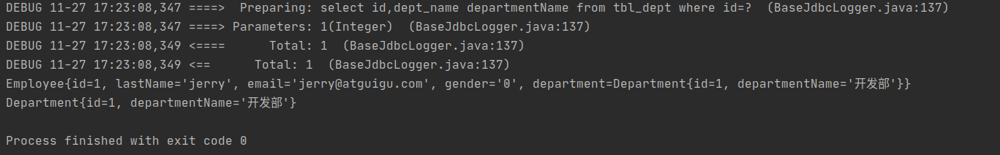

注：笔记来源于[尚硅谷 MyBatis教程 88集](https://www.bilibili.com/video/BV1bb411A7bD?from=search&seid=4039791659537805803&spm_id_from=333.788.b_636f6d6d656e74.35)

# Mybatis


# 示例一：Hello World

1. Mysql数据库mybatis ，表tbl_employee。

   ```mysql
   CREATE TABLE `tbl_employee` (
     `id` int NOT NULL AUTO_INCREMENT,
     `last_name` varchar(255) DEFAULT NULL,
     `gender` char(1) DEFAULT NULL,
     `email` varchar(255) DEFAULT NULL,
     PRIMARY KEY (`id`)
   ) ENGINE=InnoDB AUTO_INCREMENT=2 DEFAULT CHARSET=utf8mb4 		COLLATE=utf8mb4_0900_ai_ci*
   ```
	```
	| id   | last_name | gender | email            |
	| ---- | --------- | ------ | ---------------- |
	| 1    | tom       | 0      | tom@atguicom.com |
	```

2. 项目结构

   通过导入jar包的方式（没有通过maven方式）

   - `mybatis-config.xml` mybatis的主配置文件，配置数据库连接池信息，事务管理器信息等。。。系统运行环境等
   - `Employee`类对应数据库中的`tbl_employee`表
   - `EmployeeMapper `接口类，针对MyBatis通过接口与同名`EmployeeMapper.xml`动态绑定的测试
   - `EmployeeMapper.xml` 定义数据库数据操作`sql`语句，该文件与Employee类、数据库中的tbl_employee表相关
   - `MyBatisTest` 类，测试类
   - `log4.xml` 为了log4j正常运行，需要设置log4.xml

   

3. 相关类及配置文件

   Employee.class

   ```java
   public class Employee {
       private Integer id;
       private String lastName;   //注意：lastName与数据库tbl_employee表中的last_name不对应
       private String email;
       private String gender;
       //其他 toString方法 get方法 set方法 
       //构造器方法，在创建有参构造器的同时，需要保留无参构造器
   }
   ```

   EmployeeMapper

   ```java
   //MyBatis支持接口与配置文件动态绑定  不需要实现EmployeeMapper的实现类
   public interface EmployeeMapper {
       public Employee getEmpById(Integer id);
   }
   ```

   mybatis-config.xml

   ```xml
   <?xml version="1.0" encoding="UTF-8" ?>
   <!DOCTYPE configuration
           PUBLIC "-//mybatis.org//DTD Config 3.0//EN"
           "http://mybatis.org/dtd/mybatis-3-config.dtd">
   <configuration>
       <environments default="development">
           <environment id="development">
               <transactionManager type="JDBC"/>
   			
               <!-- 数据库连接 -->
               <dataSource type="POOLED">
                   <property name="driver" value="com.mysql.cj.jdbc.Driver"/>
                   <property name="url" value="jdbc:mysql://localhost:3306/mybatis"/>
                   <property name="username" value="root"/>
                   <property name="password" value="199512"/>
               </dataSource>
           </environment>
       </environments>
   
       <!--将写好的sql映射一定要注册到全局配置文件中  -->
       <mappers>
           <mapper resource="EmployeeMapper.xml"/>
       </mappers>
       
   </configuration>
   ```

   EmployeeMapper.xml

   ```xml
   <?xml version="1.0" encoding="UTF-8" ?>
   <!DOCTYPE mapper
           PUBLIC "-//mybatis.org//DTD Mapper 3.0//EN"
           "http://mybatis.org/dtd/mybatis-3-mapper.dtd">
   <!-- namespace 名称空间 指定为接口的全类名，MyBatis会将接口与配置文件动态绑定-->
   <mapper namespace="com.atguigu.mybatis.dao.EmployeeMapper">
   
       <!--  id:唯一标识
       resultType:返回值类型（返回值会被封装成XXX类型对象）
       #{id}：从传递过来的参数中取出id值
        -->
       <!-- select * from xxx 未进行处理时，如果数据库中的字段名称与类对象名称不一致，映射出来的类该字段结果为null -->
       <select id="selectEmp" resultType="com.atguigu.mybatis.bean.Employee">
           select * from tbl_employee where id = #{id}
       </select>
   
       <!--  通过别名方式 将查询的Employee中的lastName与数据库中的last_name相对应  -->
       <select id="selectEmpNickName" resultType="com.atguigu.mybatis.bean.Employee">
           select id,last_name lastName, email,gender from tbl_employee where id=#{id}
       </select>
   
       <!-- 动态绑定方式 -->
       <!-- 将select标签中的id设置为接口中的方法的名字 将方法与select语句绑定 -->
       <select id="getEmpById" resultType="com.atguigu.mybatis.bean.Employee">
           select * from tbl_employee where id = #{id}
       </select>
   </mapper>
   ```

   MyBatisTest

   ```java
   public class MyBatisTest {
       //抽取代码公共部分 创建SqlSessionFactory
       public SqlSessionFactory getSqlSessionFactory() throws IOException{
           String resource="mybatis-config.xml";
           InputStream inputStream=Resources.getResourceAsStream(resource);
           return new SqlSessionFactoryBuilder().build(inputStream);
       }
       
       /**
        * 1.根据xml配置文件（全局配置文件，有数据源一些运行环境信息），例如：mybatis-config.xml文件 创建一个sqlSessionFactory 对象
        * 2.sql 映射文件 配置了每一个sql 以及sql的封装规则等
        * 3.将sql映射文件注册在全局配置文件中
        * 4.
        *  1）根据全局配置文件得到SqlSessionFactory
        *  2）使用sqlSessionFactory 获取sqlSession对象使用其执行增删改查
        *  3）使用sql的唯一标识告诉Mybatis执行哪一个sql。sql都保存在sql映射文件中
        * @throws IOException
        */
       @Test
       public void test() throws IOException {
           //项目的主配置文件
           String resource = "mybatis-config.xml";
           //配置文件的流
           InputStream inputStream = Resources.getResourceAsStream(resource);
           //根据配置文件创建sqlSessionFactory
           SqlSessionFactory sqlSessionFactory = new SqlSessionFactoryBuilder().build(inputStream);
   
           //2.获取sqlSession实例，能直接执行已经映射的sql语句
           SqlSession sqlSession=sqlSessionFactory.openSession();
           //selectOne 函数
           //第一个参数：唯一标识，通常使用namespace+id来标识
           //第二个参数：sql使用的参数
           try{
               //select * from tbl_employee where id = #{id} 类中的lastName与数据库中的last_name不对应 查询出来的结果lastName为null
               Employee employee=sqlSession.selectOne("com.atguigu.mybatis.EmployeeMapper.selectEmp", 1);
               System.out.println(employee);
   
               //select id,last_name lastName, email,gender from tbl_employee where id=#{id} 通过查询语句别名的方式，将类中的lastName与数据库中的last_name相对应
               employee=sqlSession.selectOne("com.atguigu.mybatis.EmployeeMapper.selectEmpNickName", 1);
               System.out.println(employee);
           }finally {
               sqlSession.close();
           }
       }
   
       /**
        * 1.接口式编程：
        *  原声：      Dao --> DaoImpl
        *  mybatis：  Mapper --> xxMapper.xml
        *
        *  2. SqlSession 代表和数据库的一次会话，用完必须关闭
        *  3. Sqlsession 和Connection一样都是非线程安全。每次使用都应该去获取新的对象，不能放在共享成员变量中
        *  4. mapper接口没有实现类，但是mybatis会为接口生成一个代理对象
        *      (将接口和XML进行绑定）
        *      EmployeeMapper empMapper=sqlSession.getMapper(EmployeeMapper.class);
        *  5.两个重要的配置文件：
        *      mybatis的全局配置文件，包含数据库连接池信息，事务管理器信息等。。。系统运行环境等
        *      sql映射文件：保存了每一个sql的映射信息，将sql抽取出来
        * @throws IOException
        */
       @Test
       public void Test01() throws IOException {
           //1.获取sqlSessionFactory对象
           SqlSessionFactory sqlSessionFactory=getSqlSessionFactory();
           //2.获取sqlSession对象
           SqlSession sqlSession=sqlSessionFactory.openSession();
   
           try{
               //3.获取接口的实现类对象
               //会为接口自动的创建一个代理对象，代理对象去执行增删改查方法
               EmployeeMapper mapper=sqlSession.getMapper(EmployeeMapper.class);
               Employee employee=mapper.getEmpById(1);
   
               System.out.println(mapper.getClass());  //class com.sun.proxy.$Proxy6
               System.out.println(employee);
           }finally {
               sqlSession.close();
           }
   
       }
   }
   ```

   


# MyBatis 全局配置文件中的标签

包含了影响MyBatis的设置settings和属性properties

这些标签有一个规定的顺序，不按照这个顺序就会报错。


## properties 标签

`mybatis`通过标签来引入外部`properties`配置文件的内容。`resource`引入类路径下资源，`url`引入网络路径或磁盘路径下的资源

```xml
<properties resource="" url=""></properties>
```

示例：


`dbconfig.properties`

```xml
jdbc.driver=com.mysql.cj.jdbc.Driver
jdbc.url=jdbc:mysql://localhost:3306/mybatis?useUnicode=true&characterEncoding=UTF-8&serverTimezone=UTC&allowMultiQueries=true
jdbc.username=root
jdbc.password=root
```

`mybatis-config.xml`

```xml
<properties resource="dbconfig.properties"></properties>
<environments default="development">
    <environment id="development">
    	<transactionManager type="JDBC"/>
        <dataSource type="POOLED">
            <property name="driver" value="${jdbc.driver}"/>
            <property name="url" value="${jdbc.url}"/>
            <property name="username" value="${jdbc.username}"/>
            <property name="password" value="${jdbc.password}"/>
        </dataSource>
     </environment>
</environments>
```

## settings 标签

settings标签包含了很多设置项，setting用来设置每一个设置项，其中setting中的name表示设置项的名字，value表示设置项的取值

示例：

设置mapUnderscoreToCamelCase，驼峰命名法

启用驼峰命名法，数据库中的字段命名格式为A_COLUMN，Java类中的命名格式为aColumn，能够进行自动映射

| mapUnderscoreToCamelCase | Enables automatic mapping from classic database column names A_COLUMN to camel case classic Java property names aColumn. | true \| false | False |
| ------------------------ | ------------------------------------------------------------ | ------------- | ----- |
|                          |                                                              |               |       |

```xml
<settings>
	<setting name="mapUnderscoreToCamelCase" value="true"/>
</settings>
```

测试类以及输出结果

```java
 //select * from tbl_employee where id = #{id} 启用了驼峰命名法，数据库中的命名规则是A_COLUMN，实体类中的命名规则是aColumn，两者能够对应起来，所以查询结果能够相互对应
Employee employee=sqlSession.selectOne("com.atguigu.mybatis.dao.EmployeeMapper.selectEmp", 1);
System.out.println(employee);
```

```pow
DEBUG 11-24 20:56:34,761 ==>  Preparing: select * from tbl_employee where id = ?  (BaseJdbcLogger.java:137) 
DEBUG 11-24 20:56:34,779 ==> Parameters: 1(Integer)  (BaseJdbcLogger.java:137) 
DEBUG 11-24 20:56:34,793 <==      Total: 1  (BaseJdbcLogger.java:137) 
Employee{id=1, lastName='tom', email='tom@guigu.com', gender='0'}
```

## typeAliases 标签

`typeAliases`别名处理标签，可以为Java类型起别名，**别名不区分大小写**。

- 单独处理：`typeAlias`可以为Java类起别名，type指定要起别名的类型全类名，alias指定要起的别名，默认名为类名小写
- 批量处理：`package` 为某个包下的所有类批量起别名，name指定包名（为当前包以及下面所有的后代包的每个类都起一个默认别名（类名小写）。批量起别名的情况下，使用`@Alias`注解为某个类起新的名

示例：

```xml
<typeAliases>
    <typeAlias type="com.atguigu.mybatis.bean.Employee" alias="employee"></typeAlias>
    <!-- 批量起别名操作-->
    <package name="com.atguigu.mybatis.bean"/>
</typeAliases>
```

```java
@Alias("employee") //使用Alias注解 为类声明别名
public class Employee {
    private Integer id;
    private String lastName;
    private String email;
    private String gender;
    //toString get set
}
```


## typeHandlers 标签

类型处理器，Java类型与数据库中的类型相互映射（类型映射）


## plugins 标签

通过插件机制，实现对SQL语句的执行进行拦截

- Executor 
- ParameterHandler
- ResultSetHandler
- StatementHandler


## environments 标签

environments：mybatis可以配置多重环境，default标签指定使用某种环境，达到快速切换目标环境的目的

environment：配置一个具体的环境信息，必须要有`transactionManager`和`dataSource`两个标签

- id:代表当前环境的唯一标识

- transactionManager：事务管理器 

  ​	type：事务管理器的管理类型 `JDBC|MANAGED`

  ​	自定义事务管理器：实现TransactionFactory接口，type指定为全类名

- `dataSource`：数据源

  ​	type:`UNPOOLED|POOLED|JNDI`
  ​    自定义数据源：实现DatasourceFactory接口，type指定为自定义数据源的全类名

```xml
    <environments default="development">
        <environment id="development">
            <transactionManager type="JDBC"/>
            <dataSource type="POOLED">
                <property name="driver" value="${jdbc.driver}"/>
                <property name="url" value="${jdbc.url}"/>
                <property name="username" value="${jdbc.username}"/>
                <property name="password" value="${jdbc.password}"/>
            </dataSource>
        </environment>

        <environment id="test">
            <transactionManager type="JDBC"/>
            <dataSource type="POOLED">
                <property name="driver" value="${jdbc.driver}"/>
                <property name="url" value="${jdbc.url}"/>
                <property name="username" value="${jdbc.username}"/>
                <property name="password" value="${jdbc.password}"/>
            </dataSource>
        </environment>
    </environments>
```


## databaseIdProvider 标签

支持多数据库厂商

1. 全局配置文件中设置`databaseIdProvider`
2. 在SQL映射文件中配置sql语句，配置不同厂商数据库条件下的SQL查询语句

```xml
<!--  支持多数据库厂商
	type="DB_VENDOR" 作用是得到数据库厂商的标识，mybatis就能根据数据库厂商标识执行不同的sql
-->
<databaseIdProvider type="DB_VENDOR">
	<!--   为不同的数据库厂商起别名     -->
	<property name="MySQL" value="mysql"/>
	<property name="Oracle" value="oracle"/>
	<property name="SQL Server" value="sqlserver"/>
</databaseIdProvider>
```

```xml
<!-- databaseId 针对mysql数据库中数据进行-->
<select id="getEmpById" resultType="employee" databaseId="mysql">
	select * from tbl_employee where id=#{id}
</select>

<select id="getEmpById" resultType="employee" databaseId="oracle">
	select * from tbl_employee where id=#{id}
</select>
```


## Mappers 标签

将Sql映射注册到全局配置文件中

```xml
<mappers>
<!--  mapper：可以注册一个SQL映射XML或注册接口
    注册一个SQL映射，注册配置文件的方式有两种：resource和url
        resource：引用类路径下的sql映射文件
        url：引用网络路径或者磁盘路径下的sql映射文件
    注册接口，class方式，class:引用（注册）接口
        1.有sql映射文件，映射文件名必须与接口同名，并且放在与接口同一目录下
        2.没有sql映射文件，所有的sql都是利用注解写在接口上
        推荐：比较重要的Dao接口写sql映射文件，不重要的，简单的Dao借口为了开发快速可以使用注解           
-->

	<!-- 基于xml配置文件   -->
	<mapper resource="EmployeeMapper.xml"/>
    <!-- 无配置文件类型 基于注解方式-->
    <mapper class="com.atguigu.mybatis.dao.EmployeeMapperAnnotation"></mapper>
    <!--  批量注册
    	name：包名
        映射文件与接口同名，并且放在同一目录下 
	-->
    <package name="com.atguigu.mybatis.dao"/>
</mappers>
```


XML映射文件与接口文件在同一个文件夹下，其中XML文件与接口文件名字相同，同时，接口中的方法名与接口文件中的方法名一致


mybtais-config.xml

```xml
<mappers>
	<package name="com.atguigu.mybatis.dao"/>
</mappers>
```

EmployeeMapper.java

```java
package com.atguigu.mybatis.dao;
import com.atguigu.mybatis.bean.Employee;
//MyBatis支持借口与配置文件动态绑定
public interface EmployeeMapper {
    public Employee getEmpById(Integer id);
}
```

EmployeeMapper.xml

```xml
<?xml version="1.0" encoding="UTF-8" ?>
<!DOCTYPE mapper
        PUBLIC "-//mybatis.org//DTD Mapper 3.0//EN"
        "http://mybatis.org/dtd/mybatis-3-mapper.dtd">

<!-- namespace 名称空间 指定为接口的全类名，将接口与配置文件动态绑定-->
<mapper namespace="com.atguigu.mybatis.dao.EmployeeMapper">

    <!--  通过别名方式 将查询的Employee中的lastName与数据库中的last_name相对应  -->
    <select id="getEmpById" resultType="com.atguigu.mybatis.bean.Employee">
        select id,last_name lastName, email,gender from tbl_employee where id=#{id}
    </select>

</mapper>
```

## objectFactory标签

# MyBatis 映射文件

## 增删改查操作

**Employee.java**

```java
public class Employee {
    private Integer id;
    private String lastName;
    private String email;
    private String gender;

    //构造有参构造器，必须创建对应的无参构造器，否则容易出错
    public Employee(Integer id, String lastName, String email, String gender) {
	// xxx
    }

    //构造无参构造器
    public Employee() {
    }
    //toString set get等方法
}
```

**EmployeeMapper.java**

增删改查方法在接口文件中进行声明，具体的执行语句在EmployeeMapper.xml文件中

```java
//MyBatis支持借口与配置文件动态绑定
public interface EmployeeMapper {
    public Employee getEmpById(Integer id);

    public void addEmp(Employee employee);

//    public void updateEmp(Employee employee);
    //修改映射文件中的方法返回类型，定义返回类型为boolean类型
    public boolean updateEmp(Employee employee);

    public void deleteEmpById(Integer id);

}
```

**EmployeeMapper.xml**

```xml
<?xml version="1.0" encoding="UTF-8" ?>
<!DOCTYPE mapper
        PUBLIC "-//mybatis.org//DTD Mapper 3.0//EN"
        "http://mybatis.org/dtd/mybatis-3-mapper.dtd">


<!-- namespace 名称空间 指定为接口的全类名，将接口与配置文件动态绑定-->
<mapper namespace="com.atguigu.mybatis.dao.EmployeeMapper">
    <!--  id:唯一标识
    resultType:返回值类型（封装成XXX类型对象）
    #{id}：从传递过来的参数中取出id值
     -->

    
    <!--  public Employee getEmpById(Integer id)  -->
    <!-- 将select标签中的id设置为接口中的方法的名字 将方法与select语句绑定 -->
    <select id="getEmpById" resultType="com.atguigu.mybatis.bean.Employee">
        select * from tbl_employee where id = #{id}
    </select>

    
    
    <!--      public void addEmp(Employee employee)-->
    <!--  mysql支持自增主键，自增主键获取，mybatis也是利用了statement.getGeneratedKeys()
        通过useGeneratedKeys标签 useGeneratedKeys="true" 使用自增主键获取主键值策略
        keyProperty：指定对应的主键属性，也就是mybatis获取到主键值后，将这个值封装到javaBean的哪个属性-->
    <insert id="addEmp" parameterType="com.atguigu.mybatis.bean.Employee" useGeneratedKeys="true" keyProperty="id" databaseId="mysql">
        insert into tbl_employee(last_name,email,gender)
        values(#{lastName},#{email},#{gender})
    </insert>
    <!--  oracle不支持自增主键，Oracle使用序列来模拟自增
        每次插入的数据是从序列中拿到的值，获取该值：
 		运行顺序：
			先运行selectKey查询id的sql，查出id值封装给JavaBean的id属性
			再运行插入的sql，就可以取出id属性对应的值
		-->
    <insert id="addEmp" parameterType="com.atguigu.mybatis.bean.Employee" databaseId="oracle">
    <!-- 编写查询主键的sql语句
        id:把主键给封装给javaBean的哪个属性
        oreder="before":当前sql在插入sql之前运行
        resultType：当前执行语句的返回类型 -->
    <selectKey keyProperty="id" order="BEFORE" resultType="Integer">
        select EMPLOYEES_SEQ.nextval from dual
    </selectKey>
    <!--插入时的主键是从序列中拿到的 -->
        insert into tbl_employee(EMPLOYEE_ID,LAST_NAME,EMAIL)
        values(#{id},#{lastName},#{email})
    </insert>
    
    

    <!--    public void updateEmp(Employee employee)-->
    <update id="updateEmp">
        update tbl_employee
        set last_name=#{lastName},email=#{email},gender=#{gender}
        where id=#{id}
    </update>
    
    
    <!--    public void deleteEmpById(Integer id)-->
    <delete id="deleteEmpById" >
        delete from tbl_employee where id=#{id}
    </delete>
    
</mapper>
```

**mybatis-config.xml**

```xml
<?xml version="1.0" encoding="UTF-8" ?>
<!DOCTYPE configuration
        PUBLIC "-//mybatis.org//DTD Config 3.0//EN"
        "http://mybatis.org/dtd/mybatis-3-config.dtd">
<configuration>
    <properties resource="dbconfig.properties"></properties>
    
    <settings>
        <setting name="mapUnderscoreToCamelCase" value="true"/>
    </settings>

    <databaseIdProvider type="DB_VENDOR">
        <property name="MySQL" value="mysql"/>
        <property name="Oracle" value="oracle"/>
        <property name="SQL Server" value="sqlserver"/>
    </databaseIdProvider>

    <environments default="development">
        <environment id="development">
            <transactionManager type="JDBC"/>
            <dataSource type="POOLED">
                <property name="driver" value="${jdbc.driver}"/>
                <property name="url" value="${jdbc.url}"/>
                <property name="username" value="${jdbc.username}"/>
                <property name="password" value="${jdbc.password}"/>
            </dataSource>
        </environment>
    </environments>
    
    <mappers>
        <mapper resource="EmployeeMapper.xml"/>
    </mappers>
</configuration>
```

**MyBatisTest.java 测试文件**

```java
 /***
     * 1.mybatis 允许增删改直接定义以下类型返回值：Integer、Long、Boolean类型
     *      直接在接口上写返回类型，SQL映射文件无法定义相关类型
     *      
     * 2.需要手动提交数据
     *      sqlSessionFactory.opensession(); 手动提交数据
     *      sqlSessionFactory.opensession(true); 自动提交数据
     * @throws IOException
     */
//    增删改查操作测试
    @Test
    public void Test03() throws IOException{
        SqlSessionFactory sqlSessionFactory=getSqlSessionFactory();
        //获取改opensession的方法，获取到的sqlSession不会自动提交数据，需要手动提交
        SqlSession sqlSession=sqlSessionFactory.openSession();
        try{
            EmployeeMapper  mapper=sqlSession.getMapper(EmployeeMapper.class);
            Employee employee=mapper.getEmpById(1);

//            添加员工操作
//            employee=new Employee(null,"jerry","jerry@atguigu.com","1");
//            mapper.addEmp(employee);

            //修改操作
            employee=new Employee(3,"jerry","jerry@atguigu.com","0");
            boolean flag=mapper.updateEmp(employee);
            System.out.println(flag);


            //手动提交数据
            sqlSession.commit();
        }finally {
            sqlSession.close();
        }
    }

```


## MyBatis参数处理

1. 单个参数情况：mybatis 不会做特殊处理。通过#{参数名}，取参数名对应的值

   ```xml
   <!--    public void deleteEmpById(Integer id)-->
   <!-- 方式一和方式二等效 -->
   <!-- 方式一 -->
   <delete id="deleteEmpById" >
       delete from tbl_employee where id=#{id}
   </delete>
   <!-- 方式二 -->
   <delete id="deleteEmpById">
       delete from tbl_employee where id=#{idabc}
   </delete>
   ```
   
2. 多个参数的情况下

   - mybatis会做特殊处理，多个参数会被封装成一个map，#{}就是从map中获取指定的key值。其中，key就是parm1，...，parmN 或者参数的索引，value是传入的值。

   - 命名参数方式：明确指定封装参数时map的key，例如：`@Param("id")`

     多个参数会被封装成一个map：

     ​	key：使用`@Param`注解指定的值

     ​	value：参数值

     #{指定的key}取出对应的参数值

   - 如果多个参数正好是我们业务逻辑的数据模型，可以直接传入pojo

      #{属性名}：取出传入的pojo的属性值

   - 如果多个参数，不是业务模型中的数据，没有对应的pojo，不经常使，为了方便，可以传入map

     ​	#{key}：取出map中对应的值

   - 如果多个参数不是数据业务模型中的数据，但是经常使用，推荐使用一个TO（Transfer Ojbect）数据传输对象

     例如：Page{

     ​	int index;

     ​	int size;

     }

   - 思考

     ```java
     public Employee getEmp(@Param("id")Integer id,String lastName);
     取值：
         id=#{param1} lastName=#{param2}
     	id=#{id} lastName=#{param2}
     
     public Employee getEmp(Integer id,Employee emp);
     取值：
         id=#{param1} lastName=#{param2.lastName}
     
     public Employee getEmp(Integer id,@Param("e")Employee emp);
     取值：
         id=#{param1} lastName=#{param2.lastName}
     	id=#{param1} lastName=#{e.lastName}
     
     ## 如果是Collection（List、Set）类型或者是数组，也会特殊处理。也是把传入的list或者数组封装在map中
         	Collection类型的key（键）是collection
         	List类型的key（键）是list
         	数组类型的key（键）是array
     public Employee getEmpById(List<Integer> ids);
     取值：取出第一个id的值：#{list[0]}
     ```

   示例：

   ```java
   public Employee getEmployeeByIdAndLastName(Integer id,String lastName)
   ```

   **产生异常的取值操作**：

   ```xml
   <!-- public Employee getEmployeeByIdAndLastName(Integer id,String lastName) -->
   <select id="getEmployeeByIdAndLastName">
       select * from tbl_employee where id=#{id} and last_name=#{lastName}
   </select>
   ```

   ```pow
   org.apache.ibatis.exceptions.PersistenceException: 
   ### Error querying database.  Cause: org.apache.ibatis.binding.BindingException: Parameter 'id' not found. Available parameters are [arg1, arg0, param1, param2]
   ### Cause: org.apache.ibatis.binding.BindingException: Parameter 'id' not found. Available parameters are [arg1, arg0, param1, param2]
   ```

   **Param方式进行操作**

   ```xml
   <!-- public Employee getEmployeeByIdAndLastName(Integer id,String lastName) -->
   <select id="getEmployeeByIdAndLastName" resultType="com.atguigu.mybatis.bean.Employee">
       select * from tbl_employee where id=#{param1} and last_name=#{param2}
   </select>
   ```

   **Param注解 命名方式进行操作**

   ```java
   public Employee getEmployeeByIdAndLastName(@Param("id") Integer id, @Param("lastName") String lastName);
   ```

   ```xml
   <!-- public Employee getEmployeeByIdAndLastName(@Param("id") Integer id, @Param("lastName") String lastName) -->
   <select id="getEmployeeByIdAndLastName" resultType="com.atguigu.mybatis.bean.Employee">
       select * from tbl_employee where id=#{id} and last_name=#{lastName}
   </select>
   ```

   **Map方式**

   ```xml
   <!-- EmployeeMappper.xml -->
   <!--    public Employee getEmpByMap(Map<String,Object> map)-->
   <select id="getEmpByMap" resultType="com.atguigu.mybatis.bean.Employee">
       select * from tbl_employee where id=#{id} and last_name=#{lastName}
   </select>
   ```

   ```java
   // MyBatisTest.java 
   EmployeeMapper  mapper=sqlSession.getMapper(EmployeeMapper.class);
   HashMap<String,Object> map=new HashMap<>();
   map.put("id",1);
   map.put("lastName","jerry");
   Employee employee=mapper.getEmpByMap(map);
   System.out.println(employee);
   ```

3. 


## MyBatis参数处理源码

总结：参数多时会封装map，为了不混乱，可以使用@Param来指定封装时使用的key，`#{key}`就可以取出map中的值

示例：

`@Param("id")Integer id,@Param("lastName")String lastName`

`ParamNameResolver`类解析参数封装map的，其效果是将注解作为name的value，key为索引值，效果names：{0=id，1=lastName,2=2}

`getNamedParams`类利用name进行解析，其效果是将names={0=id,1=lastName,2=2}将args[] 转换为：map结果为{id=args[0],lastName=args[1],2=args[2]}，同时生成{param1=args[0],param2=args[1],param3=args[2]}。所以，有Param注解可以#{指定的key}，或者#{param1}


`ParamNameResolver`类过程如下：

​	第一步：获取每个标了param注解的参数的@Param的值，本示例中先依次解析出`id lastName`，赋值给name

​	第二步：每次在解析一个参数给map中保存信息（key：参数索引，value：name的值）
​		name的值，两种情况：
​			标注了param注解：注解的值
​			没有标注：
​				1)全局配置：useActualParamName(jdk1.8):name=参数名
​				2)name=map.size()：相当于当前元素的索引
​		 例如传入三个参数，前两个为注解方式`id`,`lastName`，第三个参数非注解方式传入参数`2`，names的最终效果是：{0=id,1=lastName,2=2}

```java
//args为传递的参数解析 args[]中的元素为[1,"Tom"]
//通过names={0=id,1=lastName,2=2}将args[] 转换为，map结果为{id=args[0],lastName=args[1],2=args[2]}，同时生成{param1=args[0],param2=args[1],param3=args[2]}
//效果：有Param注解可以#{指定的key}，或者#{param1}
public Object getNamedParams(Object[] args) {
    //name SortedMap<Integer,String>类型 在ParamNameResolver中进行了生成names，最终效果是：{0=id,1=lastName,2=2}的类型
    int paramCount = this.names.size();
    

    if (args != null && paramCount != 0) {
        //2.只有一个元素，并且没有Param注解：args[0] 单元素直接返回
        if (!this.hasParamAnnotation && paramCount == 1) {
            Object value = args[(Integer)this.names.firstKey()];
            return wrapToMapIfCollection(value, this.useActualParamName ? (String)this.names.get(0) : null);
            
            //多个元素或者有Param标注
        } else {
            Map<String, Object> param = new ParamMap();
            int i = 0;

            for(Iterator var5 = this.names.entrySet().iterator(); var5.hasNext(); ++i) {
                //names集合的value作为key；names集合的key有作为取值的参考
                //例如示例的names集合{0=id，1=lastName,2=2}，在处理后parm变成{id=args[0],lastName=args[1]，2=args[2]}
                Entry<Integer, String> entry = (Entry)var5.next();
                param.put(entry.getValue(), args[(Integer)entry.getKey()]);
                
                //也额外的将每一个参数保存在map中，使用新的key：param1...paramN
                //效果：有Param注解可以#{指定的key}，或者#{param1}
                String genericParamName = "param" + (i + 1);
                if (!this.names.containsValue(genericParamName)) {
                    param.put(genericParamName, args[(Integer)entry.getKey()]);
                }
            }
            return param;
        }
            //1.参数为null直接返回
    } else {
        return null;
    }
}
```

Names值的确定代码

```java
//定义的类属性names
private final SortedMap<Integer, String> names;

public ParamNameResolver(Configuration config, Method method) {
        this.useActualParamName = config.isUseActualParamName();
    	//获取注解类型
        Class<?>[] paramTypes = method.getParameterTypes();
    	//获取注解
        Annotation[][] paramAnnotations = method.getParameterAnnotations();
        SortedMap<Integer, String> map = new TreeMap();
        int paramCount = paramAnnotations.length;

        for(int paramIndex = 0; paramIndex < paramCount; ++paramIndex) {
            if (!isSpecialParameter(paramTypes[paramIndex])) {
                String name = null;
                Annotation[] var9 = paramAnnotations[paramIndex];
                int var10 = var9.length;

                for(int var11 = 0; var11 < var10; ++var11) {
                    Annotation annotation = var9[var11];
                    //获取每个标了param注解的参数的param值
                    if (annotation instanceof Param) {
                        this.hasParamAnnotation = true;
                        name = ((Param)annotation).value();
                        break;
                    }
                }

                if (name == null) {
                    //@Param was not specified
                    if (this.useActualParamName) {
                        name = this.getActualParamName(method, paramIndex);
                    }

                    if (name == null) {
                        //如何没标param注解，name为
                        name = String.valueOf(map.size());
                    }
                }

                map.put(paramIndex, name);
            }
        }

        this.names = Collections.unmodifiableSortedMap(map);
    }
```

## 参数值获取 #{} ${}

#{}：可以获取map中的值或pojo对象属性的值
${}：可以获取map中的值或pojo对象属性的值

区别：

​	#{}：是以预编译的形式，将参数设置到sql语句，PreparedStatement，防止SQL注入

​	${}：取出的值直接拼装在sql语句中，没有方法保护安全

​	大多数情况下，取参数的值使用#{}；某些情况下（原生jdbc不支持占位符的地方，就可以使用${}进行取值），例如分表、排序，按照年份分表拆分：

```xml
select * from ${year}_salary where xx;
select * from tbl_employee order by ${f_name} ${order}
```


#{}：更丰富的用法

- 规定参数的规则：

  参数指定一个特殊的数据类型

  javaType、jdbcType、mode（存储过程）、numericScale、resultMap、typeHandler、jdbcTypeName、expression

  例如：

  ```xml
  #{property,javaType=int,jdbcType=NUMERIC}
  #{height,javaType=double,jdbcType=NUMERIC,numericsScale=2}
  ```

  

  jdbcType通常需要在某种特定的条件下需要被设置：

  在我们数据为null的时候，有些数据库可能不能识别mybatis对null的默认处理，例如Oracle（mybatis对所有的null映射的是原生的Jdbc的OTHER类型，Oracle不能正确识别）。

- 


## select元素

### **封装单个对象**

```java
public Employee getEmpById(Integer id);
```

```xml
<!--  public Employee getEmpById(Integer id)  -->
<select id="getEmpById" resultType="com.atguigu.mybatis.bean.Employee">
    select * from tbl_employee where id = #{id}
</select>
```

```java
EmployeeMapper mapper=sqlSession.getMapper(EmployeeMapper.class);
Employee employee=mapper.getEmpById(1);
```

### **封装list**

resultType:如果返回的是一个集合，要写集合中的元素类型

```xml
public List<Employee> getEmpsByLastNameLike(String lastName);
```

```xml
<!--    public List<Employee> getEmpsByLastNameLike(String lastName); -->
<!-- resultType:如果返回的是一个集合，要写集合中的元素类型   -->
<select id="getEmpsByLastNameLike" resultType="com.atguigu.mybatis.bean.Employee">
    select * from tbl_employee where last_name like #{lastName}
</select>
```

```java
EmployeeMapper mapper=sqlSession.getMapper(EmployeeMapper.class);
List<Employee> employee=mapper.getEmpsByLastNameLike("%e%");
```

### **封装Map**

1. map中封装一条记录：记录中的key就是列名，值就是数据库中该列名对应的值

   ```java
   //返回一条记录的map：key就是列名（数据库中的字段名），值就是对应的值
   public Map<String,Object> getEmpByIdReturnMap(Integer id);
   ```

   ```xml
   <!--    public Map<String,Object> getEmpByIdReturnMap(Integer id) -->
   <select id="getEmpByIdReturnMap" resultType="map">
       select * from tbl_employee where id=#{id}
   </select>
   ```
   
```java
   EmployeeMapper mapper=sqlSession.getMapper(EmployeeMapper.class);
   Map<String,Object> employee=mapper.getEmpByIdReturnMap(1);
   System.out.println(employee);
```


2. map中封装多条记录

   通过`@MapKey`的方式指定map使用的主键

   ```java
   //多条记录封装成一个map：Map<Integer,Employee> 健是这条记录的主键，值是封装后的javaBean
   //@MapKey 注解标识封装这个map时候，使用哪个属性作为map的主键
   @MapKey("id")
   public Map<Integer,Employee> getEmpByLastNameLikeReturnMap(String lastName);
   ```

   ```xml
   <!--    public Map<Integer,Employee> getEmpByLastNameLikeReturnMap(String lastName);-->
   <select id="getEmpByLastNameLikeReturnMap" resultType="com.atguigu.mybatis.bean.Employee">
   	select * from tbl_employee where last_name like #{lastName}
   </select>
   ```

   ```java
   EmployeeMapper mapper=sqlSession.getMapper(EmployeeMapper.class);
   Map<Integer,Employee> map=mapper.getEmpByLastNameLikeReturnMap("%e%");
   ```

   


### resultMap

resultType：设定为从这条语句中返回的期望类型的类的完全限定名或别名。注意如果是集合，那应该是集合可以包含的类型，而不能是集合本身。该属性和resultMap不能同时使用。（自动封装相关）

resultMap：外部resultMap的命名引用，和resultType属性不能同时使用。

resultType与自动封装相关，数据库中的字段与类中的属性不相符，解决方法：

- 别名
- 驼峰命名法 A_Column aColumn
- resultMap 自定义结果集（实现高级结果集映射）

#### resultMap中只有一个类（一对一）

示例一 resultMap中需要映射的Employee对象（里面没有其他类的嵌套）：

`EmployeeMapperPlus.java`

```java
public interface EmployeeMapperPlus {
    public Employee getEmpById(Integer id);
}
```

`EmployeeMapperPlus.xml`

```xml
<?xml version="1.0" encoding="UTF-8" ?>
<!DOCTYPE mapper
        PUBLIC "-//mybatis.org//DTD Mapper 3.0//EN"
        "http://mybatis.org/dtd/mybatis-3-mapper.dtd">
<mapper namespace="com.atguigu.mybatis.dao.EmployeeMapperPlus">

    <!-- reusltMap 自定义某个javaBean的封装规则
         type:自定义规则的java类型
         id:唯一id方便引用
    -->
    <resultMap id="MyEmp" type="com.atguigu.mybatis.bean.Employee">  <!-- 注：type可以理解将要封装成对象的类型，下面的property来自该类型的属性-->
        <!--指定主键和数据库列的封装规则
            column:指定哪一列
            property：指定对应的javaBean的属性
            <id> 表明是主键，mybatis会有优化
        -->
        <id column="id" property="id"/>
        <result column="last_name" property="lastName"/>
        <!--   其他不指定的列会自动封装，我们只要写resultMap就把全部的映射规则写上-->
        <result column="email" property="email"/>
        <result column="gender" property="gender"/>
    </resultMap>

    <!-- resultMap：自定义结果集映射规则   -->
    <!--    public Employee getEmpById(Integer id)-->
    <select id="getEmpById" resultMap="MyEmp">
        select * from tbl_employee where id=#{id}
    </select>
</mapper>
```

#### resultMap中的类属性为另一个类（一对一）

示例二：在Employee类中有其他类的嵌套（Depatrment类），一共有两种方式：第一种方式，级联属性的方式，第二种方式，association指定联合的JavaBean对象

`Department.java`

```java
package com.atguigu.mybatis.bean;

public class Department {
    private Integer id;
    private String departmentName;

    public Department(){
    }

    public Department(Integer id, String departmentName) {
        this.id = id;
        this.departmentName = departmentName;
    }

    //其他set方法 get方法 toString方法
}
```

`Employee.java`

```java
public class Employee {
    private Integer id;
    private String lastName;
    private String email;
    private String gender;
    private Department department;

    //构造无参构造器
    public Employee() {
    }
    //其他有参构造器
    //toString方法 set get方法
}
```

`EmployeeMapperPlus.java`

```java
public Employee getEmpAndDept(Integer id);
```

`EmployeeMapperPlus.xml`

```xml
	<!-- 方式一：级联属性的方式-->
	<!--  联合查询：级联属性封装结果集  -->
    <resultMap id="MyDifEmp" type="com.atguigu.mybatis.bean.Employee">
        <id column="id" property="id"/>
        <result column="last_name" property="lastName"/>
        <result column="gender" property="gender"/>
        <result column="did" property="department.id"/>
        <result column="dept_name" property="department.departmentName"/>
    </resultMap>

	
	<!-- 方式二：association指定联合属性的JavaBean对象 -->
	<resultMap id="MyDifEmp2" type="com.atguigu.mybatis.bean.Employee">
        <id column="id" property="id"/>
        <result column="last_name" property="lastName"/>
        <result column="gender" property="gender"/>
        <!--association可以指定联合属性的javaBean对象
            property="department"：指定哪个属性是联合的对象
            javaType:指定这个属性对象的类型【不能省略】    
        -->
        <association property="department" javaType="com.atguigu.mybatis.bean.Department">
            <id column="did" property="id"/>
            <id column="dept_name" property="departmentName"/>
        </association>
    </resultMap>

    <!--    public Employee getEmpAndDept(Integer id)-->
    <select id="getEmpAndDept" resultMap="MyDifEmp">
        select e.id id,e.last_name last_name,e.gender gender,e.d_id d_id,d.id did,d.dept_name dept_name from tbl_employee e,tbl_dept d where e.d_id=d.id and e.id=#{id}
    </select>
```


#### 通过association 分步查询（一对一）

**补充情况：**

在一些情况下，创建了Departemnt表后，可能会有业务会创建对Departement的查询，在本实例中，创建了DepartmentMapper.xml，DepartmentMapper.java接口类，通过分布查询的方式进行查询

`DepartmentMapper.java`

```java
public interface DepartmentMapper {
    public Department getDeptById(Integer id);
}
```

`DepartmentMapper.xml`

```xml
<mapper namespace="com.atguigu.mybatis.dao.DepartmentMapper">
    <!--    public Department getDeptById(Integer id)-->
    <select id="getDeptById" resultType="com.atguigu.mybatis.bean.Department">
        select id,dept_name departmentName from tbl_dept where id=#{id}
    </select>
</mapper>
```

`EmployeeMapperPlus.java`

```java
public Employee getEmpByIdStep(Integer id);
```

`EmployeeMapperPlus.xml`

```xml
<!-- 使用association进行分步查询   -->
    <!--  示例：
                第一步：先按照员工id查询员工信息
                第二步：按照查询员工信息中的d_id值去部门表中查出部门信息
                第三部：部门设置到员工之中
    -->
    <resultMap id="MyEmpByStep" type="com.atguigu.mybatis.bean.Employee">
        <id column="id" property="id"/>
        <result column="last_name" property="lastName"/>
        <result column="email" property="email"/>
        <result column="gender" property="gender"/>
        <!-- association 定义关联对象的封装规则
            select:表明当前属性是调用select方法指定的方法查出结果
            column:指定将哪一列的值传给这个方法

            流程：使用select方法指定的方法（传入column指定的这列参数的值）查出对象，并封装给property指定的属性
        -->
        <association property="department" select="com.atguigu.mybatis.dao.DepartmentMapper.getDeptById" column="d_id">
        </association>
    </resultMap>
  
	<!--    public Employee getEmpByIdStep(Integer id)  -->
    <select id="getEmpByIdStep" resultMap="MyEmpByStep">
        select * from tbl_employee where id=#{id}
    </select>
```

`MyBatisTest.java`

```java
DepartmentMapper mapper=sqlSession.getMapper(DepartmentMapper.class);
Department employee=mapper.getDeptById(1);
System.out.println(employee);
```



#### 延迟加载

在分段查询的基础上加载两个配置，进行延迟加载

主配置文件`mybatis-config.xml`开启配置，实现按需进行查询

```xml
   <settings>
        <!--    懒加载    -->
        <setting name="lazyLoadingEnabled" value="true"/>
        <!--        -->
        <setting name="aggressiveLazyLoading" value="false"/>
    </settings>
```

示例：

```java
//测试类
EmployeeMapperPlus mapper=sqlSession.getMapper(EmployeeMapperPlus.class);
Employee employee=mapper.getEmpByIdStep(1);
System.out.println(employee.getLastName());
```

实验结果：不查询Employee的Department属性


#### resultMap中通过Collection 一对多（查询结果一对多）

场景二：查询部门的时候，将该部门下的所有员工查询出来

`Department.java`

```java
public class Department {
    private Integer id;
    private String departmentName;
    private List<Employee> emps;  //该部门下的所有员工
    //构造器 toString() set() get()方法
}
```

`DepartmentMapper.java`

```java
public interface DepartmentMapper {
	public Department getDeptById(Integer id);
    public Department getDeptByIdPlus(Integer id);
}
```

`DepartmentMapper.xml`

```xml
<!--collection嵌套结果集的方式，使用collection标签定义关联的集合类型元素的属性封装规则-->
    <resultMap id="MyDept" type="com.atguigu.mybatis.bean.Department">
        <id column="did" property="id"></id>
        <result column="dept_name" property="departmentName"/>
        <!-- collection定义集合类型的属性的封装规则
            ofType:指定集合里面元素的类型
        -->
        <collection property="emps" ofType="com.atguigu.mybatis.bean.Employee">
                <!--  定义集合中元素的封装规则          -->
            <id column="eid" property="id"/>
            <result column="last_name" property="lastName"/>
            <result column="email" property="email"/>
            <result column="gender" property="gender"/>
        </collection>
    </resultMap>

    <!--    public Department getDeptByIdPlus(Integer id)-->
    <select id="getDeptByIdPlus" resultMap="MyDept">
        select d.id did,d.dept_name dept_name,e.id eid,e.last_name last_name,e.email email,e.gender gender
        from tbl_dept d
        left join tbl_employee e
        on d.id=e.d_id
        where d.id=#{id}
    </select>
```

`MyBatisTest.java`

```java
DepartmentMapper mapper=sqlSession.getMapper(DepartmentMapper.class);
Department department=mapper.getDeptByIdPlus(1);
System.out.println(department);
System.out.println(department.getEmps());
```

实验结果：


#### resultMap中通过Collection 分布查询&延迟加载

延迟加载是通过间接的调用其他查询语句实现的。示例，在`DepartmentMapper.java`中定义函数`getDeptByIdStep(Integer id)`，通过部门`id`获取该部门下的所有员工

所以，首先在在`EmployeeMapperPlus`中创建根据部门`id`查询员工的方法

`EmployeeMapperPlus.java`

```java
public List<Employee> getEmpsByDeptId(Integer id);
```

`EmployeeMapperPlus.xml`

```xml
<!--    public List<Employee> getEmpsByDeptId(Integer id)  -->
<select id="getEmpsByDeptId" resultType="com.atguigu.mybatis.bean.Employee">
    select * from tbl_employee where d_id=#{deptId}
</select>
```

`DepartmentMapper.java`

```java
public Department getDeptByIdStep(Integer id);
```

`DepartmenMapper.xml`

```xml
<resultMap id="MyDeptStep" type="com.atguigu.mybatis.bean.Department">
    <id column="id" property="id"></id>
    <result column="dept_name" property="departmentName"/>
    <collection property="emps" select="com.atguigu.mybatis.dao.EmployeeMapperPlus.getEmpsByDeptId" column="id">
        <!-- 多列数据传递 通过Map的方式，key为select标签中查询语句使用的定义的变量，value为第一步查询出来的值-->
        <!-- 
        <collection property="emps" select="com.atguigu.mybatis.dao.EmployeeMapperPlus.getEmpsByDeptId" column="{deptId=id}" fetchType="lazy"> 
            -->
    </collection>
</resultMap>
<!--    public Department getDeptByIdStep(Integer id)-->
<select id="getDeptByIdStep" resultMap="MyDeptStep">
    select id,dept_name from tbl_dept where id=#{id}
</select>
```

`MyBatisTest.java`

```java
DepartmentMapper mapper=sqlSession.getMapper(DepartmentMapper.class);
Department department=mapper.getDeptByIdStep(1);
System.out.println(department.getId());
//System.out.println(department.getEmps());
```


**扩展：**

- **多列的值传递**

  将多列的值封装map传递：key为select标签中所对应查询语句中使用的变量名，value为前面一步查询出来的列值

  `column="{key1=column1,key2=column2}"`

  ``fetchType="lazy"`：表示使用延迟加载

  ​	lazy：延迟

  ​	eager：立即

- 鉴别器

  鉴别器：mybatis可以使用`discriminator`判断某列的值，然后根据某列的值改变封装行为

  示例：

  封装Employee：如果查出是女生，就把部门信息查询出来，否则不查询；如果是男生，把last_name列的值赋值给emai

  ```xml
      <resultMap id="MyEmpDis" type="com.atguigu.mybatis.bean.Employee">
          <id column="id" property="id"/>
          <result column="last_name" property="lastName"/>
          <result column="email" property="email"/>
          <result column="gender" property="gender"/>
  
          <!--discriminator
              column:指定进行判定的列名
              javaType：列值对应的java类型
          -->
          <discriminator javaType="string" column="gender">
              <!-- resultType或者resultMap指定返回结果的类型，不能缺失-->
              <!-- 女生 查询部门信息的属性 -->
              <case value="0" resultType="com.atguigu.mybatis.bean.Employee">
                  <association property="department" select="com.atguigu.mybatis.dao.DepartmentMapper.getDeptById" column="d_id">	
                  </association>
              </case>
              <!-- 男生的情况 将last_name列的查询结果赋值给email属性 -->
              <case value="1" resultType="com.atguigu.mybatis.bean.Employee">
                  <id column="id" property="id"/>
                  <result column="last_name" property="lastName"/>
                  <result column="last_name" property="email"/>
                  <result column="gender" property="gender"/>
              </case>
          </discriminator>
    </resultMap>
  ```
  
  

# 动态SQL

补充：判断表达式使用了OGNL（Object Graph Navigation Language），对象图导航语言，一种强大的表达式语言。


动态SQL中含有

- 标签IF：判断
- 标签choose：（when、otherwise）分支选择
- 标签trim：字符串截取
- 标签foreach：

## 标签 IF

示例：

要求：通过Employee中所包含的属性动态查询，Employee携带了哪些字段查询条件就带上这个字段的值

`EmployeeMapperDynamic.java`

```java
public List<Employee> getEmpsByConditionIf(Employee e);
```

`EmployeeMapperDynamic.xml`

```xml
<!DOCTYPE mapper
        PUBLIC "-//mybatis.org//DTD Mapper 3.0//EN"
        "http://mybatis.org/dtd/mybatis-3-mapper.dtd">
<mapper namespace="com.atguigu.mybatis.dao.EmployeeMapperDynamic">
    <!--  查询员工，要求：携带了哪个字段查询条件就带上这个字段的值  -->
    <!--    public List<Employee> getEmpsByConditionIf(Employee e)-->
    <select id="getEmpsByConditionIf" resultType="com.atguigu.mybatis.bean.Employee">
        select * from tbl_employee
        where
        <!-- test:判断表达式(使用OGNL) 从传递的参数中取值进行判断
             遇见特殊符号，应该使用转义字符  双引号转换：" -> &quot;
        -->
        <if test="id!=null">
            id=#{id}
        </if>
        <if test="lastName!=null and lastName!=&quot;&quot;">
            and last_name like #{lastName}
        </if>
        <if test="email!=null and email.trim()!=&quot;&quot;">
            and email=#{email}
        </if>
        <!-- OGNL会进行字符串与数字的转换判断 "0"==0 -->
        <if test="gender==0 or gender==1">
            and gender=#{gender};
        </if>
    </select>
</mapper>
```

`MyBatisTest.java`

```java
  @Test
    public void TestDynamicSQL() throws IOException {
        SqlSessionFactory sqlSessionFactory = getSqlSessionFactory();
        SqlSession sqlSession = sqlSessionFactory.openSession();

        Employee employee=new Employee(3,"%e%",null,null);

        try{
            EmployeeMapperDynamic mapper = sqlSession.getMapper(EmployeeMapperDynamic.class);

            List<Employee> emps = mapper.getEmpsByConditionIf(employee);
            for(Employee emp:emps){
             	System.out.println(emp);
            }
            sqlSession.commit();
        }finally {
            sqlSession.close();
        }
    }
```

```pow
DEBUG 11-28 20:51:13,745 ==>  Preparing: select * from tbl_employee where id=? and last_name like ?  (BaseJdbcLogger.java:137) 
DEBUG 11-28 20:51:13,766 ==> Parameters: 3(Integer), %e%(String)  (BaseJdbcLogger.java:137) 
DEBUG 11-28 20:51:13,783 <==      Total: 1  (BaseJdbcLogger.java:137) 
Employee{id=3, lastName='null', email='jerry@atguigu.com', gender='1', department=null}

Process finished with exit code 0
```

如果有些条件没有带，SQL拼装可能会出现问题，例如Employee只有lastName属性，查询语句就会变成`select * from tbl_employee where and last_name like ?`，报错。

解决方法：

1. 给where后面加上1=1，以后的条件都and xxx

   ```xml
    <select id="getEmpsByConditionIf" resultType="com.atguigu.mybatis.bean.Employee">
           select * from tbl_employee
           where 1=1 
           <if test="id!=null">
            and  id=#{id}
           </if>
           <!-- 省略其他 均是and xxx -->
       </select>
   ```

2. mybatis使用where标签来将所有的查询条件包括在内（不再进行手写的where语句）。mybatis会将where标签中拼装的sql，多出来的and或者or去掉，只会去掉第一个多出来的and。

   正常情况(and 在前）：

   ```xml
   <select id="getEmpsByConditionIf" resultType="com.atguigu.mybatis.bean.Employee">
           select * from tbl_employee
           <where>
               <if test="id!=null">
                   id=#{id}
               </if>
               <if test="lastName!=null and lastName!=&quot;&quot;">
                   and last_name like #{lastName}
               </if>
               <if test="email!=null and email.trim()!=&quot;&quot;">
                   and email=#{email}
               </if>
               <if test="gender==0 or gender==1">
                   and gender=#{gender}
               </if>
           </where>
       </select>
   ```

   异常情况（and在后，where标签不能进行处理）：

   ```xml
   <select id="getEmpsByConditionIf" resultType="com.atguigu.mybatis.bean.Employee">
           select * from tbl_employee
           <where>
               <if test="id!=null">
                   id=#{id} and
               </if>
               <if test="lastName!=null and lastName!=&quot;&quot;">
                   last_name like #{lastName} and
               </if>
               <if test="email!=null and email.trim()!=&quot;&quot;">
                   email=#{email} and
               </if>
               <if test="gender==0 or gender==1">
                   gender=#{gender}
               </if>
           </where>
       </select>
   ```

   

3. 使用mybatis的tirm标签

## 标签 trim

trim字符串截取（针对SQL语句使用where和set的情况，where标签用于封装查询条件，set标签封装数据库更新字段时的修改命令）。

trim标签自定义字符串截取规则。tirm中的prefix，prefixOverrides，suffix，suffixOverrides的含义如下：

```powshell
prefix：前缀：trim标签中整个字符串拼串后的结果
prefix给拼串后的整个字符串加一个前缀
prefixOverrides:前缀覆盖：去掉整个字符串前面多余的字符
suffix：后缀：给拼串后的字符串加一个后缀
suffixOverrides：后缀覆盖：去掉整个字符串后面多余的字符
```

示例一：

使用tirm标签，Employee标签携带了哪些条件，查询语句就带上对应字段的值

`EmployeeMapperDynamic.java`

```java
//根据trim标签判断 携带了那些字段查询条件就带上这个字段的值
public List<Employee> getEmpsByConditionTrim(Employee employee);
```

`EmployeeMapperDynamic.xml`

```xml
<!--    public List<Employee> getEmpsByConditionTrim(Employee employee);-->
    <select id="getEmpsByConditionTrim" resultType="com.atguigu.mybatis.bean.Employee">
        select * from tbl_employee
        <trim prefix="where" prefixOverrides="" suffix="" suffixOverrides="and">
            <if test="id!=null">
                id=#{id} and
            </if>
            <if test="lastName!=null and lastName!=&quot;&quot;">
                last_name like #{lastName} and
            </if>
            <if test="email!=null and email.trim()!=&quot;&quot;">
                email=#{email} and
            </if>
            <if test="gender==0 or gender==1">
                gender=#{gender}
            </if>
        </trim>
    </select>
```

`MyBatisTest.java`

```java
Employee employee=new Employee(null,"%e%",null,null);
try{
    EmployeeMapperDynamic mapper = sqlSession.getMapper(EmployeeMapperDynamic.class);
    List<Employee> emps = mapper.getEmpsByConditionTrim(employee);
    for(Employee emp:emps){
        System.out.println(emp);
    }
}finally {
    sqlSession.close();
}
```

```powershell
DEBUG 11-29 15:53:49,671 ==>  Preparing: select * from tbl_employee where last_name like ?  (BaseJdbcLogger.java:137) 
DEBUG 11-29 15:53:49,691 ==> Parameters: %e%(String)  (BaseJdbcLogger.java:137) 
DEBUG 11-29 15:53:49,706 <==      Total: 5  (BaseJdbcLogger.java:137) 
Employee{id=1, lastName='null', email='jerry@atguigu.com', gender='0', department=null}
Employee{id=2, lastName='null', email='jerry@atguigu.com', gender='0', department=null}
Employee{id=3, lastName='null', email='jerry@atguigu.com', gender='1', department=null}
Employee{id=4, lastName='null', email='jerry@atguigu.com', gender='1', department=null}
Employee{id=5, lastName='null', email='jerry@atguigu.com', gender='1', department=null}
```

示例二：

set更新语句，进行员工更新，根据非null属性的值，对Employee对象进行更新。通过两种方式进行：分别为通过trim标签的方式进行，以及通过set标签的方式进行

`EmployeeMapperDynamic.java`

```java
//员工更新方法 哪些字段具有非null属性则进行改属性更新
public void updateEmp(Employee employee);
```

`EmployeeMapperDynamic.xml`

```xml
<!--    //员工更新方法 哪些字段具有非null属性则进行改属性更新-->
<!--    public void updateEmp(Employee employee);-->
    <update id="updateEmp">
        <!--使用trim标签的方式
        update tbl_employee
        <trim prefix="set" suffixOverrides=",">
            <if test="lastName!=null">
                last_name=#{lastName},
            </if>
            <if test="email!=null">
                email=#{email},
            </if>
            <if test="gender!=null">
                gender=#{gender}
            </if>
        </trim>
        where id=#{id}
        -->
        <!-- 使用set标签的情况-->
        update tbl_employee
        <set>
            <if test="lastName!=null">
                last_name=#{lastName},
            </if>
            <if test="email!=null">
                email=#{emai},
            </if>
            <if test="gender!=null">
                gender=#{gender},
            </if>
        </set>
        where id=#{id}
    </update>
```

`MyBatisTest.java`

```java
Employee employee=new Employee(1,"admin",null,null);
try{
    EmployeeMapperDynamic mapper = sqlSession.getMapper(EmployeeMapperDynamic.class);
    mapper.updateEmp(employee);
    sqlSession.commit();
}finally {
    sqlSession.close();
}
```


## 标签 choose

choose(when,otherwise)，分支查询，类似于switch，case,break方式，**只会选择其中的某一个条件进行组装（只要一个成立，choose结束），其他条件成立，也不会进行组装**。

示例：

如果带了id就是用id进行查询，如果有lastName属性就使用lastName进行查询；只会进入其中一个

`EmployeeMapperDynamic.java`

```java
//根据某一个属性值进行查询
public List<Employee> getEmpsByConditionChoose(Employee employee);
```

`EmployeeMapperDynamic.xml`

```xml
<!--    //根据某一个属性值进行查询-->
<!--    public List<Employee> getEmpsByConditionChoose(Employee employee)-->
    <select id="getEmpsByConditionChoose" resultType="com.atguigu.mybatis.bean.Employee">
        select * from tbl_employee
        <where>
            <choose>
                <when test="id!=null"> id=#{id}</when>
                <when test="lastName!=null">last_name=#{lastName}</when>
                <when test="email!=null">email=#{email}</when>
                <otherwise>
                    gender=0
                </otherwise>
            </choose>
        </where>
    </select>
```

`MyBatisTest.java`

```java
Employee employee=new Employee(1,"%e%","jerry@atguigu.com",null);
        try{
            EmployeeMapperDynamic mapper = sqlSession.getMapper(EmployeeMapperDynamic.class);
            List<Employee> emps = mapper.getEmpsByConditionChoose(employee);
            for(Employee emp:emps){
                System.out.println(emp);
            }
            sqlSession.commit();
        }finally {
            sqlSession.close();
        }
```

`结果`

```powershell
DEBUG 11-29 16:41:04,962 ==>  Preparing: select * from tbl_employee WHERE id=?  (BaseJdbcLogger.java:137) 
DEBUG 11-29 16:41:04,987 ==> Parameters: 1(Integer)  (BaseJdbcLogger.java:137) 
DEBUG 11-29 16:41:05,001 <==      Total: 1  (BaseJdbcLogger.java:137) 
Employee{id=1, lastName='null', email='jerry@atguigu.com', gender='0', department=null}
```


## 标签 foreach

foreach标签可以用于遍历集合、批量插入保存（两种方式）

1. **遍历集合**

   `EmployeeMapperDynamic.java`

   ```java
   //传入多个id查询数据 查询遍历ids中的值
   //使用注解@Param可以指定foreach中collection使用的字段
   public List<Employee> getEmpsByConditionForeach(@Param("ids")List<Integer> ids);
   ```

   `EmployeeMapperDynamic.xml`

   ```xml
    <!--  传入多个id查询数据  -->
       <!--    public List<Employee> getEmpsByConditionForeach(List<Integer> ids);-->
       <select id="getEmpsByConditionForeach" resultType="com.atguigu.mybatis.bean.Employee">
           select * from tbl_employee where id in
           <!--
           collection:指定要遍历的集合
               list类型的参数或数组类型的参数，Mybatis会特殊处理将其封装在map中，map的key就叫做“list”，数组实例会使用“array”作为健
           item:将会遍历出的元素赋值给指定的变量，#{变量名}就能取出变量的值，也就是当前遍历出的元素
           separator:每个元素之间的分隔符
           open:为遍历出所有结果拼接一个开始的字符
           close:为遍历出的所有结果拼接一个结束的字符
           index:索引。遍历list的时候index是索引，item就是当前值
                      遍历map的时候index表示的就是map的key，item就是map的值
           -->
           
           <!-- 未使用注解的方式    
           <foreach collection="list" item="item_id" separator="," open="(" close=")" >
   		-->
           
   	    <!-- 使用注解的方法 -->
       <foreach collection="ids" item="item_id" separator="," open="(" close=")">
               #{item_id}
       </foreach>
       </select>
   ```

   `MyBatisTest.java`

   ```java
   try{
       EmployeeMapperDynamic mapper = sqlSession.getMapper(EmployeeMapperDynamic.class);
       // mapper.updateEmp(employee);
       List<Employee> list=mapper.getEmpsByConditionForeach(Arrays.asList(1,2,3,4));
       for(Employee employee1:list)
       	System.out.println(employee1);
       sqlSession.commit();
   }finally {
       sqlSession.close();
   }
   ```

   ```powershell
   DEBUG 11-30 10:27:27,083 ==>  Preparing: select * from tbl_employee where id in ( ? , ? , ? , ? )  (BaseJdbcLogger.java:137) 
   DEBUG 11-30 10:27:27,109 ==> Parameters: 1(Integer), 2(Integer), 3(Integer), 4(Integer)  (BaseJdbcLogger.java:137) 
   DEBUG 11-30 10:27:27,147 <==      Total: 4  (BaseJdbcLogger.java:137) 
   Employee{id=1, lastName='admin`', email='jerry@atguigu.com', gender='0', department=null}
   Employee{id=2, lastName='jerry', email='jerry@atguigu.com', gender='0', department=null}
   Employee{id=3, lastName='jerry', email='jerry@atguigu.com', gender='1', department=null}
   Employee{id=4, lastName='jerry', email='jerry@atguigu.com', gender='1', department=null}
   ```

   

2. **批量插入**

   向数据库中批量插入数据

   `EmployeeMapperDynamic.java`

   ```java
   //传入多个Employee进行保存
   public void addEmps(@Param("emps") List<Employee> emps);
   ```

   `EmployeeMapperDynamic.xml`

   ```xml
   <!-- 批量保存   -->
       <!-- 传入多个Employee进行保存-->
       <!-- public void addEmps(@Param("emps") List<Employee> emps);-->
   
       <!--  方法一：MySQL下批量保存：可以foreach遍历，mysql支持values(),(),()语法  -->
       <insert id="addEmps">
           insert into tbl_employee(last_name,email,gender,d_id)
           values
           <foreach collection="emps" item="emp" separator=",">
               (#{emp.lastName},#{emp.email},#{emp.gender},#{emp.department.id})
           </foreach>
       </insert>
   
       <!-- 方法二：多条SQL执行
       这种方式需要数据库allowMultiQueries=true的支持
   	这种分号分隔多个sql可以用于其他的批量操作（删除、修改）
       -->
       <insert id="addEmps">
           <foreach collection="emps" item="emp" separator=";">
               insert into tbl_employee(last_name,email,gender,d_id)
               values (#{emp.lastName},#{emp.email},#{emp.gender},#{emp.department.id})
           </foreach>
       </insert>
   ```

   `dbconfig.properites`

   ```powershell
   jdbc.driver=com.mysql.cj.jdbc.Driver
   jdbc.url=jdbc:mysql://localhost:3306/mybatis?useUnicode=true&characterEncoding=UTF-8&serverTimezone=UTC&allowMultiQueries=true
   jdbc.username=root
   jdbc.password=root
   ```

   `MyBatisTest.java`

   ```java
   try{
               EmployeeMapperDynamic mapper = sqlSession.getMapper(EmployeeMapperDynamic.class);
               // mapper.updateEmp(employee);
               List<Employee> list=new ArrayList<>();
               list.add(new Employee(null,"smith","smith@atguigu.com","1",new Department(1)));
               list.add(new Employee(null,"allen","allen@atguigu.com","0",new Department(2)));
               mapper.addEmps(list);
               
               sqlSession.commit();
           }finally {
               sqlSession.close();
           }
   ```

   ```powershell
   DEBUG 11-30 11:13:25,002 ==>  Preparing: insert into tbl_employee(last_name,email,gender,d_id) values (?,?,?,?) ; insert into tbl_employee(last_name,email,gender,d_id) values (?,?,?,?)  (BaseJdbcLogger.java:137) 
   DEBUG 11-30 11:13:25,029 ==> Parameters: smith(String), smith@atguigu.com(String), 1(String), 1(Integer), allen(String), allen@atguigu.com(String), 0(String), 2(Integer)  (BaseJdbcLogger.java:137) 
   DEBUG 11-30 11:13:25,041 <==    Updates: 1  (BaseJdbcLogger.java:137) 
   ```


## 两个内置参数

不只是方法传递过来的参数可以用来判断，取值

mybatis默认还有两个内置参数：

- _parameter：代表整个参数

  单个参数：_parameter就是这个参数

  多个参数：参数就会封装为一个map，_parameter就是代表这个map

- _databaseId：

  如果配置DatabaseIdProvider标签，_databaseId就是代表当前数据库的别名

  ```xml
  <!--    //测试内置参数-->
  <!--    public List<Employee> getEmpsTestInnerParameter(Employee employee);-->
      <select id="getEmpsTestInnerParameter" resultMap="com.atguigu.mybatis.bean.Employee">
          <if test="_databaseId=='mysql'">
              select * from tbl_employee
              <!-- 测试输入的数据是否为空 使用_parameter-->
              <!-- 例如测试employee是否为空 -->
              <if test="_parameter!=null">
                  where last_name = #{lastName}
              </if>
          </if>
          <if test="_databaseId='oracle'">
              select * from employee
          </if>
      </select>
```
  
  

## bind标签

可以将OGNL表达式的值绑定到一个变量中，方便后来引用这个变量。

```xml
<bind name="" value=""></bind>
```


## sql标签

抽取可重用的sql片段，方面后面引用

1. sql标签用来抽取经常将要查询的列名，或者插入用的列名抽取出来方便引用

2. include标签来引用已经抽取的sql

3. include还可以自定义一些property，sql标签内部就能使用自定义的属性。

   ​		include-property：取值的正确方式，使用${prop}，#{}这种方式不能使用

4. 

 示例：

```xml
<sql id="insertColumn">
    <if test="_databaseId"='oracle'>
        employee_id,last_name,email,${testColumn}
    </if>    
    <if test="_databaseId"='mysql'>
        last_name,email,gender,d_id,${testColumn}
    </if>
</sql>

<!-- testColumn是在include中定义的 sql中这样写，在include调用sql标签内容的时候，mybatis会把内容替换成include标签中定义的内容-->
```

修改前

```xml
insert into employee(employee_id,last_name,email)
<foreach collection="emps" item="emp">
    select #{emp.lastName} lastName
</foreach>
```

修改后

```xml
insert into employee(
	<!-- include 引用外部定义sql-->
	<include refid="insertColumn">
        <property name="testColumn" value="abc"></property>
	</include>
)
<foreach collection="emps" item="emp">
    select #{emp.lastName} lastName
</foreach>
```

# 缓存机制

默认定义了两级缓存，一级缓存和二级缓存（全局缓存）。

### 一级缓存

一级缓存默认情况下，只有一级缓存（SqlSession级别的缓存，也被称为本地缓存）开启（一直开启）。SqlSession级别的一个Map，查询时会查看Map中是否存在。

与数据库同一次会话期间查询到的数据会放在本地缓存中，以后如果需要获取相同的数据，直接从缓存中拿，没有必要再去查询数据库。

一级缓存失效的情况（没有使用到目前一级缓存的情况，效果就是，还需要想数据库发出查询）：

- SqlSession不同
- SqlSession相同，SqlSession查询条件不同（根本原因：当前SqlSession中还没有这个数据）
- SqlSession相同，两次查询期间，执行了增删改操作
- SqlSession相同，手动清除了一级缓存（清除缓存）

### 二级缓存

**二级缓存**需要手动开启和配置，是基于namespace级别的缓存，一个namespace对应一个二级缓存


**工作机制：**

1. 一个会话，查询一条数据，这个数据就会放在当前会话的一级缓存中

2. **如果*会话关闭*，一级缓存中的数据会被保存在二级缓存中**；新的会话查询信息，就可以查找二级缓存中的内容是否有对应的结果

3. SqlSession===EmployeeMapper ==>Employee

   ​						DepartmentMapper==>Department

   （SqlSession一次查询中涉及EmployeeMapper和DepartmentMapper，查询到的数据会放在对应的EmployeeMapper和DepartmentMapper的namespace下）

   不同namespace查出的数据会放在自己对应的缓存（map）中

   效果：数据会从二级缓存中获取

   ​		 查出的数据都会默认先放在一级缓存中。只有会话提交或者关闭以后，一级缓存中的数据才会转移到二级缓存中。

**使用步骤：**

1. 开启全局二级缓存配置

   ```xml
   <settings>
           <setting name="cacheEnabled" value="true"/>
   </settings>
   ```

2. 去mapper.xml中配置使用二级缓存

   ```xml
   <cache eviction="" flushInterval="" readOnly="" size="" type=""></cache>
   ```

   **eviction**：缓存的回收策略：

   - LRU - 最近最少使用，移除最长时间不使用的对象。默认的是LRU。
   - FIFO - 先进先出，按对象进入缓存的顺序移除他们
   - SOFT - 软引用，移除基于垃圾回收器状态和软应用规则的对象
   - WEAK - 弱引用，更积极地移除基于垃圾收集器状态和弱引用规则的对象

   **flushInterval**：缓存刷新间隔。缓存多长时间清空一次，默认不清空。设置一个毫秒。

   **readOnly**：是否只读。

   - true：只读，mybatis认为所有从缓存中获取数据的操作都是只读操作，不会修改数据。mybatis为了加快获取速度，直接就会将数据在缓存中的引用交给用户。不安全，速度快。
   - false：非只读。mybatis觉得获取的数据可能会被篡改。mybatis会利用序列化&反序列化的技术克隆一份新的数据给查询。安全，速度慢。

   **size**：缓存存放多少元素

   **type**：指定自定义缓存的全类名。实现缓存接口Cache，可以通过实现Cache接口来自定义二级缓存。

3. POJO（Plain Ordinary Java Object，简单的Java对象）需要实现序列化接口（`implements Serializable`）

   ```java
   //例如 Employee.java
   public class Employee implements Serializable{
       //
   }
   ```

4. 

### 缓存相关的设置/属性

1. `cacheEnabled=true`，开启缓存；false，关闭缓存（二级缓存关闭，一级缓存一直可用）

2. 每个`select`标签，都有`useCache="true"`

   ​		false：不使用缓存（一级缓存依然使用，二级缓存不可使用）

3. 每个增删改标签都有`flushCache="true"`，增删改执行完成之后就会清除缓存。

   `flushCache="true"`会**将一级缓存清除和二级缓存清空**

   查询标签`select`默认`flushCache="false"`，每次查询之前都会清空缓存；缓存是没有被使用的

4. SqlSession.clearCache()调用，只是清除当前session的一级缓存

5. localCacheScope：本地缓存作用域：取值为一级缓存`SESSION`时，当前会话的所有数据保存在会话缓存中；取值为`STATEMENT`，可以禁用一级缓存

   


### 一二级缓存原理


### 示例

**示例一：一级缓存（相同的查询条件 两个引用 一个对象）**

```java
 @Test
    public void TestCacheFirstLevel() throws IOException {
        SqlSessionFactory sqlSessionFactory=getSqlSessionFactory();
        SqlSession sqlSession=sqlSessionFactory.openSession();

        try{
            EmployeeMapper mapper=sqlSession.getMapper(EmployeeMapper.class);
            Employee employee=mapper.getEmpById(1);

            System.out.println(employee);
			
            Employee emp02=mapper.getEmpById(1);
            System.out.println(emp02);
            System.out.println(emp02==employee);
        }finally {
            sqlSession.close();
        }
```

```powershell
DEBUG 11-30 15:54:25,629 ==>  Preparing: select id,last_name lastName, email,gender from tbl_employee where id=?  (BaseJdbcLogger.java:137) 
DEBUG 11-30 15:54:25,665 ==> Parameters: 1(Integer)  (BaseJdbcLogger.java:137) 
DEBUG 11-30 15:54:25,699 <==      Total: 1  (BaseJdbcLogger.java:137) 
Employee{id=1, lastName='admin', email='jerry@atguigu.com', gender='0'}
Employee{id=1, lastName='admin', email='jerry@atguigu.com', gender='0'}
true
```

employee和emp2使用的都是相同的查询，所以，并没有进行两次查询，二者都是同一个对象（employee==emp02==true）

**示例二：一级缓存失效情况 SqlSession不同**

```java
 SqlSessionFactory sqlSessionFactory=getSqlSessionFactory();
        SqlSession sqlSession1=sqlSessionFactory.openSession();

        try{
            EmployeeMapper mapper1=sqlSession1.getMapper(EmployeeMapper.class);
            Employee emp01=mapper1.getEmpById(1);
            System.out.println(emp01);

            SqlSession sqlSession2 = sqlSessionFactory.openSession();
            EmployeeMapper mapper2=sqlSession2.getMapper(EmployeeMapper.class);
            Employee emp02=mapper2.getEmpById(1);
            System.out.println(emp02);

            System.out.println(emp02==emp01);

            sqlSession2.close();
        }finally {
            sqlSession1.close();
        }
```

```powershell
DEBUG 11-30 16:09:13,788 ==>  Preparing: select id,last_name lastName, email,gender from tbl_employee where id=?  (BaseJdbcLogger.java:137) 
DEBUG 11-30 16:09:13,840 ==> Parameters: 1(Integer)  (BaseJdbcLogger.java:137) 
DEBUG 11-30 16:09:13,978 <==      Total: 1  (BaseJdbcLogger.java:137) 
Employee{id=1, lastName='admin', email='jerry@atguigu.com', gender='0'}
DEBUG 11-30 16:09:14,056 ==>  Preparing: select id,last_name lastName, email,gender from tbl_employee where id=?  (BaseJdbcLogger.java:137) 
DEBUG 11-30 16:09:14,057 ==> Parameters: 1(Integer)  (BaseJdbcLogger.java:137) 
DEBUG 11-30 16:09:14,061 <==      Total: 1  (BaseJdbcLogger.java:137) 
Employee{id=1, lastName='admin', email='jerry@atguigu.com', gender='0'}
false
```

**示例三 SqlSession相同 查询条件不同**

```java
SqlSessionFactory sqlSessionFactory=getSqlSessionFactory();
SqlSession sqlSession1=sqlSessionFactory.openSession();
try{
    EmployeeMapper mapper1=sqlSession1.getMapper(EmployeeMapper.class);
    Employee emp01=mapper1.getEmpById(1);
    Employee emp02=mapper1.getEmpById(2);
    Employee emp03=mapper1.getEmpById(2);
            
    System.out.println(emp02==emp01);
	System.out.println(emp03==emp02);
}finally {
    sqlSession1.close();
}
```

```powershell
DEBUG 11-30 16:26:54,676 ==>  Preparing: select id,last_name lastName, email,gender from tbl_employee where id=?  (BaseJdbcLogger.java:137) 
DEBUG 11-30 16:26:54,710 ==> Parameters: 1(Integer)  (BaseJdbcLogger.java:137) 
DEBUG 11-30 16:26:54,741 <==      Total: 1  (BaseJdbcLogger.java:137) 
DEBUG 11-30 16:26:54,742 ==>  Preparing: select id,last_name lastName, email,gender from tbl_employee where id=?  (BaseJdbcLogger.java:137) 
DEBUG 11-30 16:26:54,743 ==> Parameters: 2(Integer)  (BaseJdbcLogger.java:137) 
DEBUG 11-30 16:26:54,745 <==      Total: 1  (BaseJdbcLogger.java:137) 
false
true
```

**示例四 SqlSession相同，查询条件相同，但是中间进行过增删改操作**

```java
SqlSessionFactory sqlSessionFactory=getSqlSessionFactory();
SqlSession sqlSession1=sqlSessionFactory.openSession();
try{
    EmployeeMapper mapper1=sqlSession1.getMapper(EmployeeMapper.class);
    Employee emp02=mapper1.getEmpById(2);
            
    Employee employee=new Employee("abbily","abbily@atguigu.com","1");
            
    mapper1.addEmp(employee);
    Employee emp03=mapper1.getEmpById(2);
    System.out.println(emp03==emp02);
            
    sqlSession1.commit();
}finally {
    sqlSession1.close();
}
```

```powershell
DEBUG 11-30 17:05:02,994 ==>  Preparing: select id,last_name lastName, email,gender from tbl_employee where id=?  (BaseJdbcLogger.java:137) 
DEBUG 11-30 17:05:03,020 ==> Parameters: 2(Integer)  (BaseJdbcLogger.java:137) 
DEBUG 11-30 17:05:03,045 <==      Total: 1  (BaseJdbcLogger.java:137) 
DEBUG 11-30 17:05:03,046 ==>  Preparing: insert into tbl_employee(last_name,email,gender) values (?,?,?)  (BaseJdbcLogger.java:137) 
DEBUG 11-30 17:05:03,047 ==> Parameters: abbily(String), abbily@atguigu.com(String), 1(String)  (BaseJdbcLogger.java:137) 
DEBUG 11-30 17:05:03,056 <==    Updates: 1  (BaseJdbcLogger.java:137) 
DEBUG 11-30 17:05:03,060 ==>  Preparing: select id,last_name lastName, email,gender from tbl_employee where id=?  (BaseJdbcLogger.java:137) 
DEBUG 11-30 17:05:03,061 ==> Parameters: 2(Integer)  (BaseJdbcLogger.java:137) 
DEBUG 11-30 17:05:03,063 <==      Total: 1  (BaseJdbcLogger.java:137) 
false
```

**示例五：SqlSession相同，手动清除了一级缓存（清除缓存）**

```java
    @Test
    public void TestCacheFirstLevel() throws IOException {
        SqlSessionFactory sqlSessionFactory=getSqlSessionFactory();
        SqlSession sqlSession1=sqlSessionFactory.openSession();

        try{
            EmployeeMapper mapper1=sqlSession1.getMapper(EmployeeMapper.class);
            Employee emp02=mapper1.getEmpById(2);

            sqlSession1.clearCache();
            Employee emp03=mapper1.getEmpById(2);

            System.out.println(emp03==emp02);

            sqlSession1.commit();
        }finally {
            sqlSession1.close();
        }
    }
```

```powershell
DEBUG 11-30 19:08:40,709 ==>  Preparing: select id,last_name lastName, email,gender from tbl_employee where id=?  (BaseJdbcLogger.java:137) 
DEBUG 11-30 19:08:40,739 ==> Parameters: 2(Integer)  (BaseJdbcLogger.java:137) 
DEBUG 11-30 19:08:40,765 <==      Total: 1  (BaseJdbcLogger.java:137) 
DEBUG 11-30 19:08:40,767 ==>  Preparing: select id,last_name lastName, email,gender from tbl_employee where id=?  (BaseJdbcLogger.java:137) 
DEBUG 11-30 19:08:40,768 ==> Parameters: 2(Integer)  (BaseJdbcLogger.java:137) 
DEBUG 11-30 19:08:40,770 <==      Total: 1  (BaseJdbcLogger.java:137) 
false
```

**示例六：实现二级缓存**

```java
//Employee.java 实现 Serializable接口
public class Employee implements Serializable {
 //   
}
```

```xml
<!-- 启用二级缓存 -->
<cache></cache>
```

```java
//测试
@Test
    public void TestCacheSecondLevel() throws  IOException{
        SqlSessionFactory sqlSessionFactory=getSqlSessionFactory();
        SqlSession sqlSession1=sqlSessionFactory.openSession();
        SqlSession sqlSession2=sqlSessionFactory.openSession();

        try{
            EmployeeMapper mapper1=sqlSession1.getMapper(EmployeeMapper.class);
            EmployeeMapper mapper2=sqlSession2.getMapper(EmployeeMapper.class);

            Employee emp01=mapper1.getEmpById(2);
            sqlSession1.close();

            Employee emp02=mapper2.getEmpById(2);
            sqlSession2.close();

            System.out.println(emp01==emp02);

        }finally {
            sqlSession1.close();
        }
    }
```

```powershell
DEBUG 11-30 20:00:05,834 Cache Hit Ratio [com.atguigu.mybatis.dao.EmployeeMapper]: 0.0  (LoggingCache.java:60) 
DEBUG 11-30 20:00:05,841 ==>  Preparing: select id,last_name lastName, email,gender from tbl_employee where id=?  (BaseJdbcLogger.java:137) 
DEBUG 11-30 20:00:05,867 ==> Parameters: 2(Integer)  (BaseJdbcLogger.java:137) 
DEBUG 11-30 20:00:05,902 <==      Total: 1  (BaseJdbcLogger.java:137) 
WARN  11-30 20:00:05,910 As you are using functionality that deserializes object streams, it is recommended to define the JEP-290 serial filter. Please refer to https://docs.oracle.com/pls/topic/lookup?ctx=javase15&id=GUID-8296D8E8-2B93-4B9A-856E-0A65AF9B8C66  (SerialFilterChecker.java:46) 
DEBUG 11-30 20:00:05,913 Cache Hit Ratio [com.atguigu.mybatis.dao.EmployeeMapper]: 0.5  (LoggingCache.java:60) 
false
```

测试结果，只查询了一次数据库

### 第三方Cache整合 -- ehcache示例

1. 导入相关的jar包（导入第三方缓存包即可，导入与第三方缓存整合的适配包（官方包））

   

2. 配置一个元素在mapper xml文件中，使用自定义缓存

   ```xml
   <mapper namespace="com.atguigu.mybatis.dao.DepartmentMapper">
       <cache type="org.mybatis.caches.ehcache.EhcacheCache"></cache>
       ...
   </mapper>
   ```

   ```xml
   <mapper namespace="com.atguigu.mybatis.dao.EmployeeMapper">
       <!-- cache-ref引用缓存 namespace：指定和哪个名称空间使用的cache一样-->
       <cache-ref namespace="com.atguigu.mybatis.dao.DepartmentMapper"></cache-ref>
   </mapper>
   ```

   

3. 配置一个`ehcache.xml`配置文件

   ```xml
   <?xml version="1.0" encoding="UTF-8"?>
   <ehcache xmlns:xsi="http://www.w3.org/2001/XMLSchema-instance"
            xsi:noNamespaceSchemaLocation="../config/ehcache.xsd">
       <!-- 磁盘保存路径 -->
       <diskStore path="F:\ehcache" />
   
       <defaultCache
               maxElementsInMemory="1000"
               maxElementsOnDisk="10000000"
               eternal="false"
               overflowToDisk="true"
               timeToIdleSeconds="120"
               timeToLiveSeconds="120"
               diskExpiryThreadIntervalSeconds="120"
               memoryStoreEvictionPolicy="LRU">
       </defaultCache>
   </ehcache>
   
           <!--
           属性说明：
           l diskStore：指定数据在磁盘中的存储位置。
           l defaultCache：当借助CacheManager.add("demoCache")创建Cache时，EhCache便会采用<defalutCache/>指定的的管理策略
   
           以下属性是必须的：
           l maxElementsInMemory - 在内存中缓存的element的最大数目
           l maxElementsOnDisk - 在磁盘上缓存的element的最大数目，若是0表示无穷大
           l eternal - 设定缓存的elements是否永远不过期。如果为true，则缓存的数据始终有效，如果为false那么还要根据timeToIdleSeconds，timeToLiveSeconds判断
           l overflowToDisk - 设定当内存缓存溢出的时候是否将过期的element缓存到磁盘上
   
           以下属性是可选的：
           l timeToIdleSeconds - 当缓存在EhCache中的数据前后两次访问的时间超过timeToIdleSeconds的属性取值时，这些数据便会删除，默认值是0,也就是可闲置时间无穷大
           l timeToLiveSeconds - 缓存element的有效生命期，默认是0.,也就是element存活时间无穷大
            diskSpoolBufferSizeMB 这个参数设置DiskStore(磁盘缓存)的缓存区大小.默认是30MB.每个Cache都应该有自己的一个缓冲区.
           l diskPersistent - 在VM重启的时候是否启用磁盘保存EhCache中的数据，默认是false。
           l diskExpiryThreadIntervalSeconds - 磁盘缓存的清理线程运行间隔，默认是120秒。每个120s，相应的线程会进行一次EhCache中数据的清理工作
           l memoryStoreEvictionPolicy - 当内存缓存达到最大，有新的element加入的时候， 移除缓存中element的策略。默认是LRU（最近最少使用），可选的有LFU（最不常使用）和FIFO（先进先出）
            -->
   ```

4. 

5. 

## MyBatis-Spring整合


