# 1. 概念

## DB DBMS RDBMS

数据库管理系统（DBMS，Database Management System）：管理数据库的计算机系统

关系数据库管理系统（RDBMS）：关系数据库通过关系数据库管理系统进行管理

数据库（DB，Database）：数据合集

## DBMS种类

| 类型                                             | 特点                                                         |
| ------------------------------------------------ | ------------------------------------------------------------ |
| 层次数据库（Hierarchy Database，HDB）            | 数据通过层次结构（树形结构）表现出来                         |
| 关系数据库（Relational Database，RDB）           | 由行和列组成的二位表来管理数据，专门语言SQL（Structured Query Language，结构化查询语言） |
| 面向对象数据库（Object Oriented Database，OODB） | 把数据以及对数据的操作集合起来以对象为单位进行管理           |
| XML数据库（XML Database，XMLDB）                 | 对XML形式的数据进行高速处理                                  |
| 键值存储系统（Key-Value Store，KVS)              | 保存查询所用的主键和值的组合的数据库                         |

# 2. 数据库和SQL

## 2.1 常见系统结构

客户端/服务器端（C/S类型）

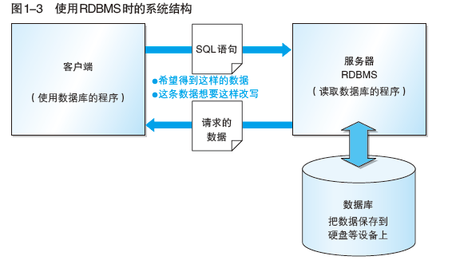

## 2.2 常见表结构

用来管理数据的二维表在关系数据库中简称为表，查询语句返回的结果也是二维表的形式

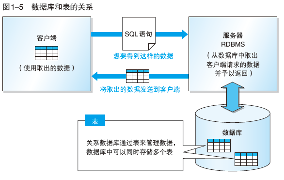

表的**列**成为**字段**

表的**行**称为**记录**，**数据库以行为单位进行读写**

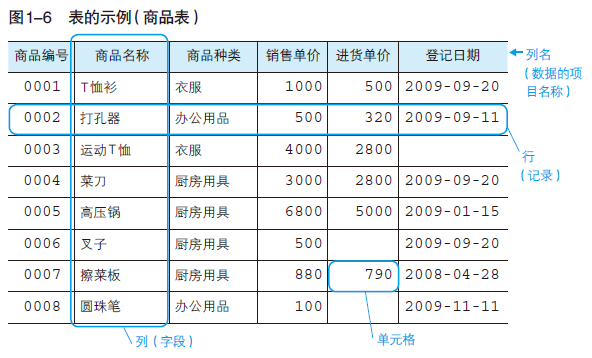

## 2.3 SQL概要

SQL分为三类：

| 类型                                                | 说明                                                         | 指令                                                         | 对象                                   |
| --------------------------------------------------- | ------------------------------------------------------------ | :----------------------------------------------------------- | -------------------------------------- |
| **DDL（Data Definition Language，数据定义语言）**   | 创建或者删除存储数据的用的数据库以及数据库中的表等对象       | **create**：创建数据库和表等对象   **drop**:杀出数据库和表等对象  **alter**：修改数据库和表等对象的结构 | **数据库和表**                         |
| **DML（Data Manipulation Language，数据操纵语言）** | 查询和变更表中的记录                                         | **select**：查询表中的数据   **insert**：向表中插入新数据     **update**：更新表中的数据   **delete**：删除表中的数据 | **操作表中的数据**                     |
| **DCL（Data Control Language，数据控制语言）**      | 确认或取消对数据库中数据进行的变更，对RDBMS的用户是否有权限操作数据库中的对象（数据库表等）进行设定 | **commit**：确认对数据库中的数据进行的变更  **rollback**：取消对数据库中数据进行的变更     **grant**：赋予用户操作权限       **revoke**：取消用户的操作权限 | **数据变更的确认与回滚；用户操作权限** |

### SQL基本书写规则

1. 关键字（select、表名、列名等）不区分大小写，插入的数据区分大小写

2. 字符串和日期常熟需要使用单引号（'）括起来

3. 数字常量无需加注单引号（直接书写数字）
4. 单词之间使用半角空格或者换行进行分隔

## 2.4 数据库

## 数据库创建

```mysql
create database <数据库名称>;
```

## 2.5 表

### 创建表

```mysql
create table <表名>
(列名1 <数据类型> <该列所需约束>，
列名2 <数据类型> <该列所需约束>，
.
.
.
<该表中的约束条件1>，<该表中的约束条件2>,...);
```

- 半角英文字母、数字、下划线（_）作为数据库、表和列的名称

- 在数据库中不能创建两个相同名称的表，在同一个表中也不能创建两个名称相同的列

- 设置默认值，通过*default*关键字

  ```mysql
  create table 表名
  (列1 数据类型 default xxx)
  ```

#### 数据类型

#### **数字型、字符型和日期型**

| 类型    | 说明                                                         |
| ------- | ------------------------------------------------------------ |
| Integer | 存储整数的列的数据类型                                       |
| Char    | 定长字符串，存储字符串的列的数据类型，char(10)、char(20）等，指定字符串的长度（最大长度） |
| varchar | 指定存储字符串的列的数据类型（字符串类型），可变长字符串的形式保存字符串 |
| date    | 指定存储日期（年月日）的列的数据类型                         |

#### 约束的设置

除数据类型之外，对列中存储的数据进行限制或者追加条件的功能。

例如：

```mysql
not null约束
null约束
primary key(product_id)  //主键约束
```

**键**：指定特定数据时使用的列的组合

### 表的删除和更新

#### 表的删除

```mysql
drop table 表名;
```

#### 表定义的更新

- 添加列

  ```mysql
  alter table 表名 add column 列的定义;
  
  alter table product add column product_name_pinyin varchar(100) not null;
  ```

- 删除列

  ```mysql
  alter table 表名 drop column 列名;
  
  alter table product drop column product_name_pinyin;
  ```

### 表中数据

#### 插入数据

- **格式**

  ```insert into 表名 (列名1,列名2,列名3,...) values(值1,值2,值3,...);```

  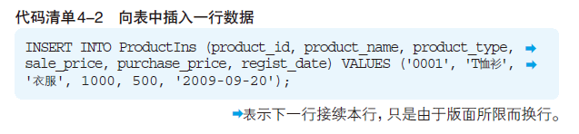

  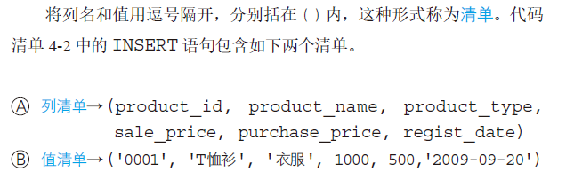

  ```mysql
  insert into 表名 values(xxx,xxxx);
  
  START TRANSACTION;
  INSERT INTO Shohin VALUES ('0001', 'T恤' ,'衣服', 1000, 500, '2009-09-20');
  INSERT INTO Shohin VALUES ('0002', '打孔器', '办公用品', 500, 320, '2009-09-11');
  COMMIT;
  ```

- **列清单的省略**

  省略表名后的列清单，values子句的值会默认按照从左到右的顺序赋予给每一列

- **插入默认值**

  <u>省略INSERT语句中的列名，就会自动设定为该列的默认值（没有默认值时会设定</u>
  <u>为NULL）。</u>

  前提：创建表时，```default```关键字约束设定默认值

  1. 显式方式插入设定默认值

     ```mysql
     INSERT INTO ProductIns (product_id, product_name, product_type, sale_price, purchase_price, regist_date) VALUES ('0007', '擦菜板', '厨房用具', DEFAULT, 790, '2009-04-28');
     ```

  2. 隐式方法插入设定默认值

     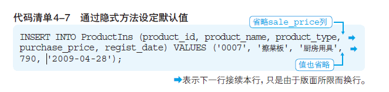

     <u>如果省略了没有设定默认值的列，该列的值将会被设定为NULL</u>

- **从其他表中复制数据**

  ***insert ... select*  (注意无values)**

  insert语句的select语句中，可以使用where子句活group by子句等任何SQL语法（但是使用order by子句不会产生任何效果）

  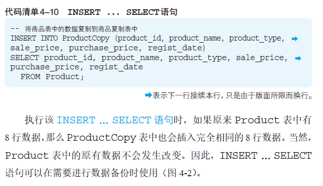

  ```mysql
  INSERT INTO ProductType (product_type, sum_sale_price,sum_purchase_price) 
  SELECT product_type, SUM(sale_price), SUM(purchase_price) FROM Product GROUP BY product_type;
  ```

#### 数据删除 delete drop truncate

- **drop和delete的区别**

  - **drop table将表完全删除**
  - **delete 语句留下表，删除表中的全部数据**

- **delete**

  1. ```delete from 表名```

  2. 指定删除对象进行删除

     ```mysql
     delete from 表名 where 条件;
     ```

  3. 

  delete 语句的删除对象并不是表或者列，而是记录（行）

  delete 语句不能使用group by、having、order by三类语句，只能使用where子句

- **drop**

- **truncate**

  删除表中全部数据

  ```mysql
  truncate 表名；
  ```

- 

#### 数据更新

- **update**

  1. ```update 表名 set 列名=表达式;```

  2. 指定条件的update语句

     ```mysql 
     update 表名
     set 列名=表达式
     where 条件;
     ```

  3. 使用null进行更新（NULL清空）--- 未设置NOT NULL约束和主键约束的列

     将赋值表达式右边的值直接写为NULL即可

     ```mysql
     update 表名
     set 列名=NULL
     where 条件;
     ```

  4. 多列更新

     ```mysql
     /*两种方法*/
     update 表名
     set 列1=列1操作表达式,列2=列2操作表达式,...
     where 条件;
     
     -- 方法二在部分数据库中不具有适用性
     update 表名
     set (列1,列2,...)=(列1操作表达式,列2操作表达式,...)
     where 条件;
     ```

  5. 


# 3. 查询

## 3.1 select基础

- 基础的select语句

```mysql
select 列名,列名,...
from 表名
```

查询结果中列的顺序和select子句中的顺序相同

查询全部列时，使用**代表所有列的星号 *** （但是结果的显示顺序就没有办法进行设定，只能按照create tabel的定义对列进行排序）

```mysql
select * from 表名
```

- 设定别名

  使用**as关键字**为**列设定别名**，使用中文的时候，使用双引号（“）括起来。

  ```mysql
  select product_id as id,  
  	   product_name as name,
  	   purchase_price as price
  from Product;
  
  ```

select product_id as "商品编号",  
  	   product_name as "商品名称",
  	   purchase_price as "进货单价" 
  from Product;
  ```
  
- 常数的查询

  select语句书写常数，该列的值展示为常数

  ```mysql
  select '商品' as string, 38 as number,'2009-02-24' as data,product_id,product_name
  from product;
  ```

  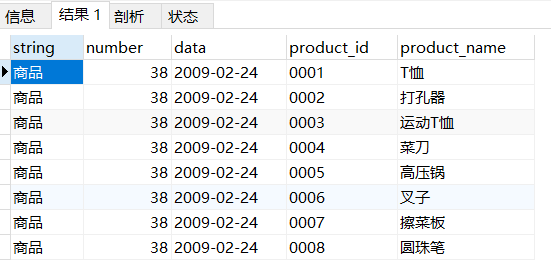

- distinct 

  **distinct关键字只能用在第一个列名之前**，不能使用```regist_date, distinct product_type```

  **distinct会将null视为一类数据**

  对一列数据使用distinct 	```select distinct(product_price) from product;```

  对多列数据使用distinct，将多列的数据进行组合	```select distinct product_type,regist_date from product```，product_type,regist_date相同的数据合并，只展示一条数据

  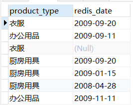

  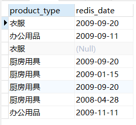

- 注释的写法

  单行注释：--

  多行注释：/* */

## 3.2 算术运算符和比较运算符

### 算术运算符

| 类型 | 说明 |
| ---- | ---- |
| +    |      |
| -    |      |
| *    |      |
| /    |      |

```mysql
//SQL语句中使用运算表达式
select product_name, sale_price,sale_price*2 as 'sale_price_x2' from product;
```

数值大小比较的运算，返回结果的符号

**所有包含NULL的算术计算，结果肯定是NULL**，例如 5+NULL, 10-NULL, 1*NULL, NULL/9, NULL/0

### 比较运算符

- 比较运算符可以对字符、数字和日期等几乎所有数据类型的列和值进行比较。

- <u>对字符串类型的数据进行大小比较时，使用的是和数字比较不同的规则</u>，典型规则包括：字典序顺序等，'1'>'10'>'11'>'2'>'222'>'3'。

| 类型            | 示例                                    |
| --------------- | --------------------------------------- |
| <>    不等于    | where sale_price <> 500; /* 不等于500*/ |
| =       等于    |                                         |
| \>=    大于等于 |                                         |
| \>      大于    |                                         |
| <=    小于等于  |                                         |
| <      小于     |                                         |

- null的判断不通过比较运算符 通过 ```is null```和```is not null```

  判断是否是NULL的```is null```运算符

  判断不是NULL的运算符，```is not null```

  ```mysql
  select * from Product where purchase_price is null;
  ```

## 3.3 逻辑运算符

| 逻辑运算符                  | 说明                                                      | 例子                                                         |
| :-------------------------- | --------------------------------------------------------- | ------------------------------------------------------------ |
| NOT （等价于比较运算符 <>） | 用于否定某一条件                                          | select * from product where not price>1000;                  |
| AND                         | 查询条件组合，均成立**（AND运算符的优先级高于OR运算符）** | select * from product where type="xxx" and sale_price>=3000; |
| OR                          | 查询条件组合，只有一个成立                                | select * from product where type="xxx"  or sale_price >=3000; |
| 括号 ()                     | 对查询条件执行顺序进行调整                                | where product_type="xxx" and (regist_date='2009-08' or regist_date='2009-09'); |
| 真值（真TRUE，假FALSE）     |                                                           |                                                              |

注：

- NOT、AND、OR成为逻辑运算符，对比较运算符等返回的真值进行操作
- 比较运算符会将运算结果以真值的形式返回，例如sale_price>=3000，成立返回FALSE，不成立返回TRUE

## 3.4 复杂查询

### 视图

表中保存的是实际的数据，**视图中保存的是SELECT语句（视图本身不存储数据）**

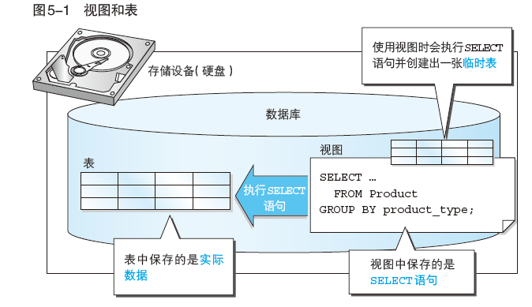

### 视图创建

```mysql
create view 视图名称(视图列名1,视图列名2,...)
as 
select 语句;
```

### 删除视图

```mysql
drop view 视图名称(视图列名1,视图列名2,...);
```

使用cascade选项删除关联视图

```mysql
drop view 视图名称(视图列名1,视图列名2,...) cascade;
```

### 优缺点 限制

**优点**

- 视图无需保存数据，可以节省存储设备的容量
- 将频繁使用的select语句保存为视图，只需要进行调用即可。并且视图中的数据会随着原表的变化自动更新。

**限制**：

- 定义视图时，不要使用order by子句

  （因为视图和表一样，数据行是没有顺序的）

- <u>如果定义视图的SELECT 语句能够满足某些条件，那么这个视图就可以被更新</u>。

  ① SELECT 子句中未使用DISTINCT
  ② FROM 子句中只有一张表
  ③ 未使用GROUP BY 子句
  ④ 未使用HAVING 子句

## 3.5 子查询

子查询特点概括起来就是一张一次性视图。

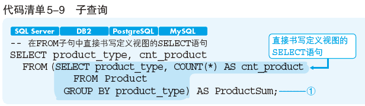

**子查询作为内层查询会首先执行**，示例中先执行from子句中的select语句，然后再执行外层的select语句

### 标量子查询(scalar subquery)

标量，单一的意思

标量子查询有特殊的限制，必须而且只能返回1行1列的结果（**标量子查询是返回单一值得子查询，不能返回多行结果**）。

由于返回得是单一值，可以使用标量进行比较运算

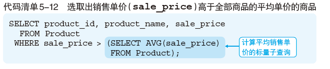

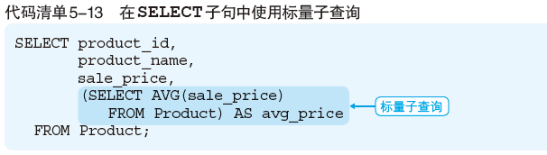

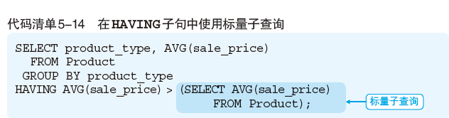

任何可以使用单一值的位置都可以使用标量子查询，能够使用常数或者列名的地方，无论是SELECT 子句、GROUP BY 子句、HAVING 子句，还是ORDER BY 子句，几乎所有的地方都可以使用。

#### 注意事项

子查询绝对不能返回多行结果，如下select的子查询会发生错误。

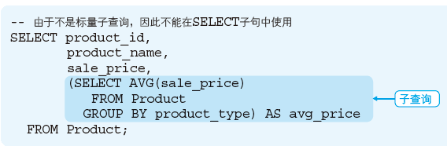

### 关联子查询

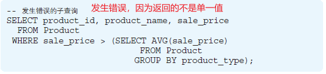

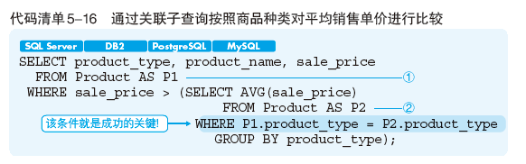

**起到关键作用的就是在子查询中添加的WHERE 子句的条件**。该条件的意思就是：在同一商品种类中对各商品的销售单价和平均单价进行比较。

使用关联子查询时，通常会使用“限定（绑定）”或者“限制”这样的语言。

#### 注意事项

- **结合条件一定要写在子查询中**

  示例中的写法违背了**关联名称的作用域**，示例中，P1、P2表的别名的作用域（scope，生存范围）有效范围P1>P2。子查询内部设定的关联名称，只能在子查询内部使用。

  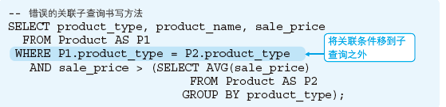

  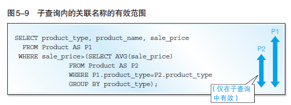

# 4.NULL

- <u>distinct会将NULL视为一类数据</u>

- <u>所有包含NULL的算术计算，结果肯定是NULL</u>，例如 5+NULL, 10-NULL, 1*NULL, NULL/9, NULL/0

- <u>NULL的判断不通过比较运算符 通过 ```is null```和```is not null```进行数据的选中，提取</u>；如果通过比较运算符进行NULL判断，则不会取出含NULL的数据

  判断是否是NULL的运算符：```is null```

  判断不是NULL的运算符：```is not null```

  ```mysql
  select * from Product where purchase_price is null;
  ```

- 除真假之外的第三种值--不确定（UNKNOWN），**SQL中的逻辑运算成为三值逻辑**

  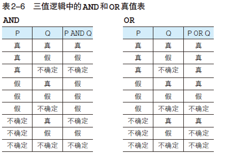

- 

# 5. 聚合和排序

## 5.1 聚合函数

对数据进行某种操作或计算时使用的函数，聚合函数或者聚集函数（将多行汇总为一行）。

| 名称      | 解释                         | 补充                                                         |
| --------- | ---------------------------- | ------------------------------------------------------------ |
| **count** | 计算表中的记录数（行数）     | **count(*)查找包含NULL在内的全部数据的行数；count(列名)会得到NULL之外的数据行数；** |
| **SUM**   | 计算表中数值列中数据的合计值 | **将”NULL除外”，只针对数值类型的列**                         |
| **AVG**   | 计算表中数值列中数据的平均值 | 计算时将NULL除外，不作为分母，**只针对数值类型的列**         |
| **MAX**   | 求出表中任意列中数据的最大值 | **原则上适用任意数据类型的列；**                             |
| **MIN**   | 求出表中任意列中数据的最小值 | **原则上适用任意数据类型的列；**                             |

## 5.2 表分组 group by

数据库的执行顺序决定了先进行分组，然后进行聚合函数处理

（where筛选过滤后，执行group by关键字分组，再执行select语句）

### 数据库关键字的执行顺序

执行顺序为：(标号为顺序)

from  -- on -- join -- where -- group by -- having -- select --  distinct -- order by -- limit

```mysql
(7) SELECT
(8) DISTINCT <select_list>
(3) FROM <join_type> JOIN <right_table>
(2) ON <join_condition>
(4) WHERE <where_condition>
(5) GROUP BY <group_by_list>
(6) HAVING <having_condition>
(9) ORDER BY <order_by_condition>
(10) LIMIT <limit_number>
```

### 5.2.1 Group by

进行分组，在**group by子句**中指定的列称为**聚合键和分组列**，可以通过都好分隔指定多列。

<u>聚合键中包含NULL时，结果会以”不确定“行（空行）的形式表现出来。</u>

**常见问题**：

- **使用group by子句时，把聚合键之外的列名不能出现在select子句中**

  ```mysql
  select product_name,purchase_price,count(*)
  from product
  group by purchase_prices;
  
  ERROR：列"product,product_name"必须包含在GROUP BY子句之中，或者必须在聚合函数内使用
  行1: SELECT product_name, purchase_price, COUNT(*)
  ```

- **在group by子句中，不能使用select 子句中定义的别名**

  产生的原因：group by的执行顺序在select之前，在执行分组group by时，不知道别名是什么

  ```mysql
  select product_type as pt,count(*)
  from Product
  group by pt;   //产生错误
  ```

- **group by子句结果的显示是无序的**

  对于按照特定顺序进行排序，需要在select语句中进行指定

- **只有select子句、having子句和order by子句能够使用count等聚合函数**，使用where语句会发生错误

  ```mysql
  select product_name,count(*)
  from product
  where count(*)=2    //不能在where子句中使用聚合
  group by product_type;
  ```

- 

## 5.3 聚合结果指定条件

### having子句

```mysql
select 列名1,列名2, ...
from 表名
group by 列名1,列名2,...
having 分组结果对应的条件
```

### having子句的构成要素

- 常数
- 聚合函数
- group by子句中指定的列名（即聚合键）

```mysql
SELECT product_type, AVG(sale_price)
FROM Product
GROUP BY product_type
HAVING AVG(sale_price) >= 2500;

SELECT product_type, COUNT(*)
FROM Product
GROUP BY product_type
HAVING product_name = '圆珠笔';  //报错，product_name必须要在group by子句中（即select子句中）
```

**having和where**：

- having子句 = 指定”组“的条件
- where子句 = 指定”行“所对应的条件

## 5.4 查询结果排序 order by

- **简介**

  order by 指定排列顺序

  位于select语句的末尾，对数据进行排序的操作必须在结果即将返回时执行

  order by子句中书写的列名称为**排序键**

  ```order by 列名 desc``` 降序排列，```order by 列名 asc```升序排列

  排列顺序时<u>默认会使用升序进行排列</u>

- **指定多个排序键**

  ```order by 列名1,列名2,...```

- 排序键中，部分行数据包含NULL，这些NULL会在开头或者末尾进行汇总

- **order by可以使用显示中用的别名，可正常执行**，order by的执行顺序在select子句之后执行

  ```mysql
  SELECT product_id AS id, product_name, sale_price AS sp, purchase_price
  FROM Product
  ORDER BY sp, id;
  ```

- order by子句可以使用存在于表中、但并不包含在select子句之中的列

  ```mysql
  SELECT product_name, sale_price, purchase_price
  FROM Product
  ORDER BY product_id;
  
  SELECT product_type, COUNT(*)
  FROM Product
  GROUP BY product_type
  ORDER BY COUNT(*);
  ```

# 6. 事务

**事务（transaction），对同一个处理单元中执行的一系列更新处理的集合。**

## 事务创建

```mysql
事务开始语句;

DML语句1;
DML语句2;
DML语句3;
.......

事务结束语句(COMMIT或者ROLLBACK);
```

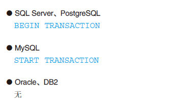

- **commit--提交处理**

  commit 是提交事务包含的全部更新处理的结束指令

  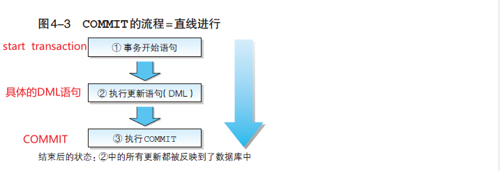

  ```mysql
  START TRANSACTION;
  -- 将运动T恤的销售单价降低1000日元
  UPDATE Product
  SET sale_price = sale_price - 1000
  WHERE product_name = '运动T恤';
  -- 将T恤衫的销售单价上浮1000日元
  UPDATE Product
  SET sale_price = sale_price + 1000
  WHERE product_name = 'T恤衫';
  COMMIT;
  ```

- **rollback --- 取消处理**

  rollback是取消事务包含的全部更新处理的结束指令

  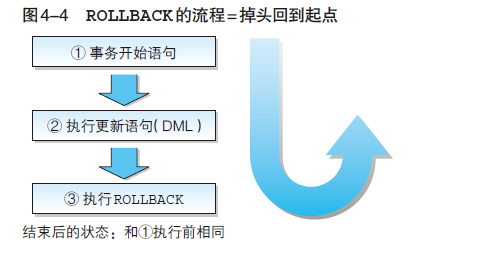

  ```mysql
  BEGIN TRANSACTION; ------------------- ①
  -- 将运动T恤的销售单价降低1000日元
  UPDATE Product
  SET sale_price = sale_price - 1000
  WHERE product_name = '运动T恤';
  -- 将T恤衫的销售单价上浮1000日元
  UPDATE Product
  SET sale_price = sale_price + 1000
  WHERE product_name = 'T恤衫';
  ROLLBACK;
  
  -- 数据表中数据不会发生任何变化,rollback之后，所有的处理都被取消了
  ```

- **事务何时开始处理**

  几乎所有的数据库产品的事务都无需开始指令。

  不使用指令而悄悄开始事务的情况下，应该如何区分各个事务呢？通常会有如下两种情况：

  - 每条SQL语句就是一个事务（自动提交模式）
  - 直到用户执行COMMIT或者ROLLBACK为止算作一个事务

  通常的DBMS 都可以选择其中任意一种模式。默认使用自动提交模式的DBMS 有SQL Server、PostgreSQL 和MySQL 等。该模式下的DML 语句如下所示，每一条语句都括在事务的开始语句和结束语句之中。

  ```mysql
  BEGIN TRANSACTION;
  -- 将运动T恤的销售单价降低1000日元
  UPDATE Product
  SET sale_price = sale_price - 1000
  WHERE product_name = '运动T恤';
  COMMIT;
  BEGIN TRANSACTION;
  -- 将T恤衫的销售单价上浮1000日元
  UPDATE Product
  SET sale_price = sale_price + 1000
  WHERE product_name = 'T恤衫';
  COMMIT;
  ```

  在默认使用B 模式的Oracle 中，事务都是直到用户自己执行提交或者回滚指令才会结束。

## ACID特性

### 原子性 Atomicity

原子性是指在事务结束时，其中所包含的更新处理要么全部执行，要么完全不执行。

### 一致性 Consistency

也被称为**完整性**。

一致性指的是事务中包含的处理要满足数据库提前设置的约束，如主键约束或者NOT NULL 约束等。

### 隔离性 Isolation

隔离性指的是保证不同事务之间互不干扰的特性。该特性保证了事务之间不会互相嵌套。此外，在某个事务中进行的更改，在该事务结束之前，对其他事务而言是不可见的。

### 持久性 Durability

持久性也可以称为耐久性，指的是在事务（不论是提交还是回滚）结束后，DBMS 能够保证该时间点的数据状态会被保存的特性。即使由于系统故障导致数据丢失，数据库也一定能通过某种手段进行恢复。

最常见的就是将事务的执行记录保存到硬盘等存储介质中（该执行记录称为日志）。当发生故障时，可以通过日志恢复到故障发生前的状态。

# 7.函数、谓词、CASE表达式

## 7.1函数

| 函数种类   | 说明                   |
| ---------- | ---------------------- |
| 算术函数   | 进行数值计算的函数     |
| 字符串函数 | 进行字符串操作的函数   |
| 日期函数   | 进行日期操作的函数     |
| 转换函数   | 转换数据类型和值的函数 |
| 聚合函数   | 数据聚合的函数         |

### 算术函数

| 名称                            | 说明                                                         |
| ------------------------------- | ------------------------------------------------------------ |
| ABS(数值)                       | 计算绝对值的函数。ABS函数的参数为NULL时，结果也是NULL。绝大多数函数对于NULL都返回NULL。 |
| MOD(被除数, 除数)               | 计算除法余数（求余）的函数，只能对整数类型的列使用MOD函数。  |
| ROUDN(对象数值，保留小数的位数) | 四舍五入操作                                                 |
|                                 |                                                              |

### 字符串函数

| 名称                                                       | 说明                                                         |
| ---------------------------------------------------------- | ------------------------------------------------------------ |
| 字符串1\|\|字符串2                                         | 字符串拼接                                                   |
| concat(字符串1，字符串2)                                   | Mysql使用concat()进行字符串拼接                              |
| length(字符串)                                             | 计算字符串长度，length以字节为单位计算长度                   |
| lower(字符串)                                              | 将参数中的字符串全部转换为小写                               |
| upper(字符串)                                              | 将参数中的字符串全部转换为大写                               |
| replace(对象字符串,替换前的字符串,替换后的字符串)          | 将字符串中的一部分替换为其他字符串                           |
| substring(对象字符串 from 截取的起始位置 for 截取的字符数) | 截取字符串中的一部分字符串，截取的其实位置从字符串最左侧开始计算 |
|                                                            |                                                              |

### 日期函数

| 名称                        | 说明                                                         |
| --------------------------- | ------------------------------------------------------------ |
| current_date                | 返回SQL执行的日期，函数执行时的日期                          |
| current_time                | 返回SQL执行的时间                                            |
| current_timestamp           | 具有CURRENT_DATE + CURRENT_TIME 的功能                       |
| extract(日期元素 from 日期) | 截取日期数据中的一部分，例如“年”，“月”，“小时“，”秒“等，<u>函数的返回值并不是日期类型而是数值类型</u>。 |
|                             |                                                              |
|                             |                                                              |
|                             |                                                              |

```mysql
SELECT CURRENT_TIMESTAMP,
EXTRACT(YEAR FROM CURRENT_TIMESTAMP) AS year,
EXTRACT(MONTH FROM CURRENT_TIMESTAMP) AS month,
EXTRACT(DAY FROM CURRENT_TIMESTAMP) AS day,
EXTRACT(HOUR FROM CURRENT_TIMESTAMP) AS hour,
EXTRACT(MINUTE FROM CURRENT_TIMESTAMP) AS minute,
EXTRACT(SECOND FROM CURRENT_TIMESTAMP) AS second;
```

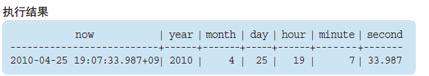

### 转换函数

| 名称                                   | 说明                                     | 例子                                              |
| -------------------------------------- | ---------------------------------------- | ------------------------------------------------- |
| CAST(转换前的值 AS 想要转换的数据类型) |                                          | select cast('0001' as signed integer) as int_col; |
| coalesce(数据1,数据2,...)              | 返回可变参数中左侧开始第一个不是NULL的值 |                                                   |
|                                        |                                          |                                                   |
|                                        |                                          |                                                   |
|                                        |                                          |                                                   |
|                                        |                                          |                                                   |
|                                        |                                          |                                                   |

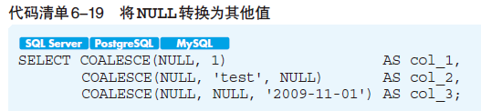


### 聚合函数

## 7.2 谓词 predicate

谓词的返回值全部都是真值（TRUE/FALSE/UNKOWN），例如：=, <, >, <>等比较运算符

#### like

模糊匹配，需要进行字符串的部分一致查询时使用该谓词，其中部分一致可以分为前方一致、中间一致和后方一致三种类型。

%：代表”0字符以上的任意字符串“

_：代表任意一个字符

```mysql
%匹配表达式 -- 后方一致  例如 %dddd
%匹配表达式%  -- 中间一致 %dddd%
匹配表达式% -- 前方一致  dddd%
```

#### between

范围查询,，结果中包含value1和value2这两个临界值，不想让结果包含临界值，必须使用< 和 >。

```mysql
between value1 and value2;
between xxx>value1 and xxx<value2;
```

#### is null和is not null

选出值为NULL的列的值，不能使用=，只能使用特定的谓词IS NULL

```mysql
SELECT product_name, purchase_price
FROM Product
WHERE purchase_price IS NULL; -- where purchase_price is not null
```

#### in和not in  -- or的简单用法

*in(值, ...)*

**IN和NOT IN是无法选取除NULL数据的**

- 可以使用子查询作为IN谓词的参数

  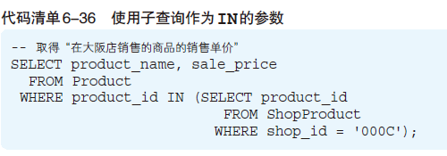

- **not in中包含有null时，结果集一直为Empty set**
- 

#### exists和not exists

作用是”**判断是否存在满足某种条件的记录**，如果存在，则返回真（TRUE），如果不存在，就返回假（FALSE）

## 7.3 CASE表达式

case表达式是在区分情况时使用的

#### CASE表达式语法

- 简单CASE表达式

  ```mysql
  CASE <表达式>
  	WHEN <表达式> THEN <表达式>
  	WHEN <表达式> THEN <表达式>
  	WHEN <表达式> THEN <表达式>
  	...
  	ELSE <表达式>
  END
  ```

  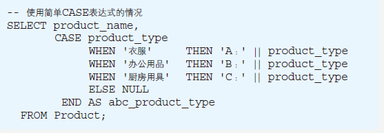

- 搜索CASE表达式

  CASE表达式中最后的END是不能省略的

  ```mysql
  CASE WHEN <求值表达式> THEN <表达式>
  	 WHEN <求值表达式> THEN <表达式>
  	 WHEN <求值表达式> THEN <表达式>
  	 WHEN <求值表达式> THEN <表达式>
  	 ...
  	 ELSE <表达式>
  END
  ```

  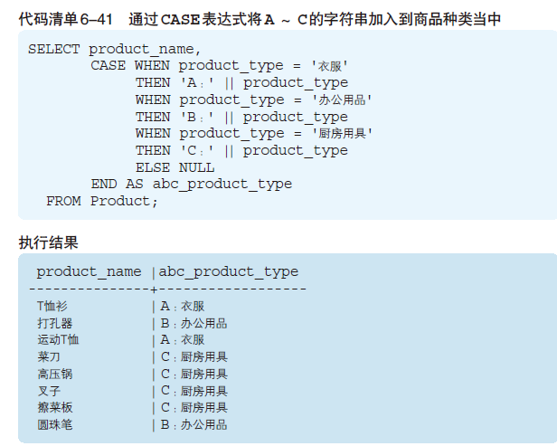

# 8.集合运算

**集合**：记录的集合

## 表加法--UNION(并集)

UNION取运算对象之间的并集

| 关键字    | 说明                   |
| --------- | ---------------------- |
| union     | 不包含重复行的集合运算 |
| union all | 包含重复行的集合运算   |
|           |                        |

```mysql
select product_id,product_name
from product
union
select product_id,product_name
from product2;

select product_id,product_name
from product
union ALL
select product_id,product_name
from product2;
```

**注意事项：**

- 运算对象的记录的列数必须相同
- 运算对象的记录中列的类型必须一致
- 可以使用任何select语句，但order by子句只能在最后使用一次

## 表交集-- intersect 

取表之间的交集

| 关键字        | 说明                   |
| ------------- | ---------------------- |
| intersect     | 不包含重复行的集合运算 |
| intersect all | 包含重复行的集合运算   |
|               |                        |

```mysql
SELECT product_id, product_name
FROM Product
INTERSECT
SELECT product_id, product_name
FROM Product2
ORDER BY product_id;
```

## 表差集 -- except

减法运算的EXCEPT（差集）。**表的位置不同，得到的结果也不同**。

```mysql
select product_id,product_name
from Product
except 
select product_id,product_name
from Product2
order by product_id;
```

## 联结（join 以列为单位对表进行联结）

union、intersect等集合运算，特征是以**行方向为单位**进行操作，导致记录行数的增减，不会导致列数的变化。

联结（join），将其他表中的列添加过来，进行“添加列”的运算。

### 内连接Inner join

内连接：只返回满足连接条件的数据。

只返回两个表中连接字段相等的行（达到匹配条件的行）。	JOIN: 如果表中有至少一个匹配，则返回行

```mysql
select empno,ename,sal,dname,loc from emp,dept
where emp.deptno=dept.deptno;  --(Oracle 8i 及以前的写法)
 
select empno,ename,job,sal,dept.deptno,dname,loc
from emp join dept on emp.deptno=dept.deptno; -- (SQL 99的写法)
```

### 外连接

外连接：除了**返回满足连接条件的行以外，还返回左（右）表中，不满足条件的行**，称为左（右）连接

#### left join 左连接

返回包括**左表中的所有记录和右表中连接字段相等的记录**。     left join: 即使右表中没有匹配，也从左表返回所有的行（左表中的所有行都存在）

#### right join 右连接

返回包括**右表中的所有记录和左表中连接字段相等的记录**。	right join: 即使左表中没有匹配，也从右表返回所有的行（右表中的所有行都存在）

#### full join 全外连接

返回**左右表中所有的记录和左右表中连接字段相等的记录**。	full join: 只要其中一个表中存在匹配，就返回行 

### 例子

底下有两个表: "Persons" 表、 "Orders" 表：

| Id_P | LastName | FirstName | Address        | City     |
| :--- | :------- | :-------- | :------------- | :------- |
| 1    | Adams    | John      | Oxford Street  | London   |
| 2    | Bush     | George    | Fifth Avenue   | New York |
| 3    | Carter   | Thomas    | Changan Street | Beijing  |

| Id_O | OrderNo | Id_P |
| :--- | :------ | :--- |
| 1    | 77895   | 3    |
| 2    | 44678   | 3    |
| 3    | 22456   | 1    |
| 4    | 24562   | 1    |
| 5    | 34764   | 65   |

以上的这两个表，然后我们把它们进行连接查询

```mysql
SELECT Persons.LastName, Persons.FirstName, Orders.OrderNo
FROM Persons, Orders 
WHERE Persons.Id_P = Orders.Id_P 
```

结果集：

| LastName | FirstName | OrderNo |
| :------- | :-------- | :------ |
| Adams    | John      | 22456   |
| Adams    | John      | 24562   |
| Carter   | Thomas    | 77895   |
| Carter   | Thomas    | 44678   |

如果使用关键词JOIN来从两个表中获取数据

```mysql
SELECT Persons.LastName, Persons.FirstName, Orders.OrderNo
FROM Persons
INNER JOIN Orders
ON Persons.Id_P = Orders.Id_P
ORDER BY Persons.LastNamem
```

结果集：

| LastName | FirstName | OrderNo |
| :------- | :-------- | :------ |
| Adams    | John      | 22456   |
| Adams    | John      | 24562   |
| Carter   | Thomas    | 77895   |
| Carter   | Thomas    | 44678   |

则inner join 与上面的普通查询没有区别

**LEFT JOIN 关键字语法**

| Id_P | LastName | FirstName | Address        | City     |
| :--- | :------- | :-------- | :------------- | :------- |
| 1    | Adams    | John      | Oxford Street  | London   |
| 2    | Bush     | George    | Fifth Avenue   | New York |
| 3    | Carter   | Thomas    | Changan Street | Beijing  |

| Id_O | OrderNo | Id_P |
| :--- | :------ | :--- |
| 1    | 77895   | 3    |
| 2    | 44678   | 3    |
| 3    | 22456   | 1    |
| 4    | 24562   | 1    |
| 5    | 34764   | 65   |

```mysql
SELECT Persons.LastName, Persons.FirstName, Orders.OrderNo
FROM Persons
LEFT JOIN Orders
ON Persons.Id_P=Orders.Id_P
ORDER BY Persons.LastName
```

结果集：

| LastName | FirstName | OrderNo |
| :------- | :-------- | :------ |
| Adams    | John      | 22456   |
| Adams    | John      | 24562   |
| Carter   | Thomas    | 77895   |
| Carter   | Thomas    | 44678   |
| Bush     | George    |         |

**SQL RIGHT JOIN 关键字**

| Id_P | LastName | FirstName | Address        | City     |
| :--- | :------- | :-------- | :------------- | :------- |
| 1    | Adams    | John      | Oxford Street  | London   |
| 2    | Bush     | George    | Fifth Avenue   | New York |
| 3    | Carter   | Thomas    | Changan Street | Beijing  |

| Id_O | OrderNo | Id_P |
| :--- | :------ | :--- |
| 1    | 77895   | 3    |
| 2    | 44678   | 3    |
| 3    | 22456   | 1    |
| 4    | 24562   | 1    |
| 5    | 34764   | 65   |

```mysql
SELECT Persons.LastName, Persons.FirstName, Orders.OrderNo
FROM Persons
RIGHT JOIN Orders
ON Persons.Id_P=Orders.Id_P
ORDER BY Persons.LastName
```

结果集：

| LastName | FirstName | OrderNo |
| :------- | :-------- | :------ |
| Adams    | John      | 22456   |
| Adams    | John      | 24562   |
| Carter   | Thomas    | 77895   |
| Carter   | Thomas    | 44678   |
|          |           | 34764   |

**SQL FULL JOIN 关键字**

"Persons" 表：

| Id_P | LastName | FirstName | Address        | City     |
| :--- | :------- | :-------- | :------------- | :------- |
| 1    | Adams    | John      | Oxford Street  | London   |
| 2    | Bush     | George    | Fifth Avenue   | New York |
| 3    | Carter   | Thomas    | Changan Street | Beijing  |

"Orders" 表：

| Id_O | OrderNo | Id_P |
| :--- | :------ | :--- |
| 1    | 77895   | 3    |
| 2    | 44678   | 3    |
| 3    | 22456   | 1    |
| 4    | 24562   | 1    |
| 5    | 34764   | 65   |

**全连接（FULL JOIN）实例**

```mysql
SELECT Persons.LastName, Persons.FirstName, Orders.OrderNo
FROM Persons
FULL JOIN Orders
ON Persons.Id_P=Orders.Id_P
ORDER BY Persons.LastName
```

结果集：

| LastName | FirstName | OrderNo |
| :------- | :-------- | :------ |
| Adams    | John      | 22456   |
| Adams    | John      | 24562   |
| Carter   | Thomas    | 77895   |
| Carter   | Thomas    | 44678   |
| Bush     | George    |         |
|          |           | 34764   |


