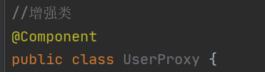

# 一、Spring5


n

## Spring框架概述

1. 轻量级的开源的J2EE应用程序框架
2. 解决企业应用开发的复杂性
3. Spring有两个核心的部分：IOC和AOP
4. Spring特点：
   - 方便解耦，简化开发
   - AOP编程的支持
   - 方便程序的测试
   - 方便和其他框架进行整合
   - 降低Java EE API的使用难度

# 二、IOC 容器

IOC：控制反转，把对象创建和对象之间的调用过程交给spring进行管理，目的降低耦合度。

# 2.1 IOC底层原理

涉及到的技术：

- XML解析
- 工厂模式
- 反射

## 2.1.1 IOC过程

第一步：XML配置文件，配置创建的对象

```xml
<bean id="dao" class="com.atguigu.UserDao"></bean>
```

第二步：创建工厂类，例如service类和dao类

```java
class UserFactory{
    public static UserDao getDao(){
        //1.xml解析
        String classValue=class属性值; 
  		//2.通过反射创建对象
        Class clazz=Class.forName(classValue);
        return (UserDao)clazz.newInstance();
    }
}
```


# 2.2 IOC接口（BeanFactory ApplicationContext）

1. IOC思想基于IOC容器完成，IOC容器底层就是对象工厂

2. Spring提供IOC容器实现的两种方式（两个重要的接口）：

   - **BeanFactory**：IOC容器基本实现，是Spring内部的使用接口，不提供开发人员进行使用

     **加载配置文件时不会创建对象，在获取对象（使用）才会创建对象**

   ```java
   BeanFactory context=new ClassPathXmlApplicationContext("bean1.xml");
   User user=context.getBean("user",User.class);
   user.add();
   ```

   - **ApplicationContext**：BeanFactory接口的子接口，提供更多更强大的功能，一般面向开发人员进行使用

     **加载配置文件时，就会把在配置文件中的对象进行创建**

   ```java
   ApplicationContext context=new ClassPathXmlApplicationContext("bean1.xml");
   User user=context.getBean("user",User.class);
   user.add();
   ```

3. ApplicationContext接口实现类：

- FileSystemXmlApplicationContext

  带盘符的路径（文件全路径）

- ClassPathXmlApplicationContext

  类路径

# 2.3 IOC操作Bean管理

## 2.3.1 Bean管理含义

Bean管理指的是：Spring创建对象、Spring注入属性

**创建对象的两种方法**：

1. **通过Spri ng XML配置文件进行创建**（Spring配置文件使用XML格式）

2. **注解方法进行创建**

## 2.3.2 IOC操作Bean管理（基于XML）

### 2.3.2.1 创建对象 属性注入

**通过Spring XML配置文件创建对象**

- 在spring配置文件中，使用bean标签，标签里面添加对应属性，就可以实现对象创建
- 在bean标签里面有很多属性

```xml
<!-- 两个标签 id 和class-->
<!-- id属性 对象名字，别名，通过其可以获取该对象，不可以使用特殊属性-->
<!-- class属性 类的路径（包+类的路径）-->
<!-- name属性 作用类似于id属性，可以使用特殊符号-->
<bean id="xxx" class="xxx.xxxx.xxx"></bean>
```

- 创建对象时，默认执行无参数的构造方法

**通过XML方式注入属性**

- DI：依赖注入，就是注入属性（DI是IOC的一种具体实现，表示依赖注入，或者是注入属性，需要在创建对象的基础上完成）

  有两种方式注入属性：使用set方法进行注入，使用有参数构造注入

  ##### set方法注入

  第一步：创建类，定义属性和对应的set方法

  ```java
  public class Book {
      private String bname;
      private String bauthor;
  
      public void setBname(String bname){
          this.bname=bname;
      }
  
      public void setBauthor(String bauthor) {
          this.bauthor = bauthor;
      }
  }
  ```

  第二步：在spring配置文件配置对象创建，配置属性注入

  ```xml
  <!--    1.Book对象创建-->
      <bean id="book" class="com.atguigu.spring5.Book">
          <!--    2.set 方法注入属性-->
          <!--   name 类的属性名 value 向属性注入的属性值     -->
          <property name="bname" value="简爱"></property>
          <property name="bauthor" value="英国"></property>
      </bean>
  ```

  ##### 有参数构造注入

  第一步：创建类，定义属性，创建属性对应的有参数构造方法

  ```java
  private String oname;
  private String address;
  
  //有参数构造
  public Orders(String oname, String address) {
      this.oname = oname;
      this.address = address;
  }
  ```

  第二步：在Spring配置文件中进行配置

  ```java
  <bean id="orders" class="com.atguigu.spring5.Orders">
  	<constructor-arg name="oname" value="abc"/>
      <constructor-arg name="address" value="china"/>
  </bean>
  ```

  ##### P名称空间注入

  使用p名称空间注入，简化基于XML配置方式

  第一步：添加P名称空间在配置文件中

  ```xml
  <beans xmlns="http://www.springframework.org/schema/beans"
         xmlns:xsi="http://www.w3.org/2001/XMLSchema-instance" xmlns:util="http://www.springframework.org/schema/util"
         xmlns:p="http://www.springframework.org/schema/p"
         xsi:schemaLocation="http://www.springframework.org/schema/beans http://www.springframework.org/schema/beans/spring-beans.xsd http://www.springframework.org/schema/util https://www.springframework.org/schema/util/spring-util.xsd">
  ```

  第二步：进行属性注入

  ```java
  <bean id="book" class="com.atguigu.spring5.Book" p:bauthor="九阳神功" p:bname="达摩">
      </beans>
  ```

### 2.3.2.2 XML注入其他类型属性

1. 字面量

   - null

     ```xml
     <!--        设置一个空值-->
     <property name="address"><null/></property>
     ```

   - 属性值包含特殊符号

     ```XML
     <!--属性值中包含特殊符号
     1.把<>进行转义 &lt;&lt;南京&gt;&gt;
     2.把带特殊符号内容写到CDATA结构中去 <![CDATA[[XXXX]]>
     -->
     <property name="address">
     	<value><![CDATA[<<南京>>]]></value>
     </property>
     ```

### 2.3.2.3 注入属性 外部bean

（外部bean，在xml配置文件中，非嵌套关系生成多个bean）

例子：

1. 创建两个类service和dao类

2. 在service中调用dao里面的方法

   

   ```java
   package com.atguigu.spring5.dao;
   public interface UserDao {
       public void update();
   }
   
   package com.atguigu.spring5.dao;
   public class UserDaoImpl implements UserDao{
       @Override
       public void update() {
           System.out.println("Dao update ....");
       }
   }
   
   
   package com.atguigu.spring5.service;
   import com.atguigu.spring5.dao.UserDao;
   public class UserService {
       private UserDao userDao;
   
       public void setUserDao(UserDao userDao) {
           this.userDao = userDao;
       }
   
       public void add(){
           System.out.println("service add ...");
           userDao.update();
       }
   }
   ```

3. 在spring配置文件中进行配置

```xml
    <!--service和dao对象创建    -->
<bean id="userDaoImpl" class="com.atguigu.spring5.dao.UserDaoImpl"></bean>
    <!-- 注入userDao对象
        name属性：类里面属性名称
        ref 属性：创建userDao对象bean标签id值-->
    
<bean id="userService" class="com.atguigu.spring5.service.UserService">
        <!--  ref 指向引用创建的对象  -->
        <property name="userDao" ref="userDaoImpl"></property>
    </bean>
```

### 2.3.2.4 注入属性 内部bean和级联赋值

（内部bean在一个bean中生成另一个bean对象）

1. 一对多的关系，例如：部分和员工
2. 在实体类之间表示一对多的关系

```java 
package com.atguigu.spring5.bean;
//部门类
public class Department {
    private  String dname;

    public void setDname(String dname) {
        this.dname = dname;
    }
}


package com.atguigu.spring5.bean;
public class Emp {
    private String ename;
    private String gender;
    //员工属于某一个部门，使用对象形式表示
    private Department dept;

    public void setDept(Department dept) {
        this.dept = dept;
    }

    public void setEname(String ename) {
        this.ename = ename;
    }

    public void setGender(String gender) {
        this.gender = gender;
    }
}
```

3. spring 配置文件中进行配置

   ```xml
   <bean id="emp" class="com.atguigu.spring5.bean.Emp">
       <property name="ename" value="lucky"></property>
       <property name="gender" value="女"></property>
       <property name="dept">
           <!-- 在一个bean中嵌套使用另一个对象-->
           <bean id="dept" class="com.atguigu.spring5.bean.Department">
               <property name="dname" value="安保部"></property>
           </bean>
       </property>
   </bean>
   ```

### 2.3.2.5 注入属性 级联赋值

1. 第一种写法

   ```xml
   <!--级联赋值操作-->
       <bean id="emp" class="com.atguigu.spring5.bean.Emp">
           <property name="ename" value="lucy"></property>
           <property name="gender" value="女"></property>
           <!-- 级联赋值-->
           <property name="dept" ref="dept"></property>
       </bean>
   
       <bean id="dept" class="com.atguigu.spring5.bean.Department">
           <property name="dname" value="财务部"></property>
       </bean>
   ```

2. 第二种写法

   前提：需要get方法

   ```xml
   <!--级联赋值操作-->
       <bean id="emp" class="com.atguigu.spring5.bean.Emp">
           <property name="ename" value="lucy"></property>
           <property name="gender" value="女"></property>
           <!-- 级联赋值-->
           <property name="dept" ref="dept"></property>
           <!-- 这种方式需要emp类有get方法-->
           <property name="dept.dname" value="技术部门"></property>
       </bean>
   
       <bean id="dept" class="com.atguigu.spring5.bean.Department">
           <property name="dname" value="财务部"></property>
       </bean>
   ```

### 2.3.2.6 IOC操作Bean管理（注入集合属性）

1. 注入数组类型属性
2. 注入List集合类型的属性
3. 注入Map集合类型的属性

以上类型，相关步骤：

步骤一：创建类，定义数组、list、map、set类型属性，生成对应set方法

步骤二：在spring配置文件中进行配置

#### 基本类型属性注入

```java
public class Stu 
    private String[] courses;
    private List<String> list;
    private Map<String,String> maps;
    private Set<String> sets;
```

```xml
    <!-- 集合类型属性注入   -->
    <bean id="stu" class="com.atguigu.spring5.collectiontype.Stu">
    <!--数组类型属性注入 array或list标签-->
        <property name="courses">
            <array>
                <value>java课程</value>
                <value>数据库课程</value>
            </array>
        </property>

<!--        list类型属性注入-->
        <property name="list">
            <list>
                <value>张三</value>
                <value>李四</value>
            </list>
        </property>

<!--        map类型属性注入-->
        <property name="maps">
            <map>
                <entry key="JAVA" value="java"></entry>
                <entry key="PHP" value="php"></entry>
            </map>
        </property>

<!--        set类型属性注入-->
        <property name="sets">
            <set>
                <value>MySQL</value>
                <value>Redis</value>
            </set>
        </property>
    </bean>
```

#### 在集合属性中设置对象类型值

```java
public class Stu 
    private String[] courses;
    private List<String> list;
    private Map<String,String> maps;
    private Set<String> sets;
	//Course为类对象 具有一个属性课程名cname
    private List<Course> courseList;  
```

```xml
<!-- 创建多个course对象-->
    <bean id="course1" class="com.atguigu.spring5.collectiontype.Course">
        <property name="cname" value="spring5框架"></property>
    </bean>
    <bean id="course2" class="com.atguigu.spring5.collectiontype.Course">
        <property name="cname" value="MyBatis框架"></property>
    </bean>

    <!-- 集合类型属性注入   -->
    <bean id="stu" class="com.atguigu.spring5.collectiontype.Stu">
<!--数组类型属性注入 array或list标签-->
<!--        list类型属性注入-->     
<!--        map类型属性注入-->    
<!--        set类型属性注入-->
<!--现在注入List集合类型，值是对象-->
        <property name="courseList">
            <list>
                <ref bean="course1"></ref>
                <ref bean="course2"></ref>
            </list>
        </property>
    </bean>
```

#### 把集合注入公共部分提取出来

- 步骤一：在spring配置文件中引入名称空间 util

  ```xml
  <?xml version="1.0" encoding="UTF-8"?>
  <beans xmlns="http://www.springframework.org/schema/beans"
         xmlns:xsi="http://www.w3.org/2001/XMLSchema-instance"
         xmlns:util="http://www.springframework.org/schema/util"
         xsi:schemaLocation="http://www.springframework.org/schema/beans http://www.springframework.org/schema/beans/spring-beans.xsd
                             http://www.springframework.org/schema/util  http://www.springframework.org/schema/util/spring-util.xsd">
  ```

- 步骤二：使用util标签 完成公共部分抽取，以集合list为例

  ```java
  public class Book 
      private List<String> list;
  
      public void setList(List<String> list) {
          this.list = list;
      }
  ```

  ```xml
  <!--   1.提取list集合属性注入-->
      <util:list id="bookList">
          <value>简爱</value>
          <value>飘</value>
          <value>百年孤独</value>
      </util:list>
  <!--    2.提取list类型属性注入使用-->
      <bean id="book" class="com.atguigu.spring5.collectiontype.Book">
          <property name="list" ref="bookList"></property>
      </bean>
  ```

### 2.3.2.7 IOC操作Bean管理（FactoryBean）

Spring里面有两种类型的bean，一种普通bean，另外一种工厂bean（FactoryBean）

1. 普通bean

   特点：在配置类型中定义bean类型就是返回类型

2. 工厂bean（FactoryBean）

   特点：在配置文件中定义bean类型可以和返回类型不一致

   第一步：创建类，让其做为工厂bean，实现接口FactoryBean

   第二步：实现接口类里面的方法，在实现的方法中定义返回的bean类型

   ```java
   public class MyBean implements FactoryBean<Course> {
       
       //    定义返回bean
       @Override
       public Course getObject() throws Exception {
           Course course=new Course();
           course.setCname("java");
           return course;
       }
   
       @Override
       public Class<?> getObjectType() {
           return null;
       }
   
       @Override
       public boolean isSingleton() {
           return false;
       }
   }
   
   
       @Test
       public void test3(){
           ApplicationContext context=new ClassPathXmlApplicationContext("bean3.xml");
           Course course=context.getBean("myBean",Course.class);
           System.out.println(course);
       }
   ```

   ```xml
   <bean id="myBean" class="com.atguigu.spring5.factorybean.MyBean"></bean>
   ```

### 2.3.2.8 IOC操作管理 bean作用域

1. 在Spring里面，设置创建bean实例是单实例还是多实例

2. 在Spring，在默认情况下，创建的bean是一个单实例对象

3. bean实例设置

   - 在Spring配置文件bean标签里面有**属性（scope）**用于设置单实例还是多实例  

   - scope属性值：

     - 默认值，singleton，表示单实例对象
     - prototype，表示是多实例对象

     

     

   - singleton和prototype区别

     - singleton表示单实例，prototype表示多实例

     - 设置scope的值是singleton，加载spring配置文件时就会创建单实例对象

       设置scope的值是prototype时，不是在加载spring配置文件时创建对象，在调用getBean时创建对象

### 2.3.2.9  IOC操作Bean管理（bean生命周期）

1. 生命周期：从对象的创建到对象销毁的过程

2. bean生命周期

   - 第一步：通过构造器创建bean实例（无参数构造）
   - 第二步：为bean的属性设置对应的值和对其他bean的引用（调用类中的set方法）
   - 第三步：调用bean中初始化的方法（需要进行配置）
   - bean可以使用（对象获取到了）
   - 当容器关闭时候，调用bean销毁方法（需要进行配置销毁方法，手动调用）

3. 示例bean的声明周期

   ```java
   package com.atguigu.spring5.bean;
   public class Orders {
   
       private String oname;
   
       public Orders(){
           System.out.println("第一步 执行无参数构造创建bean实例");
       }
   
       public Orders(String oname) {
           this.oname = oname;
       }
   
       public void setOname(String oname) {
           this.oname = oname;
           System.out.println("第二步 调用set方法设置属性的值");
       }
   
       //创建执行的初始化的方法
       public void initMethod(){
           System.out.println("第三步 执行初始化的方法");
       }
   
       //创建销毁执行的方法
       public void destoryMethod(){
           System.out.println("第五步 执行销毁的方法");
       }
   }
   
   ```

   ```xml
   <bean id="orders" class="com.atguigu.spring5.bean.Orders" init-method="initMethod" destroy-method="destoryMethod">
       <property name="oname" value="iphone"></property>
   </bean>
   ```

   ```java
       @Test
       public void testBean3(){
   //        ClassPathXmlApplicationContext context=new ClassPathXmlApplicationContext("bean4.xml");
           ApplicationContext context=new ClassPathXmlApplicationContext("bean4.xml");
           Orders orders=context.getBean("orders", Orders.class);
           System.out.println("第四步 获取创建bean实例的对象");
           System.out.println(orders);
   
           //手动 bean实例销毁
           //ApplicationContext 没有实现close方法 其子类有实现的接口所以进行类型的转换
   //        context.close();
           ((ClassPathXmlApplicationContext) context).close();
       }
   ```

4. bean的后置处理器，bean生命周期一共七步

   - 第一步：通过构造器创建bean实例（无参数构造）
   - 第二步：为bean的属性设置对应的值和对其他bean的引用（调用类中的set方法）
   - **新增：把bean实例传递bean后置处理器的方法** postProcessBeforeInitialization方法
   - 第三步：调用bean中初始化的方法（需要进行配置）
   - **新增：把bean实例传递bean后置处理器的方法**postProcessAfterInitialization方法
   - bean可以使用（对象获取到了）
   - 当容器关闭时候，调用bean销毁方法（需要进行配置销毁方法，手动调用）

5. 演示添加后置处理器效果

   - 创建类，实现接口BeanPostProcessor，创建后置处理器

   ```java
   public class MyBeanPost implements BeanPostProcessor {
   
       @Override
       public Object postProcessBeforeInitialization(Object bean, String beanName) throws BeansException {
           System.out.println("bean初始化之前执行");
           return null;
       }
   
       @Override
       public Object postProcessAfterInitialization(Object bean, String beanName) throws BeansException {
           System.out.println("在bean初始化之后执行");
           return null;
       }
   }
   ```

   ```xml
   <!--    会为当前配置文件的所有实例添加后置处理器-->
   <!--    配置后置处理器-->
       <bean id="myBeanPost" class="com.atguigu.spring5.bean.MyBeanPost"></bean>
   ```

   

### 2.3.2.10 IOC 操作Bean管理（自动装配）

1. 自动装配：

   根据指定装配规则（属性名称或属性类型），Spring自动将匹配的属性值进行注入

2. 演示自动装配过程

   bean标签属性autowire 配置自动装配，autowire属性常用两个值：

   - byName根据属性名注入 ，**注入值bean的id值和类属性名称一样**
   - byType根据属性类型注入，id的名称无限制，只与对象的类型相关

   ```java
   public class Emp {
       private Dept dept;
   ```

   ```xml
   <!--   实现自动装配
           bean标签属性autowire 配置自动装配
           autowire属性常用两个值：byName根据属性名注入 byType根据属性类型注入-->
       <bean id="emp" class="com.atguigu.spring5.autowire.Emp" autowire="byName">
   <!--        手动装配方式-->
   <!--        <property name="dept" ref="dept"></property>-->
       </bean>
   
   <!-- id名称与Emp中属性dept相同-->
       <bean id="dept" class="com.atguigu.spring5.autowire.Dept"></bean>
   ```

   ```xml
       <bean id="emp" class="com.atguigu.spring5.autowire.Emp" autowire="byType">
   <!--        手动装配方式-->
   <!--        <property name="dept" ref="dept"></property>-->
       </bean>
   
   <!-- id的名称无限制，只与对象的类型相关-->
       <bean id="deptTwo" class="com.atguigu.spring5.autowire.Dept"></bean>
   ```

### 2.3.2.11 IOC 操作Bean管理（外部属性文件）

1. 直接配置数据库信息

   - 配置德鲁伊连接池
   - 引入德鲁伊连接池依赖jar包

   ```xml
   <!--    直接配置连接池-->
       <bean id="dataSource" class="com.alibaba.druid.pool.DruidDataSource">
           <property name="driverClassName" value="com.mysql.jdbc.Driver"></property>
           <property name="url" value="jdbc:mysql://localhost:3306"></property>
           <property name="username" value="root"></property>
           <property name="password" value="root"></property>
       </bean>
   ```

2. 引入外部属性文件配置数据库连接池

   ​	步骤一：**创建外部的属性文件，properties格式文件**，写数据库信息

   

   

   步骤二：把外部properties属性文件引入到spring配置文件中

   <u>引入context名称空间</u>

   ```xml
   xmlns:context="http://www.springframework.org/schema/context"      xsi:schemaLocation="http://www.springframework.org/schema/beans http://www.springframework.org/schema/beans/spring-beans.xsd
          http://www.springframework.org/schema/context http://www.springframework.org/schema/context/spring-context.xsd
   "
   ```

   步骤三：在spring配置文件使用标签引入外部属性文件

   ```xml
   <!--    先引入外部属性文件-->
       <context:property-placeholder location="classpath:jdbc.properties"/>
   <!--    配置连接池-->
       <bean id="dataSource" class="com.alibaba.druid.pool.DruidDataSource">
   <!--        ${表达式}  使用表达式-->
           <property name="driverClassName" value="${prop.driverClass}"></property>
           <property name="url" value="${prop.url}"></property>
           <property name="username" value="${prop.userName}"></property>
           <property name="password" value="${prop.password"></property>
       </bean>
   ```

## 2.3.3 IOC操作Bean管理（基于注解方式)

### 2.3.3.1 什么是注解

- 注解是代码里面特殊的标记，格式：`@注解名称(属性名称=属性值,属性名称=属性值..)`
- 注解作用于：类、方法、属性
- 注解的目的：简化XML配置

### 2.3.3.2 Spring针对Bean管理操作中的创建对象所提供的注解

- @Component
- @Service
- @Controller
- @Repository

*上面四个注解功能是一样的，都可以用来创建bean实例

### 2.3.3.3 基于注解方式实现对象创建

步骤一：引入依赖


步骤二：开启组件扫描

- 引入context名称空间

- 开启组件扫描

  

  ```xml
  <?xml version="1.0" encoding="UTF-8"?>
  <beans xmlns="http://www.springframework.org/schema/beans"
         xmlns:xsi="http://www.w3.org/2001/XMLSchema-instance"
         xmlns:context="http://www.springframework.org/schema/context"
         xsi:schemaLocation="http://www.springframework.org/schema/beans http://www.springframework.org/schema/beans/spring-beans.xsd
                             http://www.springframework.org/schema/context http://www.springframework.org/schema/context/spring-context.xsd">
  <!--开启组件扫扫描-->
  <!--    base-package 指定扫描哪一个指定的包-->
  <!--    1. 如果扫描多个包，多个包使用逗号隔开-->
      <context:component-scan base-package="com.atguigu.spring5.testdemo.dao,com.atguigu.spring5.testdemo.service"></context:component-scan>
  <!--    2. 如果扫描多个包，扫描包的上层目录-->
      <context:component-scan base-package="com.atguigu"></context:component-scan>
  </beans>
  ```

步骤三：创建类，在类上面添加创建对象注解

```java
//在注解里面value属性值可以省略不写  默认值是类名称，首字母小写  创建id为userService的单实例
@Component(value="userService")  //<bean id="userService" class=""/> 等价
public class UserService {

    public void add(){
        System.out.println("service add ......");
    }
}
```

```java
//测试
@Test
public void testService(){
    ApplicationContext context=new ClassPathXmlApplicationContext("bean1.xml");
    UserService userService=context.getBean("userService",UserService.class);
    userService.add();
}
```

### 2.3.3.4 开启组件扫描细节配置

示例一：

```xml
<!--
use-default-filter="false"：不使用默认filter 自己配置filter
context:include-filter：设置扫描哪些内容 type="annotation" (annotation注解) expresssion="xxx.Controller" 扫描controller注解修饰的类
-->
    <context:component-scan base-package="com.atguigu" use-default-filters="false">
        <context:include-filter type="annotation" expression="org.springframework.stereotype.Controller"/>
    </context:component-scan>
```

示例二：

```xml
<!--
use-default-filter="false"：不使用默认filter 自己配置filter 
context:exclude-filter：设置不扫描哪些内容 type="annotation" (annotation注解) expresssion="xxx.Controller" 不扫描controller注解修饰的类
-->
<context:component-scan base-package="com.atguigu" use-default-filters="false">
        <context:exclude-filter type="annotation" expression="org.springframework.stereotype.Controller"/>
    </context:component-scan>
```

### 2.3.3.5 基于注解方式实现属性注入

三种常用注解：

1. @AutoWired：根据属性类型进行自动装配，注入
2. @Qualifier：根据属性名称进行注入，和@AutoWired一起进行使用
3. @Resource：可以根据类型注入，也可以根据名称注入
4. @Value：注入普通类型属性

#### @AutoWired：根据属性类型进行自动装配，注入示例

步骤一：把service和dao对象创建，在service和dao类添加对象注解

```java
@Repository
public class UserDaoImpl implements UserDao{
    @Override
    public void add() {
        System.out.println("dao add ...");
    }
}
```

步骤二： 在service注入dao对象，在service类和dao类型属性，在属性上面使用注解

```java
//在注解里面value属性值可以省略不写  默认值是类名称，首字母小写  创建id为userService的单实例
@Component(value="userService")  //<bean id="userService" class=""/> 等价
public class UserService {
//    定义dao类型属性 不需要set方法 添加注入属性注解
    @Autowired  //根据类型进行注入
    private UserDao userDao;
    
    public void add(){
        System.out.println("service add ......");
        userDao.add();
    }
}
```

#### @Qualifier：根据属性名称进行注入示例

必须与@AutoWired一起使用

```java
@Repository(value = "userDaoImpl")
public class UserDaoImpl implements UserDao{
    @Override
    public void add() {
        System.out.println("dao add ...");
    }
}
```

```java
@Component(value="userService")  //<bean id="userService" class=""/> 等价
public class UserService {
//    定义dao类型属性 不需要set方法 添加注入属性注解
    @Autowired
    @Qualifier(value = "userDaoImpl")
    private UserDao userDao;

    public void add(){
        System.out.println("service add ......");
        userDao.add();
    }
}
```

#### @Resource：可以根据类型注入，也可以根据名称注入示例

来自javax.annotaion.Resource 拓展包中

```java
@Resource  //根据类型进行注入
private UserDao userDao;

@Resource(name = "userDaoImpl") //依据名称进行注入
private UserDao userDao;
```

#### @Value：注入普通类型属性示例

```java
@Value(value = "abc") //@注入属性值
private String nname;
```

### 2.3.3.6 完全注解开发

1. 创建配置类，代替XML配置文件

   ```java
   @Configuration //将当前类作为配置类，代替XML配置文件
   @ComponentScan(basePackages = {"com.atguigu"})  //注解表示扫描的位置包部分
   public class SpringConfig {
   }
   ```

2. 编写测试类

   ```java
   @Test
   public void testService(){
   //        加载配置类
   	ApplicationContext context=new 	AnnotationConfigApplicationContext(SpringConfig.class);
   	UserService userService=context.getBean("userService",UserService.class);
   userService.add();
   }
   ```

# 三、AOP

# 3.1 AOP概念

- AOP：面向切面编程，不改源代码进行功能增强。利用AOP可以对业务逻辑的各个部分进行隔离，从而使得业务逻辑各部分之间的耦合度降低，提高程序的可用性，提高开发效率。
- 通俗描述：不通过修改源代码方式，在主干功能里面添加新功能
- 使用登录的例子进行说明


# 3.2 AOP底层原理

先介绍底层原理如何实现，在介绍使用注解封装之后的简单的使用方法3.5小节AOP操作（AspectJ注解）

## 3.2.1 AOP底层使用动态代理

1. 有两种情况的动态代理

   - 第一种情况：**有接口的情况 使用JDK动态代理**

     创建**接口实现类的代理对象**，通过代理对象增强类的方法（增加新的功能）

     

   - 第二种情况：**没有接口的情况 使用CGLIB动态代理**

     创建**子类的代理对象**，增强类的方法

     

     

   - 

## 3.2.2 AOP (JDK动态代理)

### 3.2.2.1 JDK动态代理简介

**使用JDK动态代理，使用Proxy类里面的方法，创建代理对象**，调用newProxyInstance方法实现，三个参数：

- ClassLoader loader，类加载器
- Class<?> interfaces，增强方法所在的类，这个类实现的接口，支持多个接口
- InvovationHandler，实现这个接口InvocationHandler，创建代理的对象，写增强的方法


### 3.2.2.2 编写JDK动态代理代码

1. **创建接口，定义方法**

   ```java
   public interface UserDao {
       public int add(int a,int b);
       public String update(String id);
   }
   ```

2. **创建接口的实现类，实现方法**

   ```java
   public class UserDaoImpl implements UserDao{
       @Override
       public int add(int a, int b) {
           return a+b;
       }
   
       @Override
       public String update(String id) {
           return id;
       }
   }
   ```

3. 使用Proxy类创建接口代理对象

   ```java
   import java.lang.reflect.InvocationHandler;
   import java.lang.reflect.Method;
   import java.lang.reflect.Proxy;
   import java.util.Arrays;
   
   public class JDKProxy {
   
       public static void main(String[] args) {
           //创建要实现方法增强的接口类
           Class[] interfaces={UserDao.class};
           UserDaoImpl userDaoImpl=new UserDaoImpl();
           //接口等于实现类的代理对象  Proxy.newProxyInstance创建接口实现类的代理对象
           UserDao dao =(UserDao)Proxy.newProxyInstance(JDKProxy.class.getClassLoader(),interfaces,new UserDaoProxy(userDaoImpl));
           int result=dao.add(1,2);
           System.out.println(result);
           dao.update("1234556Strings");
       }
   
   }
   
   //创建代理对象代码 里面写一些增强逻辑
   class UserDaoProxy implements InvocationHandler {
       //1. 把被代理对象传递进来
       public Object obj;
   
       //通过有参构造进行传递
       public UserDaoProxy(Object obj){
           this.obj=obj;
       }
   
       //增强的逻辑
       @Override
       public Object invoke(Object proxy, Method method, Object[] args) throws Throwable {
           //增强方法之前
           //method.getName() 获得执行方法的名字
           System.out.println("方法之前执行："+method.getName()+"传递的参数:"+ Arrays.toString(args));
   
           if(method.getName()=="add"){
               //执行类原有方法
               Object res=method.invoke(obj,args);
               //增强方法之后
               System.out.println("方法之后执行："+obj);
               return res;
           }else{
               //执行类原有方法
               Object res=method.invoke(obj,args);
               //方法执行
               System.out.println("方法执行之后："+obj);
               return null;
           }
       }
   }
   ```

# 3.3 AOP（术语）

## 3.3.1 连接点

类中哪些方法可以被增强，这些方法被称为连接点

## 3.3.2 切入点

实际被真正被增强的方法，称为切入点 

## 3.3.3 通知（增强）

1. 实际增强的逻辑部分被称为通知（增强）
2. 通知有多种类型（五种类型）：
   - 前置通知
   - 后置通知
   - 环绕通知
   - 异常通知
   - 最终通知

## 3.3.4 切面

是一个动作上的操作，把通知应用到切入点的过程

# 3.4 AOP操作（准备工作）

**Spring框架中一般基于AspectJ实现AOP操作**

## 3.4.1 AspectJ

不是Spring组成部分，独立AOP框架，一般把AspectJ和Spring框架一起使用，进行AOP操作

## 3.4.2 基于AspectJ实现AOP操作

### 3.4.2.1 基于XML配置文件实现

### 3.4.2.2 基于注解方式实现

## 3.4.3 在项目工程里面引入AOP相关依赖


## 3.4.4 切入点表达式

### 3.4.4.1 切入点表达式作用

知道对哪个类里面的那个方法进行增强

### 3.4.4.3 语法结构

```java
execution([权限修饰符][返回类型][类全路径][方法名称]([参数列表]))
```

举例1：对com.atguigu.dao.BookDao类里面的add方法进行增强

```java
execution(* com.atguigu.dao.BookDao.add(..))
//* 表示任意修饰符
//..表示方法中的参数
```

举例2：对com.atguigu.dao.BookDao类里面的所有方法进行增强

```java
execution(* com.atguigu.dao.BookDao.*(..))
```

举例3：对com.atguigu.dao包里面所有类，所有类里的所有方法进行增强

```java
execution(* com.atguigu.dao.*.*(..))
```

# 3.5 AOP操作（AspectJ注解）

## 3.5.1 创建类，在类里面定义方法（被增强）

```java
public class User {

    //    前置通知
    public void add(){
        System.out.println("add ...");
    }
}
```

## 3.5.2 创建增强类（编写增强逻辑）

 在增强类里面，创建方法，让不同方法代表不同通知类型

```java
public class UserProxy {
    public void before(){
        System.out.println("before...");
    }
}
```

## 3.5.3 进行通知配置

- 步骤一：在Spring配置文件中，开启注解扫描

  

- 步骤二：使用注解创建User和UserProxy对象

  

  

- 步骤三：在增强类上面添加注解@Aspect

  

- 步骤四：在Spring配置文件中，开启生成代理对象

  ```xml
  <!--    开启AspectJ生成代理对象-->
  <aop:aspectj-autoproxy></aop:aspectj-autoproxy>
  ```


## 3.5.4 配置不同类型的通知

在增强类的里面，在作为通知方法上面添加通知类型注解，使用切入点表达式配置

`@Before @After @AfterReturning @AfterThrowing @Around`

```java
import org.aspectj.lang.ProceedingJoinPoint;
import org.aspectj.lang.annotation.*;
import org.springframework.stereotype.Component;

//增强类
@Component
@Aspect  //生成代理对象
public class UserProxy {

    //前置通知
    //@Before 注解表示作为前置通知  切入点表达式execution([权限修饰符][返回类型][类全路径][方法名称]([参数列表]))
    @Before(value = "execution(* com.atguigu.spring5.aopanno.User.add(..))")
    public void before(){
        System.out.println("before...");
    }

    //最终通知
    //在方法执行之后执行 方法被调用的时候就会执行 不管调用之后方法有没出错
    @After(value = "execution(* com.atguigu.spring5.aopanno.User.add(..))")
    public void after(){
        System.out.println("after...");
    }

    
    //在返回结果（值）之后执行
    @AfterReturning(value = "execution(* com.atguigu.spring5.aopanno.User.add(..))")
    public void afterReturning(){
        System.out.println("afterReturning...");
    }

    //异常通知
    @AfterThrowing(value = "execution(* com.atguigu.spring5.aopanno.User.add(..))")
    public void afterThrowing(){
        System.out.println("afterThrowing...");
    }

    //在方法执行之前、之后都执行 环绕通知
    @Around(value = "execution(* com.atguigu.spring5.aopanno.User.add(..))")
    public void around(ProceedingJoinPoint proceedingJoinPoint) throws Throwable {
        System.out.println("环绕之前...");
		
        //被增强方法执行
        proceedingJoinPoint.proceed();
        System.out.println("环绕之后");
    }
}
```

## 3.5.5 相同的切入点抽取

使用`@Pointcut(value="execution([权限修饰符][返回类型][类全路径][方法名称]([参数列表]))")`

```java
public class UserProxy {
    //相同的切入点抽取
    @Pointcut(value = "execution(* com.atguigu.spring5.aopanno.User.add(..))")
    public void pointdemo(){
    }

    //前置通知
    //@Before 注解表示作为前置通知  切入点表达式execution([权限修饰符][返回类型][类全路径][方法名称]([参数列表]))
    @Before(value = "pointdemo()")
    public void before(){
        System.out.println("before...");
    }

    //最终通知
    //在方法执行之后执行 方法被调用的时候就会执行 不管调用之后方法有没出错
    @After(value = "pointdemo()")
    public void after(){
        System.out.println("after...");
    }
```

## 3.5.6 有多个增强类对同一个方法进行增强，设置增强类的优先级

1. 在增强类上面增加注解`@Order(数字类型的值)`，数字类型的值越小优先级越高，0、1、2、......

   ```java
   //增强类
   @Component
   @Aspect  //生成代理对象
   @Order(3)  //代理对象优先级
   public class UserProxy {
       //todo
   }
   ```

## 3.5.7 完全使用注解开发

1. 创建配置类，不需要配置XML配置文件

   ```java
   @Configuration     //配置类
   @ComponentScan(basePackages = {"com.atguigu"})    //开启组件扫描
   @EnableAspectJAutoProxy(proxyTargetClass = true)  //开启AspectJ 代理对象
   public class ConfigAop {
   }
   ```

2. 

# 3.6 AOP操作（AspectJ配置文件）

## 3.6.1 创建两个类，增强类和被增强类，创建方法

```java
public class Book {
    public void buy(){
        System.out.println("buy...");
    }
}
```

```java
public class BookProxy {

    public void before(){
        System.out.println("before....");
    }
}
```

## 3.6.2 在Spring配置文件中创建两个类对象

```xml
<!--创建两个类的对象-->
    <bean id="book" class="com.atguigu.spring5.aopxml.Book"></bean>
    <bean id="bookProxy" class="com.atguigu.spring5.aopxml.BookProxy"></bean>
```

## 3.6.3 在Spring配置文件中配置切入点

```xml
<!--配置aop的增强-->
    <aop:config>
    <!-- 步骤一：配置切入点 aop:pointcut
        id：切入点名称
        expression：切入点表达式
        -->
        <aop:pointcut id="p" expression="execution(* com.atguigu.spring5.aopxml.Book.buy(..))"/>

    <!--  步骤二：配置切面  aop:aspect
          ref：指定增强类
     -->
        <aop:aspect ref="bookProxy">
            <!--增强作用在具体的方法上
                有aop:before aop:after aop:after-returning aop:after-throwing aop:around
                method:作用在哪个方法上，方法名
                pointcut-ref:作用在哪一个切入点上
            -->
            <aop:before method="before" pointcut-ref="p"></aop:before>
        </aop:aspect>
    </aop:config>
```


# 四、JdbcTemplate

# 五、事务管理

# 六、Spring5新特性

