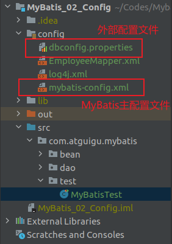

注：笔记来源于[尚硅谷 MyBatis教程 88集](https://www.bilibili.com/video/BV1bb411A7bD?from=search&seid=4039791659537805803&spm_id_from=333.788.b_636f6d6d656e74.35)

# Mybatis


# 示例一：Hello World

1. Mysql数据库mybatis ，表tbl_employee。

   ```mysql
   CREATE TABLE `tbl_employee` (
     `id` int NOT NULL AUTO_INCREMENT,
     `last_name` varchar(255) DEFAULT NULL,
     `gender` char(1) DEFAULT NULL,
     `email` varchar(255) DEFAULT NULL,
     PRIMARY KEY (`id`)
   ) ENGINE=InnoDB AUTO_INCREMENT=2 DEFAULT CHARSET=utf8mb4 		COLLATE=utf8mb4_0900_ai_ci*
   ```
	```
	| id   | last_name | gender | email            |
	| ---- | --------- | ------ | ---------------- |
	| 1    | tom       | 0      | tom@atguicom.com |
	```

2. 项目结构

   通过导入jar包的方式（没有通过maven方式）

   - Employee类对应数据库中的tbl_employee表
   - EmployeeMapper 接口类，针对MyBatis通过接口与XML动态绑定的测试
   - MyBatisTest 类，测试类
   - EmployeeMapper.xml 定义SQL语句，该文件与Employee类、数据库中的tbl_employee表相关
   - log4.xml 为了log4j正常运行，需要设置log4.xml
   - mybatis-config.xml mybatis的主配置文件，配置数据库连接池信息，事务管理器信息等。。。系统运行环境等。

   

3. Employee.class

   ```java
   public class Employee {
       private Integer id;
       private String lastName;   //lastName与数据库tbl_employee表中的last_name不对应
       private String email;
       private String gender;
       //其他 toString方法 get方法 set方法
   }
   ```
   
4. EmployeeMapper

   ```java
   //MyBatis支持接口与配置文件动态绑定  不需要实现EmployeeMapper的实现类
   public interface EmployeeMapper {
       public Employee getEmpById(Integer id);
   }
   ```

5. mybatis-config.xml

   ```xml
   <?xml version="1.0" encoding="UTF-8" ?>
   <!DOCTYPE configuration
           PUBLIC "-//mybatis.org//DTD Config 3.0//EN"
           "http://mybatis.org/dtd/mybatis-3-config.dtd">
   <configuration>
       <environments default="development">
           <environment id="development">
               <transactionManager type="JDBC"/>
   
               <dataSource type="POOLED">
                   <property name="driver" value="com.mysql.cj.jdbc.Driver"/>
                   <property name="url" value="jdbc:mysql://localhost:3306/mybatis"/>
                   <property name="username" value="root"/>
                   <property name="password" value="199512"/>
               </dataSource>
           </environment>
       </environments>
   
       <!--将写好的sql映射一定要注册到全局配置文件中  -->
       <mappers>
           <mapper resource="EmployeeMapper.xml"/>
       </mappers>
       
   </configuration>
   ```

   

6. EmployeeMapper.xml

   ```xml
   <?xml version="1.0" encoding="UTF-8" ?>
   <!DOCTYPE mapper
           PUBLIC "-//mybatis.org//DTD Mapper 3.0//EN"
           "http://mybatis.org/dtd/mybatis-3-mapper.dtd">
   <!-- namespace 名称空间 指定为接口的全类名，MyBatis会将接口与配置文件动态绑定-->
   <mapper namespace="com.atguigu.mybatis.dao.EmployeeMapper">
   
       <!--  id:唯一标识
       resultType:返回值类型（返回值会被封装成XXX类型对象）
       #{id}：从传递过来的参数中取出id值
        -->
       <!-- select * from xxx 如果数据库中的字段名称与类对象名称不一致，映射出来的类该字段结果为null -->
       <select id="selectEmp" resultType="com.atguigu.mybatis.bean.Employee">
           select * from tbl_employee where id = #{id}
       </select>
   
       <!--  通过别名方式 将查询的Employee中的lastName与数据库中的last_name相对应  -->
       <select id="selectEmpNickName" resultType="com.atguigu.mybatis.bean.Employee">
           select id,last_name lastName, email,gender from tbl_employee where id=#{id}
       </select>
   
       <!-- 将select标签中的id设置为接口中的方法的名字 将方法与select语句绑定 -->
       <select id="getEmpById" resultType="com.atguigu.mybatis.bean.Employee">
           select * from tbl_employee where id = #{id}
       </select>
   </mapper>
   ```

   

7. MyBatisTest

   ```java
   public class MyBatisTest {
       //抽取代码公共部分 创建SqlSessionFactory
       public SqlSessionFactory getSqlSessionFactory() throws IOException{
           String resource="mybatis-config.xml";
           InputStream inputStream=Resources.getResourceAsStream(resource);
           return new SqlSessionFactoryBuilder().build(inputStream);
       }
       
       /**
        * 1.根据xml配置文件（全局配置文件，有数据源一些运行环境信息），例如：mybatis-config.xml文件 创建一个sqlSessionFactory 对象
        * 2.sql 映射文件 配置了每一个sql 以及sql的封装规则等
        * 3.将sql映射文件注册在全局配置文件中
        * 4.
        *  1）根据全局配置文件得到SqlSessionFactory
        *  2）使用sqlSessionFactory 获取sqlSession对象使用其执行增删改查
        *  3）使用sql的唯一标识告诉Mybatis执行哪一个sql。sql都保存在sql映射文件中
        * @throws IOException
        */
       @Test
       public void test() throws IOException {
           //项目的主配置文件
           String resource = "mybatis-config.xml";
           //配置文件的流
           InputStream inputStream = Resources.getResourceAsStream(resource);
           //根据配置文件创建sqlSessionFactory
           SqlSessionFactory sqlSessionFactory = new SqlSessionFactoryBuilder().build(inputStream);
   
           //2.获取sqlSession实例，能直接执行已经映射的sql语句
           SqlSession sqlSession=sqlSessionFactory.openSession();
           //selectOne 函数
           //第一个参数：唯一标识，通常使用namespace+id来标识
           //第二个参数：sql使用的参数
           try{
               //select * from tbl_employee where id = #{id} 类中的lastName与数据库中的last_name不对应 查询出来的结果lastName为null
               Employee employee=sqlSession.selectOne("com.atguigu.mybatis.EmployeeMapper.selectEmp", 1);
               System.out.println(employee);
   
               //select id,last_name lastName, email,gender from tbl_employee where id=#{id} 通过查询语句别名的方式，将类中的lastName与数据库中的last_name相对应
               employee=sqlSession.selectOne("com.atguigu.mybatis.EmployeeMapper.selectEmpNickName", 1);
               System.out.println(employee);
           }finally {
               sqlSession.close();
           }
       }
   
       /**
        * 1.接口式编程：
        *  原声：      Dao --> DaoImpl
        *  mybatis：  Mapper --> xxMapper.xml
        *
        *  2. SqlSession 代表和数据库的一次会话，用完必须关闭
        *  3. Sqlsession 和Connection一样都是非线程安全。每次使用都应该去获取新的对象，不能放在共享成员变量中
        *  4. mapper接口没有实现类，但是mybatis会为接口生成一个代理对象
        *      (将接口和XML进行绑定）
        *      EmployeeMapper empMapper=sqlSession.getMapper(EmployeeMapper.class);
        *  5.两个重要的配置文件：
        *      mybatis的全局配置文件，包含数据库连接池信息，事务管理器信息等。。。系统运行环境等
        *      sql映射文件：保存了每一个sql的映射信息，将sql抽取出来
        * @throws IOException
        */
       @Test
       public void Test01() throws IOException {
           //1.获取sqlSessionFactory对象
           SqlSessionFactory sqlSessionFactory=getSqlSessionFactory();
           //2.获取sqlSession对象
           SqlSession sqlSession=sqlSessionFactory.openSession();
   
           try{
               //3.获取接口的实现类对象
               //会为接口自动的创建一个代理对象，代理对象去执行增删改查方法
               EmployeeMapper mapper=sqlSession.getMapper(EmployeeMapper.class);
               Employee employee=mapper.getEmpById(1);
   
               System.out.println(mapper.getClass());  //class com.sun.proxy.$Proxy6
               System.out.println(employee);
           }finally {
               sqlSession.close();
           }
   
       }
   }
   ```

   


# MyBatis 全局配置文件

包含了影响MyBatis的设置settings和属性properties

## properties标签

mybatis通过标签来引入外部properties配置文件的内容。`resource`引入类路径下资源，`url`引入网络路径或磁盘路径下的资源

```xml
<properties resource="" url=""></properties>
```

示例：



`dbconfig.properties`

```xml
jdbc.driver=com.mysql.cj.jdbc.Driver
jdbc.url=jdbc:mysql://localhost:3306/mybatis
jdbc.username=root
jdbc.password=199512
```

`mybatis-config.xml`

```xml
<properties resource="dbconfig.properties"></properties>
<environments default="development">
    <environment id="development">
    	<transactionManager type="JDBC"/>
        <dataSource type="POOLED">
            <property name="driver" value="${jdbc.driver}"/>
            <property name="url" value="${jdbc.url}"/>
            <property name="username" value="${jdbc.username}"/>
            <property name="password" value="${jdbc.password}"/>
        </dataSource>
     </environment>
</environments>
```

## settings标签

settings标签包含了很多设置项，setting用来设置每一个设置项，其中setting中的name表示设置项的名字，value表示设置项的取值

示例：

设置mapUnderscoreToCamelCase，驼峰命名法

启用驼峰命名法，数据库中的字段命名格式为A_COLUMN，Java类中的命名格式为aColumn，能够进行自动映射

| mapUnderscoreToCamelCase | Enables automatic mapping from classic database column names A_COLUMN to camel case classic Java property names aColumn. | true \| false | False |
| ------------------------ | ------------------------------------------------------------ | ------------- | ----- |
|                          |                                                              |               |       |

```xml
<settings>
	<setting name="mapUnderscoreToCamelCase" value="true"/>
</settings>
```

测试类以及输出结果

```java
 //select * from tbl_employee where id = #{id} 启用了驼峰命名法，数据库中的命名规则是A_COLUMN，实体类中的命名规则是aColumn，两者能够对应起来，所以查询结果能够相互对应
Employee employee=sqlSession.selectOne("com.atguigu.mybatis.dao.EmployeeMapper.selectEmp", 1);
System.out.println(employee);
```

```pow
DEBUG 11-24 20:56:34,761 ==>  Preparing: select * from tbl_employee where id = ?  (BaseJdbcLogger.java:137) 
DEBUG 11-24 20:56:34,779 ==> Parameters: 1(Integer)  (BaseJdbcLogger.java:137) 
DEBUG 11-24 20:56:34,793 <==      Total: 1  (BaseJdbcLogger.java:137) 
Employee{id=1, lastName='tom', email='tom@guigu.com', gender='0'}
```

## typeAliases标签

`typeAliases`别名处理标签，可以为Java类型起别名，**别名不区分大小写**。

其中，`typeAlias`可以为Java类起别名，type指定要起别名的类型全类名，alias指定要起的别名，默认名为类名小写

`package` 为某个包下的所有类批量起别名，name指定包名（为当前包以及下面所有的后代包的每个类都起一个默认别名（类名小写）。批量起别名的情况下，使用`@Alias`注解为某个类起新的名

示例：

```xml
<typeAliases>
    <typeAlias type="com.atguigu.mybatis.bean.Employee" alias="employee"></typeAlias>
    
    <!-- 批量起别名操作-->
    <package name="com.atguigu.mybatis.bean"/>
</typeAliases>
```

```java
@Alias("employee") //使用Alias注解 为类声明别名
public class Employee {
    private Integer id;
    private String lastName;
    private String email;
    private String gender;
    //toString get set
}
```


