SpringMVC笔记参考连接：

- https://www.bilibili.com/video/BV1uE411C7CW?p=120

# SpringMVC简介

- Spring为展现层提供的基于MVC设计理念的优秀的Web框架，目前最主流的MVC框架之一
- SpringMVC 通过一套MVC注解，让POJO 成为处理请求的控制器，而无需实现任何接口
- 支持REST风格的URL请求

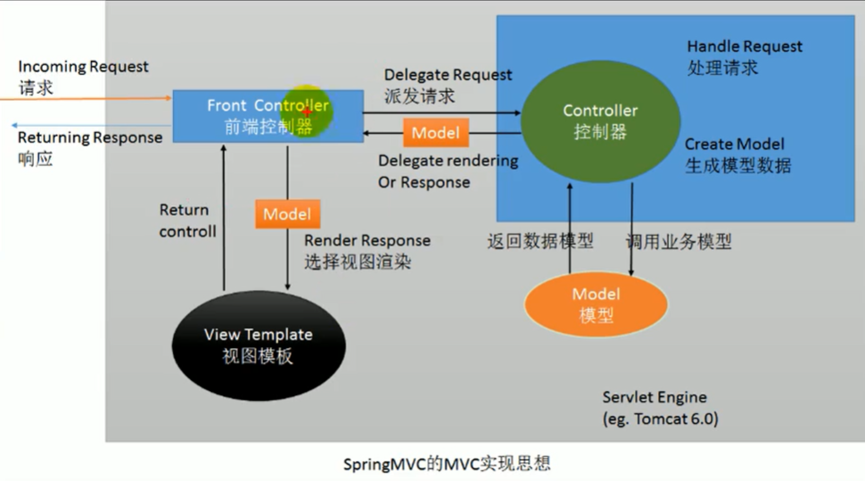

# HelloWorld

1. 导包

2. 写配置

   - `web.xml` 配置springmvc 的前端控制器，指定springmvc配置文件

     ```xml
         <!-- SpringMVC思想是有一个前端控制器能拦截所有请求，并智能分发
           这个前端控制器是一个servlet，应该在web.xml中配置这个servlet来拦截所有的请求
           -->
         <!-- The front controller of this Spring Web application,responsible for handling all application requests -->
         <servlet>
             <servlet-name>springDispatcherServlet</servlet-name>
             <servlet-class>org.springframework.web.servlet.DispatcherServlet</servlet-class>
             <init-param>
                 <!-- contextConfigLocation：指定SpringMVC配置文件位置 -->
                 <param-name>contextConfigLocation</param-name>
                 <param-value>classpath:springmvc.xml</param-value>
             </init-param>
             <!-- servlet启动加载，servlet原来是第一次访问创建对象
                 load-on-startup:服务器启动的时候创建对象，值越小优先级越高，越先创建对象
             -->
             <load-on-startup>1</load-on-startup>
         </servlet>
         <!-- Map all request to the DispatcherServlet for handling   -->
         <!-- /* 和 / 都是拦截所有请求
             /* 的范围更大，还会拦截到*.jsp 这些请求；一旦拦截jsp页面就不能显示
             /：会拦截所有请求，但是不会拦截*.jsp，保证jsp访问正常。
     	   *.jsp的处理是tomcat处理的事情
     	   
     	   服务器的大web.xml中有一个DefaultServlet是url-pattern=/
     	   项目配置中的前端控制器url-pattern=/
     	   其中，服务器中的DefaultServlet是Tomcat中处理静态资源的，除过jsp和servlet之外，剩下的都是静态资源，前端控制器的 / 禁用了tomcat服务器中的DefaultServlet，静态资源会来到 DispatcherServlet（前端控制器）查询哪些方式是RequestMapping是静态资源
            -->
         <servlet-mapping>
             <servlet-name>springDispatcherServlet</servlet-name>
             <url-pattern>/</url-pattern>
         </servlet-mapping>
     ```

   - `框架自身`

     ```xml
     <context:component-scan base-package="com.atguigu"></context:component-scan>
     
     	<!-- 配置一个视图解析器 帮我们拼接地址 -->
         <bean class="org.springframework.web.servlet.view.InternalResourceViewResolver">
             <property name="prefix" value="/WEB-INF/pages/"></property>
             <property name="suffix" value=".jsp"></property>
         </bean>
     ```

     ```java
     @Controller
     public class MyFirstController {
         /**
          * / 代表从当前项目下开始，处理当前项目下的hello请求
          */
         @RequestMapping("/hello")
         public String myfirstRequest(){
             System.out.println("Hello 请求收到了 正在处理中");
             //返回字符串 表示新的地址  新的页面地址  转发操作
             return "/WEB-INF/pages/success.jsp";  //配置的视图解析器会自动拼接前缀和后缀  当前项目请求/hello 会报错
         }
     
         @RequestMapping("/helloworld")
         public String helloWordRequest(){
             System.out.println("Hello World 请求收到了 正在处理中");
             return "success";
         }
     }
     ```

3. 运行流程：

   - 客户端点击连接发送请求到服务器
   - SpringMVC的前端控制器收到请求
   - 来查看请求地址和`@RequestMapping`标注的哪个匹配，来找到使用哪个类的哪个方法
   - **前端控制器找到了目标处理器类和目标方法，直接利用反射执行目标方法**
   - 方法执行完成以后会有一个返回值，SpringMVC认为返回值就是要去的页面地址
   - 拿到方法返回值，用视图解析器进行拼串得到完整的页面地址
   - 拿到页面地址，前端控制器帮我们转发到页面

4. 如果不指定配置文件，默认的配置文件是`/WEB-INF/xxxxx-servlet.xml`，xxxxx与`servlet-name`中定义的xxxxx同名

   ```xml
   <servlet-name>xxxxx</servlet-name>
   <servlet-class>org.springframework.web.servlet.DispatcherServlet</servlet-class>
   <init-param>
       <param-name>contextConfigLocation</param-name>
       <param-value></param-value>
   </init-param>
   ```

# `@RequestMapping`

   - 可以添加到类上面，也可以添加到类的方法上面，添加到类上面增加了基准路径

     ```java 
     @RequestMapping("/haha")
     @Controller
     public class RequestMappingTestController{
         @RequestMapping("/handle01")
         public String handler01{
             //
         }
     }
     ```

   - 相关属性：

     value：对应的请求地址

     method：限定请求方式 、HTTP协议中的所有请求方式。GET、POST、HEAD等，限定后，只能接受这种请求

     ​	`@RequestMapping(value="/handler01",method=RequestMethod.POST)`

     params：规定请求参数

     ​	params和headers支持简单的表达式：

     ​		param1：表示请求必须包含名为param1的请求参数，例如：`params={"username"}` 发送的请求必须携带名为username的参数

     ​		param2：表示请求不能包含名为param1的请求参数，例如：`params={"!username"}` 发送的请求必须不携带名为username的参数

     ​		param1!=value1：表示请求包含名为param1的请求参数，但其值不能为value1

     ​		{"param1=value1", "param2"}：请求必须包含名为param1和param2的两个请求参数，且param1参数的值必须为value1

     headers：规定请求头

     consumes：只接受内容类型是哪种的请求，规定请求头中的`Content-Type`

     produces：告诉浏览器返回的内容类型是什么，给响应头中加上`Content-Type`

   - 模糊匹配功能

     URL地址可以写模糊的通配符（匹配模糊和精确情况下，使用精确）：

     ？：能替代任意一个字符，示例 `@RequestMapping("/antTest0?")`

     *：能替代多个字符和一层路径

     **：能替代多层路径

   - 路径占位符

     `{xxx}`路径上的占位符，`PathVariable("xxx")`获取路径上占位符的值

     ```java
     @RequestMapping("/usr/{id}")
     public String pathVariableTest(@PathVariable("id")String id){
         System.out.println("路径上的占位符的值："+id);
         return "success";
     }
     ```

   - 

# REST

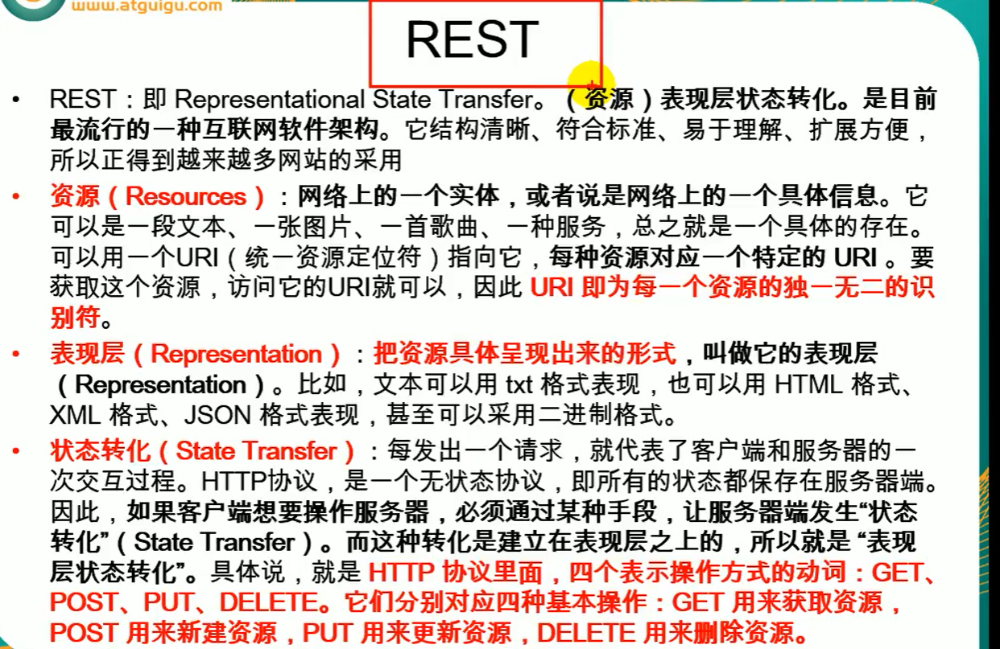

以简洁的URL地址来发请求
对一个资源的增删改查使用请求方式来区分
REST推荐：
	URL地址这么起名：/资源名/资源标识符
	/book/1：GET --- 查询1号图书
	/book/1：PUT --- 更新1号图书
	/book/1：DELETE --- 删除1号图书
	/book：POST --- 添加图书

从页面上只能发去两种请求方式，GET和POST。Spring提供了对Rest风格的支持

- SpringMVC提供了Filter，可以将普通的请求转化为规定形式的请求，配置该filter

- 发起其他形式请求，例如DELETE、PUT请求

  按照以下要求：

  1. 创建一个post类型的表单
  2. 表单项种携带一个`_method`的参数
  3. 这个`_method`的值就是DELETE、PUT


# SpringMVC获取请求带来的信息

默认方式获取参数：

直接给方法入参上写一个和请求参数名相同的变量，这个变量就用来接受请求参数的值。有参，为该参数的值，无值为null。

例如：

```html
<a href="hello?username=hello"></a>
```

```java
@RequestMapping("/hello")
public String handler(String username){
    //
}
```

## `@RequestParam`

获取请求参数

## `@RequestHeader`

获取请求头中某个key的值

## `CookieValue`

获取cookie值

均有三个属性：

- value：指定要获取的参数的key
- required：这个参数是否是必须的
- defaultValue：默认值 

```java
@RequestMapping("/handler")
public String handler(@RequestParam(value="userName",required=false)String userName,@RequestParam("age")int age,
                      @RequestHeader("Accept-Encoding")String encoding,@RequestHeader("Keep-Alive")long keppAlieve,
                     @CookieValue(vlaue="JSESSIONID",required=false)){
 //
}
```

## POJO

如果我们的请求参数是一个POJO，SpringMVC会自动为这个POJO进行赋值，还支持级联封装

```java
@RequestMapping("/book")
public String addBook(Book book){
    //
}
```

```java
public class Book{
    //属性
    private Address address;
    //set get方法
}
```

```java
public class Address{
    String province;
    String city;
    String street;
}
```

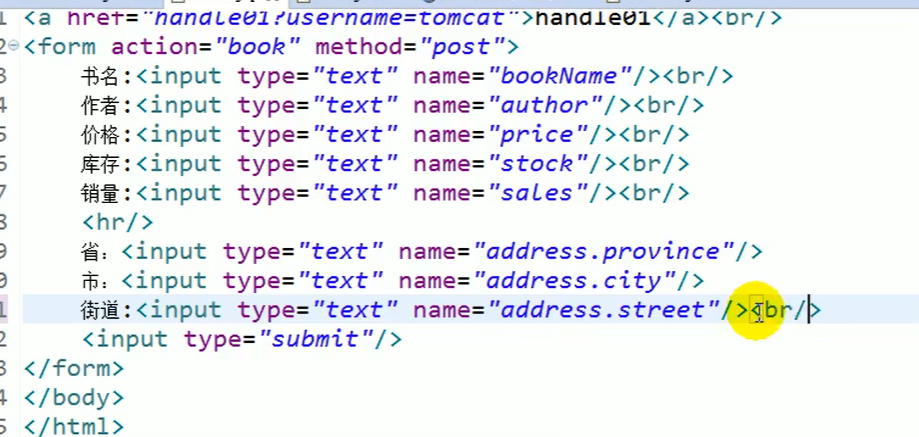

## 直接在参数上写原生API

包括：`HttpServletRquest, HttpServletResponse, HttpSession, java.security.Principal, Locale, InputStream, OutputStream, Reader, Writer`

```java
@RequestMapping("/handler02")
public String handler02(HttpSession session,HttpServletRequest request){
    //直接在参数中使用原生API
}
```

# 字符编码

```xml
    <!-- 字符编码过滤器   -->
    <filter>
        <filter-name>characterEncodingFilter</filter-name>
        <filter-class>org.springframework.web.filter.CharacterEncodingFilter</filter-class>
        <init-param>
            <param-name>encoding</param-name>
            <param-value>UTF-8</param-value>
        </init-param>
        <init-param>
            <param-name>forceEncoding</param-name>
            <param-value>true</param-value>
        </init-param>
    </filter>
    <filter-mapping>
        <filter-name>characterEncodingFilter</filter-name>
        <url-pattern>/*</url-pattern>
    </filter-mapping>
```

# 数据输出

SpringMVC 除过在方法上传入原生的`request`和`session`之外，还能：

1. **在方法处传入Map或者Model或者ModelMap**。这些参数保存的所有数据都会放在请求域`request`中。可以在页面获取。

   关系：

   Map, Model, ModelMap：最终都是`BindingAwareModelMap`工作

   相当于`BindingAwareModelMap`中保存的东西都会放在请求域中

   ```java
   @RequestMapping("/handler")
   public String handler(Map<String,Object> map){
       map.put("msg","Hello");
       return "success";
   }
   public String handler(Model model){
       model.addAttribute("msg","你好 model");
       return "success";
   }
   @RequestMapping("/handler03")
   public String handler03(ModelMap modelMap){
       modelMap.addAttribute("msg","你好 ModelMap");
       return "success";
   }
   ```

   ```xml
   <body>
   <h1>成功</h1>
   pageContext:${pageScope.msg}<br/>
   request:${requestScope.msg}<br/>  //通过requestScope方法获得
   session:${sessionScope.msg}<br/>
   application:${applicationScope.msg}<br/>
   </body>
   ```

2. 方法的**返回值可以变为`ModelAndView`类型**，既包含视图信息（页面地址）也包含模型数据（给页面带的数据）；数据是存放在请求域中的

   ```java
   @RequestMapping("/handler")
   public ModelAndView handler(){
       //success 为跳转的目标页面
       ModelAndView mv=new ModelAndView("success");
       mv.addObject("msg","你好");
       return mv;
   }
   ```

3. SpirngMVC 提供了一种给可以临时给Session域中保存数据的方式，使用一个注解，`@SessionAttributes`（只能标识在类上）

   例如：@SessionAttributes(value="msg") 给`BindingAwareModelMap`中保存的数据，同时给`session`中放一份

   value 指定保存数据时要给session中的数据的key

   types 指定只要是保存这种类型的数据，给session中也存放

   给session放数据，推荐使用原生API

   ```java
   @SessionAttributes(value={"msg"},types={String.class})
   public class HandlerControl{
       //
   }
   ```

4. 

# SpringMVC源码

1. 前端控制器的架构

   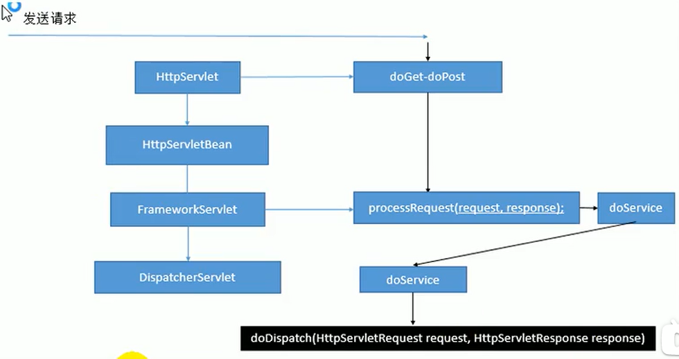

   1）所有请求过来DispatcherServlet收到请求

   2）调用doDispatch()方法进行处理

   - getHandler()：根据当前请求地址找到能处理这个请求的目标处理器类（处理器）

     根据当前请求在`HandlerMapping`中找到这个请求的映射信息，获取到目标处理器类

   - getHandlerAdapter()：根据当前处理器类获取能执行这个处理器方法的适配器

     根据当前处理类，找到当前类的HandlerAdapter（适配器)

   - 使用刚才获取到的适配器（AnnotationMethodHandlerAdapter）执行目标方法

   - 目标方法执行后会返回一个ModelAndView对象

   - 根据ModelAndView的信息转发到具体的页面，并可以在请求域中取出ModelAndView中的模型数据


   ```java
   protected void doDispatch(HttpServletRequest request, HttpServletResponse response) throws Exception {
   		HttpServletRequest processedRequest = request;
   		HandlerExecutionChain mappedHandler = null;
   		boolean multipartRequestParsed = false;
   
   		WebAsyncManager asyncManager = WebAsyncUtils.getAsyncManager(request);
   
   		try {
   			ModelAndView mv = null;
   			Exception dispatchException = null;
   
   			try {
                   //1.检查是否文件上传请求
   				processedRequest = checkMultipart(request);
   				multipartRequestParsed = (processedRequest != request);
   
   				// Determine handler for the current request.
                    //2.根据当前请求地址找到哪个类能够进行处理
   				mappedHandler = getHandler(processedRequest);
                    //3.如果没有找到哪个处理器（控制器） 类能处理该请求，则抛异常
   				if (mappedHandler == null) {
   					noHandlerFound(processedRequest, response);
   					return;
   				}
   
   				// Determine handler adapter for the current request.
                    //4.拿到类中能够执行所有方法的适配器 
   				HandlerAdapter ha = getHandlerAdapter(mappedHandler.getHandler());
   
   				// Process last-modified header, if supported by the handler.
   				String method = request.getMethod();
   				boolean isGet = "GET".equals(method);
   				if (isGet || "HEAD".equals(method)) {
   					long lastModified = ha.getLastModified(request, mappedHandler.getHandler());
   					if (new ServletWebRequest(request, response).checkNotModified(lastModified) && isGet) {
   						return;
   					}
   				}
   
   				if (!mappedHandler.applyPreHandle(processedRequest, response)) {
   					return;
   				}
   
   				// Actually invoke the handler.  处理器（控制器）的方法被调用
                   //5.适配器来执行目标方法，将目标方法执行完后的返回值最为视图名，设置保存到ModelAndView中
   				mv = ha.handle(processedRequest, response, mappedHandler.getHandler());
   
   				if (asyncManager.isConcurrentHandlingStarted()) {
   					return;
   				}
   
   				applyDefaultViewName(processedRequest, mv); //如果没有视图名，设置一个默认的视图名
   				mappedHandler.applyPostHandle(processedRequest, response, mv);
   			}
   			catch (Exception ex) {
   				dispatchException = ex;
   			}
   			catch (Throwable err) {
   				// As of 4.3, we're processing Errors thrown from handler methods as well,
   				// making them available for @ExceptionHandler methods and other scenarios.
   				dispatchException = new NestedServletException("Handler dispatch failed", err);
   			}
   	         //该方法运行，转发到目标页面
                //6.根据方法最终执行后封装的ModelAndView转发到对应页面，并将ModelAndView中的数据从请求域中获取
   			processDispatchResult(processedRequest, response, mappedHandler, mv, dispatchException);
   		}
   		catch (Exception ex) {
   			triggerAfterCompletion(processedRequest, response, mappedHandler, ex);
   		}
   		catch (Throwable err) {
   			triggerAfterCompletion(processedRequest, response, mappedHandler,
   					new NestedServletException("Handler processing failed", err));
   		}
   		finally {
   			if (asyncManager.isConcurrentHandlingStarted()) {
   				// Instead of postHandle and afterCompletion
   				if (mappedHandler != null) {
   					mappedHandler.applyAfterConcurrentHandlingStarted(processedRequest, response);
   				}
   			}
   			else {
   				// Clean up any resources used by a multipart request.
   				if (multipartRequestParsed) {
   					cleanupMultipart(processedRequest);
   				}
   			}
   		}
   	}
   ```

2. getHandler()方法细节：根据当前请求确定哪个类进行处理，返回目标处理器类的执行链`HandlerExecutionChain`

   ```java
   @Nullable
   protected HandlerExecutionChain getHandler(HttpServletRequest request) throws Exception {
       if (this.handlerMappings != null) {
           for (HandlerMapping mapping : this.handlerMappings) {
               HandlerExecutionChain handler = mapping.getHandler(request);
   			if (handler != null) {
   				return handler;
   			}
   		}
   	}
   	return null;
   }
   ```

   `HandlerMapping` 处理器映射，保存了每一个处理器能处理哪些请求的映射信息

   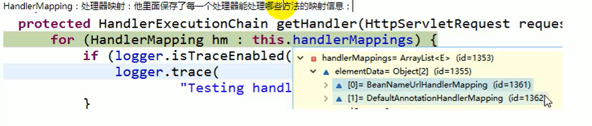

   handerMap：IOC容器启动创建Controller对象的时候，扫描每个处理器都能处理什么请求，保存在HandlerMapping的handlerMap属性中。下次请求，就查看HandlerMapping中有这个请求信息

   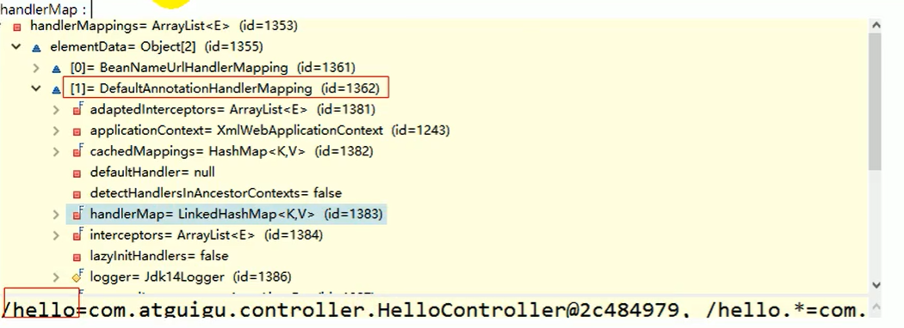

3. `getHandlerAdapter`方法

   如何找到目标处理器类的适配器，要拿适配器执行目标方法

   ```java
      protected HandlerAdapter getHandlerAdapter(Object handler) throws ServletException {
           if (this.handlerAdapters != null) {
               Iterator var2 = this.handlerAdapters.iterator();
   
               while(var2.hasNext()) {
                   HandlerAdapter adapter = (HandlerAdapter)var2.next();
                   if (adapter.supports(handler)) {
                       return adapter;
                   }
               }
           }
   
           throw new ServletException("No adapter for handler [" + handler + "]: The DispatcherServlet configuration needs to include a HandlerAdapter that supports this handler");
       }
   ```

   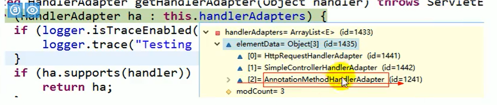

   `AnnotationMethodAdapter`：能解析注解方法的解析器

   

4. SpringMVC 九大组件

   关键位置都是由这些组件完成的

   接口就是规范

   ```java
   //文件上传解析器
   private MultipartResolver multipartResolver;
   //区域信息解析器，和国际化有关
   private LocaleResolver localeResolver;
   //主题解析器
   private ThemeResolver themeResolver;
   //Handler映射信息
   private List<HandlerMapping> handlerMappings;
   //Handler的适配器
   private List<HandlerAdapter> handlerAdapters;
   //SpringMVC 异常解析器
   private List<HandlerExceptionResolver> handlerExceptionResolvers;
   //
   private RequestToViewNameTranslator viewNameTranslator;
   //SpringMVC中允许重定向携带数据的功能
   private FlashMapManager flashMapManager;
   //视图解析器
   private List<ViewResolver> viewResolvers;
   ```

5. SpringMVC 九大组件初始化方法

   ```java
   //DispatchServlet类中
   protected void initStrategies(ApplicationContext context) {
       this.initMultipartResolver(context);
        this.initLocaleResolver(context);
        this.initThemeResolver(context);
        this.initHandlerMappings(context);
        this.initHandlerAdapters(context);
        this.initHandlerExceptionResolvers(context);
        this.initRequestToViewNameTranslator(context);
        this.initViewResolvers(context);
        this.initFlashMapManager(context);
   }
   ```

   

# 视图解析

有前缀的转发和重定向操作，配置的视图解析器不会进行操作

## forward 转发

forward：转发到一个页面

forward前缀的转发，不会由我们配置的视图解析器拼串

/hello.jsp：转发到当前项目下的hello

一定要加上`/`，如果不加`/`就是相对路径

```java
@RequestMapping("/handler01")
public String handler01(){
    System.out.println("handler01");
    return "forward:/hello.jsp";
}
```

## redirect 重定向 

redirect：重定向到新的网址

原生的Servlet重定向，需要加上项目名才能成功`response.sendRedirect("/hello.jsp");`

redirect下：`/hello.jsp`代表从当前项目下开始，SpringMVC会自动的拼接上项目名

## SpringMVC视图解析的原理

SpringMVC视图解析

1. 方法执行后的返回值会作为页面地址参考，转发或重定向到页面
2. 视图解析器可能会进行页面地址的拼串

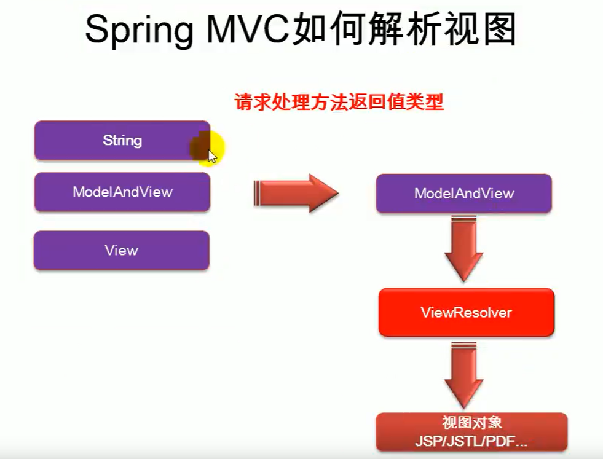

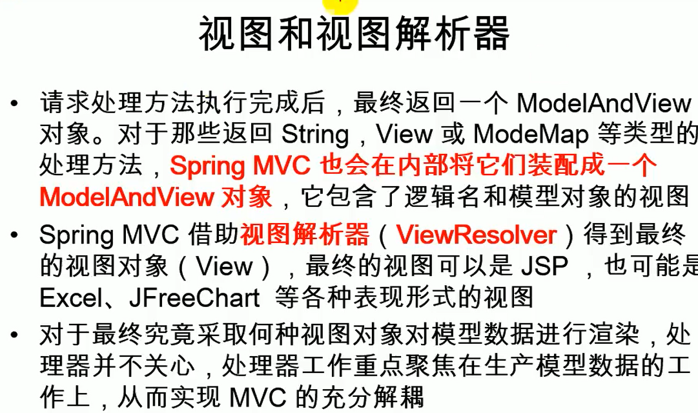

## 视图

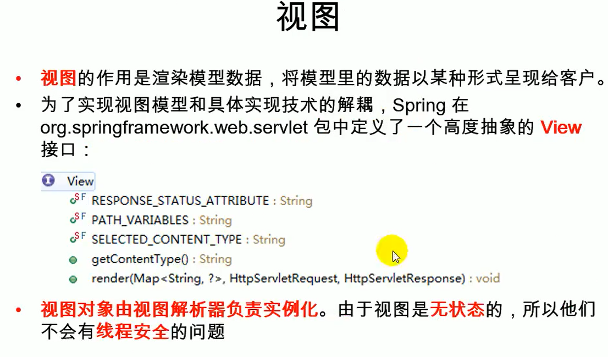

## 国际化

请求一定要过SpringMVC 的视图解析流程，会创建一个jstlView帮助快速国际化；同时不能使用forward信息

## mvc:view-controller 

将请求映射到一个页面，在dispatcher-servlet中进行配置。

走了SpringMVC的整个视图解析流程，但是其他请求就不能用了，需要开启MVC注解驱动模式

```xml
 <!-- 发送一个请求（”toLoginPage")：直接来到web-inf下的login页面，mvc名称空间中有标签
        path="":指定哪个请求
        view-name=""：指定映射给哪个视图
     -->
<mvc:view-controller path="/toLoginPage" view-name="login"></mvc:view-controller>
<mvc:annotation-driven></mvc:annotation-driven>
```


视图解析器根据方法的返回值得到视图对象

多个视图解析器都会尝试能否得到视图对象

视图对象不同就可以具有不同的功能

# 自定义视图和视图解析器

步骤：

1. 编写自定义的视图解析器和视图实现类
2. 视图解析器必须放在IOC容器中
3. 自定义视图解析器

# 表单标签

通过SpringMVC的表单标签可以实现模型数据中的属性和HTML表单元素相绑定，以实现表单数据更便捷编辑和表单值的回显。

# SpringMVC_CRUD项目

# SpringMVC封装自定类型对象

## 数据绑定期间的数据类型转换？

例如：class 类中：Integer age，传输的数据是String类型，数据绑定期间如何进行数据类型转换

## 数据绑定期间的数据格式化问题


## 数据校验

前端校验：JS+正则表达式

后端校验：重要的数据必须进行校验

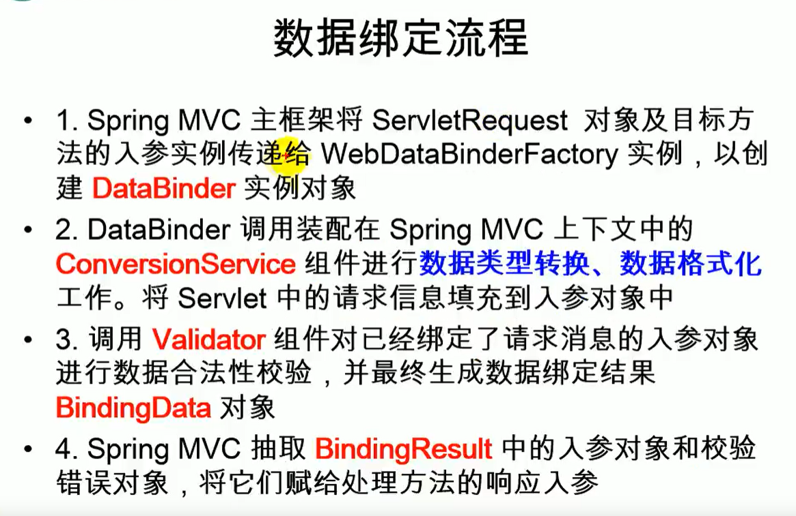

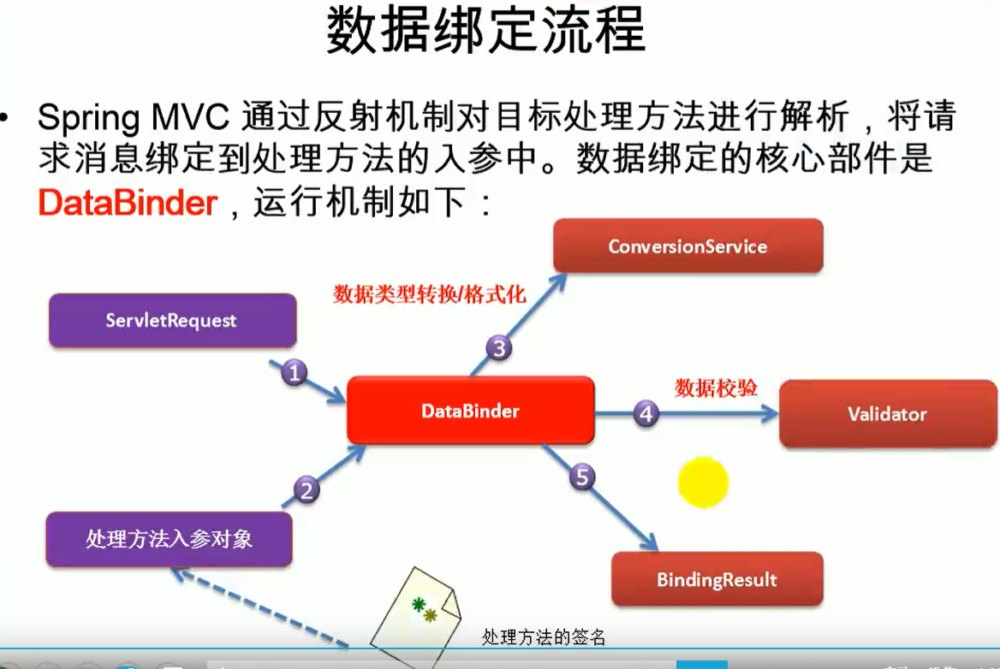

ConversionService组件：负责数据类型的转换以及格式化功能，ConversionService中有很多converter，不同类型的转换和格式化用它自己的converter。

## 自定义类型转换器

步骤：

1. 实现自定义类型的Convertor

   ```java
   package com.atguigu.component;
   
   import com.atguigu.dao.DepartmentDao;
   import com.atguigu.entities.Employee;
   import org.springframework.beans.factory.annotation.Autowired;
   import org.springframework.core.convert.converter.Converter;
   /**
    *入参：两个泛型 S：Source --> T：Target
    */
   public class MyStringToEmployeeConverter implements Converter<String, Employee>{
       @Autowired
       DepartmentDao departmentDao;
   
       @Override
       public Employee convert(String s) {
           Employee employee=new Employee();
           System.out.println("页面提交的将要转换的字符串"+s);
           if(s.contains("-")){
               String[] split = s.split("-");
               employee.setLastName(split[0]);
               employee.setEmail(split[1]);
               employee.setGender(Integer.parseInt(split[2]));
               employee.setDepartment(departmentDao.getDepartment(Integer.parseInt(split[3])));
           }
           return employee;
       }
   }
   ```

   ConversionService：是一个接口。

   里面有converter进行工作。实现Converter接口，写一个自定义的类型转换器（org.springframework.core.convert.converter.Converter）

   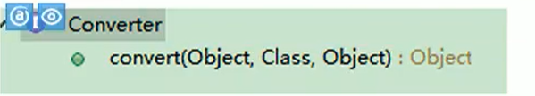

   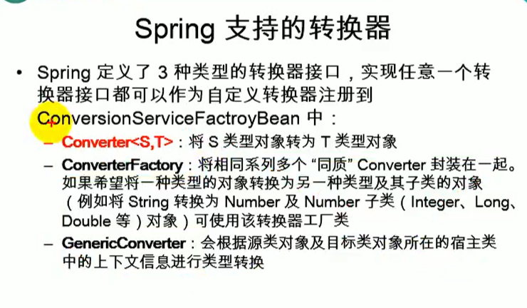

2.  告诉SpringMVC别使用默认的ConversionService，使用自定义的ConversionService

   ```xml
   <!-- conversionServiceFactoryBean 指定使用自己配置的类型转换组件 -->
   <mvc:annotation-driven conversion-service="conversionServiceFactoryBean"></mvc:annotation-driven>
   
   <!-- 告诉SpringMVC别使用自定义的ConversionService，使用自定义的ConversionService，可能有我们自定义的Converter -->
   <!-- 配置自定义的ConversionService -->
   <bean id="conversionServiceFactoryBean" class="org.springframework.context.support.ConversionServiceFactoryBean">
       <!-- converters转换器中添加自定义的类型转换器 -->
       <property name="converters">
           <set>
               <bean class="com.atguigu.component.MyStringToEmployeeConverter"></bean>
           </set>
       </property>
   </bean>
   ```

   Converter是ConversionService中的组件

   1. 将自定义的Convertor放进ConversionService中
   2. 将WebDataBinder中的ConversionService设置成我们这个加了自定义类型转换器的ConversionService

3.  

# mvc:annotation-driven

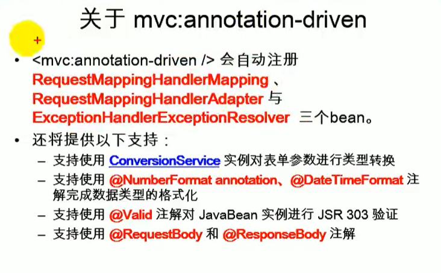

## `<mvc:default-servlet-handler/> <mvc:annotation-driven/>`搭配

1. **都没配情况下：动态资源（@RequestMapping映射得资源能访问，静态资源（.html，.js，.img）不能访问**

   `DefaultAnnotationHandlerMapping`中的`handlerMap`保存了每一个资源的映射信息

2. **只配置`<mvc:default-servlet-handler/>`只能访问静态资源**

3. **配置`<mvc:default-servlet-handler/> <mvc:annotation-driven/>`后，既能访问静态资源，也能访问动态资源**


   