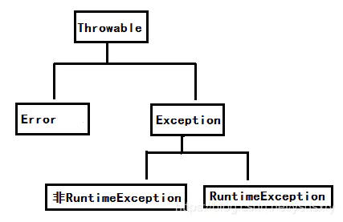
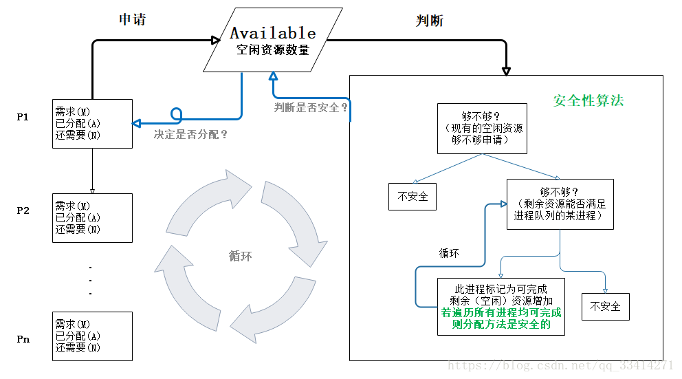
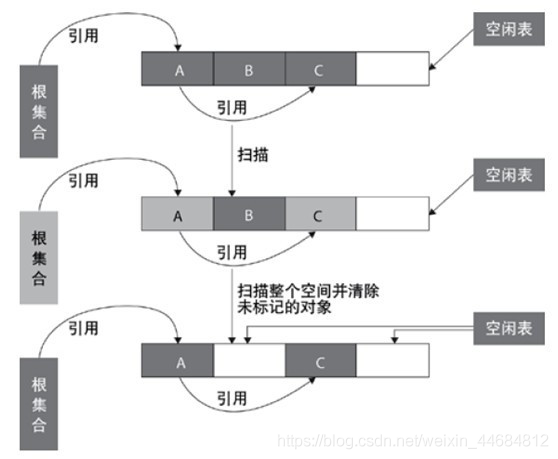
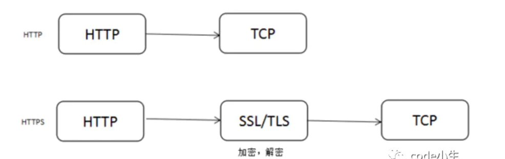
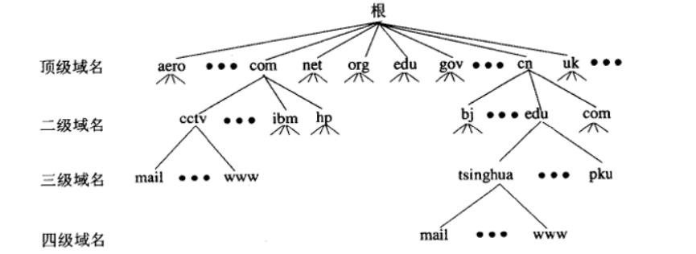
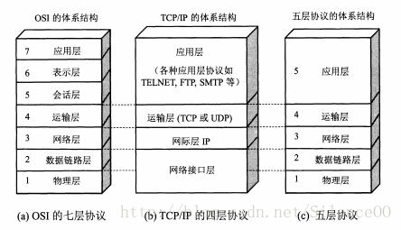
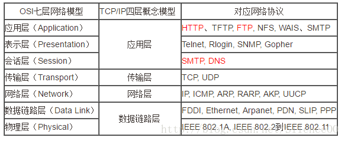

# 一、java 基础知识

# 1. Deque 双端队列

两头进，两头出，双端队列（Double Ended Queue）

- 既可以添加到队尾，也可以添加到队首
- 既可以从队首获取，也可以从队尾获取

|                    | Queue                  | Deque                           |
| :----------------- | :--------------------- | ------------------------------- |
| 添加元素到队尾     | add(E e) / offer(E e)  | addLast(E e) / offerLast(E e)   |
| 取队首元素并删除   | E remove() / E poll()  | E removeFirst() / E pollFirst() |
| 取队首元素但不删除 | E element() / E peek() | E getFirst() / E peekFirst()    |
| 添加元素到队首     | 无                     | addFirst(E e) / offerFirst(E e) |
| 取队尾元素并删除   | 无                     | E removeLast() / E pollLast()   |
| 取队尾元素但不删除 | 无                     | E getLast() / E peekLast()      |

# 2.Queue 队列

特殊的线性表，只允许在表的前端进行删除操作，在表的后端进行插入操作。

## 构造函数

实现了接口的类有：

[AbstractQueue](https://docs.oracle.com/javase/8/docs/api/java/util/AbstractQueue.html), [ArrayBlockingQueue](https://docs.oracle.com/javase/8/docs/api/java/util/concurrent/ArrayBlockingQueue.html), [ArrayDeque](https://docs.oracle.com/javase/8/docs/api/java/util/ArrayDeque.html), [ConcurrentLinkedDeque](https://docs.oracle.com/javase/8/docs/api/java/util/concurrent/ConcurrentLinkedDeque.html), [ConcurrentLinkedQueue](https://docs.oracle.com/javase/8/docs/api/java/util/concurrent/ConcurrentLinkedQueue.html), [DelayQueue](https://docs.oracle.com/javase/8/docs/api/java/util/concurrent/DelayQueue.html), [LinkedBlockingDeque](https://docs.oracle.com/javase/8/docs/api/java/util/concurrent/LinkedBlockingDeque.html), [LinkedBlockingQueue](https://docs.oracle.com/javase/8/docs/api/java/util/concurrent/LinkedBlockingQueue.html), [LinkedList](https://docs.oracle.com/javase/8/docs/api/java/util/LinkedList.html), [LinkedTransferQueue](https://docs.oracle.com/javase/8/docs/api/java/util/concurrent/LinkedTransferQueue.html), [PriorityBlockingQueue](https://docs.oracle.com/javase/8/docs/api/java/util/concurrent/PriorityBlockingQueue.html), [PriorityQueue](https://docs.oracle.com/javase/8/docs/api/java/util/PriorityQueue.html), [SynchronousQueue](https://docs.oracle.com/javase/8/docs/api/java/util/concurrent/SynchronousQueue.html)

```java
Queue<T> queue=new LinkeList<T>();
```

## 方法

新方法包括**offer(e)、poll()、peek()**

**offer add 区别：**

一些队列有大小限制，因此如果想在一个满的队列中加入一个新项，多出的项就会被拒绝。

offer 方法就可以起作用了。它不是对调用 add() 方法抛出一个 unchecked 异常，而只是得到由 <u>offer() 返回的 false</u>。

**poll remove 区别：**

remove() 和 poll() 方法都是从队列中删除第一个元素。remove() 的行为与 Collection 接口的版本相似， 但是<u>新的 poll() 方法在用空集合调用时不是抛出异常，返回 null</u>。因此新的方法更适合容易出现异常条件的情况。

**peek element区别：**

element() 和 peek() 用于在队列的头部查询元素。与 remove() 方法类似，<u>在队列为空时， element() 抛出一个异常，而 peek() 返回 null</u>。

**contains(Ojbect o)**

returns true if this deque contains the specified element.

**remove(Object)**

removes the first occurrence of the specified element from this deque.

# 3.Object中==、equals区别

- equals 是方法，而 == 是操作符

- 对于基本类型的变量来说（如 `short`、 `int`、 `long`、 `float`、 `double`），只能使用 == ，因为这些基本类型的变量没有 equals 方法。**基本类型的变量使用 == 比较， 一般比较的是它们的值**。

- 引用类型的变量才有 equals 方法，equals 是 Object 类的通用方法。对于该类型对象的比较，默认情况下，也就是没有复写 Object 类的 equals 方法，使用 == 和 equals 比较是一样效果的，**比较的是它们在内存中的存放地址**。但是对于某些类来说，为了满足自身业务需求，可能存在 equals 方法被复写的情况，这时使用 equals 方法比较需要看具体的情况，**例如 String 类，使用 equals 方法会比较它们的值**；

  - **对于 equals 方法没有被重写的情况**。如果类没有重写该方法，那么默认使用的就是 Object 类的方法，这种情况下比较的就是它们在内存中的存放地址，以下是 Object 类的 equals 方法：

  ```java
    public boolean equals(Object obj) {
        return (this == obj);
    }
  ```

- **对于 `equals` 方法被重写的情况**。以 String 类为例，以下是 String 类中的 equals 方法，

  当使用 == 比较内存的存放地址不相等时，接下来会比较字符串的内容是否相等，所以 String 类中的 equals 方法会比较两者的字符串内容是否一样。

  ```java
    @Override public boolean equals(Object other) {
    if (other == this) {
      return true;
    }
    if (other instanceof String) {
        String s = (String)other;
        int count = this.count;
        if (s.count != count) {
            return false;
        }
        if (hashCode() != s.hashCode()) {
            return false;
        }
        char[] value1 = value;
        int offset1 = offset;
        char[] value2 = s.value;
        int offset2 = s.offset;
        for (int end = offset1 + count; offset1 < end; ) {
            if (value1[offset1] != value2[offset2]) {
                return false;
            }
            offset1++;
            offset2++;
        }
        return true;
    } else {
        return false;
    }
  }
  ```

```java
    String a = "Hello World";
    String b = new String("Hello World");
    String c = b; //引用传递
    System.out.println("a == b:" + (a == b));             //false
    System.out.println("b == c:" + (b == c));             //true
    System.out.println("a == c:" + (a == c));             //false
    System.out.println("a.equals(b):" + a.equals(b));   //true
    System.out.println("b.equals(c):" + b.equals(c));   //true
    System.out.println("a.equals(c):" + a.equals(c));   //true
```

# 4.Map

## 方法

**boolean containsKey(Object key)**

Returns true if this map contians a mapping for the specified key.

**boolean containsValue(Object value)**

Return true if this map maps one or more keys to the specified value.

**Set\<K> keySet()**

Returns a Set view of the keys contained in this map.

# 5.Java特性

**封装、继承和多态**

## 5.1 封装 Encapsulation

隐藏对象的属性和实现细节，仅对外公开访问方法，控制在程序中属性的读和写的访问级别。

**基本要求**

1. 把所有属性私有化。
2. 对每个属性提供 `getter` 和 `setter` 方法。
3. 如果有一个带参的构造函数的话，那一定要写一个不带参的构造函数。

## 5.2 继承 Inheritance

在一个现有类的基础上，增加新的方法或重写已有的方法，从而产生一个新类。

存在一个所有类的父类（基类、超类）：Java.lang.Object。

子类不能继承父类中访问权限为 `private` 的成员变量和方法，也不能继承父类的构造方法。子类可以重写父类的方法及命名与父类同名的成员变量。

只允许子类的成员来访问，使用到 `protected`。

类成员访问修饰符与访问能力之间的关系：

| 访问修饰符 | 类内部 | 当前包 | 子类 | 其他包 |
| ---------- | ------ | ------ | ---- | ------ |
| public     | √      | √      | √    | √      |
| protected  | √      | √      | √    | ×      |
| default    | √      | √      | ×    | ×      |
| private    | √      | ×      | ×    | ×      |

**Java类分类**

分为以下三种：

- **普通类**：使用 `class` 定义且不含有抽象方法的类。
- **抽象类**：使用 `abstract class` 定义的类，它可以含有或不含有抽象方法。
- **接口**：使用 `interface` 定义的类。

各继承规律中的约束：

- 一个普通类或一个抽象类，要么继承**一个**普通类，要么继承**一个**抽象类，即所谓的**单继承**。
- 一个普通类或一个抽象类或一个接口，可以继承**任意多个**接口，对于类来说，它必须实现它所继承的所有接口中定义的全部方法。
- 一个普通类继承一个抽象类后，必须实现这个抽象类中定义的所有抽象（`abstract`）方法，否则就只能被定义为抽象类。
- 一个普通类继承一个接口后，必须实现这个接口中定义的所有方法，否则就只能被定义为抽象类。
- 抽象类继承抽象类，或者实现接口时，可以部分、全部或者完全**不实现**父类抽象类的抽象（`abstract`）方法或父类接口中定义的方法。

### 继承和接口

1. 接口可以继承接口，抽象类不可以继承接口，但可以实现接口。

2. 抽象类可以继承实体类。抽象类可以实现(implements)接口，抽象类是否可继承实体类，但前提是实体类必须有明确的构造函数。

3. 抽象类可以继承实体类，就是因为抽象类的可以继承性和有方法。

4. 一个接口可以继承多个接口. interface C extends A, B {}是可以的.

   一个类可以实现多个接口: class D implements A,B,C{} 

   但是一个类只能继承一个类,不能继承多个类 class B extends A{} 在继承类的同时,也可以继承接口: class E extends D implements A,B,C{} 这也正是选择用接口而不是抽象类的原因。

## 5.3 多态 Polymorphism

相同的事物，调用其相同的方法，参数也相同时，但表现的行为却不同。

```java
/**
 * 汽车接口
 */
interface Car {
    // 汽车名称
    String getName();
    // 获得汽车售价
    int getPrice();
}

// 宝马
class BMW implements Car {

    public String getName() {
        return "BMW";
    }

    public int getPrice() {
        return 300000;
    }
}

// 奔驰
class BENZ implements Car {

    public String getName() {
        return "BENZ";
    }

    public int getPrice() {
        return 400000;
    }
}

// 汽车出售店
public class CarShop {
    // 售车收入
    private int money = 0;

    // 卖出一部车
    public void sellCar(Car car) {
        System.out.println("车型：" + car.getName() + "  单价：" + car.getPrice());
        // 增加卖出车售价的收入
        money += car.getPrice();
    }

    // 售车总收入
    public int getMoney() {
        return money;
    }

    public static void main(String[] args) {
        CarShop carShop = new CarShop();
        // 卖出一辆宝马
        carShop.sellCar(new BMW());
        // 卖出一辆奔驰
        carShop.sellCar(new BENZ());
        System.out.println("总收入：" + carShop.getMoney());
    }
}
```

继承是多态得以实现的基础。针对上面的示例，多态就是一种类型（都是 `Car` 类型）表现出多种状态（宝马汽车的名称是 BMW，售价是 300000；奔驰汽车的名称是 BENZ，售价是 400000）。

**绑定: 将一个方法调用同这个方法所属的主体（也就是对象或类）关联起来**，分**前期绑定**和**后期绑定**两种。

> - 前期绑定：在程序运行之前进行绑定，由编译器和连接程序实现，又叫做静态绑定。比如 `static` 方法和 `final` 方法，注意，这里也包括 `private` 方法，因为它是隐式 `final` 的。
> - 后期绑定：在运行时根据对象的类型进行绑定，由方法调用机制实现，因此又叫做动态绑定，或者运行时绑定。除了前期绑定外的所有方法都属于后期绑定。

**多态就是在后期绑定这种机制上实现的**。

多态给我们带来的好处是消除了类之间的**耦合**关系，使程序更容易扩展。比如在上例中，新增加一种类型汽车的销售，只需要让新定义的类继承 `Car` 类并实现它的所有方法，而无需对原有代码做任何修改，`CarShop` 类的 `sellCar(Car car)` 方法就可以处理新的车型了。

### 实现多态的三个必要条件

1. **继承**：在多态中必须存在有继承关系的子类和父类。
2. **重写**：子类对父类中某些方法进行重新定义，在调用这些方法时就会调用子类的方法。
3. **向上转型**：在多态中需要将子类的引用赋给父类对象，只有这样该引用才能够具备技能调用父类的方法和子类的方法。

只有满足了上述三个条件，我们才能够在同一个继承结构中使用统一的逻辑实现代码处理不同的对象，从而达到执行不同的行为。

### 多态的实现方式

**基于继承实现的多态**: 主要表现在父类和继承该父类的一个或多个子类对某些方法的重写，多个子类对同一方法的重写可以表现出不同的行为。

**基于接口实现的多态**: 在接口的多态中，指向接口的引用必须是指定这实现了该接口的一个类的实例，在运行时，根据对象引用的实际类型来执行对应的方法。

继承都是**单继承**，只能为一组相关的类提供一致的服务接口。

接口是**多继承多实现**，它能够利用一组相关或者不相关的接口进行组合与扩充，能够对外提供一致的服务接口。所以它相对于继承来说有更好的灵活性。

# 6. 接口与抽象类

## 抽象方法

只有声明，没有具体的实现，abstract关键字修饰，```abstract void func()```

## 抽象类

抽象类必须在类前用abstract关键字修饰，含有抽象方法。因为抽象类中含有无具体实现的方法，所以不能用抽象类创建对象。

```java 
[public] abstract class ClassName{
    abstract void func();
}
```

### 抽象类和普通类的区别

抽象类和普通类一样，拥有成员变量和普通的成员方法。

1. 抽象方法必须是public或protected，缺省情况下默认为public
2. 抽象类不能用来创建对象
3. 如果一个类继承于一个抽象类，则子类必须实现父类的抽象方法。如果子类没有实现父类的抽象方法，则必须将子类定义为abstract

## 接口

interface，**泛指供别人调用的方法或者函数，对行为的抽象**

```java
[public] interface InterfaceName{
}
```

**接口中可以含有变量和方法**。但是要注意，**接口中的变量会被隐式地指定（只能是）为public static final变量，方法会被隐式地指定（只能是）为public abstract**，并且接口中所有的方法不能有具体的实现，**接口中的方法必须都是抽象方法**。

要让一个类遵循某组特地的接口需要使用implements关键字，具体格式如下：

```java
class ClassName  implements Interface1,Interface2,[....]{
}
```

允许一个类遵循多个特定的接口。**如果一个非抽象类遵循了某个接口，就必须实现该接口中的所有方法。对于遵循某个接口的抽象类，可以不实现该接口中的抽象方法。**

## 抽象类和接口的区别

### 不同点

- 抽象类可以提供成员方法的实现细节（除抽象方法之外，还允许存在普通非抽象方法），而接口中只能存在public abstract 方法；
- 抽象类中的成员变量可以是各种类型的，而接口中的成员变量只能是public static final类型的；
- 接口中不能含有静态代码块以及静态方法，而抽象类可以有静态代码块和静态方法；
- 一个类只能继承一个抽象类，而一个类却可以实现多个接口。

- 抽象类是对一种事物的抽象，即对类抽象，而接口是对行为的抽象。抽象类是对整个类整体进行抽象，包括属性、行为，但是接口却是对类局部（行为）进行抽象**。**继承是一个 "是不是"的关系，而接口实现则是 "有没有"的关系。如果一个类继承了某个抽象类，则子类必定是抽象类的种类，而接口实现则是有没有、具备不具备的关系，比如鸟是否能飞（或者是否具备飞行这个特点），能飞行则可以实现这个接口，不能飞行就不实现这个接口。


### 共同点

都是上层的抽象层，都不能被实例化，都能包含抽象的方法，这些抽象的方法用于描述类具备的功能，但是不提供具体的实现。

# 7.数组和集合的区别

- 数组的长度不可变，集合长度可变
- 数组只能存储基本数据类型，而集合既可以存储基本数据类型，也可以存储引用数据类型，当存储引用数据类型时，存的是地址值；
  数组—— int[] arr;
  集合—— List\<Integer> list;

# 8.异常处理机制

## 8.1 Java异常分类



面向对象的方式处理异常，用对象表示一个（或一类）异常，**任何异常都是`Throwable`类或其子类对象；Throwable有两个子类，分别是：`Error`和`Exception`**；

-  `Error`：这是系统错误类，是程序运行时Java内部的错误，一般是由硬件或操作系统引起的，开发人员一般无法处理，这类异常发生时，只能关闭程序。 
- `Exception`：这是异常类，该类及其子类对象表示的错误一般是由算法考虑不周或编码时疏忽所致，需要开发人员处理。

**Java中的异常被分为两大类：`Runtime异常`和`非Runtime异常`**，其中非Runtime异常也被称作`Checked异常`。 `Runtime异常`：是Java程序运行时产生的异常，例如：数组下标越界、空指针异常、对象类型强制转换错误等。`Error`和`RuntimeException`都是Runtime异常，编译时对这类异常不做检查。 `非Runtime异常`：也称`Checked异常`，例如IOException等。在编译时，编译器会对这类异常进行检查，看看有没有对这类异常进行处理，如果没有进行处理，编译会无法通过。

## 8.2 异常处理机制

### 异常的捕获与处理

Java采用<u>try-catch-finally</u>语句来对异常进行捕获并处理。该语句的语法格式如下：

```
try{
            //可能会产生异常的代码
        }
        catch(Exception_1 e1){
            //处理Exception_1的代码
        }
        catch(Exception_2 e2){
            //处理Exception_2的代码
        }
        ……
        catch(Exception_n en){
            //处理Exception_n的代码
        }
        finally{
            //通常是释放资源的代码
        }
```

其中catch和finally都是可以默认的（即可以不写），但是不允许同时默认catch和finally。 `try语句块`：该语句块中是程序正常情况下应该要完成的功能，而这些代码中可能会产生异常，其后面的catch语句块就是用来捕获并处理这些异常的。 `catch语句块`：该语句块用来捕获并处理try语句块中产生的异常。每个catch语句块声明其能处理的一种特定类型的异常，catch后面的括号中就是该特定类型的异常；不过，在Java7以前，每个catch语句块只能捕获一种异常，但是，从Java7开始就支持一个catch捕获多种异常，多个异常之间用`|`隔开。写法如下：

```
try{
            //可能会产生异常的代码
        }
        catch(Exception_1 | Exception_2 | Exception_3 | ... | Exception_n e1){
            //统一处理Exception_1、Exception_2、Exception_3、...、Exception_n的代码
        }
        finally{
            //通常是释放资源的代码
        }
复制代码
```

catch语句块中声明的异常对象（`catch(Exception_n e)`）封装了该异常的信息，可以通过该异常对象的一些方法来获取这些信息： `String getMessage()`：用来获取有关异常事件的详细信息。 `void printStackTrace()`：用来跟踪异常事件发生时执行堆栈的内容。 `finally语句块`：该语句块一般用于释放资源等操作。无论try语句块中是否有异常，finally语句块都会执行。

### try-catch-finally执行流程（最基本的情况）

这里先介绍一下try-catch-finally执行流程最基本的情况，所谓最基本的情况就是没有用到throw关键字（抛出异常，后面会讲到）、return关键字等。 首先，执行try中的代码，如果 **try中的代码没有发生异常**，那么catch中的代码就不执行，等try中的代码执行完毕后直接执行finally中的代码；如果 **try中的代码发生了异常**(假设发生异常的代码语句是xxx),那么try中xxx下面的代码就不会执行了，会立即跳转到catch中去匹配异常，若匹配到了对应的catch中声明的异常对象，那么就执行该catch语句块中的代码，并且后面的catch语句块就不再执行。等catch语句块中的代码执行完毕，就执行finally语句块中的代码。此时，整个try-catch-finally才算执行完毕。


## 声明抛出异常

<u>声明抛出异常是一个子句</u>，它只能写在方法头部的后面,其格式如下： `throws <异常列表>` 举例：`public void fun() throws IOException{......}` <u>若在一个方法中声明抛出异常，那么调用该方法的调用者就必须对该异常进行处理，调用者处理该异常有两种方式：</u>

1. <u>使用try-catch-finally来捕获并处理该异常。</u>
2. <u>继续抛出，留给后面的调用者去处理，从而形成**异常处理链**。</u>

## 抛出异常

上面讲到的声明抛出异常只是告诉方法的调用者要去处理异常，这只是个说明性的语句，因为方法的代码中可能有异常，也可能没有异常（没有异常时就不会抛出）。而真正抛出异常的语句是`throw <异常对象>`，其中的异常对象必须是Throwable或其子类对象。例如： `throw new Exception("这是一个异常对象！")` 当执行到上述语句时，会立即结束方法的执行。 接下来通过案例来讲解，请看下面的代码：

```java
    @Test
    public void test1(){
        try{
            int a=1/0; //发生异常的代码
            System.out.println("算术异常！！！");
        }
        catch(ArithmeticException | NumberFormatException e){
            System.out.println(e.getMessage()); //打印异常信息，并没有抛出异常
            throw new ArithmeticException("抛出算术异常！！！"); //抛出算术异常
        }
        finally{
            System.out.println("执行finally代码块！！");
        }
        System.out.println("已经抛出算术异常！！！");
    }
```

上述代码的运行结果如下图所示：


try中的`int a=1/0;`语句发生了算术异常（除数为0），直接跳转到catch中去匹配异常对象，匹配到了ArithmeticException异常对象，然后执行catch中的代码：打印异常信息，抛出异常。**但是，在catch中抛出异常之前，会先执行finally中的代码，等finally中的代码执行完毕，再回到catch中抛出异常**，而catch中的异常抛出后，整个方法就结束了，方法中剩下的代码就不执行了。 以上就是上述代码的完整执行流程。

## 异常屏蔽问题

<u>如果在try-catch-finally代码块中，try、catch以及finally中都有异常抛出，那么最终只能抛出finally代码块中的异常。这就是**异常屏蔽**问题</u>。 请看下面的代码：

```java
 //如果try、catch以及finally中都有异常抛出，那么最终只能抛出finally中的异常，try和catch中的异常抛出会被屏蔽
    @Test
    public  void test4(){
        try{
            System.out.println("try");
            throw new RuntimeException("try中抛出异常！！！");
        }
        catch(Exception e){
            System.out.println("catch");
            throw new RuntimeException("catch中抛出异常！！！");
        }
        finally{
            System.out.println("finally");
            throw new RuntimeException("finally中抛出异常！！！");
        }
    }
```

上述代码的运行结果为：


首先执行try中的代码：`打印“try”`；然后在try中抛出异常，那么在try中的异常抛出**之前**，要去catch中匹配异常对象并执行catch代码块，于是，匹配到了Exception对象并执行catch中的代码：`打印“catch”`，然后抛出异常；那么，在抛出catch中的异常之前，要先执行finally中的代码：`打印“finally”`，并`抛出finally中的异常`，此时整个方法执行结束，前面的两个异常不会被抛出。这就是所谓的**异常屏蔽**。

## 其他问题

如果在tr-catch-finally代码块中有return，那么执行流程又是怎样的呢？ 请看下面的代码：

```Java
public int test5(){
        try{
            int a=1/0; //发生异常的代码
            return 1;
        }
        catch(Exception e){
            System.out.println("catch");
            return 2;
        }
        finally{
            System.out.println("finally");
            return 3; //禁止在finally中使用return语句，这里只是举例说明，在实际开发中禁止使用
        }
    }
```

在main方法中执行上述方法，结果为：


try中`int a=1/0;`语句发生了异常，那么就跳转到catch中去匹配并执行catch中的代码，而catch中要返回整数2，在执行catch中的`return 2;`语句之前，要先去执行finally中的代码，因为finally中有`return 3;`语句，所以当执行到finally中的return语句后，整个方法就结束了，catch以及try中的return语句就不会执行了。 请继续看下面的代码：

```java
public int test8(){
        // try中没有异常发生
        try{
            int a=1/1;
            return 1;
        }
        catch(Exception e){
            System.out.println("catch");
//            throw new RuntimeException("catch抛出异常！！！");
            return 2;
        }
        finally{
            System.out.println("finally");
            return 3; //禁止在finally中使用return语句，这里只是举例说明，在实际开发中禁止使用
        }
    }
```

上述代码的返回的结果依旧是3。

```Java
public int test8(){
        // try中没有异常发生
        try{
            int a=1/1;
            throw new Exception("try中的异常");
        }
        catch(Exception e){
            System.out.println("catch");
            return 2;
        }
        finally{
            System.out.println("finally");
            return 3; //禁止在finally中使用return语句，这里只是举例说明，在实际开发中禁止使用
        }
    }
```

上述代码的运行结果如下图所示：


try中没有发生异常的代码，但try中抛出了异常，那么在抛出try中的异常之前，会先去匹配catch声明的异常对象并执行catch中的代码，因为catch中有return语句，那么在执行catch中的return语句之前，会先去执行finally中的代码，因为finally代码块中有return语句，所以当finally中的return语句执行完毕后，整个方法就结束了。前面的return语句就不会被执行了。


综合上面的几段代码，我们来总结一下：

1. 当try、catch以及finally中都抛出了异常时，只有finally中的异常会被抛出，try和catch中的异常会被屏蔽。
2. 当try、catch以及finally中都有return语句时，只有finally中的return语句会被执行，try和catch中的return语句不会被执行。
3. return和抛出异常（throw new XXXException()）是不能同时出现在 ***同一个*** 代码块中的。
4. 如果try中有return（throw）语句并且try中**没有异常**，那么在执行try中的return（throw）语句之前，要先去执行finally中的语句；同理，如果catch中有return（throw）语句，那么在执行catch中的return（throw）语句之前，要先去执行finally中的代码。
5. <u>一旦执行了return语句（或throw抛出异常代码），那么该方法就**立即结束**了。</u>
6. 如果，在try、catch以及finally中混合了return语句和抛出异常代码（throw），执行原理请参照第**4**条结论。

一句话总结一下：**如果try、catch和finally中都有return语句（或者都抛出了异常），那么只有finally中的return语句会执行（或者只有finally中的异常会被抛出），try和catch中的return语句不会被执行（或者try和catch中的异常不会被抛出）。**

## 自定义异常类

自定义异常类必须是Throwable类的子类，通常是从Exception及其子类来继承。例如，下述的MyException类就是一个自定义类。

```
public class MyException extends Exception {

}
```

## 常见异常

- 算术异常类：`ArithmeticExecption`
- 空指针异常类：`NullPointerException`
- 类型强制转换异常：`ClassCastException`
- 数组负下标异常：`NegativeArrayException`
- 数组下标越界异常：`ArrayIndexOutOfBoundsException`
- 违背安全原则异常：`SecturityException`
- 文件已结束异常：`EOFException`
- 文件未找到异常：`FileNotFoundException`
- 字符串转换为数字异常：`NumberFormatException`
- 操作数据库异常：`SQLException`
- 输入输出异常：`IOException`
- 方法未找到异常：`NoSuchMethodException`
- 抽象方法错误。当应用试图调用抽象方法时抛出 ：`java.lang.AbstractMethodError`
- 断言错,   用来指示一个断言失败的情况：`java.lang.AssertionError`
- 方法不存在错误。当应用试图调用某类的某个方法，而该类的定义中没有该方法的定义时抛出该错误：`java.lang.NoSuchMethodError`
- 内存不足错误。当可用内存不足以让Java虚拟机分配给一个对象时抛出该错误：`java.lang.OutOfMemoryError`
- 堆栈溢出错误。当一个应用递归调用的层次太深而导致堆栈溢出时抛出该错误：`java.lang.StackOverflowError`
- 线程结束。当调用Thread类的stop方法时抛出该错误，用于指示线程结束：`java.lang.ThreadDeath`
- 未知错误。用于指示Java虚拟机发生了未知严重错误的情况：`java.lang.UnknownError`
- 索引越界异常。当访问某个序列的索引值小于0或大于等于序列大小时，抛出该异常：`java.lang.IndexOutOfBoundsException`

# 9.栈和队列的异同

**栈（Stack）和队列（Queue）是两种操作受限的线性表。**受限表现在：栈的插入和删除操作只允许在栈顶，满足“FILO：First In Last Out”；队列只允许在表尾插入数据元素，在表头删除数据元素,满足“First In First Out”。

**相同点：**

1.都是线性结构。

2.插入操作都是限定在表尾进行。

3.都可以通过顺序结构和链式结构实现。

4.插入与删除的时间复杂度都是O(1)，在空间复杂度上两者也一样。

5.多链栈和多链队列的管理模式可以相同。

**不同点：**

1.删除数据元素的位置不同，栈的删除操作在表尾进行，队列的删除操作在表头进行。

2.应用场景不同；常见栈的应用场景包括括号问题的求解，表达式的转换和求值，函数调用和递归实现，深度优先搜索遍历等；常见的队列的应用场景包括计算机系统中各种资源的管理，消息缓冲器的管理和广度优先搜索遍历等。

3.顺序栈能够实现多栈空间共享，而顺序队列不能。

# 二、框架

# 三、数据库

# 1. 索引

| 分类角度 | 索引名称                                           |
| :------- | -------------------------------------------------- |
| 数据结构 | B+树、Hash索引、R-Tree等                           |
| 存储层面 | 聚簇索引、非聚簇索引                               |
| 逻辑层面 | 主键索引、普通索引、复合索引、唯一索引、空间索引等 |

## 主键索引和非主键索引（二级索引）区别

对于主键，关系数据库会自动创建主键索引，主键索引效率最高，因为主键保证绝对唯一。

非主键索引的叶子节点存放的是**主键的值**，而主键索引的叶子节点存放的是**整行数据**。

（二级索引：非主键索引也被称为**二级索引**，建立各列值与行键之间的映射关系）

## 聚簇索引 非聚簇索引

区别：叶节点是否存放一整行记录

InnoDB 主键使用的是聚簇索引，MyISAM 不管是主键索引，还是二级索引使用的都是非聚簇索引。

**聚簇索引表：一张表只能有一个聚簇索引，确定表中数据的物理顺序，表数据和主键一起存储。在聚簇索引表中，主键索引的叶节点存储行数据（包括主键值），二级索引的叶结点存储行的主键值**。使用的是B+树作为索引的存储结构，非叶子节点都是索引关键字，但非叶子节点中的关键字中不存储对应记录的具体内容或内容地址。**叶子节点上的数据是主键与具体记录(数据内容)**。

**非聚簇索引表：表数据和索引是分成两部分存储的，主键索引和二级索引存储上没有任何区别**。使用的是B+树作为索引的存储结构，所有的节点都是索引，**叶子节点存储的是索引+索引对应的记录的数据**。


## 聚簇索引优缺点

**优点**

1.当你需要取出一定范围内的数据时，用聚簇索引也比用非聚簇索引好。

2.当通过聚簇索引查找目标数据时理论上比非聚簇索引要快，因为非聚簇索引定位到对应主键时还要多一次目标记录寻址,即多一次I/O。

3.使用覆盖索引扫描的查询可以直接使用页节点中的主键值。

**缺点**

1.**插入速度严重依赖于插入顺序**，按照主键的顺序插入是最快的方式，否则将会出现页分裂，严重影响性能。因此，对于InnoDB表，我们一般都会定义一个自增的ID列为主键。

2.**更新主键的代价很高，因为将会导致被更新的行移动**。因此，对于InnoDB表，我们一般定义主键为不可更新。

3.**二级索引访问需要两次索引查找，第一次找到主键值，第二次根据主键值找到行数据。**

二级索引的叶节点存储的是主键值，而不是行指针（非聚簇索引存储的是指针或者说是地址），这是为了减少当出现行移动或数据页分裂时二级索引的维护工作，但会让二级索引占用更多的空间。

4.**采用聚簇索引插入新值比采用非聚簇索引插入新值的速度要慢很多**，因为插入要保证主键不能重复，判断主键不能重复，采用的方式在不同的索引下面会有很大的性能差距，聚簇索引遍历所有的叶子节点，非聚簇索引也判断所有的叶子节点，但是聚簇索引的叶子节点除了带有主键还有记录值，记录的大小往往比主键要大的多。这样就会导致聚簇索引在判定新记录携带的主键是否重复时进行昂贵的I/O代价。

## 索引创建规则

1. 表的主键、外键必须有索引；
2. 数据量超过300的表应该有索引；
3. 经常与其他表进行连接的表，在连接字段上应该建立索引；
4. 经常出现在where子句中的字段，特别是大表的字段，应该建立索引；
5. 索引应该建在选择性高的字段上；
6. 索引应该建在小字段上，对于大的文本字段甚至超长字段，不要建索引；
7. 复合索引的建立需要进行仔细分析，尽量考虑用单字段索引代替；
8. 频繁进行数据操作的表，不要建立太多的索引；
9. 删除无用的索引，避免对执行计划造成负面影响；

# 2.优化

## 数据库优化

1. 选取最适应的字段属性，字段的宽度设置的尽可能小，尽量将字段设置为not null
2. 使用连接（join）来代替子查询
3. 使用事务进行数据库连续操作，例如：```start transaction; xxxxx; xxxxx; commit;```
4. 创建索引、复合索引、使用短索引
5. 不要在列上进行运算（将会在每个列上进行运算，全表扫描）
6. 不使用not in和<> 操作（因为会进行全表扫描）
7. 避免在where子句中使用or来连接条件，将会导致全表扫描

# 3.数据库锁的分类（粒度、级别）

# 4.B+树

https://blog.csdn.net/xlgen157387/article/details/79450295

## 二叉查找树

**二叉查找树，有序二叉查找树**，满足二叉查找树的一般性质，是指一棵空树具有如下性质：

1. 任意节点左子树不为空，则左子树的值均小于根节点的值；

2. 任意节点右子树不为空，则右子树的值均大于于根节点的值；

3. 任意节点的左右子树也分别是二叉查找树；

4. 没有键值相等的节点；

   

   上图为一个普通的二叉查找树，按照中序遍历的方式可以从小到大的顺序排序输出：2、3、5、6、7、8。

对上述二叉树进行查找，如查键值为5的记录，先找到根，其键值是6，6大于5，因此查找6的左子树，找到3；而5大于3，再找其右子树；一共找了3次。如果按2、3、5、6、7、8的顺序来找同样需求3次。用同样的方法在查找键值为8的这个记录，这次用了3次查找，而顺序查找需要6次。计算平均查找次数得：顺序查找的平均查找次数为（1+2+3+4+5+6）/ 6 = 3.3次，二叉查找树的平均查找次数为（3+3+3+2+2+1）/6=2.3次。二叉查找树的平均查找速度比顺序查找来得更快。

**局限性及应用**

一个二叉查找树是由n个节点随机构成，所以，**对于某些情况，二叉查找树会退化成一个有n个节点的线性链**。如下图：

大家看上图，如果我们的根节点选择是最小或者最大的数，那么二叉查找树就完全退化成了线性结构。上图中的平均查找次数为（1+2+3+4+5+5）/6=3.16次，和顺序查找差不多。显然这个二叉树的查询效率就很低，因此若想最大性能的构造一个二叉查找树，需要这个二叉树是平衡的（这里的平衡从一个显著的特点可以看出这一棵树的高度比上一个输的高度要大，在相同节点的情况下也就是不平衡），从而引出了一个新的定义-平衡二叉树AVL。

## AVL树

**AVL树 带有平衡条件的二叉查找树**

**AVL树是带有平衡条件的二叉查找树**，一般是用**平衡因子差值判断是否平衡并通过旋转来实现平衡，左右子树树高不超过1**，和红黑树相比，它是**严格的平衡二叉树，平衡条件必须满足（所有节点的左右子树高度差不超过1）**。不管我们是执行插入还是删除操作，只要不满足上面的条件，就要通过旋转来保持平衡，而旋转是非常耗时的，由此我们可以知道**AVL树适合用于插入删除次数比较少，但查找多的情况**。


**局限性**

由于维护这种高度平衡所付出的代价比从中获得的效率收益还大，故而实际的应用不多，更多的地方是用追求局部而不是非常严格整体平衡的红黑树。当然，如果应用场景中对插入删除不频繁，只是对查找要求较高，那么AVL还是较优于红黑树。

## 红黑树

**一种二叉查找树，但在每个节点增加一个存储位表示节点的颜色，可以是red或black**。通过对任何一条从根到叶子的路径上各个节点着色的方式的限制，红黑树确保没有一条路径会比其它路径长出两倍。它是**一种弱平衡二叉树**(由于是弱平衡，可以推出，相同的节点情况下，AVL树的高度低于红黑树)，相对于要求严格的AVL树来说，它的旋转次数变少，所以对于搜索、插入、删除操作多的情况下，我们就用红黑树。

**性质**

1. 每个节点只有两种颜色：红或黑；
2. 根节点是黑的，每个叶节点(叶节点即树尾端NULL指针或NULL节点)都是黑的；
3. 如果一个节点是红的,那么它的两儿子都是黑的；
4. **对于任意节点而言，其到叶子点树NULL指针的每条路径都包含相同数目的黑节点；**
5. 每条路径都包含相同的黑节点；


## B/B+树

**B树**

为什么B类树可以进行优化磁盘读取速度呢？根据B类树的特点，构造一个多阶的B类树，然后在尽量多的在结点上存储相关的信息，保证层数尽量的少，以便后面我们可以更快的找到信息，磁盘的I/O操作也少一些，而且B类树是平衡树，每个结点到叶子结点的高度都是相同，这也保证了每个查询是稳定的。

总的来说，B/B+树是为了磁盘或其它存储设备而设计的一种平衡多路查找树(相对于二叉，B树每个内节点有多个分支)，与红黑树相比，在相同的的节点的情况下，一颗B/B+树的高度远远小于红黑树的高度(在下面B/B+树的性能分析中会提到)。B/B+树上操作的时间通常由存取磁盘的时间和CPU计算时间这两部分构成，而CPU的速度非常快，所以B树的操作效率取决于访问磁盘的次数，关键字总数相同的情况下B树的高度越小，磁盘I/O所花的时间越少。

**注意B-树就是B树，-只是一个符号。**

**B树的性质**

1、定义任意非叶子结点最多只有M个儿子，且M>2；
2、根结点的儿子数为[2, M]；
3、除根结点以外的非叶子结点的儿子数为[M/2, M]；
4、每个结点存放至少M/2-1（取上整）和至多M-1个关键字；（至少2个关键字）
5、非叶子结点的关键字个数=指向儿子的指针个数-1；
6、非叶子结点的关键字：K[1], K[2], …, K[M-1]；且K[i] < K[i+1]；
7、非叶子结点的指针：P[1], P[2], …, P[M]；其中P[1]指向关键字小于K[1]的子树，P[M]指向关键字大于K[M-1]的子树，其它P[i]指向关键字属于(K[i-1], K[i])的子树；
8、所有叶子结点位于同一层；

这里只是一个简单的B树，在实际中B树节点中关键字很多的，上面的图中比如35节点，35代表一个key(索引)，而小黑块代表的是这个key所指向的内容在内存中实际的存储位置，是一个指针。

## B+树

**B+树是应文件系统所需而产生的一种B树的变形树（文件的目录一级一级索引，只有最底层的叶子节点（文件）保存数据）非叶子节点只保存索引，不保存实际的数据，数据都保存在叶子节点中**。

**B+树的性质(下面提到的都是和B树不相同的性质)**

1、非叶子节点的子树指针与关键字个数相同；
2、非叶子节点的子树指针p[i]，指向关键字值属于[k[i],k[i+1]]的子树。(B树是开区间,也就是说B树不允许关键字重复,B+树允许重复)；
3、为所有叶子节点增加一个链指针；
4、所有关键字都在叶子节点出现(稠密索引)。 (且链表中的关键字恰好是有序的)；
5、非叶子节点相当于是叶子节点的索引(稀疏索引)，叶子节点相当于是存储(关键字)数据的数据层；


非叶子节点（比如5，28，65）只是一个key（索引），实际的数据存在叶子节点上（5，8，9）才是真正的数据或指向真实数据的指针。

**应用**

1、B和B+树主要用在文件系统以及数据库做索引，比如MySQL；

## B/B+树性能分析

n个节点的平衡二叉树的高度为H(即logn)，而n个节点的B/B+树的高度为logt((n+1)/2)+1；
　
若要作为内存中的查找表，B树却不一定比平衡二叉树好，尤其当m较大时更是如此。因为查找操作CPU的时间在B-树上是O(mlogtn)=O(lgn(m/lgt))，而m/lgt>1；所以m较大时O(mlogtn)比平衡二叉树的操作时间大得多。因此在内存中使用B树必须取较小的m。（通常取最小值m=3，此时B-树中每个内部结点可以有2或3个孩子，这种3阶的B-树称为2-3树）。

## 为什么说B+树比B树更适合数据库索引？

1、 **B+树的磁盘读写代价更低**：B+树的内部节点并没有指向关键字具体信息的指针，因此其内部节点相对B树更小，如果把所有同一内部节点的关键字存放在同一盘块中，那么盘块所能容纳的关键字数量也越多，一次性读入内存的需要查找的关键字也就越多，相对IO读写次数就降低了。

2、**B+树的查询效率更加稳定**：由于非终结点并不是最终指向文件内容的结点，而只是叶子结点中关键字的索引。所以任何关键字的查找必须走一条从根结点到叶子结点的路。所有关键字查询的路径长度相同，导致每一个数据的查询效率相当。

3、由于B+树的数据都存储在叶子结点中，分支结点均为索引，方便扫库，只需要扫一遍叶子结点即可，但是B树因为其分支结点同样存储着数据，我们要找到具体的数据，需要进行一次中序遍历按序来扫，所以B+树更加适合在区间查询的情况，所以通常B+树用于数据库索引。

PS：我在知乎上看到有人是这样说的,我感觉说的也挺有道理的：

他们认为数据库索引采用B+树的主要原因是：B树在提高了IO性能的同时并没有解决元素遍历的我效率低下的问题，正是为了解决这个问题，B+树应用而生。B+树只需要去遍历叶子节点就可以实现整棵树的遍历。而且在数据库中基于范围的查询是非常频繁的，而B树不支持这样的操作或者说效率太低。

# 5. 视图

虚拟存在的表，逻辑表，本身不包含数据，作为一个select语句保存在数据字典中。通过视图可以展现基表（base table 基表：用来创建视图的表）的部分数据，视图数据来自定义视图的查询中使用的表，使用试图动态生成。

## 5.1 视图优点

- 简单：使用视图的用户完全不需要关心后面对应的表的结构、关联条件和筛选条件，对用户来说已经是过滤好的复合条件的结果集。
- 安全：使用视图的用户只能访问他们被允许查询的结果集，对表的权限管理并不能限制到某个行某个列，但是通过视图就可以简单的实现。
- 数据独立：一旦视图的结构确定了，可以屏蔽表结构变化对用户的影响，源表增加列对视图没有影响；源表修改列名，则可以通过修改视图来解决，不会造成对访问者的影响。

## 5.2 视图创建 查看 更改

```mysql
create [or replace][algorithm={UNDIFINDED | MERGE | TEMPTABLE}]
view view_name [(column_names)]
as select_statement
[WITH [CASCADED | LOCAL] CHECK OPTION]
```

1. or replace :表示替换已有视图

2. algorithm：表示视图选择算法，默认算法是undefined，merger合并，template临时表

3. select_statement：表示select语句

4. [WITH [CASCADED | LOCAL] CHECK OPTION]：表示视图在更新时保证在视图的权限范围之内

   cascade是默认值，表示更新视图的时候，要满足视图和表的相关条件

   local表示更新视图的时候，要满足该视图定义的一个条件即可

   TIPS：推荐使用WHIT [CASCADED|LOCAL] CHECK OPTION选项，可以保证数据的安全性

### 查看视图

```mysql
show create view V_F_player;
```

### 视图更改

create or replace view 语句修改视图

```mysql
create or replace view view_name as select 语句;
```

alter语句修改视图

```mysql
ALTER
    [ALGORITHM = {UNDEFINED | MERGE | TEMPTABLE}]
    [DEFINER = { user | CURRENT_USER }]
    [SQL SECURITY { DEFINER | INVOKER }]
VIEW view_name [(column_list)]
AS select_statement
    [WITH [CASCADED | LOCAL] CHECK OPTION]
```

修改视图是指修改数据库中已存在的表的定义，当基表的某些字段发生改变时，可以通过修改视图来保持视图和基本表之间一致

### 视图删除

```mysql
drop view [IF EXISTS]
view_name[,view_name]...
```

## 

# 四、操作系统

# 1. 死锁

死锁是指多个进程在运行过程中，因为争夺资源而造成的一种僵局，如果没有外力推进，处于僵局中的进程就无法继续执行。

## 死锁原因

1. **竞争资源**：请求同一有限资源的进程数多于可用资源数
2. **进程推进顺序非法**：进程执行中，请求和释放资源顺序不合理，如资源等待链
3. **资源分配不当**：

## 死锁产生的必要条件

1. **互斥条件**：进程对所分配的资源进行排他性的使用（一个资源每次只能被一个进程使用）
2. **请求和保持条件**：进程被阻塞的时候并不释放所申请到的资源
3. **不可剥夺条件**：进程对于已经申请到的资源在使用完成之前，不可以被剥夺
4. **环路等待条件**：发生死锁的进程之间存在的一个 进程-资源 环形等待链

## 死锁的处理

**预防死锁**：破坏产生死锁的4个必要条件中的一个或者多个；实现起来比较简单，但是如果限制过于严格会降低系统资源利用率以及吞吐量
**避免死锁**：在资源的动态分配中，防止系统进入不安全状态(可能产生死锁的状态)-如**银行家算法（避免死锁）**
**检测死锁**：允许系统运行过程中产生死锁，在死锁发生之后，采用一定的算法进行检测，并确定与死锁相关的资源和进程，采取相关方法清除检测到的死锁。实现难度大
**解除死锁**：与死锁检测配合，将系统从死锁中解脱出来（撤销进程或者剥夺资源）。对检测到的和死锁相关的进程以及资源，通过撤销或者挂起的方式，释放一些资源并将其分配给处于阻塞状态的进程，使其转变为就绪态。实现难度大。

**补充：银行家算法**

当一个进程申请使用资源的时候，银行家算法通过先 **试探** 分配给该进程资源，然后通过安全性算法判断分配后的系统是否处于安全状态，若不安全则试探分配作废，让该进程继续等待。



- 首先是银行家算法中的**进程**：包含进程Pi的需求资源数量（最大需求资源数量MAX），已分配给该进程的资源A（Allocation），还需要的资源数量N（Need=M-A）
- Available为空闲资源数量，即资源池（注意：资源池的剩余资源数量+已分配给所有进程的资源数量=系统中的资源总量）

假设资源P1申请资源，银行家算法先**试探**的分配给它（当然先要看看当前资源池中的资源数量够不够），若申请的资源数量小于等于Available，然后接着判断分配给P1后剩余的资源，能不能使进程队列的某个进程执行完毕，若没有进程可执行完毕，则系统处于不安全状态（即此时没有一个进程能够完成并释放资源，随时间推移，系统终将处于死锁状态）。

若有进程可执行完毕，则假设回收已分配给它的资源（剩余资源数量增加），把这个进程标记为可完成，并继续判断队列中的其它进程，**若所有进程都可执行完毕，则系统处于安全状态，并根据可完成进程的分配顺序生成安全序列**（如{P0，P3，P2，P1}表示将申请后的剩余资源Work先分配给P0–>回收（Work+已分配给P0的A0=Work）–>分配给P3–>回收（Work+A3=Work）–>分配给P2–>······满足所有进程）。

如此就可避免系统存在潜在死锁的风险。

# 2. 线程和进程


# 五、多线程

# 1.创建线程的方式

三种方式：

1. 实现Runnable接口的run方法
2. 继承Thread类并重写run方法
3. 使用FutureTask方式

## 继承Thread类并重写run方法

调用start方法线程没有马上执行而是处于就绪状态（获取了除CPU资源外的其他资源）

**优势**：在run() 方法内获取当前线程直接使用this 就可以了，无须使用Thread.currentThread() 方法； 

**劣势**：是Java 不支持多继承，如果继承了Thread 类，那么就不能再继承其他类；没有相关返回值。

## 实现Runnable接口的run方法

**优势**：可以继承其他类

**劣势**：没有返回值

## 使用FutureTask方式

```java
import java.util.concurrent.Callable;
import java.util.concurrent.ExecutionException;
import java.util.concurrent.FutureTask;

public class ThreadTest {
    //继承Thread类
    public static class MyThread extends Thread{
        @Override
        public void run(){
            System.out.println("I am a child thread");
        }
    }
	
    //继承Runnable接口
    public static class RunnableTask implements Runnable{

        @Override
        public void run() {
            System.out.println("I am a child thread");
        }
    }

    //创建任务，类似于Runnable
    public static class CallerTask implements Callable<String> {
        @Override
        public String call() throws Exception{
            return "hello";
        }
    }

    public static void main(String[] args){
        MyThread myThread=new MyThread();
        myThread.start();

        RunnableTask runnableTask=new RunnableTask();
        new Thread(runnableTask).start();
        new Thread(runnableTask).start();
		
        //创建异步任务
        FutureTask<String> futureTask=new FutureTask<>(new CallerTask());
        //启动线程
        new Thread(futureTask).start();
        try {
            //线程执行完成返回结果
            String result=futureTask.get();
            System.out.println(result);
        }catch (ExecutionException | InterruptedException e){
            e.printStackTrace();
        }
    }
}
```

# 六、Redis


# 七、虚拟机

# 1. 垃圾分析算法

功能：分析JVM堆上哪些对象是“垃圾”

**引用计数法**
每一个对象都有一个引用计数器，当被引用一次时，它都会 +1，引用取消时 -1，当执行GC时，所有引用计数器为 0 的对象都会被视为“垃圾”。
优点：相对于其他垃圾回收算法，标记清除法实现相对简单。
缺点：当两个对象相互引用时，就会无法被清除。

**可达性分析算法(主流)**
以方法区的静态变量或栈针变量表的变量为Root根节点，通过这个root去找其他下级节点，无法到达的对象在GC中会被清理。

# 2. 垃圾收集算法

### **标记清除算法**

**标记-清除算法分为标记和清除两个阶段。该算法首先从根集合进行扫描，对存活的对象标记，标记完毕后，再扫描整个空间中未被标记的对象并进行回收**，如下图所示。

　　　　　　　　

　　标记-清除算法的主要不足有两个：

- **效率问题：**标记和清除两个过程的效率都不高;

- **空间问题：**<u>标记-清除算法不需要进行对象的移动，并且仅对不存活的对象进行处理</u>，因此标记清除之后会产生大量不连续的内存碎片，空间碎片太多可能会导致以后在程序运行过程中需要分配较大对象时，无法找到足够的连续内存而不得不提前触发另一次垃圾收集动作。

  　　　　　　　　　　　　

------

### **复制算法**

将内存分为两块，from域和to域，每次只是使用from域，to域空闲着。当from域内存不够，执行GC操作，把from域存活的对象拷贝到to域，直接把from域进行内存清理。

**复制算法将可用内存按容量划分为大小相等的两块，每次只使用其中的一块。当这一块的内存用完了，就将还存活着的对象复制到另外一块上面，然后再把已使用过的内存空间一次清理掉。**<u>这种算法适用于对象存活率低的场景，比如新生代</u>。这样使得每次都是对整个半区进行内存回收，内存分配时也就不用考虑内存碎片等复杂情况，只要移动堆顶指针，按顺序分配内存即可，实现简单，运行高效。该算法示意图如下所示：

　　　　　　　　　　　


JVM将Heap 内存划分为新生代与老年代，又将新生代划分为Eden(伊甸园) 与2块Survivor Space(幸存者区，From和To两块区域)，然后在Eden –>Survivor Space 以及From Survivor Space 与To Survivor Space 之间实行Copying 算法。 不过jvm在应用coping算法时，并不是把内存按照1:1来划分的，这样太浪费内存空间了。一般的jvm都是8:1。也即是说,Eden区:From区:To区域的比例是8：1：1

始终有90%的空间是可以用来创建对象的，而剩下的10%用来存放回收后存活的对象。


1、当Eden区满的时候,会触发第一次young gc,把还活着的对象拷贝到Survivor From区；当Eden区再次触发young gc的时候,会扫描Eden区和From区域,对两个区域进行垃圾回收,经过这次回收后还存活的对象,则直接复制到To区域,并将Eden和From区域清空。
2、当后续Eden又发生young gc的时候,会对Eden和To区域进行垃圾回收,存活的对象复制到From区域,并将Eden和To区域清空。
3、可见部分对象会在From和To区域中复制来复制去,如此交换15次(由JVM参数MaxTenuringThreshold决定,这个参数默认是15),最终如果还是存活,就存入到老年代

注意：

```
万一存活对象数量比较多，那么To域的内存可能不够存放，这个时候会借助老年代的空间。
```

**现在商用的虚拟机都采用这种算法来回收新生代。**因为研究发现，新生代中的对象每次回收都基本上只有10%左右的对象存活，所以需要复制的对象很少，效率还不错。正如在博文[《JVM 内存模型概述》](http://blog.csdn.net/justloveyou_/article/details/71189093)中介绍的那样，实践中会将新生代内存分为一块较大的Eden（伊甸园）空间和两块较小的Survivor（幸存者）空间 (如下图所示)，每次使用Eden和其中一块Survivor。当回收时，将Eden和Survivor中还存活着的对象一次地复制到另外一块Survivor空间上，最后清理掉Eden和刚才用过的Survivor空间。HotSpot虚拟机默认Eden和Survivor的大小比例是 8:1，也就是每次新生代中可用内存空间为整个新生代容量的90% ( 80%+10% )，只有10% 的内存会被“浪费”。

　　　　　　　　　　　　　　　　

------

### **标记整理算法**

复制收集算法在对象存活率较高时就要进行较多的复制操作，效率将会变低。更关键的是，如果不想浪费50%的空间，就需要有额外的空间进行分配担保，以应对被使用的内存中所有对象都100%存活的极端情况，所以在老年代一般不能直接选用这种算法。**标记整理算法的标记过程类似标记清除算法，但后续步骤不是直接对可回收对象进行清理，而是让所有存活的对象都向一端移动，然后直接清理掉端边界以外的内存，类似于磁盘整理的过程，该垃圾回收算法适用于对象存活率高的场景（老年代）**，其作用原理如下图所示。

　　　　　　　　　　

　　***标记整理算法与标记清除算法最显著的区别是：标记清除算法不进行对象的移动，并且仅对不存活的对象进行处理；而标记整理算法会将所有的存活对象移动到一端并对不存活对象进行处理，因此其不会产生内存碎片。标记整理算法的作用示意图如下：***

　　　　　　　　　　　　

# 3. 分代收集算法


# 4.Java内存空间

## 堆

堆主要存放Java在运行过程中**new出来的对象**，凡是通过new生成的对象都存放在堆中，对于堆中的对象生命周期的管理由Java虚拟机的垃圾回收机制GC进行回收和统一管理。

**类的非静态成员变量也放在堆区**，其中基本数据类型是直接保存值，而复杂类型是保存指向对象的引用，非静态成员变量在类的实例化时开辟空间并且初始化。类的几个时机，加载-连接-初始化-实例化。

## 栈

**栈主要存放在运行期间用到的一些局部变量（基本数据类型的变量）或者是指向其他对象的一些引用**，因为方法执行时，被分配的内存就在栈中，所以当然存储的局部变量就在栈中。当一段代码或者一个方法调用完毕后，栈中为这段代码所提供的基本数据类型或者对象的引用立即被释放；

## 常量池

常量池是方法区的一部分内存。**常量池在编译期间就将一部分数据存放于该区域，包含基本数据类型如int、long等以final声明的常量值和String字符串**，特别注意的是对于方法运行期位于栈中的局部变量String常量的值可以通过 String.intern()方法将该值置入到常量池中。

## 静态域

位于方法区的一块内存。存放类中以static声明的静态成员变量

## 方法区

**是各个线程共享的内存区域，它用于存储class二进制文件，包含了虚拟机加载的类信息、常量、静态变量、即时编译后的代码等数据**。它有个名字叫做Non-Heap(非堆)，目的是与Java堆区分开。

方法区是线程安全的。由于所有的线程都共享方法区，所以，方法区里的数据访问必须被设计成线程安全的。例如，假如同时有两个线程都企图访问方法区中的同一个类，而这个类还没有被装入JVM，那么只允许一个线程去装载它，而其它线程必须等待 ！

## 总结

栈：为即时调用的方法开辟空间，存储局部变量值(基本数据类型)，局部变量引用。注意：局部变量必须手动初始化。
堆：存放引用类型的对象，即new出来的对象、数组值、类的非静态成员变量值(基本数据类型)、非静态成员变量引用。其中非静态成员变量在实例化时开辟空间初始化值。更具体点，个人感觉非静态成员变量是放在堆的对象中。
方法区：存放class二进制文件。包含类信息、静态变量，常量池（String字符串和final修饰的常量值等），类的版本号等基本信息。因为是共享的区域，所以如果静态成员变量的值或者常量值(String类型的值能够非修改，具体请[查看博客](http://blog.csdn.net/marvel__dead/article/details/70240671))被修改了直接就会反应到其它类的对象中。


# 八、网络

# 1.HTTP和HTTPS区别

HTTPS和HTTP的区别主要如下：

　　1、https协议需要到CA（签证机构，Certificate Authority）申请证书，一般免费证书较少，因而需要一定费用。

　　2、**http**是超文本传输协议，信息是明文传输，https则是具有安全性的ssl加密传输协议。

　　3、http和https使用的是完全不同的连接方式，用的端口也不一样，前者是**80**，后者是**443**。

　　4、http的连接很简单，是**无状态的**（对事务处理没有记忆能力，如果后续处理需要前面的信息，则它需要重传；另一方面，服务器不需要先前信息时它的应答就较快）；HTTPS协议是由SSL+HTTP协议构建的可进行加密传输、身份认证的网络协议，比http协议安全。




# 2. Cookie和session

## Cookie机制

在客户端保持状态的方案。

**生成**：正统的cookie分发通过拓展HTTP协议实现，服务器通过在HTTP的响应头上加一行特殊的指示以提示浏览器生成相应的cookie。

**使用**：由浏览器按照一定的原则在后台自动发送给服务器的，浏览器检查所有存储的cookie，如果某个cookie所声明的作用范围大于等于将要请求的资源所在的位置，则把该cookie附在请求资源的HTTP请求头上发送给服务器。

**内容**：包括**名字，值，过期时间，路径和域**。路径与域一起构成cookie的作用范围。

**过期时间**：若不设置过期时间，则表示这个cookie的生命期为浏览器会话期间，关闭浏览器窗口，cookie就消失。这种生命期为浏览器会话期的cookie被称为会话cookie。会话cookie一般不存储在硬盘上而是保存在内存里。若设置了过期时间，浏览器就会把cookie保存到硬盘上，关闭后再次打开浏览器，这些cookie仍然有效直到超过设定的过期时间。存储在硬盘上的cookie可以在不同的浏览器进程间共享，比如两个IE窗口。而对于保存在内存里的cookie，不同的浏览器有不同的处理方式。

## Session机制

session机制采用的是在服务器端保持状态的方案，借助Cookie来进行信息处理，进行请求处理时，服务器端会在客户端建立一个cookie。session机制是一种服务器端的机制，服务器使用一种类似于散列表的结构来保存信息。

**创建**：当程序需要为某个客户端的请求创建一个session时，服务器首先检查这个客户端的请求里是否已包含了一个session标识（称为session id），如果已包含则说明以前已经为此客户端创建过session，服务器就按照session id把这个session检索出来使用（检索不到，会新建一个），如果客户端请求不包含session id，则为此客户端创建一个session并且生成一个与此session相关联的session id，这个session id将被在本次响应中返回给客户端保存。保存这个session id的方式可以采用cookie，这样在交互过程中浏览器可以自动的按照规则把这个标识发送给服务器。一般这个cookie的名字都是类似于SEEESIONID。但cookie可以被人为的禁止，则必须有其他机制以便在cookie被禁止时仍然能够把session id传递回服务器。

经常被使用的一种技术叫做URL重写，就是把session id直接附加在URL路径的后面。还有一种技术叫做表单隐藏字段。就是服务器会自动修改表单，添加一个隐藏字段，以便在表单提交时能够把session id传递回服务器。比如： 

```html
<form name="testform" action="/xxx"> 
<input type="hidden" name="jsessionid" value="ByOK3vjFD75aPnrF7C2HmdnV6QZcEbzWoWiBYEnLerjQ99zWpBng!-145788764"> 
<input type="text"> 
</form>
```

实际上这种技术可以简单的用对action应用URL重写来代替。

## **cookie 和session 的区别**

- cookie数据存放在客户的浏览器上，session数据放在服务器上。
- cookie不是很安全，别人可以分析存放在本地的COOKIE并进行COOKIE欺骗，考虑到安全应当使用session。
- session会在一定时间内保存在服务器上。当访问增多，会比较占用你服务器的性能， 考虑到减轻服务器性能方面，应当使用COOKIE。
- 单个cookie保存的数据不能超过4K，很多浏览器都限制一个站点最多保存20个cookie。

# 3. 从输入URL到页面加载过程（一次完整的HTTP请求过程）

1. DNS解析
2. TCP连接 （TCP的3次握手，建立TCP连接）
3. 发送HTTP请求（建立TCP连接后，发起http请求）
4. 服务器处理请求并返回HTTP报文
5. 浏览器解析渲染页面（浏览器获取相关资源后，进行渲染，展现给用户）
6. 连接结束

## 3.1 DNS解析

Domain Name System（域名系统，域名与IP地址相互映射的分布式数据库）

将URL解析为IP地址（网址转换为IP地址），DNS解析是一个递归查询的过程。

查找www.google.com的IP地址过程。

1. 浏览器首先搜索自身的DNS缓存，看自身缓存中是否有对应URL的条目
2. 如果浏览器自身DNS缓存没有，会搜索操作系统本身的DNS缓存
3. 如果操作系统DNS缓存中也没有找到，尝试检索hosts文件
4. 如果hosts文件中没有找到对应的条目，浏览器会发起一个DNS系统调用。**首先在本地域名服务器**中查询IP地址，如果没有找到的情况下，本地域名服务器会向**根域名服务器**53号端口发送一个请求，如果根域名服务器也不存在该域名时，根域名返回顶级域名查询对应的顶级域域名的IP地址，本地域名会向com顶级域名服务器发送一个请求，依次类推下去。（本地 DNS 服务器没有缓存不能直接将域名转换为 IP 地址，需要采用递归或者迭代查询的方式依次向根域名服务器、顶级域名服务器、权威域名服务器发起查询请求，直至找到一个或一组 IP 地址，返回给浏览器。）。直到最后本地域名服务器得到google的IP地址并把它缓存到本地，供下次查询使用。从上述过程中，可以看出网址的解析是一个从右向左的过程: com -> google.com -> www.google.com。但是你是否发现少了点什么，根域名服务器的解析过程呢？事实上，真正的网址是www.google.com.，并不是我多打了一个.，这个.对应的就是根域名服务器，默认情况下所有的网址的最后一位都是.，既然是默认情况下，为了方便用户，通常都会省略，浏览器在请求DNS的时候会自动加上，所有网址真正的解析过程为: . -> .com -> google.com. -> www.google.com.。



### DNS优化

DNS存在着多级缓存，从离浏览器的距离排序的话，有以下几种: 浏览器缓存，系统缓存，路由器缓存，IPS服务器缓存，根域名服务器缓存，顶级域名服务器缓存，主域名服务器缓存。

### DNS负载均衡

DNS可以返回一个合适的机器（一个URL有多个IP地址）的IP给用户，例如可以根据每台机器的负载量，该机器离用户地理位置的距离等等，这种过程就是DNS负载均衡，又叫做DNS重定向。大家耳熟能详的CDN(Content Delivery Network)就是利用DNS的重定向技术，DNS服务器会返回一个跟用户最接近的点的IP地址给用户，CDN节点的服务器负责响应用户的请求，提供所需的内容。

## 3.2 TCP连接

HTTP协议是使用TCP作为传输层协议的

### 发起TCP的3次握手

最开始的时候客户端和服务器都处于closed状态，主动打开的是客户端，被动打开的是服务器。

拿到域名对应的IP地之后，User-Agent（一般是指**浏览器**）会以一个**随机端口**（1024<端口<65535）向服务器的web程序（常用的有httpd，nginx等）80端口**发起TCP的连接请求**。这个连接请求（原始的http请求经过TCP/IP层模型层层包装）到达服务器后（这中间通过各种路由设备，局域网除外），进入到网卡，然后进入到内核的TCP/IP协议栈（用于识别这个连接请求，解封包，一层层剥开），还有可能要经过Netfilter防火墙（属于内核的模块）的过滤，最终到达web程序（本文就以Nginx为例）最终建立TCP/IP连接，如下图:


1. TCP服务器进程先创建传输控制块TCB，时刻准备接受客户进程的连接请求，此时服务器就进入了LISTEN（监听）状态；
2. TCP客户进程也是先创建传输控制块TCB，然后向服务器发出连接请求报文，这是报文首部中：**确认位ACK=0**，**同步位SYN=1**，选择一个**初始序列号 seq=x** ，此时，<u>TCP客户端进程进入了 SYN-SENT（同步已发送状态）状态。TCP规定，SYN报文段（SYN=1的报文段）不能携带数据，但需要消耗掉一个序号。</u>
3. TCP服务器收到请求报文后，如果同意连接，则发出确认报文。**确认报文中应该 确认位ACK=1，同步位SYN=1，确认号是ack=x+1，同时也要为自己初始化一个序列号 seq=y**，此时，TCP服务器进程进入了SYN-RCVD（同步收到）状态。这个报文也不能携带数据，但是同样要消耗一个序号。
4. TCP客户进程收到确认后，还要向服务器给出确认。**确认报文的 确认位ACK=1，确认号 ack=y+1，自己的序列号seq=x+1，此时，TCP连接建立**，客户端进入ESTABLISHED（已建立连接）状态。TCP规定，ACK报文段可以携带数据，但是如果不携带数据则不消耗序号。
5. 当服务器收到客户端的确认后也进入ESTABLISHED状态，此后双方就可以开始通信了。

注：

1. **确认位ACK**，仅当ACK=1时，确认号字段才有效。TCP规定，在连接建立后所有报文的传输都必须把ACK置1；
2. **同步位SYN**，在连接建立时用来同步序号。当SYN=1，ACK=0，表明是连接请求报文，若同意连接，则响应报文中应该使SYN=1，ACK=1；

## 3.3 发送HTTP请求

请求行、请求报头、请求正文、请求参数

## 3.4 服务器处理请求并返回HTTP报文

后端从在固定的端口接收到TCP报文开始，这一部分对应于编程语言中的socket。它会对TCP连接进行处理，对HTTP协议进行解析，并按照报文格式进一步封装成HTTP Request对象，供上层使用。

## 3.5 浏览器解析渲染页面

## 3.6 连接结束

# 4. 五层模型

五层体系结构包括：应用层、运输层、网络层、数据链路层和物理层。






## 第五层——应用层(application layer) 

**应用层(application layer)：**是体系结构中的最高，直接为用户的应用进程（例如电子邮件、文件传输和终端仿真）提供服务。

应用层协议很多，如支持万维网应用的HTTP协议，支持电子邮件的SMTP协议，支持文件传送的FTP协议，DNS，POP3，SNMP，Telnet等等。

## 第四层——运输层(transport layer)

**运输层(transport layer)：**负责向两个主机中进程之间的通信提供服务。由于一个主机可同时运行多个进程，因此运输层有复用和分用的功能

- 复用，多个应用层进程可同时使用下面运输层的服务。
- 分用，把收到的信息分别交付给上面应用层中相应的进程。

**主要使用以下两种协议：** 
**传输控制协议TCP(Transmission Control Protocol)**：<u>面向连接的，数据传输的单位是报文段，能够提供可靠的交付。</u> 
**用户数据包协议UDP(User Datagram Protocol)：**<u>无连接的，数据传输的单位是用户数据报，不保证提供可靠的交付，只能提供“尽最大努力交付”。</u>

## 第三层——网络层(network layer)

- 网络层(network layer)主要包括以下两个任务：
  - 负责为分组交换网上的不同主机提供通信服务。在发送数据时，网络层把运输层产生的报文段或用户数据报封装成分组或包进行传送。在TCP/IP体系中，由于网络层使用IP协议，因此分组也叫做**IP数据报**，或简称为数据报。
  - 选中合适的路由，使源主机运输层所传下来的分组，能够通过网络中的路由器找到目的主机。
- 协议：IP,ICMP,IGMP,ARP,RARP （ARP协议在不同的模型中所处的层次不同）

## 第二层——数据链路层(data link layer)

- **数据链路层(data link layer)：**简称为链路层，两个主机之间的数据传输，总是在一段一段的链路上传送的，也就是说，在两个相邻结点之间传送数据是直接传送的(点对点)，这时就需要使用专门的链路层的协议。
- 在两个相邻结点之间传送数据时，数据链路层将网络层交下来的IP数据报组装成帧(framing)，在两个相邻结点之间的链路上“透明”地传送帧中的数据。
- 每一帧包括数据和必要的控制信息(如同步信息、地址信息、差错控制等)。典型的帧长是几百字节到一千多字节。
- ”透明”是一个很重要的术语。它表示，某一个实际存在的事物看起来却好像不存在一样。”在数据链路层透明传送数据”表示无论什么样的比特组合的数据都能够通过这个数据链路层。因此，对所传送的数据来说，这些数据就“看不见”数据链路层。或者说，数据链路层对这些数据来说是透明的。 
  (1)在接收数据时，控制信息使接收端能知道一个帧从哪个比特开始和到哪个比特结束。这样，数据链路层在收到一个帧后，就可从中提取出数据部分，上交给网络层。 
  (2)控制信息还使接收端能检测到所收到的帧中有无差错。如发现有差错，数据链路层就简单地丢弃这个出了差错的帧，以免继续传送下去白白浪费网络资源。如需改正错误，就由运输层的TCP协议来完成。

## 第一层——物理层(physical layer)

- **物理层(physical layer)：**在物理层上所传数据的单位是比特，其任务就是透明地传送比特流。

## 数据在各层之间的传递过程


# 5. 7层模型

## **第七层：应用层** 

**HTTP、TFTP、SNMP、FTP、SMTP、DNS、Telnet**

定义了用于在网络中进行通信和数据传输的接口 - 用户程式；提供标准服务，比如虚拟终端、文件以及任务的传输和处理；

## **第六层：表示层**

掩盖不同系统间的数据格式的不同性； 指定独立结构的数据传输格式； 数据的编码和解码；加密和解密；压缩和解压缩

## **第五层：会话层**

管理用户会话和对话； 控制用户间逻辑连接的建立和挂断；报告上一层发生的错误

## **第四层：传输层** 

**报文段/用户数据报** **TCP、UDP**

管理网络中端到端的信息传送； 通过错误纠正和流控制机制提供可靠且有序的数据包传送；提供面向无连接的数据包的传送；

## **第三层：网络层** 

**数据报** **IP**、**ICMP**、RIP、OSPF、BGP、IGMP

定义网络设备间如何传输数据；根据唯一的网络设备地址路由数据包；提供流和拥塞控制以防止网络资源的损耗；

## **第二层：数据链路层**  

**帧**  SLIP、CSLIP、PPP、**ARP**(地址解析协议，根据IP地址获取物理地址）、**RARP**、MTU

定义操作通信连接的程序；封装数据包为数据帧；监测和纠正数据包传输错误

## **第一层：物理层** 

 **比特** ISO2110、IEEE802、IEEE802.2

定义通过网络设备发送数据的物理方式；作为网络媒介和设备间的接口；定义光学、电气以及机械特性。主要作用是传输比特流。

# 九、数据结构

# 1. 排序算法

**比较类排序**：通过比较来决定元素间的相对次序，由于其时间复杂度不能突破O(nlogn)，因此也称为非线性时间比较类排序。
**非比较类排序**：不通过比较来决定元素间的相对次序，它可以突破基于比较排序的时间下界，以线性时间运行，因此也称为线性时间非比较类排序。


### 算法复杂度


- **稳定**：如果a原本在b前面，而a=b，排序之后a仍然在b的前面。
- **不稳定**：如果a原本在b的前面，而a=b，排序之后 a 可能会出现在 b 的后面。
- **时间复杂度**：对排序数据的总的操作次数。反映当n变化时，操作次数呈现什么规律。
- **空间复杂度：**是指算法在计算机内执行时所需存储空间的度量，它也是数据规模n的函数。 

**堆排序、快速排序、希尔排序、直接选择排序**是**不稳定的排序算法**，而**基数排序、冒泡排序、直接插入排序、折半插入排序、归并排序是稳定的排序算法**。 

### 冒泡排序

**算法步骤**

比较相邻的元素。如果第一个比第二个大，就交换他们两个。

对**每一对相邻元素作同样的工作**，从开始第一对到结尾的最后一对。这步做完后，**最后的元素会是最大的数**。

针对所有的元素重复以上的步骤，除了最后一个。

持续每次对越来越少的元素重复上面的步骤，直到没有任何一对数字需要比较。


```java 
class Solution {
    public int[] sortArray(int[] nums) {
        int[] res=Arrays.copyOf(nums,nums.length);
		
        //i 循环次数
        for(int i=1;i<res.length;i++){
            //每次冒泡的起始位置
            for(int j=0;j<res.length-i;j++){
                if(res[j]>res[j+1]){
                    int tmp=res[j];
                    res[j]=res[j+1];
                    res[j+1]=tmp;
                }
            }
        }

        return res;
    }
}
```

### 选择排序Selection Sort

工作原理：首先在未排序序列中找到最小（大）元素，存放到排序序列的起始位置，然后，再从剩余未排序元素中继续寻找最小（大）元素，然后放到已排序序列的末尾。以此类推，直到所有元素均排序完毕

表现最稳定的排序算法之一，因为无论什么数据进去都是O(n2)的时间复杂度

**算法描述**

n个记录的直接选择排序可经过n-1趟直接选择排序得到有序结果。具体算法描述如下：

- 初始状态：无序区为R[1..n]，有序区为空；
- 第i趟排序(i=1,2,3…n-1)开始时，当前有序区和无序区分别为R[1..i-1]和R(i..n）。该趟排序从当前无序区中-选出关键字最小的记录 R[k]，将它与无序区的第1个记录R交换，使R[1..i]和R[i+1..n)分别变为记录个数增加1个的新有序区和记录个数减少1个的新无序区；
- n-1趟结束，数组有序化了。

**动图演示**


```java
//@author:TingHL

class Solution {
    public int[] sortArray(int[] nums) {
        if(nums.length==0||nums.length==1)return nums;

        int length=nums.length-1;
        for(int i=0;i<=length-1;i++){
            int minValue=i;
            for(int j=i;j<=length;j++){
                if(nums[minValue]<nums[j])minValue=j;
            }
            swap(nums,minValue,i);
        }
        return nums;
    }
    
    public void swap(int[] arr,int i,int j){
        int tmp=arr[i];
        arr[i]=arr[j];
        arr[j]=tmp;
    }
}
```

### 插入排序Insertion Sort

工作原理是通过构建有序序列，对于未排序数据，在已排序序列中从后向前扫描，找到相应位置并插入。

**算法描述**

一般来说，插入排序都采用in-place在数组上实现。具体算法描述如下：

- 从第一个元素开始，该元素可以认为已经被排序；
- 取出下一个元素，在已经排序的元素序列中从后向前扫描；
- 如果该元素（已排序）大于新元素，将该元素移到下一位置；
- 重复步骤3，直到找到已排序的元素小于或者等于新元素的位置；
- 将新元素插入到该位置后；
- 重复步骤2~5。

**动图演示**


```java
class Solution {
    public int[] sortArray(int[] nums) {
        if(nums.length==0||nums.length==1)return nums;
        int length=nums.length-1;

        for(int i=1;i<=length;i++){
            int current=nums[i];
            int j=i-1;
            while(j>=0&&nums[j]>current){
                nums[j+1]=nums[j];
                j--;
            }       
            nums[j+1]=current;     
        }

        return nums;
    }
}
```

### 希尔排序Shell Sort

### 归并排序Merge Sort

分治法（Divide and Conquer)，将已有序的子序列合并，得到完全有序的序列；即先使每个子序列有序，再使子序列段间有序。若将两个有序表合并成一个有序表，称为2-路归并。 

**算法描述**

- 把长度为n的输入序列分成两个长度为n/2的子序列；
- 对这两个子序列分别采用归并排序；
- 将两个排序好的子序列合并成一个最终的排序序列。

**动图演示**


### 快速排序Quick Sort

### 堆排序Heap Sort

### 计算排序Counting Sort

### 桶排序Bucket Sort

### 基数排序Radix Sort

