# 一、java 基础知识

# 1.1 Deque 双端队列

两头进，两头出，双端队列（Double Ended Queue）

- 既可以添加到队尾，也可以添加到队首
- 既可以从队首获取，也可以从队尾获取

|                    | Queue                  | Deque                           |
| :----------------- | :--------------------- | ------------------------------- |
| 添加元素到队尾     | add(E e) / offer(E e)  | addLast(E e) / offerLast(E e)   |
| 取队首元素并删除   | E remove() / E poll()  | E removeFirst() / E pollFirst() |
| 取队首元素但不删除 | E element() / E peek() | E getFirst() / E peekFirst()    |
| 添加元素到队首     | 无                     | addFirst(E e) / offerFirst(E e) |
| 取队尾元素并删除   | 无                     | E removeLast() / E pollLast()   |
| 取队尾元素但不删除 | 无                     | E getLast() / E peekLast()      |

## 实现类

[ArrayDeque](https://docs.oracle.com/javase/8/docs/api/java/util/ArrayDeque.html), [ConcurrentLinkedDeque](https://docs.oracle.com/javase/8/docs/api/java/util/concurrent/ConcurrentLinkedDeque.html), [LinkedBlockingDeque](https://docs.oracle.com/javase/8/docs/api/java/util/concurrent/LinkedBlockingDeque.html), [LinkedList](https://docs.oracle.com/javase/8/docs/api/java/util/LinkedList.html)

# 1.2 Queue 队列

特殊的线性表，只允许在表的前端进行删除操作，在表的后端进行插入操作。

## 构造函数

实现了接口的类有：

[AbstractQueue](https://docs.oracle.com/javase/8/docs/api/java/util/AbstractQueue.html), [ArrayBlockingQueue](https://docs.oracle.com/javase/8/docs/api/java/util/concurrent/ArrayBlockingQueue.html), [ArrayDeque](https://docs.oracle.com/javase/8/docs/api/java/util/ArrayDeque.html), [ConcurrentLinkedDeque](https://docs.oracle.com/javase/8/docs/api/java/util/concurrent/ConcurrentLinkedDeque.html), [ConcurrentLinkedQueue](https://docs.oracle.com/javase/8/docs/api/java/util/concurrent/ConcurrentLinkedQueue.html), [DelayQueue](https://docs.oracle.com/javase/8/docs/api/java/util/concurrent/DelayQueue.html), [LinkedBlockingDeque](https://docs.oracle.com/javase/8/docs/api/java/util/concurrent/LinkedBlockingDeque.html), [LinkedBlockingQueue](https://docs.oracle.com/javase/8/docs/api/java/util/concurrent/LinkedBlockingQueue.html), [LinkedList](https://docs.oracle.com/javase/8/docs/api/java/util/LinkedList.html), [LinkedTransferQueue](https://docs.oracle.com/javase/8/docs/api/java/util/concurrent/LinkedTransferQueue.html), [PriorityBlockingQueue](https://docs.oracle.com/javase/8/docs/api/java/util/concurrent/PriorityBlockingQueue.html), [PriorityQueue](https://docs.oracle.com/javase/8/docs/api/java/util/PriorityQueue.html), [SynchronousQueue](https://docs.oracle.com/javase/8/docs/api/java/util/concurrent/SynchronousQueue.html)

```java
Queue<T> queue=new LinkeList<T>();
```

## 方法

新方法包括**offer(e)、poll()、peek()**

**offer add 区别：**

一些队列有大小限制，因此如果想在一个满的队列中加入一个新项，多出的项就会被拒绝。

offer 方法就可以起作用了。它不是对调用 add() 方法抛出一个 unchecked 异常，而只是得到由 <u>offer() 返回的 false</u>。

**poll remove 区别：**

remove() 和 poll() 方法都是从队列中删除第一个元素。remove() 的行为与 Collection 接口的版本相似， 但是<u>新的 poll() 方法在用空集合调用时不是抛出异常，返回 null</u>。因此新的方法更适合容易出现异常条件的情况。

**peek element区别：**

element() 和 peek() 用于在队列的头部查询元素。与 remove() 方法类似，<u>在队列为空时， element() 抛出一个异常，而 peek() 返回 null</u>。

**contains(Ojbect o)**

returns true if this deque contains the specified element.

**remove(Object)**

removes the first occurrence of the specified element from this deque.

# 1.3 Object中==、equals区别

- equals 是方法，而 == 是操作符

- 对于基本类型的变量来说（如 `short`、 `int`、 `long`、 `float`、 `double`），只能使用 == ，因为这些基本类型的变量没有 equals 方法。**基本类型的变量使用 == 比较， 一般比较的是它们的值**。

- 引用类型的变量才有 equals 方法，equals 是 Object 类的通用方法。对于该类型对象的比较，默认情况下，也就是没有复写 Object 类的 equals 方法，使用 == 和 equals 比较是一样效果的，**比较的是它们在内存中的存放地址**。但是对于某些类来说，为了满足自身业务需求，可能存在 equals 方法被复写的情况，这时使用 equals 方法比较需要看具体的情况，**例如 String 类，使用 equals 方法会比较它们的值**；

  - **对于 equals 方法没有被重写的情况**。如果类没有重写该方法，那么默认使用的就是 Object 类的方法，这种情况下比较的就是它们在内存中的存放地址，以下是 Object 类的 equals 方法：

  ```java
    public boolean equals(Object obj) {
        return (this == obj);
    }
  ```

- **对于 `equals` 方法被重写的情况，比较是否是同一个对象实例**。以 String 类为例，以下是 String 类中的 equals 方法，当使用 == 比较内存的存放地址不相等时，接下来会比较字符串的内容是否相等，所以 String 类中的 equals 方法会比较两者的字符串内容是否一样。

  ```java
  @Override public boolean equals(Object other) {
    if (other == this) {
      return true;
    }
    if (other instanceof String) {
        String s = (String)other;
        int count = this.count;
        if (s.count != count) {
            return false;
        }
        if (hashCode() != s.hashCode()) {
            return false;
        }
        char[] value1 = value;
        int offset1 = offset;
        char[] value2 = s.value;
        int offset2 = s.offset;
        for (int end = offset1 + count; offset1 < end; ) {
            if (value1[offset1] != value2[offset2]) {
                return false;
            }
            offset1++;
            offset2++;
        }
        return true;
    } else {
        return false;
    }
  }
  
  String a = "Hello World";
  String b = new String("Hello World");
  String c = b; //引用传递
  System.out.println("a == b:" + (a == b));             //false
  System.out.println("b == c:" + (b == c));             //true
  System.out.println("a == c:" + (a == c));             //false
  System.out.println("a.equals(b):" + a.equals(b));   //true
  System.out.println("b.equals(c):" + b.equals(c));   //true
  System.out.println("a.equals(c):" + a.equals(c));   //true
  ```

# 1.4 Map

## 方法

**boolean containsKey(Object key)**

Returns true if this map contians a mapping for the specified key.

**boolean containsValue(Object value)**

Return true if this map maps one or more keys to the specified value.

**Set\<K> keySet()**

Returns a Set view of the keys contained in this map.

# 1.5 Java三种特性

**封装、继承和多态**

## 1.5.1 封装 Encapsulation

隐藏对象的属性和实现细节，仅对外公开访问方法，控制在程序中属性的读和写的访问级别。

**基本要求**

1. 把所有属性私有化。
2. 对每个属性提供 `getter` 和 `setter` 方法。
3. 如果有一个带参的构造函数的话，那一定要写一个不带参的构造函数。

## 1.5.2 继承 Inheritance

在一个现有类的基础上，增加新的方法或重写已有的方法，从而产生一个新类。

存在一个所有类的父类（基类、超类）：Java.lang.Object。

子类不能继承父类中访问权限为 `private` 的成员变量和方法，也不能继承父类的构造方法。子类可以重写父类的方法及命名与父类同名的成员变量。

只允许子类的成员来访问，使用到 `protected`。

类成员访问修饰符与访问能力之间的关系：

- private：同一个类中，类内部能够访问
- default：同一个类（类内部）能够访问，同一个包中其他类（包括该类的子类和任意其他类）都能访问，其他包中类（该类的子类或其他类）不能访问
- protected：除了在同一个类中和同一个包中的类（包括子类和其它任意类）中能访问它们外，其它包中该类的子类中也能访问它们
- public：除了在一个类中和同一个包中的类（包括子类和其它任意类）中能访问它们外，其它包中的类（包括子类和其它任意类）中也能访问它们

### 1.5.2.1 **Java类分类**

分为以下三种：

- **普通类**：使用 `class` 定义且不含有抽象方法的类。
- **抽象类**：使用 `abstract class` 定义的类，它可以含有或不含有抽象方法。
- **接口**：使用 `interface` 定义的类。

各继承规律中的约束：

- 一个普通类或一个抽象类，要么继承**一个**普通类，要么继承**一个**抽象类，即所谓的**单继承**。
- 一个普通类或一个抽象类或一个接口，可以继承**任意多个**接口，对于类来说，它必须实现它所继承的所有接口中定义的全部方法。
- 一个普通类继承一个抽象类后，必须实现这个抽象类中定义的所有抽象（`abstract`）方法，否则就只能被定义为抽象类。
- 一个普通类继承一个接口后，必须实现这个接口中定义的所有方法，否则就只能被定义为抽象类。
- 抽象类继承抽象类，或者实现接口时，可以部分、全部或者完全**不实现**父类抽象类的抽象（`abstract`）方法或父类接口中定义的方法。

### 1.5.2.2 继承和接口

1. 接口可以继承`extends`接口，抽象类不可以继承`extends`接口，但可以实现`implements`接口。

2. 抽象类可以继承实体类。抽象类可以实现`implements`接口，抽象类是否可继承实体类，但前提是实体类必须有明确的构造函数。

3. 抽象类可以继承实体类，就是因为抽象类的可以继承性和有方法。

4. 一个接口可以继承多个接口. interface C extends A, B {}是可以的.

   一个类可以实现多个接口: class D implements A,B,C{} 

   但是一个类只能继承一个类,不能继承多个类 class B extends A{} 在继承类的同时,也可以继承接口: class E extends D implements A,B,C{} 这也正是选择用接口而不是抽象类的原因。

## 1.5.3 多态 Polymorphism

指允许不同类的对象对同一消息做出响应。即同一消息可以根据发送对象的不同而采用多种不同的行为方式。（发送消息就是函数调用）

```java
/**
 * 汽车接口
 */
interface Car {
    // 汽车名称
    String getName();
    // 获得汽车售价
    int getPrice();
}

// 宝马
class BMW implements Car {

    public String getName() {
        return "BMW";
    }

    public int getPrice() {
        return 300000;
    }
}

// 奔驰
class BENZ implements Car {

    public String getName() {
        return "BENZ";
    }

    public int getPrice() {
        return 400000;
    }
}

// 汽车出售店
public class CarShop {
    // 售车收入
    private int money = 0;

    // 卖出一部车
    public void sellCar(Car car) {
        System.out.println("车型：" + car.getName() + "  单价：" + car.getPrice());
        // 增加卖出车售价的收入
        money += car.getPrice();
    }

    // 售车总收入
    public int getMoney() {
        return money;
    }

    public static void main(String[] args) {
        CarShop carShop = new CarShop();
        // 卖出一辆宝马
        carShop.sellCar(new BMW());
        // 卖出一辆奔驰
        carShop.sellCar(new BENZ());
        System.out.println("总收入：" + carShop.getMoney());
    }
}
```

继承是多态得以实现的基础。针对上面的示例，多态就是一种类型（都是 `Car` 类型）表现出多种状态（宝马汽车的名称是 BMW，售价是 300000；奔驰汽车的名称是 BENZ，售价是 400000）。

**绑定: 将一个方法调用同这个方法所属的主体（也就是对象或类）关联起来**，分**前期绑定**和**后期绑定**两种。

> - 前期绑定：在程序运行之前进行绑定，由编译器和连接程序实现，又叫做静态绑定。比如 `static` 方法和 `final` 方法，注意，这里也包括 `private` 方法，因为它是隐式 `final` 的。
> - 后期绑定（动态绑定）：在运行时根据对象的类型进行绑定，由方法调用机制实现，因此又叫做动态绑定，或者运行时绑定。除了前期绑定外的所有方法都属于后期绑定。

**多态就是在后期绑定这种机制上实现的**。

### 实现多态的三个必要条件

1. **继承**：在多态中必须存在有继承关系的子类和父类。
2. **重写**：子类对父类中某些方法进行重新定义，在调用这些方法时就会调用子类的方法。
3. **向上转型**：在多态中需要将子类的引用赋给父类对象，只有这样该引用才能够具备调用父类的方法和子类的方法的能力。

只有满足了上述三个条件，我们才能够在同一个继承结构中使用统一的逻辑实现代码处理不同的对象，从而达到执行不同的行为。

### 多态的实现方式

**基于继承实现的多态**: 主要表现在父类和继承该父类的一个或多个子类对某些方法的重写，多个子类对同一方法的重写可以表现出不同的行为。

**基于接口实现的多态**: 在接口的多态中，指向接口的引用必须是指定这实现了该接口的一个类的实例，在运行时，根据对象引用的实际类型来执行对应的方法。

继承都是**单继承**，只能为一组相关的类提供一致的服务接口。

接口是**多继承多实现**，它能够利用一组相关或者不相关的接口进行组合与扩充，能够对外提供一致的服务接口。所以它相对于继承来说有更好的灵活性。

### 多态的作用

消除了类之间的**耦合**关系，使程序更容易扩展。比如在上例中，新增加一种类型汽车的销售，只需要让新定义的类继承 `Car` 类并实现它的所有方法，而无需对原有代码做任何修改，`CarShop` 类的 `sellCar(Car car)` 方法就可以处理新的车型了。

### 多态的好处

1. 可替换性（substitutability）。多态对已存在代码具有可替换性。例如，多态对圆Circle类工作，对其他任何圆形几何体，如圆环，也同样工作。
2. 可扩充性（extensibility）。多态对代码具有可扩充性。增加新的子类不影响已存在类的多态性、继承性，以及其他特性的运行和操作。实际上新加子类更容易获得多态功能。例如，在实现了圆锥、半圆锥以及半球体的多态基础上，很容易增添球体类的多态性。
3. 接口性（interface-ability）。多态是超类通过方法签名，向子类提供了一个共同接口，由子类来完善或者覆盖它而实现的。
4. 灵活性（flexibility）。它在应用中体现了灵活多样的操作，提高了使用效率。
5. 简化性（simplicity）。多态简化对应用软件的代码编写和修改过程，尤其在处理大量对象的运算和操作时，这个特点尤为突出和重要。

# 1.6. 接口与抽象类

## 抽象方法

只有声明，没有具体的实现，abstract关键字修饰，```abstract void func()```

## 抽象类

抽象类必须在类前用abstract关键字修饰，含有抽象方法。因为抽象类中含有无具体实现的方法，所以不能用抽象类创建对象。

```java 
[public] abstract class ClassName{
    abstract void func();
}
```

### 抽象类和普通类的区别

抽象类和普通类一样，拥有成员变量和普通的成员方法。

1. 抽象方法必须是public或protected，缺省情况下默认为public
2. 抽象类不能用来创建对象
3. 如果一个类继承于一个抽象类，则子类必须实现父类的抽象方法。如果子类没有实现父类的抽象方法，则必须将子类定义为abstract

## 接口

interface，**泛指供别人调用的方法或者函数，对行为的抽象**

```java
[public] interface InterfaceName{
}
```

**接口中可以含有变量和方法**。但是要注意，**接口中的变量会被隐式地指定（只能是）为public static final变量，方法会被隐式地指定（只能是）为public abstract**，并且**接口中所有的方法不能有具体的实现，接口中的方法必须都是抽象方法**。

要让一个类遵循某组特地的接口需要使用implements关键字，具体格式如下：

```java
class ClassName  implements Interface1,Interface2,[....]{
}
```

允许一个类遵循多个特定的接口。**如果一个非抽象类遵循了某个接口，就必须实现该接口中的所有方法。对于遵循某个接口的抽象类，可以不实现该接口中的抽象方法。**

## 抽象类和接口的区别

### 不同点

- 抽象类可以提供成员方法的实现细节（除抽象方法之外，还允许存在普通非抽象方法），而**接口中只能存在public abstract 方法**；
- 抽象类中的成员变量可以是各种类型的，而接口中的成员变量只能是public static final类型的；
- 接口中不能含有静态代码块以及静态方法，而抽象类可以有静态代码块和静态方法；
- 一个类只能继承一个抽象类，而一个类却可以实现多个接口。

- 抽象类是对一种事物的抽象，即对类抽象，而接口是对行为的抽象。抽象类是对整个类整体进行抽象，包括属性、行为，但是接口却是对类局部（行为）进行抽象**。**继承是一个 "是不是"的关系，而接口实现则是 "有没有"的关系。如果一个类继承了某个抽象类，则子类必定是抽象类的种类，而接口实现则是有没有、具备不具备的关系，比如鸟是否能飞（或者是否具备飞行这个特点），能飞行则可以实现这个接口，不能飞行就不实现这个接口。


### 共同点

都是上层的抽象层，都不能被实例化，都能包含抽象的方法，这些抽象的方法用于描述类具备的功能，但是不提供具体的实现。

# 1.7 数组和集合的区别

- 数组的长度不可变，集合长度可变
- 数组可以存储基本数据类型，也可以存储引用数据类型，集合只能存储引用类型的数据

# 1.8 异常处理机制

## 1.8.1 Java异常分类

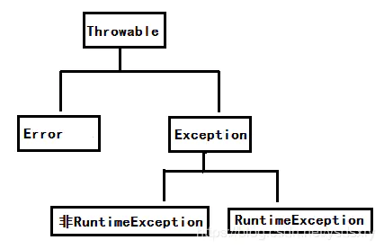

面向对象的方式处理异常，用对象表示一个（或一类）异常，**任何异常都是`Throwable`类或其子类对象；Throwable有两个子类，分别是：`Error`和`Exception`**；

-  `Error`：系统错误类，是程序运行时Java内部的错误，一般是由硬件或操作系统引起的，开发人员一般无法处理，这类异常发生时，只能关闭程序。 
- `Exception`：异常类，该类及其子类对象表示的错误一般是由算法考虑不周或编码时疏忽所致，需要开发人员处理。

**Java中的异常被分为两大类：`Runtime异常`和`非Runtime异常(也称为，Checked异常）`**，其中非Runtime异常也被称作`Checked异常`。 `Runtime异常`：是Java程序运行时产生的异常，例如：数组下标越界、空指针异常、对象类型强制转换错误等。`Error`和`RuntimeException`都是Runtime异常，编译时对这类异常不做检查。 `非Runtime异常`：也称`Checked异常`，例如IOException等。在编译时，编译器会对这类异常进行检查，看看有没有对这类异常进行处理，如果没有进行处理，编译会无法通过。

## 1.8.2 异常处理机制

### 异常的捕获与处理

Java采用<u>try-catch-finally</u>语句来对异常进行捕获并处理。该语句的语法格式如下：

```
try{
            //可能会产生异常的代码
        }
        catch(Exception_1 e1){
            //处理Exception_1的代码
        }
        catch(Exception_2 e2){
            //处理Exception_2的代码
        }
        ……
        catch(Exception_n en){
            //处理Exception_n的代码
        }
        finally{
            //通常是释放资源的代码
        }
```

其中catch和finally都是可以默认的（即可以不写），但是不允许同时默认catch和finally。 `try语句块`：该语句块中是程序正常情况下应该要完成的功能，而这些代码中可能会产生异常，其后面的catch语句块就是用来捕获并处理这些异常的。 `catch语句块`：该语句块用来捕获并处理try语句块中产生的异常。每个catch语句块声明其能处理的一种特定类型的异常，catch后面的括号中就是该特定类型的异常；不过，在Java7以前，每个catch语句块只能捕获一种异常，但是，从Java7开始就支持一个catch捕获多种异常，多个异常之间用`|`隔开。写法如下：

```
try{
            //可能会产生异常的代码
        }
        catch(Exception_1 | Exception_2 | Exception_3 | ... | Exception_n e1){
            //统一处理Exception_1、Exception_2、Exception_3、...、Exception_n的代码
        }
        finally{
            //通常是释放资源的代码
        }
复制代码
```

catch语句块中声明的异常对象（`catch(Exception_n e)`）封装了该异常的信息，可以通过该异常对象的一些方法来获取这些信息： `String getMessage()`：用来获取有关异常事件的详细信息。 `void printStackTrace()`：用来跟踪异常事件发生时执行堆栈的内容。 `finally语句块`：该语句块一般用于释放资源等操作。无论try语句块中是否有异常，finally语句块都会执行。

### try-catch-finally执行流程（最基本的情况）

try-catch-finally执行流程最基本的情况，所谓**最基本的情况就是没有用到throw关键字、return关键字等**。 首先，执行try中的代码，如果 try中的代码没有发生异常，那么catch中的代码就不执行，等try中的代码执行完毕后直接执行finally中的代码；如果 try中的代码发生了异常(假设发生异常的代码语句是xxx),那么try中xxx下面的代码就不会执行了，会立即跳转到catch中去匹配异常，若匹配到了对应的catch中声明的异常对象，那么就执行该catch语句块中的代码，并且后面的catch语句块就不再执行。等catch语句块中的代码执行完毕，就执行finally语句块中的代码。此时，整个try-catch-finally才算执行完毕。

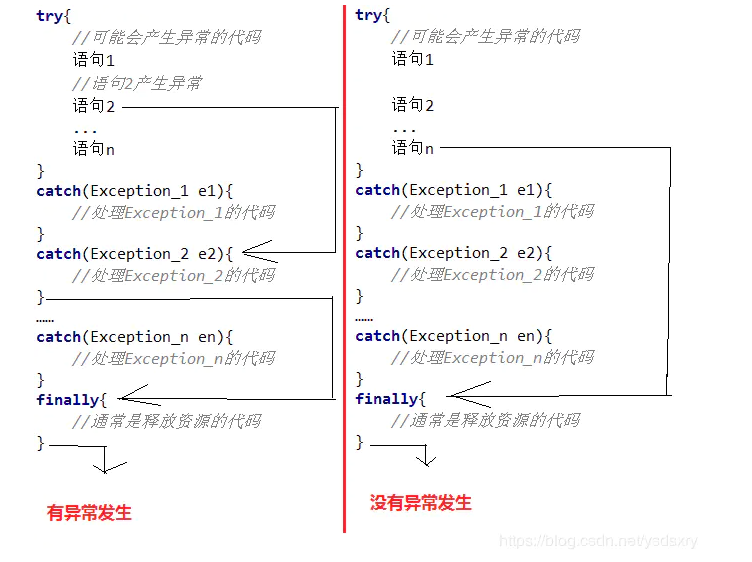


## 1.8.3 声明抛出异常

<u>声明抛出异常是一个子句</u>，它只能写在方法头部的后面,其格式如下： `throws <异常列表>` 举例：`public void fun() throws IOException{......}` <u>若在一个方法中声明抛出异常，那么调用该方法的调用者就必须对该异常进行处理，调用者处理该异常有两种方式：</u>

1. <u>使用try-catch-finally来捕获并处理该异常。</u>
2. <u>继续抛出，留给后面的调用者去处理，从而形成**异常处理链**。</u>

## 1.8.4 抛出异常

上面讲到的声明抛出异常只是告诉方法的调用者要去处理异常，这只是个说明性的语句，因为方法的代码中可能有异常，也可能没有异常（没有异常时就不会抛出）。而真正抛出异常的语句是`throw <异常对象>`，其中的异常对象必须是Throwable或其子类对象。例如： `throw new Exception("这是一个异常对象！")` 当执行到上述语句时，会立即结束方法的执行。 接下来通过案例来讲解，请看下面的代码：

```java
    @Test
    public void test1(){
        try{
            int a=1/0; //发生异常的代码
            System.out.println("算术异常！！！");
        }
        catch(ArithmeticException | NumberFormatException e){
            System.out.println(e.getMessage()); //打印异常信息，并没有抛出异常
            throw new ArithmeticException("抛出算术异常！！！"); //抛出算术异常
        }
        finally{
            System.out.println("执行finally代码块！！");
        }
        System.out.println("已经抛出算术异常！！！");
    }
```

上述代码的运行结果如下图所示：

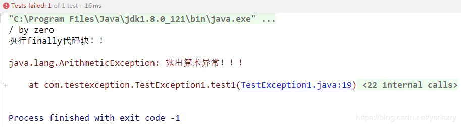

try中的`int a=1/0;`语句发生了算术异常（除数为0），直接跳转到catch中去匹配异常对象，匹配到了ArithmeticException异常对象，然后执行catch中的代码：打印异常信息，抛出异常。**但是，在catch中抛出异常之前，会先执行finally中的代码，等finally中的代码执行完毕，再回到catch中抛出异常**，而catch中的异常抛出后，整个方法就结束了，方法中剩下的代码就不执行了。 以上就是上述代码的完整执行流程。

## 1.8.5 异常屏蔽问题

<u>如果在try-catch-finally代码块中，try、catch以及finally中都有异常抛出，那么最终只能抛出finally代码块中的异常。这就是**异常屏蔽**问题</u>。 请看下面的代码：

```java
 //如果try、catch以及finally中都有异常抛出，那么最终只能抛出finally中的异常，try和catch中的异常抛出会被屏蔽
    @Test
    public  void test4(){
        try{
            System.out.println("try");
            throw new RuntimeException("try中抛出异常！！！");
        }
        catch(Exception e){
            System.out.println("catch");
            throw new RuntimeException("catch中抛出异常！！！");
        }
        finally{
            System.out.println("finally");
            throw new RuntimeException("finally中抛出异常！！！");
        }
    }
```

上述代码的运行结果为：

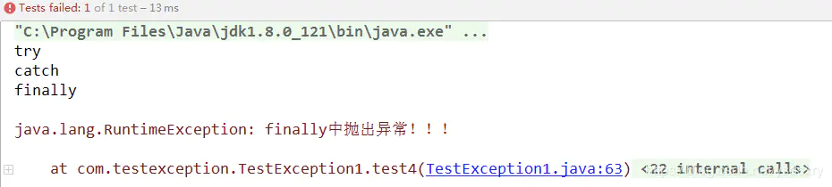

首先执行try中的代码：`打印“try”`；然后在try中抛出异常，那么在try中的异常抛出**之前**，要去catch中匹配异常对象并执行catch代码块，于是，匹配到了Exception对象并执行catch中的代码：`打印“catch”`，然后抛出异常；那么，在抛出catch中的异常之前，要先执行finally中的代码：`打印“finally”`，并`抛出finally中的异常`，此时整个方法执行结束，前面的两个异常不会被抛出。这就是所谓的**异常屏蔽**。

## 1.8.6 其他问题

如果在tr-catch-finally代码块中有return，那么执行流程又是怎样的呢？ 请看下面的代码：

```Java
public int test5(){
        try{
            int a=1/0; //发生异常的代码
            return 1;
        }
        catch(Exception e){
            System.out.println("catch");
            return 2;
        }
        finally{
            System.out.println("finally");
            return 3; //禁止在finally中使用return语句，这里只是举例说明，在实际开发中禁止使用
        }
    }
```

在main方法中执行上述方法，结果为：

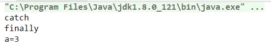

try中`int a=1/0;`语句发生了异常，那么就跳转到catch中去匹配并执行catch中的代码，而catch中要返回整数2，在执行catch中的`return 2;`语句之前，要先去执行finally中的代码，因为finally中有`return 3;`语句，所以当执行到finally中的return语句后，整个方法就结束了，catch以及try中的return语句就不会执行了。 请继续看下面的代码：

```java
public int test8(){
        // try中没有异常发生
        try{
            int a=1/1;
            return 1;
        }
        catch(Exception e){
            System.out.println("catch");
//            throw new RuntimeException("catch抛出异常！！！");
            return 2;
        }
        finally{
            System.out.println("finally");
            return 3; //禁止在finally中使用return语句，这里只是举例说明，在实际开发中禁止使用
        }
    }
```

上述代码的返回的结果依旧是3。

```Java
public int test8(){
        // try中没有异常发生
        try{
            int a=1/1;
            throw new Exception("try中的异常");
        }
        catch(Exception e){
            System.out.println("catch");
            return 2;
        }
        finally{
            System.out.println("finally");
            return 3; //禁止在finally中使用return语句，这里只是举例说明，在实际开发中禁止使用
        }
    }
```

上述代码的运行结果如下图所示：

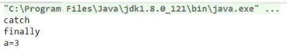

try中没有发生异常的代码，但try中抛出了异常，那么在抛出try中的异常之前，会先去匹配catch声明的异常对象并执行catch中的代码，因为catch中有return语句，那么在执行catch中的return语句之前，会先去执行finally中的代码，因为finally代码块中有return语句，所以当finally中的return语句执行完毕后，整个方法就结束了。前面的return语句就不会被执行了。

### 总结

1. 当try、catch以及finally中都抛出了异常时，只有finally中的异常会被抛出，try和catch中的异常会被屏蔽。
2. 当try、catch以及finally中都有return语句时，只有finally中的return语句会被执行，try和catch中的return语句不会被执行。
3. return和抛出异常（throw new XXXException()）是不能同时出现在 ***同一个*** 代码块中的。
4. 如果try中有return（throw）语句并且try中**没有异常**，那么在执行try中的return（throw）语句之前，要先去执行finally中的语句；同理，如果catch中有return（throw）语句，那么在执行catch中的return（throw）语句之前，要先去执行finally中的代码。
5. <u>一旦执行了return语句（或throw抛出异常代码），那么该方法就**立即结束**了。</u>
6. 如果，在try、catch以及finally中混合了return语句和抛出异常代码（throw），执行原理请参照第**4**条结论。

一句话总结一下：**如果try、catch和finally中都有return语句（或者都抛出了异常），那么只有finally中的return语句会执行（或者只有finally中的异常会被抛出），try和catch中的return语句不会被执行（或者try和catch中的异常不会被抛出）。**

## 1.8.7 自定义异常类

**自定义异常类必须是Throwable类的子类，通常是从Exception及其子类来继承**。例如，下述的MyException类就是一个自定义类。

```java
public class MyException extends Exception {
}
```

## 1.8.8 常见异常

- 算术异常类：`ArithmeticExecption`
- 空指针异常类：`NullPointerException`
- 类型强制转换异常：`ClassCastException`
- 数组负下标异常：`NegativeArrayException`
- 数组下标越界异常：`ArrayIndexOutOfBoundsException`
- 违背安全原则异常：`SecturityException`
- 文件已结束异常：`EOFException`
- 文件未找到异常：`FileNotFoundException`
- 字符串转换为数字异常：`NumberFormatException`
- 操作数据库异常：`SQLException`
- 输入输出异常：`IOException`
- 方法未找到异常：`NoSuchMethodException`
- 抽象方法错误。当应用试图调用抽象方法时抛出 ：`java.lang.AbstractMethodError`
- 断言错,   用来指示一个断言失败的情况：`java.lang.AssertionError`
- 方法不存在错误。当应用试图调用某类的某个方法，而该类的定义中没有该方法的定义时抛出该错误：`java.lang.NoSuchMethodError`
- 内存不足错误。当可用内存不足以让Java虚拟机分配给一个对象时抛出该错误：`java.lang.OutOfMemoryError`
- 堆栈溢出错误。当一个应用递归调用的层次太深而导致堆栈溢出时抛出该错误：`java.lang.StackOverflowError`
- 线程结束。当调用Thread类的stop方法时抛出该错误，用于指示线程结束：`java.lang.ThreadDeath`
- 未知错误。用于指示Java虚拟机发生了未知严重错误的情况：`java.lang.UnknownError`
- 索引越界异常。当访问某个序列的索引值小于0或大于等于序列大小时，抛出该异常：`java.lang.IndexOutOfBoundsException`

## 1.8.9 finally代码什么时候不被执行

1. 当程序在进入try语句之前就出现异常时，会直接结束，不会执行finally块中的代码

2. 当程序在try块中强制退出时也不会去执行finally块中的代码

   ```java
   try{
       System.out.println("try block");
       System.exit(0); //强制退出
   }catch(Exception e){
       System.out.println("catch block");
   }finally{
       System.out.println("finally block");
   }
   ```

3. 

# 1.9 Stack Queue Heap 异同

## 栈Stack和队列Queue的异同

**栈（Stack）和队列（Queue）是两种操作受限的线性表。**受限表现在：栈的插入和删除操作只允许在栈顶，满足”FILO：First In Last Out“；队列只允许在表尾插入数据元素，在表头删除数据元素，满足“First In First Out”。

**相同点：**

1.都是线性结构。

2.插入操作都是限定在表尾进行。

3.都可以**通过顺序结构和链式结构**实现。

4.插入与删除的时间复杂度都是O(1)，在空间复杂度上两者也一样。

5.多链栈和多链队列的管理模式可以相同。

**不同点：**

1.删除数据元素的位置不同，栈的删除操作在表尾进行，队列的删除操作在表头进行。

2.应用场景不同；常见栈的应用场景包括括号问题的求解，表达式的转换和求值，函数调用和递归实现，深度优先搜索遍历等；常见的队列的应用场景包括计算机系统中各种资源的管理，消息缓冲器的管理和广度优先搜索遍历等。

3.顺序栈能够实现多栈空间共享，而顺序队列不能。

## 堆 Heap 和栈 Stack 的区别

- https://blog.csdn.net/K346K346/article/details/80849966

程序内存布局场景下，堆与栈表示两种内存管理方式；数据结构场景下，堆与栈表示两种常用的数据结构。

### 程序内存分区场景下


### 数据结构场景下

**栈是一种操作受限的线性表，其限制是指只仅允许在栈顶（Top）进行插入和删除操作**。这种受限的运算使栈拥有“**先进后出**”的特性（First In Last Out，简称FILO）。

**栈分顺序栈和链式栈两种**。栈是一种线性结构，所以可以使用数组或链表（单向链表、双向链表或循环链表）作为底层数据结构。使用数组实现的栈叫做顺序栈，使用链表实现的栈叫做链式栈，二者的区别是顺序栈中的元素地址连续，链式栈中的元素地址不连续。

栈的结构如下图所示：


**堆是一种常用的树形结构，是一种特殊的完全二叉树，当且仅当满足所有节点的值总是不大于或不小于其父节点的值的完全二叉树被称之为堆**。堆的这一特性称之为堆序性。因此，在一个堆中，根节点是最大（或最小）节点。如果根节点最小，称之为小顶堆（或小根堆），如果根节点最大，称之为大顶堆（或大根堆）。**堆的左右孩子没有大小的顺序**。下面是一个小顶堆示例：

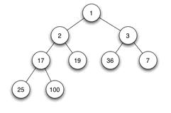

堆的存储一般都用数组来存储堆，i节点的父节点下标就为( i – 1 ) / 2 。它的左右子节点下标分别为 2 ∗ i + 1 和 2 ∗ i + 2。如第0个节点左右子节点下标分别为1和2。


# 1.10 ArrayList和LinkedList

**都实现List接口的类，都是元素的容器，用于存放对象的引用；都可以对存放的元素进行增删改查的操作，进行排序。**

## 1.10.1 ArrayList

ArrayList：**数组的形式实现存储，实现了RandomAccess接口，利用数组下标进行元素的访问，因此对元素的随机访问速度非常快。**

因为是数组，所以ArrayList在初始化的时候，有初始大小10，插入新元素的时候，会判断是否需要扩容，**扩容的步长是0.5倍原容量（扩容后将会按照1.5倍增长）**，扩容方式是利用数组的复制，因此有一定的开销；

另外，ArrayList在进行元素插入的时候，需要移动插入位置之后的所有元素，位置越靠前，需要位移的元素越多，开销越大，相反，插入位置越靠后的话，开销就越小了，如果在最后面进行插入，那就不需要进行位移；

## 1.10.2 LinkedList

LinkedList使用**双向链表的结构实现存储**，LinkedList有一个内部类作为存放元素的单元，里面有三个属性，用来存放元素本身以及前后2个单元的引用，另外LinkedList内部还有一个header属性，用来标识起始位置，LinkedList的第一个单元和最后一个单元都会指向header，因此形成了一个双向的链表结构。

每一个元素（结点）的地址不连续，通过引用找到当前结点的上一个结点和下一个结点，即插入和删除效率较高，只需要常数时间，而get和set则较为低效。

LinkedList的方法和使用和ArrayList大致相同，由于LinkedList是链表实现的，所以额外提供了在头部和尾部添加/删除元素的方法，也没有ArrayList扩容的问题了。

## 1.10.3 使用场景

在需要频繁读取集合中的元素时，使用ArrayList效率较高，而在插入和删除操作较多时，使用LinkedList效率较高。

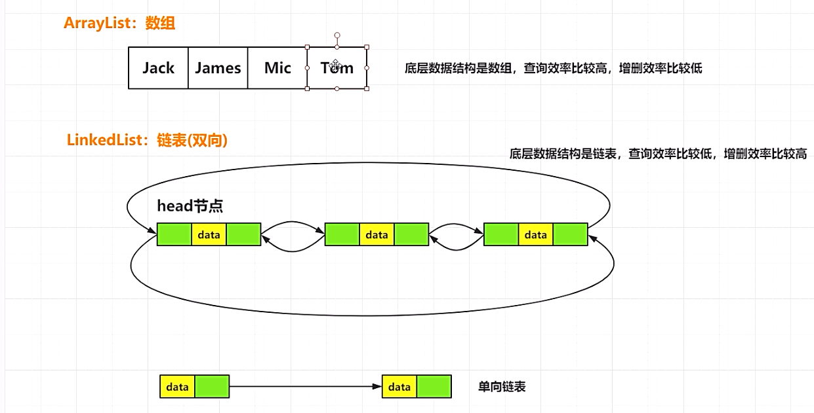


# 1.10‘ ArrayList和Vector的区别

1. vector在add的时候使用了同步函数，方法上加上了synchronized关键字，ArrayList的add方法没有加上这个关键字
2. 存储空间不足的时候，ArrayList默认增加为原来的50%，Vector默认增加为原来的一倍

# 1.11 重写 重载

## 重写(Override) -- 父类 子类

重写是<u>子类对父类的允许访问的方法的实现过程进行重新编写</u>, **返回值和形参都不能改变**。**即外壳不变，核心重写！**重写方法不能抛出新的检查异常或者比被重写方法申明更加宽泛的异常。

**方法的重写规则**

- 参数列表与被重写方法的**参数列表**必须完全相同
- 返回类型与被重写方法的**返回类型**可以不相同，但是必须是父类返回值的派生类（java5 及更早版本返回类型要一样，java7 及更高版本可以不同）
- **访问权限**不能比父类中被重写的方法的访问权限更低。例如：如果父类的一个方法被声明为 public，那么在子类中重写该方法就不能声明为 protected
- **父类的成员方法只能被它的子类重写**
- 声明为 final 的方法不能被重写
- 声明为 static 的方法不能被重写，但是能够被再次声明
- **重写的方法能够抛出任何非强制异常`UncheckedException`，无论被重写的方法是否抛出异常。但是，重写的方法不能抛出新的强制性异常，或者比被重写方法声明的更广泛的强制性异常，反之则可以**
- **构造方法不能被重写**
- 如果不能继承一个类，则不能重写该类的方法
- 子类和父类在同一个包中，那么子类可以重写父类所有方法，除了声明为 private 和 final 的方法
- 子类和父类不在同一个包中，那么子类只能够重写父类的声明为 public 和 protected 的非 final 方法

## 重载（Overload）-- 构造函数

**重载是在一个类里面，方法名字相同，而参数不同。返回类型可以相同也可以不同。**每个重载的方法（或者构造函数）都必须有一个独一无二的参数类型列表。**最常用的地方就是构造器的重载。**

**重载规则:**

- 被重载的方法**必须改变参数列表(参数个数或类型不一样)**；
- 被重载的方法可以改变返回类型；
- 被重载的方法可以改变访问修饰符；
- 被重载的方法可以声明新的或更广的检查异常；
- 方法能够在同一个类中或者在一个子类中被重载。
- 无法以返回值类型作为重载函数的区分标准。

# 1.12 8个基础类型

byte、short、int、long、float、double、char、boolean

# 1.13 Java final的用法

修饰类、方法和变量（包括成员变量和局部变量）

- 修饰类

  这个类不能被继承，注意final类中的所有成员方法都会被隐式地指定为final方法。

- 修饰方法

  想要明确禁止该方法在子类中被覆盖的情况，才将方法设置为final，类的private方法会隐式地被指定为final方法。

- 修饰变量

  如果是基本数据类型的变量，则其数值一旦初始化之后便不能更改；如果是引用类型的变量，则在其初始化之后便不能再让其指向另一个对象。

  - **final作用于类的成员变量时，成员变量必须在定义时或者构造器中进行初始化赋值**，而且final变量一旦被初始化赋值之后，就不能再被赋值
  - final和static的区别，static作用于成员变量用来表示只保存一份副本，而final的作用是保持变量不可变。

# 1.14 Java多线程同步机制

## 1.14.1 volatile

用于多个线程访问同一个变量时，用变量进行唯一性约束，**volatile保证了变量的可见性，不能保证原子性**。

`private volatile booleanflag = false`

**保证变量的可见性**：当写一个volatile变量时，JMM会把该线程对应的工作内存中的共享变量值刷新到主内存中，当读取一个volatile变量时，JMM会把该线程对应的工作内存置为无效，那么该线程将只能从主内存中重新读取共享变量。

**不能保证原子性**：原子性指的是不会被线程调度机制打断的操作，在java中，对基本数据类型的变量的读取和赋值操作是原子性操作。自增/自减操作不是原子性操作（例如：i++等）。

**内存语义：**

1. 写：当写一个volatile变量时，JMM把该进程对应的本地缓存中的共享变量刷新到主内存
2. 读：当读取一个volatile变量时，JMM把该进程对应的本地缓存置为无效，线程接下来从主存中读取共享变量
3. 禁止执行重排优化

**特点:**

- 可见性

  当一个线程修改了这个变量的值，新值对于其他线程来说是可以立即获取的，但是基于volatile变量的操作并不是安全的（如自增操作），不能保证原子性

- 禁止指令重排序

  不允许对volatile操作指令进行重排序

## 1.14.2 synchronized

**将临界区的内容上锁，同一时刻只有一个进程能访问该临界区代码**
使用**内置锁**，锁一个时刻只能被一个线程持有，**可以重入**（表示一个处于synchronized代码中的线程可以进入另外一个使用synchronized的代码块，比如：方法A和方法B同时使用synchronized修饰，在方法A中调用了方法B，调用某个线程调用方法A的时候不会造成死锁，因为synchronized是可重入的锁，线程在进入方法A的时候获得了当前对象的锁，但是此时这个线程依然可以获得方法B的synchronized锁）

### 1.14.2.1 修饰代码块

**修饰代码块：作用范围{}括起来的代码，作用对象是调用这个代码块的类对象**。一个线程访问一个对象的synchronized(this)同步代码块时，其他试图访问该对象的线程将被阻塞。

```java
class SyncThread implements Runnable{
    public void run(){
        //synchronized修饰代码块
        synchronized(this){;}
    }
    
    //非synchronized修饰 可以不受限制访问
    public void printCount(){
        ;
    }
}

//锁住的是 syncThread对象 thread1先运行，thread2后运行
SyncThread syncThread = new SyncThread();   
Thread thread1 = new Thread(syncThread, "SyncThread1");
Thread thread2 = new Thread(syncThread, "SyncThread2");
thread1.start();
thread2.start();

//锁住的是两个new SyncThread()对象，thread1 thread2运行互不干扰
Thread thread1 = new Thread(new SyncThread(), "SyncThread1");
Thread thread2 = new Thread(new SyncThread(), "SyncThread2");
thread1.start();
thread2.start();
```

#### 指定给某个对象加锁

```java
class AccountOperator implements Runnable{
    private Account account;
    public AccountOperator(Account account){
        this.count=count;
    }
    
    public void run(){
        //锁定对象
        synchronized(account){
            account.deposit(500);
            ;
        }
    }
}
```

### 1.14.2.2 修饰普通方法

**修饰普通方法：作用范围是整个方法，作用对象是调用这个方法的类对象**

- synchronized关键字不能被继承。如果在父类中的某个方法使用了synchronized关键字，而在子类中覆盖了这个方法，在子类的这个方法默认情况下并不是同步的。但子类调用了父类的同步方法，子类的方法也相当于同步了。
- 在定义接口方法时不能使用synchronized关键字
- 构造方法不能使用synchronized关键字

```java
public synchronized Singleton getInstance(){
}

//方法一：子类方法加上synchronized方法
class Parent{
    public synchronized void method(){}
}
class Child extends Parent{
    public synchronized void method(){}
}

//方法二：子类调用父类的同步方法
class Parent{
    public synchronized void method(){}
}
class Child extends Parent{
    public void method(){super.method();}
}
```

### 1.14.2.3 修饰静态方法

静态方法是属于类的不是属于对象的，所以**修饰静态方法：作用范围是整个静态方法，作用对象是这个类的所有对象**

```java
public synchronized static void method(){
    //todo
}
```

### 1.14.2.4 修饰类 

- **修饰一个类：作用范围是synchronized 后面括号括起来的部分，作用的对象是这个类的所有对象**

```java
class ClassName{
    public void method(){
        //修饰类
        synchronized(ClassName.class){
            //todo
        }
    }
}
```

### 1.14.2.5 synchronized 总结

1. 无论synchronized关键字加在方法上还是对象上，如果它作用的对象是非静态的，则它取得的锁是对象；如果synchronized作用的对象是一个静态方法或一个类，则它取得的锁是对类，该类所有的对象同一把锁。
2. 每个对象只有一个锁（lock）与之相关联，谁拿到这个锁谁就可以运行它所控制的那段代码。
3. 实现同步是要很大的系统开销作为代价的，甚至可能造成死锁，所以尽量避免无谓的同步控制。

## 1.14.3 volatile synchronized区别

- volatile通过变量的可见性，指定线程必须从主存中读取变量的最新值；synchronized通过阻塞线程的方式，只有当前线程能访问该变量，锁定了当前变量。

-  volatile使用在变量级别；synchronized可以使用在变量、方法、类级别

- volatile不会造成线程阻塞；synchronized可能会造成线程阻塞

- volatile不能保证原子性；synchronized能保证原子性

- volatile标记的变量不会被编译器优化；synchronized标记的变量有可能会被编译器优化（指令重排）。

# 1.15 Set集合

## 1.15.1 构造方法

AbstractSet, ConcurrentHashMap.KeySetView, ConcurrentSkipListSet, CopyOnWriteArraySet, EnumSet, HashSet, JobStateReasons, LinkedHashSet, TreeSet

## 1.15.2 类方法

| 修饰符和类型 |                                                              |
| ------------ | ------------------------------------------------------------ |
| `boolean`    | `add(E e)` <br>Adds the specified element to this set if it is not already present (optional operation). |
| `void`       | `clear()`<br>Removes all of the elements from this set (optional operation). |
| `boolean`    | `contains(Object o)`<br>Returns `true` if this set contains the specified element. |
| `boolean`    | `removeAll(Collection<?> c)`<br>Removes from this set all of its elements that are contained in the specified collection (optional operation).  集合取非交集 |
| `boolean`    | `retainAll(Collection<?> c)`<br>Retains only the elements in this set that are contained in the specified collection (optional operation). 集合取交集 |

## 1.15.3 遍历方法

```java
Set<String> set=new HashSet<>();

//方法一：集合类的通用遍历方式
Iterator it1=set.iterator();
while(it1.hasNext()){
    it1.next();
}

//方法二：集合类的通用遍历方式
for(Interator it2=set.iterator();it2.hasNext();){
    it2.next;
}

//方法三：增强型for遍历循环
for(String value:set){
    value;
}
```

# 1.16 强引用 软引用 弱引用 虚引用

**对象的引用分为四个级别，依次为：强引用、软引用、弱引用、虚引用**，使得程序能够更加灵活地控制对象的生命周期，**体现的是对象不同的可达性状态和垃圾收集的影响**。目的：

- 通过代码的方式决定某个对象的生命周期
- 有利于垃圾回收

## 1.16.1 强引用 Strong Reference

如果一个对象具有强引用，垃圾回收器绝不会回收它。如果强引用对象不使用时，需要通过弱化从而使`GC`能够回收。

```java
Object strongReference =new Object();
// 弱化强引用 垃圾回收 显式地设置强引用对象为null
strongReference=null;
```

```java
public void test() {
	Object strongReference = new Object();
    // 省略其他操作
}
```

在一个**方法的内部**有一个**强引用**，这个引用`strongReference`保存在`Java`**栈**中，而真正的引用内容(`Object`)保存在`Java`**堆**中。 当这个**方法运行完成**后，就会退出**方法栈**，则引用对象的**引用数**为`0`，这个对象会被回收。

**示例：ArrayList的Clear方法**

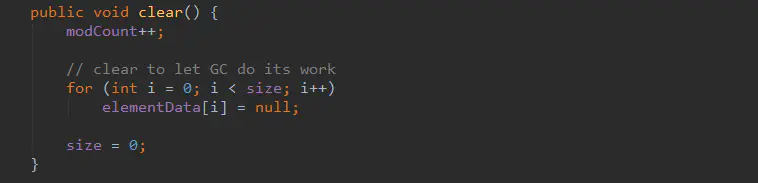

在`ArrayList`类中定义了一个`elementData`数组，在调用`clear`方法清空数组时，每个数组元素被赋值为`null`。 不同于`elementData=null`，强引用仍然存在，避免在后续调用`add()`等方法添加元素时进行内存的**重新分配**。 使用如`clear()`方法**内存数组**中存放的**引用类型**进行**内存释放**特别适用，这样就可以及时释放内存。

## 1.16.2 软引用 Soft Reference

当内存不足，就会触发JVM的GC，如果GC之后，内存还是不足，就会把软引用包裹的对象GC掉，也就只有内存不足，JVM才会回收该对象。

> 软引用可用来实现内存敏感的高速缓存。

**软引用就是把对象用SoftReference 包裹**一下，当需要从软引用对象获取包裹的对象，使用get方法就可以

```java
SoftReference<引用类型或自定义的类T> objectClassSoftReference=new SoftReference<引用类型或自定义的类T>(new 引用类型或自定义的类T);
引用类型或自定义的类T t=objectClassSoftReference.get();
```

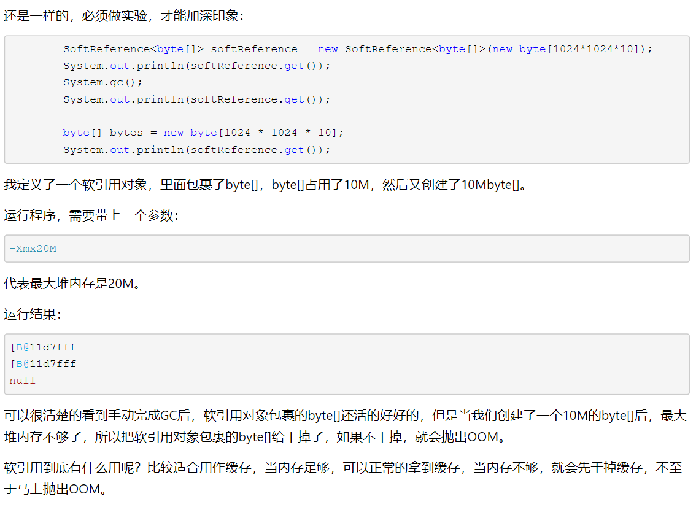

## 1.16.3 弱引用 Weak Reference

弱引用的使用类似于软引用，**关键字变成WeakReference**

```java
WeakReference<byte[]> weakReference=new WeakReference<byte[]>(new byte[1024*1024*10]);
System.out.println(weakReference.get())
```

**弱引用的特点是不管内存是否足够，只要发生GC，都会被回收**

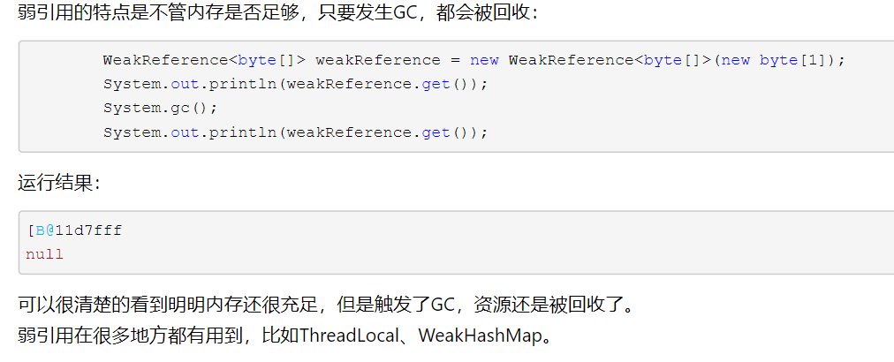

## 1.16.4 虚引用（幻影引用）PhantomReference

必须与`ReferenceQueue`一起使用，当 `GC` 准备回收一个对象，如果发现它有虚引用，就会在回收之前，把这个 **虚引用** 加入到与之关联的 `ReferenceQueue` 中。

**无法通过虚引用来获取对一个对象的真实引用**，为一个对象设置虚引用关联的唯一目的就是希望能在这个对象被收集器回收时收到一个系统通知。

# 1.17 相关类及其方法

## 1.17.1 String

`char[] toCharArray()`

Converts this string to a new character array.


## 1.17.2 StringBuilder

# 1.18 序列化和反序列化

序列化：**把对象转换为字节序列的过程**称为对象的序列化

反序列化：**把字节序列恢复为对象的过程**称为对象的反序列化

## 适应场景

1. 内存中的对象状态保存到一个文件中或数据库中的时候

2. 使用套接字在网络上传送对象的时候

3. 通过RMI（Remote Method Invocation，远程方法调用）传输对象的时候

   补充：RMI，Remote Method Invocation，一个JVM中的代码可以通过网络实现远程调用另一个JVM的某个方法。提供服务的一方我们称之为服务器，而实现远程调用的一方我们称之为客户端。

## 实现序列化

**实现`Serializable`接口**

**transient修饰的属性是不会被序列化的，静态属性不会序列化**

**要实现序列化的对象，所有涉及的引用，都要实现序列化接口才可以**

**serialVersionUID 的作用和用法**：

- 没有明确的给出serialVersionUID，java会自动赋值，并且值与类的属性相关。在未设置serialVersionUID的情况下，类增加或减少属性的时候，会出错

- 设置`private static final long serialVersionUID`可以在序列化、反序列化的过程中，适应对象的变化

- 序列化运行时使用一个称为 serialVersionUID 的版本号与每个可序列化类相关联，该序列号在反序列化过程中用于验证序列化对象的发送者和接收者是否为该对象加载了与序列化兼容的类。如果接收者加载的该对象的类的 serialVersionUID 与对应的发送者的类的版本号不同，则反序列化将会导致 InvalidClassException。可序列化类可以通过声明名为 "serialVersionUID" 的字段（<u>该字段必须是静态 (static)、最终 (final) 的 long 型字段</u>）显式声明其自己的 serialVersionUID：

  如果可序列化类未显式声明 serialVersionUID，则序列化运行时将基于该类的各个方面计算该类的默认 serialVersionUID 值，如“Java(TM) 对象序列化规范”中所述。不过，强烈建议 所有可序列化类都显式声明 serialVersionUID 值，原因是计算默认的 serialVersionUID 对类的详细信息具有较高的敏感性，根据编译器实现的不同可能千差万别，这样在反序列化过程中可能会导致意外的 InvalidClassException。因此，为保证 serialVersionUID 值跨不同 java 编译器实现的一致性，序列化类必须声明一个明确的 serialVersionUID 值。还强烈建议使用 private 修饰符显示声明 serialVersionUID（如果可能），原因是这种声明仅应用于直接声明类 -- serialVersionUID 字段作为继承成员没有用处。数组类不能声明一个明确的 serialVersionUID，因此它们总是具有默认的计算值，但是数组类没有匹配 serialVersionUID 值的要求。

## 示例

```java
package com.lxk.model;
 
import java.io.Serializable;
 
/**
 * @author lxk on 2017/11/1
 */
public class FlyPig implements Serializable {
    //private static final long serialVersionUID = 1L;
    private static String AGE = "269";
    private String name;
    private String color;
    transient private String car;
 
    //后期增加的新的属性
    //private String addTip;  
 
    public String getName() {
        return name;
    }
 
    public void setName(String name) {
        this.name = name;
    }
 
    public String getColor() {
        return color;
    }
 
    public void setColor(String color) {
        this.color = color;
    }
 
    public String getCar() {
        return car;
    }
 
    public void setCar(String car) {
        this.car = car;
    }
 
    //public String getAddTip() {
    //    return addTip;
    //}
    //
    //public void setAddTip(String addTip) {
    //    this.addTip = addTip;
    //}
 
    @Override
    public String toString() {
        return "FlyPig{" +
                "name='" + name + '\'' +
                ", color='" + color + '\'' +
                ", car='" + car + '\'' +
                ", AGE='" + AGE + '\'' +
                //", addTip='" + addTip + '\'' +
                '}';
    }
}
```

```java
package com.lxk.test;
 
import com.lxk.model.FlyPig;
 
import java.io.*;
 
/**
 * 序列化测试
 *
 * @author lxk on 2017/11/1
 */
public class SerializableTest {
    public static void main(String[] args) throws Exception {
        serializeFlyPig();
        FlyPig flyPig = deserializeFlyPig();
        System.out.println(flyPig.toString());
 
    }
 
    /**
     * 序列化
     */
    private static void serializeFlyPig() throws IOException {
        FlyPig flyPig = new FlyPig();
        flyPig.setColor("black");
        flyPig.setName("naruto");
        flyPig.setCar("0000");
        // ObjectOutputStream 对象输出流，将 flyPig 对象存储到E盘的 flyPig.txt 文件中，完成对 flyPig 对象的序列化操作
        ObjectOutputStream oos = new ObjectOutputStream(new FileOutputStream(new File("d:/flyPig.txt")));
        oos.writeObject(flyPig);
        System.out.println("FlyPig 对象序列化成功！");
        oos.close();
    }
 
    /**
     * 反序列化
     */
    private static FlyPig deserializeFlyPig() throws Exception {
        ObjectInputStream ois = new ObjectInputStream(new FileInputStream(new File("d:/flyPig.txt")));
        FlyPig person = (FlyPig) ois.readObject();
        System.out.println("FlyPig 对象反序列化成功！");
        return person;
    }
}
```

# 1.19 线程安全的类

1. 通过`synchronized`关键字给方法加上内置锁来实现线程安全：`Vector, Stack, HashTable, StringBuffer, Timer, TimerTask`

2. 原子类`Atomicxxx`—包装类的线程安全类，**`Atomicxxx` 是通过`Unsafe` 类的native方法实现线程安全的**
   如`AtomicLong`，`AtomicInteger`等等

3. **`BlockingQueue`** 和`BlockingDeque`
   `BlockingDeque`接口继承了`BlockingQueue`接口，
   `BlockingQueue` 接口的实现类有**`ArrayBlockingQueue`** ，**`LinkedBlockingQueue`** ，**`PriorityBlockingQueue`** 而`BlockingDeque`接口的实现类有`LinkedBlockingDeque`
   **`BlockingQueue`和`BlockingDeque` 都是通过使用定义为final的`ReentrantLock`作为类属性显式加锁实现同步的**

4. **`CopyOnWriteArrayList`**和 **`CopyOnWriteArraySet`**
   `CopyOnWriteArraySet`的内部实现是在其类内部声明一个final的`CopyOnWriteArrayList`属性，并在调用其构造函数时实例化该`CopyOnWriteArrayList`，`CopyOnWriteArrayList`采用的是显式地加上`ReentrantLock`实现同步，而`CopyOnWriteArrayList`容器的线程安全性在于在每次修改时都会创建并重新发布一个新的容器副本，从而实现可变性。

5. `Concurrentxxx`
   最常用的就是**`ConcurrentHashMap`**，当然还有`ConcurrentSkipListSet`和`ConcurrentSkipListMap`等等。
   `ConcurrentHashMap`使用了一种完全不同的加锁策略来提供更高的并发性和伸缩性。`ConcurrentHashMap`并不是将每个方法都在同一个锁上同步并使得每次只能有一个线程访问容器，而是使用一种粒度更细的加锁机制——**`分段锁`**来实现更大程度的共享

   在这种机制中，任意数量的读取线程可以并发访问Map，执行读取操作的线程和执行写入操作的线程可以并发地访问Map，并且一定数量的写入线程可以并发地修改Map，这使得在并发环境下吞吐量更高，而在单线程环境中只损失非常小的性能

6. **`ThreadPoolExecutor`**
   `ThreadPoolExecutor`也是使用了`ReentrantLock`显式加锁同步

7. `Collections`中的`synchronizedCollection(Collection c)`方法可将一个集合变为线程安全，其内部通过`synchronized`关键字加锁同步

# 1.20 StringBuffer和StringBuilder的区别

- 都是final类，都不允许被继承；StringBuffer和StringBuilder类长度是可以改变的；
- StringBuffer类是线程安全的，StringBuilder不是线程安全的；

# 1.21 HashMap

- https://yikun.github.io/2015/04/01/Java-HashMap%E5%B7%A5%E4%BD%9C%E5%8E%9F%E7%90%86%E5%8F%8A%E5%AE%9E%E7%8E%B0/
- 

HashMap采用**Entry数组来存储key-value对**，**每一个键值对组成了一个Entry实体，Entry类实际上是一个单向的链表结构**，它具有Next指针，可以连接下一个Entry实体。 **只是在JDK1.8中，链表长度大于8的时候，链表会转成红黑树**。

非同步、不保证有序（比如插入的顺序）、不在保证序列不随时间变化

哈希表的初始化大小为2的幂次，默认加载因子0.75f，<u>当size>=threshold（table.length*loadFactor）时，需对哈希表进行扩容，将会创建原来HashMap大小两倍的bucket数组</u>。

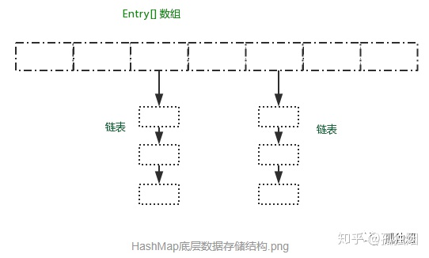

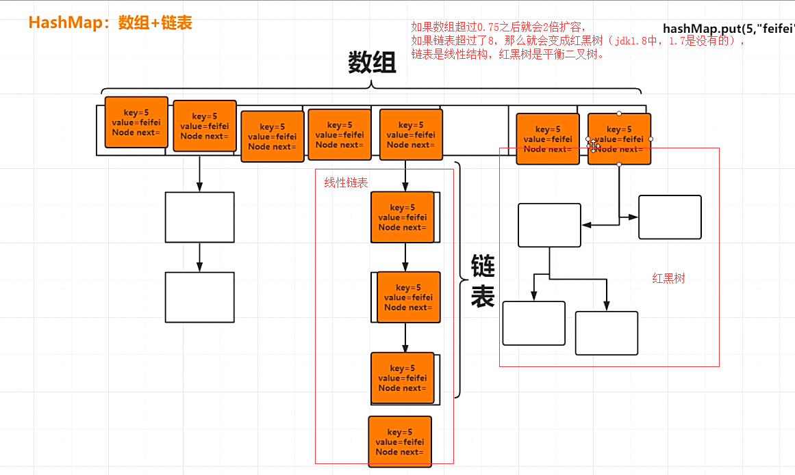


## 工作原理

通过hash的方法，通过put和get存储和获取对象。存储对象时，我们将K/V传给put方法时，它调用hashCode计算hash从而得到bucket位置，进一步存储，HashMap会根据当前bucket的占用情况自动调整容量(超过Load Facotr则resize为原来的2倍)。获取对象时，我们将K传给get，它调用hashCode计算hash从而得到bucket位置，并进一步调用equals()方法确定键值对。如果发生碰撞的时候，Hashmap通过链表将产生碰撞冲突的元素组织起来，在Java 8中，如果一个bucket中碰撞冲突的元素超过某个限制(默认是8)，则使用红黑树来替换链表，从而提高速度。

### put方法

1. 对key计算Hash值，再计算下标index

2. 如果没有碰撞，直接放入桶bucket中

3. 如果碰撞了，以链表的方式链接到bucket后面

4. 如果链表长度超过阈值，把链表转换为红黑树

5. 如果节点已经存在就替换旧值

6. 如果桶bucket满了（超了load factor*current capacity），就需要resize

   ```java
   public V put(K key, V value) {
       // 对key的hashCode()做hash
       return putVal(hash(key), key, value, false, true);
   }
   
   final V putVal(int hash, K key, V value, boolean onlyIfAbsent,boolean evict) {
       Node<K,V>[] tab; Node<K,V> p; int n, i;
       // tab为空则创建
       if ((tab = table) == null || (n = tab.length) == 0)
           n = (tab = resize()).length;
       // 计算index，并对null做处理
       if ((p = tab[i = (n - 1) & hash]) == null)
           tab[i] = newNode(hash, key, value, null);
       else {
           Node<K,V> e; K k;
           // 节点存在
           if (p.hash == hash && ((k = p.key) == key || (key != null && key.equals(k))))
               e = p;
           // 该链为树
           else if (p instanceof TreeNode)
               e = ((TreeNode<K,V>)p).putTreeVal(this, tab, hash, key, value);
           // 该链为链表
           else {
               for (int binCount = 0; ; ++binCount) {
                   if ((e = p.next) == null) {
                       p.next = newNode(hash, key, value, null);
                       if (binCount >= TREEIFY_THRESHOLD - 1) // -1 for 1st
                           treeifyBin(tab, hash);
                       break;
                   }
                   if (e.hash == hash &&
                       ((k = e.key) == key || (key != null && key.equals(k))))
                       break;
                   p = e;
               }
           }
           // 写入
           if (e != null) { // existing mapping for key
               V oldValue = e.value;
               if (!onlyIfAbsent || oldValue == null)
                   e.value = value;
               afterNodeAccess(e);
               return oldValue;
           }
       }
       ++modCount;
       // 超过load factor*current capacity，resize
       if (++size > threshold)
           resize();
       afterNodeInsertion(evict);
       return null;
   }
   ```

### get方法

1. bucket里第一个节点，直接命中
2. 如果有冲突，通过key.equals(k)去查找对应的entry
   - 若为树，则在树中通过key.equals(k)查找，O(logn)
   - 若为链表，则在链表中通过key.equals(k)查找，O(n)

```java
public V get(Object key) {
    Node<K,V> e;
    return (e = getNode(hash(key), key)) == null ? null : e.value;
}

final Node<K,V> getNode(int hash, Object key) {
    Node<K,V>[] tab; Node<K,V> first, e; int n; K k;
    if ((tab = table) != null && (n = tab.length) > 0 && (first = tab[(n - 1) & hash]) != null) {
        // 直接命中
        if (first.hash == hash && // always check first node
            ((k = first.key) == key || (key != null && key.equals(k))))
            return first;
        // 未命中
        if ((e = first.next) != null) {
            // 在树中get
            if (first instanceof TreeNode)
                return ((TreeNode<K,V>)first).getTreeNode(hash, key);
            // 在链表中get
            do {
                if (e.hash == hash &&
                    ((k = e.key) == key || (key != null && key.equals(k))))
                    return e;
            } while ((e = e.next) != null);
        }
    }
    return null;
}
```

## hash函数实现

计算下标时，**先对key进行hashCode进行hash操作**，**然后再通过hash值进一步计算下标**

1. 对key进行hashCode的hash操作如下：

   ```java
   static final int hash(Object key) {
       int h;
       return (key == null) ? 0 : (h = key.hashCode()) ^ (h >>> 16);  //h的高16bit和低16bit进行异或操作
   }
   ```

2. 计算下标，使用&操作

   ```java
   (n - 1) & hash
   ```


## RESIZE的实现

bucket扩大为原来的两倍，重新计算index，把节点放到新的bucket中。因为使用的是2次幂的扩展(指长度扩为原来2倍)，所以，**元素的位置要么是在原位置，要么是在原位置再移动2次幂的位置**。

在扩充HashMap的时候，不需要重新计算hash，只需要看看原来的hash值新增的那个bit是1还是0就好了，是0的话索引没变，是1的话索引变成“原索引+oldCap”。可以看看下图为16扩充为32的resize示意图：


## hash冲突的解决方法

1. 开放定址法

2. 链地址法

3. 再哈希法

4. 公共溢出区域法

## 是否可以使用LinkedList代替数组结构

```java
Entry[] table=new Entry[capacity];
//转换为
List<Entry> table=new LinkedList<Entry>();
```

可行，但是HashMap使用数组效率最高。

在HashMap中，定位桶的位置是利用元素的key的哈希值对数组长度取模（实际代码使用的是`hash&(n-1)`）得到。此时，我们已得到桶的位置。显然数组的查找效率比LinkedList大。

**追加：为什么不用ArrayList代替数组**

因为采用基本数组结构，扩容机制可以自己定义，HashMap中数组扩容刚好是2的次幂，在做取模运算的效率高。 而ArrayList的扩容机制是1.5倍扩容，那ArrayList为什么是1.5倍扩容

## 使HashMap变成线程安全

调用工具类Collections.synchronizedMap(map)

```java
HashMap map=new HashMap();
map.put("xxx","xxx");
Map map1=Collections.synchronizedMap(map);
```

## HashTable和HashMap的区别

1. HashMap不是线程安全的
2. HashTable是线程安全的一个Collection（hashtable的put和get方法都使用了同步函数`synchronized`，保证线程安全）
3. HashMap是HashTable的轻量级实现（非线程安全实现），HashMap允许空键值（null），只能有一个，允许有一个或多个键所对应的值为null，Hashtable中，key和value都不允许出现null值

## 其他

1. **equals()和hashCode()的都有什么作用？**

   通过对key的hashCode()进行hashing，并计算下标( n-1 & hash)，从而获得buckets的位置。如果产生碰撞，则利用key.equals()方法去链表或树中去查找对应的节点

2. **你知道hash的实现吗？为什么要这样实现？**
   在Java 1.8的实现中，是通过hashCode()的高16位异或低16位实现的：`(h = k.hashCode()) ^ (h >>> 16)`，主要是从速度、功效、质量来考虑的，这么做可以在bucket的n比较小的时候，也能保证考虑到高低bit都参与到hash的计算中，同时不会有太大的开销。

3. **如果HashMap的大小超过了负载因子(load factor)定义的容量，怎么办？**
   如果超过了负载因子(默认0.75)，则会重新resize一个原来长度两倍的HashMap，并且重新调用hash方法。

5. 

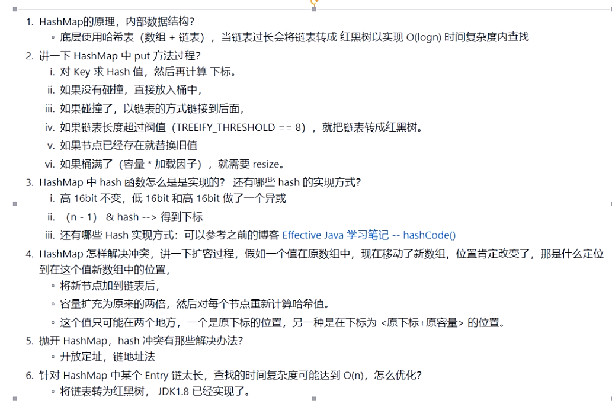


# 二、框架

# 2.1 Spring AOP自调用问题

# 2.2 Spring bean生命周期管理

在Spring中，组成应用程序的主体及由Spring IoC容器所管理的对象，被称为Bean。

Spring IoC容器管理的对象，其生命周期完全由容器控制。

Spring中的bean默认都是单例的


## 1 实例化 Bean

对于`BeanFactory`容器来说，当用户向容器请求一个尚未初始化的 Bean 或初始化 Bean 的时候，如果需要注入另一个尚未初始化的依赖，容器就会调用`createBean`进行实例化；对于`ApplicationContext`容器来说，当容器启动结束后，便实例化所有的 Bean。

容器通过获取`BeanDefinition`对象中的信息进行实例化。并且这一步仅仅是简单的实例化，并未进行依赖注入。 实例化对象被包装在`BeanWrapper`对象中，`BeanWrapper`提供了设置对象属性的接口，从而避免了使用反射机制设置属性。

## 2 设置对象属性（依赖注入）

实例化后的对象被封装在`BeanWrapper`对象中，并且此时对象仍然是一个原生的状态，并没有进行依赖注入。 紧接着，Spring 根据`BeanDefinition`中的信息进行依赖注入，并且通过`BeanWrapper`提供的设置属性的接口完成依赖注入。

## 3 注入 Aware 接口

紧接着，Spring 会检测该对象是否实现了`xxxAware`接口，并将相关的`xxxAware`实例注入给 Bean：

- 如果 Bean 实现了`BeanNameAware`接口，Spring 将 Bean 的 ID 传递给`setBeanName()`方法。实现`BeanNameAware`主要是为了通过 Bean 的引用来获得 Bean 的 ID，一般业务中是很少有用到 Bean 的 ID 的。
- 如果 Bean 实现了`BeanFactoryAware`接口，Spring 将调用`setBeanDactory(BeanFactory bf)`方法并把`BeanFactory`容器实例作为参数传入。实现`BeanFactoryAware`主要目的是为了获取 Spring 容器，如 Bean 通过 Spring 容器发布事件等。
- 如果 Bean 实现了`ApplicationContextAware`接口，Spring 容器将调用`setApplicationContext(ApplicationContext ctx)`方法，把应用上下文作为参数传入，作用与`BeanFactory`类似都是为了获取 Spring 容器，不同的是 Spring 容器在调用`setApplicationContext`方法时会把它自己作为`setApplicationContext`的参数传入，而 Spring 容器在调用`setBeanDactory`前需要程序员自己指定（注入）`setBeanDactory`里的参数`BeanFactory`。

## 4 BeanPostProcessor

当经过上述几个步骤后，Bean 对象已经被正确构造，但如果你想要对象被使用前再进行一些自定义的处理，就可以通过`BeanPostProcessor`接口实现。 该接口提供了两个函数：

- `postProcessBeforeInitialzation(Object bean, String beanName)`当前正在初始化的 Bean 对象会被传递进来，我们就可以对这个 Bean 作任何处理。这个函数会先于`InitialzationBean`执行，因此称为前置处理。 所有`Aware`接口的注入就是在这一步完成的。
- `postProcessAfterInitialzation(Object bean, String beanName)`当前正在初始化的 Bean 对象会被传递进来，我们就可以对这个 Bean 作任何处理。这个函数会在`InitialzationBean`完成后执行，因此称为后置处理。

## 5 InitializingBean 与 init-method

当`BeanPostProcessor`的前置处理完成后就会进入本阶段。 `InitializingBean`接口只有一个函数：

- `afterPropertiesSet()`

这一阶段也可以在 Bean 正式构造完成前增加我们自定义的逻辑，但它与前置处理不同，由于该函数并不会把当前 Bean 对象传进来，因此在这一步没办法处理对象本身，只能增加一些额外的逻辑。 若要使用它，我们需要让 Bean 实现该接口，并把要增加的逻辑写在该函数中。然后，Spring 会在前置处理完成后检测当前 Bean 是否实现了该接口，并执行`afterPropertiesSet`函数。

当然，Spring 为了降低对客户代码的侵入性，给 Bean 的配置提供了`init-method`属性，该属性指定了在这一阶段需要执行的函数名。Spring 便会在初始化阶段执行我们设置的函数。`init-method`本质上仍然使用了`InitializingBean`接口。

## 6 DisposableBean 和 destroy-method

如果 Bean 实现了`DispostbleBean`接口，Spring 将调用它的`destory`方法，作用与在配置文件中对 Bean 使用`destory-method`属性的作用一样，都是在 Bean 实例销毁前执行的方法。

至此，Spring 中 Bean 的经历了从创建到消耗的整个生命周期的过程。

# 三、数据库

# 3.1 索引

| 分类角度 | 索引名称                                           |
| :------- | -------------------------------------------------- |
| 数据结构 | B+树、Hash索引、R-Tree等                           |
| 存储层面 | 聚簇索引、非聚簇索引                               |
| 逻辑层面 | 主键索引、普通索引、复合索引、唯一索引、空间索引等 |

## 3.1.1 主键索引和非主键索引（二级索引）区别

对于主键，关系数据库会自动创建主键索引，主键索引效率最高，因为主键保证绝对唯一。

非主键索引的叶子节点存放的是**主键的值**，而主键索引的叶子节点存放的是**整行数据**。

（二级索引：非主键索引也被称为**二级索引**，建立各列值与行键之间的映射关系）

## 3.1.2 聚簇索引 非聚簇索引

**区别：叶节点是否存放一整行记录**

InnoDB 主键使用的是聚簇索引，MyISAM 不管是主键索引，还是二级索引使用的都是非聚簇索引。

**聚簇索引表：在聚簇索引表中，主键索引的叶节点存储行数据（包括主键值），二级索引的叶结点存储行的主键值**。使用的是**B+树作为索引的存储结构**，非叶子节点都是索引关键字，但非叶子节点中的关键字中不存储对应记录的具体内容或内容地址。**叶子节点上的数据是主键与具体记录(数据内容)**。

**非聚簇索引表：表数据和索引是分成两部分存储的，主键索引和二级索引存储上没有任何区别**。使用的是**B+树作为索引的存储结构**，所有的节点都是索引，**叶子节点存储的是索引+索引对应的记录的数据**。


## 3.1.3 聚簇索引优缺点

**优点**

1.当你需要取出一定范围内的数据时，用聚簇索引也比用非聚簇索引好。

2.当通过聚簇索引查找目标数据时理论上比非聚簇索引要快，因为非聚簇索引定位到对应主键时还要多一次目标记录寻址,即多一次I/O。

3.使用覆盖索引扫描的查询可以直接使用页节点中的主键值。

**缺点**

1.**插入速度严重依赖于插入顺序**，按照主键的顺序插入是最快的方式，否则将会出现页分裂，严重影响性能。因此，对于InnoDB表，我们一般都会定义一个自增的ID列为主键。

2.**更新主键的代价很高，因为将会导致被更新的行移动**。因此，对于InnoDB表，我们一般定义主键为不可更新。

3.**二级索引访问需要两次索引查找，第一次找到主键值，第二次根据主键值找到行数据。**

二级索引的叶节点存储的是主键值，而不是行指针（非聚簇索引存储的是指针或者说是地址），这是为了减少当出现行移动或数据页分裂时二级索引的维护工作，但会让二级索引占用更多的空间。

4.**采用聚簇索引插入新值比采用非聚簇索引插入新值的速度要慢很多**，因为插入要保证主键不能重复，判断主键不能重复，采用的方式在不同的索引下面会有很大的性能差距，聚簇索引遍历所有的叶子节点，非聚簇索引也判断所有的叶子节点，但是聚簇索引的叶子节点除了带有主键还有记录值，记录的大小往往比主键要大的多。这样就会导致聚簇索引在判定新记录携带的主键是否重复时进行昂贵的I/O代价。

## 3.1.4 索引创建规则

1. 表的主键、外键必须有索引；
2. 数据量超过300的表应该有索引；
3. 经常与其他表进行连接的表，在连接字段上应该建立索引；
4. 经常出现在where子句中的字段，特别是大表的字段，应该建立索引；
5. 索引应该建在选择性高的字段上；
6. 索引应该建在小字段上，对于大的文本字段甚至超长字段，不要建索引；
7. 复合索引的建立需要进行仔细分析，尽量考虑用单字段索引代替；
8. 频繁进行数据操作的表，不要建立太多的索引；
9. 删除无用的索引，避免对执行计划造成负面影响；

## 3.1.5 索引优缺点

**优点：**

1. **创建唯一性索引，保证数据库表中每一行数据的唯一性**
2. **加快数据的检索速度**，这也是创建索引的最主要的原因
3. **加速表和表之间的连接**，特别是在实现数据的参考完整性方面特别有意义。
4. **在使用分组和排序子句进行数据检索时，同样可以显著减少查询中分组和排序的时间。**

**缺点：**

1. 创建索引和维护索引要耗费时间，这种时间随着数据量的增加而增加
2. 索引需要**占用物理空间**，除了数据表占数据空间之外，每一个索引还要占一定的物理空间，如果要建立聚簇索引，那么需要的空间就会更大
3. **性能损失**，当对表中的数据进行增加、删除和修改的时候，索引也要动态的维护，降低了数据的维护速度

# 3.2 优化

## 数据库优化

1. 选取最适应的字段属性，字段的宽度设置的尽可能小，尽量将字段设置为not null
2. 使用连接（join）来代替子查询
3. 使用事务进行数据库连续操作，例如：```start transaction; xxxxx; xxxxx; commit;```
4. 创建索引、复合索引、使用短索引
5. 不要在列上进行运算（将会在每个列上进行运算，全表扫描）
6. 不使用not in和<> 操作（因为会进行全表扫描）
7. 避免在where子句中使用or来连接条件，将会导致全表扫描

# 3.3 数据库锁的分类（粒度、级别）


# 3.4 B+树

https://blog.csdn.net/xlgen157387/article/details/79450295

## 二叉查找树 Binary Search Tree, BST

**二叉查找树，有序二叉查找树**，满足二叉查找树的一般性质，是指一棵空树具有如下性质：

1. 任意节点左子树不为空，则左子树的值均小于根节点的值；

2. 任意节点右子树不为空，则右子树的值均大于于根节点的值；

3. 任意节点的左右子树也分别是二叉查找树；

4. 没有键值相等的节点；

   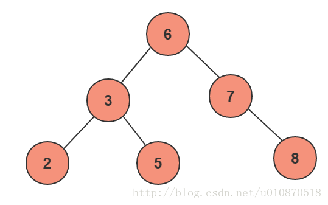

上图为一个普通的二叉查找树，按照中序遍历的方式可以从小到大的顺序排序输出：2、3、5、6、7、8。

对上述二叉树进行查找，如查键值为5的记录，先找到根，其键值是6，6大于5，因此查找6的左子树，找到3；而5大于3，再找其右子树；一共找了3次。如果按2、3、5、6、7、8的顺序来找同样需求3次。用同样的方法在查找键值为8的这个记录，这次用了3次查找，而顺序查找需要6次。计算平均查找次数得：顺序查找的平均查找次数为（1+2+3+4+5+6）/ 6 = 3.3次，二叉查找树的平均查找次数为（3+3+3+2+2+1）/6=2.3次。二叉查找树的平均查找速度比顺序查找来得更快。

**局限性及应用**

一个二叉查找树是由n个节点随机构成，所以，**对于某些情况，二叉查找树会退化成一个有n个节点的线性链**。如下图：

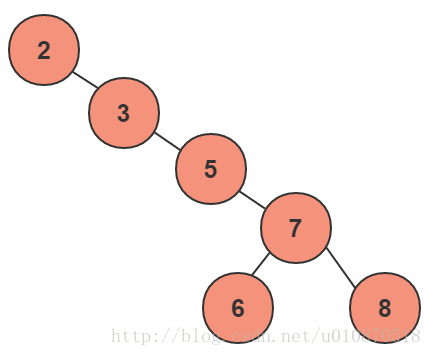

大家看上图，如果我们的根节点选择是最小或者最大的数，那么二叉查找树就完全退化成了线性结构。上图中的平均查找次数为（1+2+3+4+5+5）/6=3.16次，和顺序查找差不多。显然这个二叉树的查询效率就很低，因此若想最大性能的构造一个二叉查找树，需要这个二叉树是平衡的（这里的平衡从一个显著的特点可以看出这一棵树的高度比上一个输的高度要大，在相同节点的情况下也就是不平衡），从而引出了一个新的定义-平衡二叉树AVL。

## AVL树

**AVL树 带有平衡条件的二叉查找树**

**AVL树是带有平衡条件的二叉查找树**，一般是用**平衡因子差值判断是否平衡并通过旋转来实现平衡，左右子树树高不超过1**，和红黑树相比，它是**严格的平衡二叉树，平衡条件必须满足（所有节点的左右子树高度差不超过1）**。不管我们是执行插入还是删除操作，只要不满足上面的条件，就要通过旋转来保持平衡，而旋转是非常耗时的，由此我们可以知道**AVL树适合用于插入删除次数比较少，但查找多的情况**。

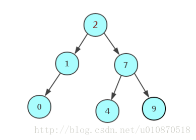

**局限性**

由于维护这种高度平衡所付出的代价比从中获得的效率收益还大，故而实际的应用不多，更多的地方是用追求局部而不是非常严格整体平衡的红黑树。当然，如果应用场景中对插入删除不频繁，只是对查找要求较高，那么AVL还是较优于红黑树。

## 红黑树

**一种二叉查找树，但在每个节点增加一个存储位表示节点的颜色，可以是red或black**。通过对任何一条从根到叶子的路径上各个节点着色的方式的限制，红黑树确保没有一条路径会比其它路径长出两倍。它是**一种弱平衡二叉树**（由于是弱平衡，可以推出，相同的节点情况下，AVL树的高度低于红黑树），相对于要求严格的AVL树来说，它的旋转次数变少，所以对于搜索、插入、删除操作多的情况下，我们就用红黑树。

**性质**

1. 每个节点只有两种颜色：红或黑；
2. 根节点是黑的，每个叶节点(叶节点即树尾端NULL指针或NULL节点)都是黑的；
3. 如果一个节点是红的,那么它的两儿子结点都是黑的；
4. **对于任意节点而言，其到叶子点树NULL指针的每条路径都包含相同数目的黑节点；**
5. 每条路径都包含相同的黑节点；

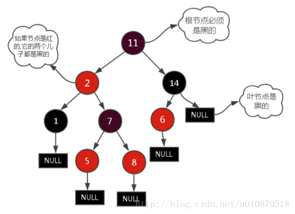

## B/B+树

**B树**

为什么B类树可以进行优化磁盘读取速度呢？根据B类树的特点，构造一个多阶的B类树，然后在尽量多的在结点上存储相关的信息，保证层数尽量的少，以便后面我们可以更快的找到信息，磁盘的I/O操作也少一些，而且**B类树是平衡树，每个结点到叶子结点的高度都是相同**，这也保证了每个查询是稳定的。

总的来说，B/B+树是为了磁盘或其它存储设备而设计的一种**平衡多路查找树**(相对于二叉，B树每个内节点有多个分支)，与红黑树相比，在相同的的节点的情况下，一颗B/B+树的高度远远小于红黑树的高度(在下面B/B+树的性能分析中会提到)。B/B+树上操作的时间通常由存取磁盘的时间和CPU计算时间这两部分构成，而CPU的速度非常快，所以B树的操作效率取决于访问磁盘的次数，关键字总数相同的情况下B树的高度越小，磁盘I/O所花的时间越少。

**注意B-树就是B树，-只是一个符号。**

**B树的性质**

1. 定义任意非叶子结点最多只有M个儿子，且M>2；
2. 根结点的儿子数为[2, M]；
3. 除根结点以外的非叶子结点的儿子数为[M/2, M]；
4. 每个结点存放至少M/2-1（取上整）和至多M-1个关键字；（至少2个关键字）
5. 非叶子结点的关键字个数=指向儿子的指针个数-1；
6. 非叶子结点的关键字：K[1], K[2], …, K[M-1]；且K[i] < K[i+1]；
7. 非叶子结点的指针：P[1], P[2], …, P[M]；其中P[1]指向关键字小于K[1]的子树，P[M]指向关键字大于K[M-1]的子树，其它P[i]指向关键字属于(K[i-1], K[i])的子树；
8. 所有叶子结点位于同一层；

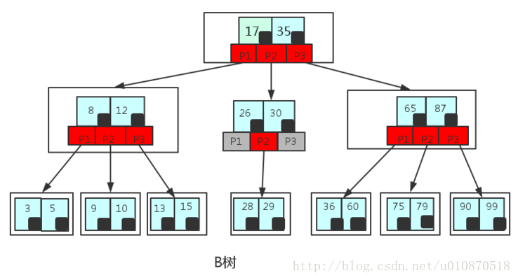

这里只是一个简单的B树，在实际中B树节点中关键字很多的，上面的图中比如35节点，35代表一个key(索引)，而小黑块代表的是这个key所指向的内容在内存中实际的存储位置，是一个指针。

## B+树

**B+树是应文件系统所需而产生的一种B树的变形树（文件的目录一级一级索引，只有最底层的叶子节点（文件）保存数据）非叶子节点只保存索引，不保存实际的数据，数据都保存在叶子节点中**。

**B+树的性质(下面提到的都是和B树不相同的性质)**

1、非叶子节点的子树指针与关键字个数相同；
2、非叶子节点的子树指针p[i]，指向关键字值属于[k[i],k[i+1]]的子树。(B树是开区间,也就是说B树不允许关键字重复,B+树允许重复)；
3、为所有叶子节点增加一个链指针；
4、所有关键字都在叶子节点出现(稠密索引)。 (且链表中的关键字恰好是有序的)；
5、非叶子节点相当于是叶子节点的索引(稀疏索引)，叶子节点相当于是存储(关键字)数据的数据层；

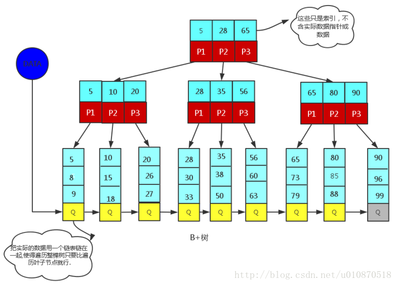

非叶子节点（比如5，28，65）只是一个key（索引），实际的数据存在叶子节点上（5，8，9）才是真正的数据或指向真实数据的指针。

**应用**

1、B和B+树主要用在文件系统以及数据库做索引，比如MySQL；

## B/B+树性能分析

n个节点的平衡二叉树的高度为H(即logn)，而n个节点的B/B+树的高度为logt((n+1)/2)+1；
　
若要作为内存中的查找表，B树却不一定比平衡二叉树好，尤其当m较大时更是如此。因为查找操作CPU的时间在B-树上是O(mlogtn)=O(lgn(m/lgt))，而m/lgt>1；所以m较大时O(mlogtn)比平衡二叉树的操作时间大得多。因此在内存中使用B树必须取较小的m。（通常取最小值m=3，此时B-树中每个内部结点可以有2或3个孩子，这种3阶的B-树称为2-3树）。

## 为什么说B+树比B树更适合数据库索引？

1.  **B+树的磁盘读写代价更低**：B+树的内部节点并没有指向关键字具体信息的指针，因此其内部节点相对B树更小，如果把所有同一内部节点的关键字存放在同一盘块中，那么盘块所能容纳的关键字数量也越多，一次性读入内存的需要查找的关键字也就越多，相对IO读写次数就降低了。
2. **B+树的查询效率更加稳定**：由于非终结点并不是最终指向文件内容的结点，而只是叶子结点中关键字的索引。所以任何关键字的查找必须走一条从根结点到叶子结点的路。所有关键字查询的路径长度相同，导致每一个数据的查询效率相当。
3. 由于B+树的数据都存储在叶子结点中，分支结点均为索引，方便扫库，只需要扫一遍叶子结点即可，但是B树因为其分支结点同样存储着数据，我们要找到具体的数据，需要进行一次中序遍历按序来扫，所以B+树更加适合在区间查询的情况，所以通常B+树用于数据库索引。

PS：我在知乎上看到有人是这样说的,我感觉说的也挺有道理的：

他们认为**数据库索引采用B+树的主要原因是：B树在提高了IO性能的同时并没有解决元素遍历的效率低下的问题，正是为了解决这个问题，B+树应用而生。B+树只需要去遍历叶子节点就可以实现整棵树的遍历。而且在数据库中基于范围的查询是非常频繁的，而B树不支持这样的操作或者说效率太低。**

# 3.5 视图

虚拟存在的表，逻辑表，本身不包含数据，作为一个select语句保存在数据字典中。通过视图可以展现基表（base table 基表：用来创建视图的表）的部分数据，视图数据来自定义视图的查询中使用的表，使用试图动态生成。

## 3.5.1 视图优点

- 简单：使用视图的用户完全不需要关心后面对应的表的结构、关联条件和筛选条件，对用户来说已经是过滤好的复合条件的结果集。
- 安全：使用视图的用户只能访问他们被允许查询的结果集，对表的权限管理并不能限制到某个行某个列，但是通过视图就可以简单的实现。
- 数据独立：一旦视图的结构确定了，可以屏蔽表结构变化对用户的影响，源表增加列对视图没有影响；源表修改列名，则可以通过修改视图来解决，不会造成对访问者的影响。

## 3.5.2 视图创建 查看 更改

```mysql
create [or replace][algorithm={UNDIFINDED | MERGE | TEMPTABLE}]
view view_name [(column_names)]
as select_statement
[WITH [CASCADED | LOCAL] CHECK OPTION]
```

1. or replace :表示替换已有视图

2. algorithm：表示视图选择算法，默认算法是undefined，merger合并，template临时表

3. select_statement：表示select语句

4. [WITH [CASCADED | LOCAL] CHECK OPTION]：表示视图在更新时保证在视图的权限范围之内

   cascade是默认值，表示更新视图的时候，要满足视图和表的相关条件

   local表示更新视图的时候，要满足该视图定义的一个条件即可

   TIPS：推荐使用WHIT [CASCADED|LOCAL] CHECK OPTION选项，可以保证数据的安全性

### 查看视图

```mysql
show create view V_F_player;
```

### 视图更改

create or replace view 语句修改视图

```mysql
create or replace view view_name as select 语句;
```

alter语句修改视图

```mysql
ALTER
    [ALGORITHM = {UNDEFINED | MERGE | TEMPTABLE}]
    [DEFINER = { user | CURRENT_USER }]
    [SQL SECURITY { DEFINER | INVOKER }]
VIEW view_name [(column_list)]
AS select_statement
    [WITH [CASCADED | LOCAL] CHECK OPTION]
```

修改视图是指修改数据库中已存在的表的定义，当基表的某些字段发生改变时，可以通过修改视图来保持视图和基本表之间一致

### 视图删除

```mysql
drop view [IF EXISTS]
view_name[,view_name]...
```

# 3.6 事务级别

## 3.6.1 事务并发可能产生的情况

- 脏读（Dirty Read）：一个事务读到了另一个未提交事务修改过的数据
- 不可重复读（Non-Repeatable Read）：(强调数据的修改）一个事务只能读到另一个已经提交的事务修改过的数据，并且其他事务每对该数据进行一次修改并提交后，该事务都能查询得到最新值。
- 幻读（Phantom）：（强调数据条数的变化，新增或删除）一个事务先根据某些条件查询出一些记录，之后另一个事务又向表中插入了符合这些条件的记录，原先的事务再次按照该条件查询时，能把另一个事务插入的记录也读出来。（幻读在读未提交、读已提交、可重复读隔离级别都可能会出现）
- 丢失更新：两个事务同时读取同一条记录，A先修改记录，B也修改记录（B是不知道A修改过），B提交数据后B的修改结果覆盖了A的修改结果。

## 3.6.2 事务的隔离级别

**四种隔离级别**：**读未提交、读已提交、可重复读、可串行化。**

| **隔离级别**              | **脏读** | **丢失更新** | **不可重复读** | **幻读** | **并发模型** | **更新冲突检测** |
| ------------------------- | -------- | ------------ | -------------- | -------- | ------------ | ---------------- |
| 未提交读：Read Uncommited | 是       | 是           | 是             | 是       | 悲观         | 否               |
| 已提交读：Read commited   | 否       | 是           | 是             | 是       | 悲观         | 否               |
| 可重复读：Repeatable Read | 否       | 否           | 否             | 是       | 悲观         | 否               |
| 可串行读：Serializable    | 否       | 否           | 否             | 否       | 悲观         | 否               |

1. **读未提交：隔离界别最低，允许脏读。在读取数据时不会检查或使用任何锁。（产生脏读、丢失更新、不可重复读、幻读）**一个事务正在处理某一个数据，对其进行操作，但是同时没有提交事务，允许另一个事务进行访问。也就是说一个事务可以访问另一个事务正在处理的数据。
2. **读已提交**：**只读取提交的数据并等待其他事务释放排他锁。(解决脏读，不能解决丢失更新、不可重复读、幻读）**只能读取别人提交后的值，事务进行的中间值不会读取到
3. **可重复读**：**会保持共享锁直至事务结束。（不能解决幻读）**事务处理过程中多次读取同一个数据的时候，这个值不会发生改变，其值都和第一次查询到的数据是一致的
4. **可串行化**：**不仅会锁定所影响的数据，而且锁定范围**。是最严格的隔离级别，要求所有的事务都被串行执行，即事务只能一个接一个的进行处理，不能并发执行

# 3.7 ACID

**原子性（Atomicity）、一致性（Consistency）、隔离性（Isolation）、持久性（Durability）**

**原子性**：操作必须全部完成或者不完成，不允许只执行一半。

**一致性**：最终目标是一致性，确保数据库从一个状态成功转换为另一个状态。事务开始之前和事务结束之后，数据库的完整性约束没有被破坏。数据库事务不能破坏数据的完整性和义务逻辑上的一致性。

**隔离性**：线程安全，在并发事务下，多个事务都有自己的事务空间，相互独立不干扰。一个事务中是感觉不到其他并发事务的存在。

**持久性**：当事务完成后，该事务对数据库所作的更改便持久的保存在数据库中，并不会被回滚，事务一旦被提交，则持久化保存在数据库中。当进行硬盘修改的时候，发生宕机、停电，根据日志进行数据的回滚。

# 3.8 左/右/全连接

## 3.8.1 内连接

内连接：只返回满足连接条件的数据。

### inner join 或join 等值连接或者内连接

只返回两个表中连接字段相等的行（达到匹配条件的行）。	JOIN: 如果表中有至少一个匹配，则返回行

```mysql
select empno,ename,sal,dname,loc from emp,dept
where emp.deptno=dept.deptno;  --(Oracle 8i 及以前的写法)
 
select empno,ename,job,sal,dept.deptno,dname,loc
from emp join dept on emp.deptno=dept.deptno; -- (SQL 99的写法)
```

## 3.8.2 外连接

外连接：除了**返回满足连接条件的行以外，还返回左（右）表中，不满足条件的行**，称为左（右）连接

### left join 左连接

返回包括**左表中的所有记录和右表中连接字段相等的记录**。    

left join: 即使右表中没有匹配，也从左表返回所有的行（左表中的所有行都存在）

### right join 右连接

返回包括**右表中的所有记录和左表中连接字段相等的记录**。	

right join: 即使左表中没有匹配，也从右表返回所有的行（右表中的所有行都存在）

### full join 全外连接

返回**左右表中所有的记录和左右表中连接字段相等的记录**。	

full join: 只要其中一个表中存在匹配，就返回行 

# 3.9 具体操作示例

## 3.9.1 统计60分以上每一个分数有多少人

**表结构**student_info

| id   | name | profession | score |
| ---- | ---- | ---------- | ----- |
| id   | 姓名 | 专业       | 分数  |

**按分数段统计**

```mysql
select 
count(case when score between 60 and 70 then 1 end) as 60-70,
count(case when score between 70 and 80 then 1 end) as 70-80,
count(case when score between 80 and 90 then 1 end) as 80-90,
count(case when score between 90 and 100 then 1 end) as 90-100
from student_info;
```

**按分数段和专业统计**

```mysql
select 
count(case when score between 60 and 70 then 1 end) as 60-70,
count(case when score between 70 and 80 then 1 end) as 70-80,
count(case when score between 80 and 90 then 1 end) as 80-90,
count(case when score between 90 and 100 then 1 end) as 90-100
from student_info
group by profession;
```

## 3.9.2 mysql表新添加一列

在这个表增加一列。当然可以新建表建立联系满足需求。但就仅新增一列这个问题，可以有以下操作：

```sql
ALTER ...  ADD COLUMN .... 
```

**在表的最后一列增加新的一列**

```sql
ALTER TABLE `tbname`
	ADD COLUMN `state` TINYINT(2) NOT NULL DEFAULT '0' COMMENT '0为添加1为编辑' 
```

**在指定的位置增加新的一列**

```sql
ALTER TABLE `tbname`
	ADD COLUMN `state` TINYINT(2) NOT NULL DEFAULT '0' COMMENT '0为添加1为编辑' AFTER `column_name`;
```

**在第一列增加新的一列**

```sql
ALTER TABLE `tbname`
	ADD COLUMN `state` TINYINT(2) NOT NULL DEFAULT '0' COMMENT '0为添加1为编辑' FIRST;
```

# 3.10 Mysql数据库连接池

##  概念

数据库连接池（Connection pooling）是程序启动时建立足够的数据库连接，并将这些连接组成一个连接池，由程序动态地对池中的连接进行申请，使用，释放。

## 传统的连接机制和数据库连接池运行机制

传统统链接:   一般来说，Java应用程序访问数据库的过程是：

1. 装载数据库驱动程序；
2. 通过JDBC建立数据库连接；
3. 访问数据库，执行SQL语句；
4. 断开数据库连接。

数据库连接池的机制：

1. 程序初始化时创建连接池
2. 使用时向连接池申请可用连接
3. 使用完毕，将连接返还给连接池
4.  程序退出时，断开所有连接，并释放资源

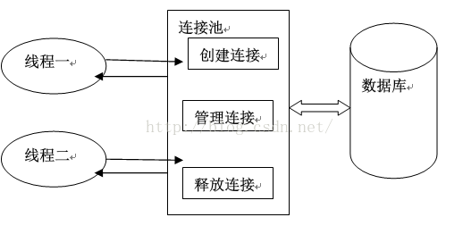

**数据库连接池负责分配,管理和释放数据库连接,它允许应用程序重复使用一个现有的数据库连接,而不是重新建立一个**。

数据库连接池在初始化时将创建一定数量的数据库连接放到连接池中, 这些数据库连接的数量是由**最小数据库连接数**来设定的.无论这些数据库连接是否被使用,连接池都将一直保证至少拥有这么多的连接数量.连接池的**最大数据库连接数量**限定了这个连接池能占有的最大连接数,当应用程序向连接池请求的连接数超过最大连接数量时,这些请求将被加入到等待队列中.

**DB连接池必须要确保某一时间内一个 conn 只能分配给一个线程。不同 conn 的事务是相互独立的。** （不同两个线程共用一个连接Connection对象）

##  连接池的优势

1. 减少创建连接的时间。连接池中的连接是已准备好的、可重复使用的，获取后可以直接访问数据库，因此减少了连接创建的次数和时间。
2. 简化编程模式。当使用连接池时，每一个单独的线程能够像创建一个自己的JDBC连接一样操作，允许用户直接使用JDBC编程技术。
3. 控制资源的使用。如果不使用连接池，每次访问数据库都需要创建一个连接，这样系统的稳定性受系统连接需求影响很大，很容易产生资源浪费和高负载异常。连接池能够使性能最大化，将资源利用控制在一定的水平之下。连接池能控制池中的连接数量，增强了系统在大量用户应用时的稳定性。

## 工作原理

工作原理主要由三部分组成，分别为**连接池的建立**、**连接池中连接的使用管理**、**连接池的关闭**。

第一、连接池的建立。一般在系统初始化时，连接池会根据系统配置建立，并在池中创建了几个连接对象，以便使用时能从连接池中获取。连接池中的连接不能随意创建和关闭，这样避免了连接随意建立和关闭造成的系统开销。Java中提供了很多容器类可以方便的构建连接池，例如Vector、Stack等。

第二、连接池的管理。连接池管理策略是连接池机制的核心，连接池内连接的分配和释放对系统的性能有很大的影响。其管理策略是：

- 当客户请求数据库连接时，首先查看连接池中是否有空闲连接，如果存在空闲连接，则将连接分配给客户使用；如果没有空闲连接，则查看当前所开的连接数是否已经达到最大连接数，如果没达到就重新创建一个连接给请求的客户；如果达到就按设定的最大等待时间进行等待，如果超出最大等待时间，则抛出异常给客户。

- 当客户释放数据库连接时，先判断该连接的引用次数是否超过了规定值，如果超过就从连接池中删除该连接，否则保留为其他客户服务。

  该策略保证了数据库连接的有效复用，避免频繁的建立、释放连接所带来的系统资源开销。

第三、连接池的关闭。当应用程序退出时，关闭连接池中所有的连接，释放连接池相关的资源，该过程正好与创建相反。

# 3.11 数据库锁


# 四、操作系统

# 4.1 死锁

死锁是指多个进程在运行过程中，因为争夺资源而造成的一种僵局，如果没有外力推进，处于僵局中的进程就无法继续执行。

## 死锁原因

1. **竞争资源**：请求同一有限资源的进程数多于可用资源数
2. **进程推进顺序非法**：进程执行中，请求和释放资源顺序不合理，如资源等待链
3. **资源分配不当**：

## 死锁产生的必要条件

1. **互斥条件**：进程对所分配的资源进行排他性的使用（一个资源每次只能被一个进程使用）
2. **请求和保持条件**：进程被阻塞的时候并不释放所申请到的资源
3. **不可剥夺条件**：进程对于已经申请到的资源在使用完成之前，不可以被剥夺
4. **环路等待条件**：发生死锁的进程之间存在的一个 进程-资源 环形等待链

## 死锁的处理

**预防死锁**：破坏产生死锁的4个必要条件中的一个或者多个；实现起来比较简单，但是如果限制过于严格会降低系统资源利用率以及吞吐量
**避免死锁**：在资源的动态分配中，防止系统进入不安全状态(可能产生死锁的状态)-如**银行家算法（避免死锁）**
**检测死锁**：允许系统运行过程中产生死锁，在死锁发生之后，采用一定的算法进行检测，并确定与死锁相关的资源和进程，采取相关方法清除检测到的死锁。实现难度大
**解除死锁**：与死锁检测配合，将系统从死锁中解脱出来（撤销进程或者剥夺资源）。对检测到的和死锁相关的进程以及资源，通过撤销或者挂起的方式，释放一些资源并将其分配给处于阻塞状态的进程，使其转变为就绪态。实现难度大。

**补充：银行家算法**

当一个进程申请使用资源的时候，银行家算法通过先 **试探** 分配给该进程资源，然后通过安全性算法判断分配后的系统是否处于安全状态，若不安全则试探分配作废，让该进程继续等待。


- 首先是银行家算法中的**进程**：包含进程Pi的需求资源数量（最大需求资源数量MAX），已分配给该进程的资源A（Allocation），还需要的资源数量N（Need=M-A）
- Available为空闲资源数量，即资源池（注意：资源池的剩余资源数量+已分配给所有进程的资源数量=系统中的资源总量）

假设资源P1申请资源，银行家算法先**试探**的分配给它（当然先要看看当前资源池中的资源数量够不够），若申请的资源数量小于等于Available，然后接着判断分配给P1后剩余的资源，能不能使进程队列的某个进程执行完毕，若没有进程可执行完毕，则系统处于不安全状态（即此时没有一个进程能够完成并释放资源，随时间推移，系统终将处于死锁状态）。

若有进程可执行完毕，则假设回收已分配给它的资源（剩余资源数量增加），把这个进程标记为可完成，并继续判断队列中的其它进程，**若所有进程都可执行完毕，则系统处于安全状态，并根据可完成进程的分配顺序生成安全序列**（如{P0，P3，P2，P1}表示将申请后的剩余资源Work先分配给P0–>回收（Work+已分配给P0的A0=Work）–>分配给P3–>回收（Work+A3=Work）–>分配给P2–>······满足所有进程）。

如此就可避免系统存在潜在死锁的风险。

## 死锁 活锁 饥饿锁 

- https://blog.csdn.net/universsky2015/article/details/106276609

1. **死锁**

   是指两个或两个以上的进程（或线程）在执行过程中，因争夺资源而造成的一种互相等待的现象，若无外力作用，它们都将无法推进下去。此时称系统处于死锁状态或系统产生了死锁，这些永远在互相等待的进程称为死锁进程。

2. **活锁**

   多线程中出现了相互谦让，都主动将资源释放给别的线程使用，这样资源在多个线程之间跳动而又得不到执行，形成活锁。活锁不会被阻塞，而是不停检测一个永远不可能为真的条件。除去进程本身持有的资源外，活锁状态的进程会持续耗费宝贵的CPU时间。

3. **饥饿锁**

   一个或者多个线程因为种种原因无法获得所需要的资源，导致一直无法执行的状态。多线程中优先级高的会优先执行，并且抢占优先级低的资源，导致优先级低的线程无法得到执行。

**区别**

1. **活锁与死锁的区别：**活锁和死锁类似，不同之处在于处于活锁的线程或进程的状态是一直在不断改变的，活锁不会被阻塞，而是不停检测一个永远不可能为真的条件。除去进程本身持有的资源外，活锁状态的进程会持续耗费宝贵的[CPU时间](https://www.baidu.com/s?wd=CPU时间&tn=SE_PcZhidaonwhc_ngpagmjz&rsv_dl=gh_pc_zhidao)。活锁可以认为是一种特殊的饥饿。一个现实的活锁例子是两个人在狭小的走廊碰到，两个人都试着避让对方好让彼此通过，但是因为避让的方向都一样导致最后谁都不能通过走廊。简单的说就是，<u>活锁和死锁的主要区别是前者进程的状态可以改变但是却不能继续执行。</u>
2. **死锁活锁与饥饿的区别：**进程会处于饥饿状态是因为持续地有其它优先级更高的进程请求相同的资源。不像死锁或者活锁，饥饿能够被解开。例如，当其它高优先级的进程都终止时并且没有更高优先级的进程到达。


# 4.2 线程和进程

## 4.2.1 线程和进程的区别

线程是指进程内的一个执行单元，也是进程内的可调度实体。与进程的区别:

- 调度：线程作为调度和分配的基本单位，进程作为拥有资源的基本单位。

- 并发性：不仅进程之间可以并发执行，同一个进程的多个线程之间也可并发执行。

- 拥有资源：进程是拥有资源的一个独立单位，线程不拥有系统资源，但可以访问隶属于进程的资源.

- 系统开销：在创建或撤消进程时，由于系统都要为之分配和回收资源，导致系统的开销明显大于创建或撤消线程时的开销。

# 4.3 线程同步机制

## 4.3.1 互斥量 Mutex

**本质上是一把锁，在访问共享资源前对互斥量进行加锁，在访问完成后释放互斥量上的锁。**

对互斥量进行加锁以后，任何其它试图再次对互斥量加锁的线程将会被阻塞直到当前线程释放该互斥锁。如果释放互斥锁时有多个线程阻塞，所有在该互斥锁上的阻塞线程都会变成可运行状态，第一个变为运行状态的线程可以对互斥量加锁，其它线程将会看到互斥锁依然被锁住，只能回去再次等待它重新变为可用。在这种情况下，每次只有一个线程可以向前执行。

## 4.3.2 信号量 Semaphore

**它允许多个线程在同一时刻访问同一资源，但是需要限制在同一时刻访问此资源的最大线程数目** .信号量对象对线程的同步方式与前面几种方法不同，信号允许多个线程同时使用共享资源，这与操作系统中的PV 操作相同。它指出了同时访问共享资源的线程最大数目。

**信号量S是一个整数**

- **S>=0时，表示可供并发进程使用的资源实体数**
- **S<0时，表示正在等待使用共享资源的进程数**

P 操作申请资源：

1. S减1；
2.  若S减1 后仍大于等于零，则进程继续执行；
3. 若S减1 后小于零，则该进程被阻塞后进入与该信号相对应的队列中，然后转入进程调度。

V 操作释放资源：

1.  S加1；
2. 如果*S>0*，则该进程继续执行；否则释放队列中第一个等待信号量的进程(S<=0，表明某个进程正在等待该资源，需要唤醒一个等待状态的进程，使之运行下去）。

## 4.3.3 临界区 Ciritical Section

**通过对多线程的串行化来访问公共资源或一段代码，速度快，适合控制数据访问**。**任意时刻只允许一个线程对共享资源进行访问**，如果有多个线程试图访问公共资源，那么在有一个线程进入后，其他试图访问公共资源的线程将被挂起，并一直等到进入临界区的线程离开，临界区在被释放后，其他线程才可以抢占。

## 4.3.4 事件 Event

通过通知操作的方式来保持线程的同步，还可以方便实现对多个线程的优先级比较的操作 .

## 4.3.5 总结

互斥量与临界区的作用非常相似，但**互斥量是可以命名的，可以跨越进程使用**。所以创建互斥量需要的资源更多，所以如果只为了在进程内部是用的话使用临界区会带来速度上的优势并能够减少资源占用量。因为互斥量是跨进程的。互斥量一旦被创建，就可以通过名字打开它。而**临界区(critical section)只能在进程内部各线程间使用**。

**互斥量（Mutex），信号量（Semaphore），事件（Event）都可以被跨越进程使用来进行同步数据操作**

**通过互斥量可以指定资源被独占的方式使用**，但如果有下面一种情况通过互斥量就无法处理，比如现在一位用户购买了一份三个并发访问许可的数据库系统，可以根据用户购买的访问许可数量来决定有多少个线程/进程能同时进行数据库操作，这时候如果利用互斥量就没有办法完成这个要求，信号灯对象可以说是一种资源计数器。

1. 临界区和互斥量都有“线程所有权”的概念，所以它们是不能用来实现线程间的同步的，只能用来实现互斥。
2. 事件和信号量都可以实现线程和进程间的互斥和同步。但是事件和信号量都无法解决遗弃问题。
3. 临界区的效率是最高的，因为它不是内核对象。但是临界区不能跨进程使用。 事件，互斥量，信号量都是内核对象，可以跨进程使用，但相应的效率也会低很多。

## 4.3.6 临界区 互斥量 信号量 事件的区别

- 临界区（Critical Section）：<u>适合一个进程内的多线程</u>访问公共区域或代码段时使用
- 互斥量 (Mutex)：<u>适合不同进程内多线程</u>访问公共区域或代码段时使用，与临界区相似
- 信号量（Semaphore）：与临界区和互斥量不同，可以<u>实现多个线程同时访问公共区域数据。可以跨进程使用</u>。原理与操作系统中PV操作类似，先设置一个访问公共区域的线程最大连接数，每有一个线程访问共享区资源数就减一，直到资源数小于等于零
- 事件（Event）：通过线程间触发事件实现同步互斥

**同步和互斥**：临界区和互斥量都有“线程所有权”的概念，所以它们是不能用来实现线程间的同步的，只能用来实现互斥。原因是由于创建临界区或互斥器的线程可以不用等待LeaveCriticalSection(),SetEvent()就可以无条件进入保护的程序段，因为它拥有这个权利。事件和信号量都可以实现线程和进程间的互斥和同步。

**处理“遗弃”操作**：互斥量可以很好的处理”遗弃“操作。若线程在未释放对象的时候就意外终止的，其它线程可以等待到一个WAIT_ABANDONED_0。但是事件和信号量都不能做到。事件和信号量都无法解决遗弃问题。

**使用效率**：临界区的效率是最高的，因为它不是内核对象，而其它的三个都是核心对象，要借助操作系统来实现，效率相对来说就比较低。但如果要跨进程使用还是要用到互斥器、事件对象和信号量。

# 4.4 进程间通讯方式 

### 管道  有名管道 信号 信号量 共享内存 套接字

1. **管道**：管道是一种半双工的通信方式，**数据只能单向流动，而且只能在具有亲缘关系的进程之间使用**。进程的亲缘关系通常是指父子进程关系。
2. **有名管道（FIFO）**：有名管道也是半双工的通信方式，但是**允许在没有亲缘关系的进程之间使用**，管道是先进先出的通信方式。
3. **信号量**：信号量是一个计数器，可以用来控制多个进程对共享资源的访问。它常作为一种锁机制，防止某进程正在访问共享资源时，其他进程也访问该资源。因此，主要作为进程间以及同一进程内不同线程之间的同步手段。
4. **信号 ( signal )** ：信号是一种比较复杂的通信方式，用于通知接收进程某个事件已经发生。
5. **消息队列**：消息队列是有消息的链表，存放在内核中并由消息队列标识符标识。消息队列克服了信号传递信息少、管道只能承载无格式字节流以及缓冲区大小受限等缺点。
6. **共享内存( shared memory )** ：共享内存就是映射一段能被其他进程所访问的内存，这段共享内存由一个进程创建，但多个进程都可以访问。共享内存是最快的进程间通信(IPC)方式，它是针对其他进程间通信方式运行效率低而专门设计的。它往往与其他通信机制(如信号量) 配合使用，来实现进程间的同步和通信。
7. **套接字( socket )** ：套接字也是一种进程间通信机制，与其他通信机制不同的是，它可用于不同机器间的进程通信。

# 4.5

# 五、多线程

# 5.1 创建线程的方式

三种方式：

1. 实现Runnable接口的run方法
2. 继承Thread类并重写run方法
3. 使用FutureTask方式

## 继承Thread类并重写run方法

***调用start方法线程没有马上执行而是处于就绪状态（获取了除CPU资源外的其他资源）***

**优势**：在run() 方法内获取当前线程直接使用this 就可以了，无须使用Thread.currentThread() 方法； 

**劣势**：是Java 不支持多继承，如果继承了Thread 类，那么就不能再继承其他类；没有相关返回值。

## 实现Runnable接口的run方法

**优势**：可以继承其他类

**劣势**：没有返回值

## 使用FutureTask方式

```java
import java.util.concurrent.Callable;
import java.util.concurrent.ExecutionException;
import java.util.concurrent.FutureTask;

public class ThreadTest {
    //继承Thread类
    public static class MyThread extends Thread{
        @Override
        public void run(){
            System.out.println("I am a child thread");
        }
    }
	
    //继承Runnable接口
    public static class RunnableTask implements Runnable{

        @Override
        public void run() {
            System.out.println("I am a child thread");
        }
    }

    //创建任务，类似于Runnable
    public static class CallerTask implements Callable<String> {
        @Override
        public String call() throws Exception{
            return "hello";
        }
    }

    public static void main(String[] args){
        MyThread myThread=new MyThread();
        myThread.start();

        RunnableTask runnableTask=new RunnableTask();
        new Thread(runnableTask).start();
        new Thread(runnableTask).start();
		
        //创建异步任务
        FutureTask<String> futureTask=new FutureTask<>(new CallerTask());
        //启动线程
        new Thread(futureTask).start();
        try {
            //线程执行完成返回结果
            String result=futureTask.get();
            System.out.println(result);
        }catch (ExecutionException | InterruptedException e){
            e.printStackTrace();
        }
    }
}
```

# 5.2 wait sleep区别

1. 每个对象都有一个锁来控制同步访问，`synchronized`关键字可以和对象的锁交互，来实现同步方法或同步块。`sleep()`方法正在执行的线程主动让出CPU（然后CPU就可以去执行其他任务），在`sleep`指定时间后CPU再回到该线程继续往下执行(注意：**sleep方法只让出了CPU，而并不会释放同步资源锁**！！！)；**wait()方法则是指当前线程让自己暂时退让出同步资源锁，以便其他正在等待该资源的线程得到该资源进而运行，只有调用了notify()方法，之前调用wait()的线程才会解除wait状态，可以去参与竞争同步资源锁，进而得到执行**。（注意：notify的作用相当于叫醒睡着的人，而并不会给他分配任务，就是说notify只是让之前调用wait的线程有权利重新参与线程的调度）；
2. sleep()方法可以在任何地方使用；wait()方法则只能在同步方法或同步块中使用；
3. sleep()是线程线程类（Thread）的方法，调用会暂停此线程指定的时间，但监控依然保持，不会释放对象锁，到时间自动恢复；wait()是Object的方法，调用会放弃对象锁，进入等待队列，待调用notify()/notifyAll()唤醒指定的线程或者所有线程，才会进入锁池，不再次获得对象锁才会进入运行状态

# 5.3 ThreadLocal

**关于创建线程局部变量的类，使用ThreadLocal创建的变量只能被当前线程访问，其他线程无法访问和修改。**

## 5.3.1 创建，支持泛型

```java
ThreadLocal<String> mStringThreadLocal =new ThreadLocal<>();
```

## 5.3.2 set get方法

```java
mStringThreadLocal.set("droy.com");
mStringThreadLocal.get();
```

## 5.3.3 ThreadLocal初始值

设置ThreadLocal的get初始值，需要重写`InitialValue`方法

```java
ThreadLocal<String> mThreadLocal=new ThreadLocal<String>(){
    @Override
    protected String initialValue(){
        return Thread.currentThread().getName();
    }
};
```

## 5.3.4 原理

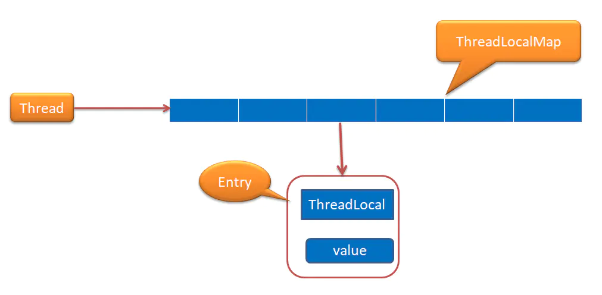

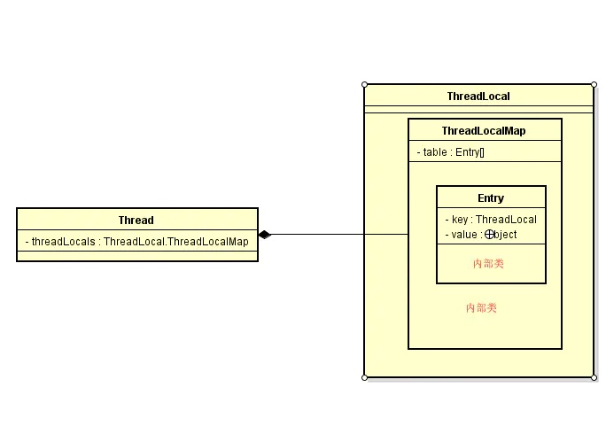

**Thread类中有一个ThreadLocalMap属性，ThreadLocalMap中Entry的key是ThreadLocal对象，value是Object类型**，一个ThreadLocalMap可以有多个ThreadLocal。如图：Thread类源码中有ThreadLocal属性。

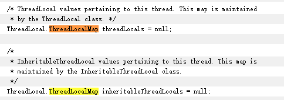

ThreadLocalMap 设计为ThreadLocal 静态内部类。

ThreadLocalMap 是一个线程本地的值，它所有的方法都是private 的，也就意味着除了ThreadLocal 这个类，其他类是不能操作ThreadLocalMap 中的任何方法的，这样就可以对其他类是透明的。同时这个类的权限是包级别的，也就意味着只有同一个包下面的类才能引用ThreadLocalMap 这个类，这也是Thread 为什么可以引用ThreadLocalMap 的原因，因为他们在同一个包下面。

虽然Thread 可以引用ThreadLocalMap，但是不能调用任何ThreadLocalMap 中的方法。这也就是我们平时都是通过ThreadLocal 来获取值和设置值。

**ThreadLocal set方法**

1. 获取当前线程，根据当前线程获取对应的`ThreadLocalMap`
2. 如果对应的`ThreadLocalMap`不为null，则调用其的set方法保存对应关系
3. 如果map为null，就最终调用`ThreadLocalMap`的构造方法创建一个`ThreadLocalMap`并保存对应关系

```java
public void set(T value) {
    Thread t = Thread.currentThread();
    ThreadLocalMap map = getMap(t);
    if (map != null)
        map.set(this, value);
    else
        createMap(t, value);
}
```

```java
ThreadLocalMap getMap(Thread t) {
    return t.threadLocals;
}
```

**ThreadLocal get方法**

1. 获取当前线程，根据当前线程获取对应的`ThreadLocalMap`
2. 在`ThreadLocalMap`当中获取该`ThreadLocal`对象对应的Entry节点，并且返回对应的值
3. 如果获取到的`ThreadLocalMap`为null，则证明还没有初始化，就调用setInitialValue方法
   - 在调用setInitialValue方法的时候，会双重保证，再进行获取一次`ThreadLocalMap`
   - 如果依然为null，就最终调用ThreadLocalMap的构造方法

```java
 public T get() {
        //这里通过获取当前的线程
        Thread t = Thread.currentThread();
        //通过线程来获取ThreadLocalMap ，还记得我们上面说的Thread 里面有一个ThreadLocalMap 属性吗？就是这里用上了
        ThreadLocalMap map = getMap(t);
        if (map != null) {
            ThreadLocalMap.Entry e = map.getEntry(this);
            if (e != null) {
                @SuppressWarnings("unchecked")
                T result = (T)e.value;
                return result;
            }
        }
        return setInitialValue();
    }
```

```java
    ThreadLocalMap getMap(Thread t) {
        return t.threadLocals;
    }
```

## 5.3.4 对象存放在哪里

在Java中，栈内存归属于单个线程，每个线程都会有一个栈内存，其存储的变量只能在其所属线程中可见，即栈内存可以理解成线程的私有内存。而堆内存中的对象对所有线程可见。堆内存中的对象可以被所有线程访问。

**那么是不是说ThreadLocal的实例以及其值存放在栈上呢？**

其实不是，因为ThreadLocal实例实际上也是被其创建的类持有（更顶端应该是被线程持有）。而ThreadLocal的值其实也是被线程实例持有。

**它们都是位于堆上，只是通过一些技巧将可见性修改成了线程可见。**

## 5.3.5 通过inheritableThreadLocal实现多个线程访问ThreadLocal的值

使用`InheritableThreadLocal`可以实现多个线程访问`ThreadLocal`的值。

如下，我们在主线程中创建一个`InheritableThreadLocal`的实例，然后在子线程中得到这个`InheritableThreadLocal`实例设置的值。

## 5.3.6 使用场景

- 实现单个线程单例以及单个线程上下文信息存储，比如交易id等
- 实现线程安全，非线程安全的对象使用ThreadLocal之后就会变得线程安全，因为每个线程都会有一个对应的实例
- 承载一些线程相关的数据，避免在方法中来回传递参数

# 六、Redis


# 七、虚拟机

# 7.1 垃圾分析算法

功能：分析JVM堆上哪些对象是“垃圾”

## 7.1.1 引用计数法

每一个对象都有一个引用计数器，当被引用一次时，它都会 +1，引用取消时 -1，当执行GC时，所有引用计数器为 0 的对象都会被视为“垃圾”。
优点：相对于其他垃圾回收算法，标记清除法实现相对简单。
缺点：当两个对象相互引用时，就会无法被清除。

## 7.1.2 可达性分析算法(主流)

以方法区的静态变量或栈针变量表的变量为Root根节点，通过这个root去找其他下级节点，无法到达的对象在GC中会被清理。

# 7.2 垃圾收集算法

### **标记清除算法**

**标记-清除算法分为标记和清除两个阶段。该算法首先从根集合进行扫描，对存活的对象标记，标记完毕后，再扫描整个空间中未被标记的对象并进行回收**，如下图所示。

　　　　　　　　

　　标记-清除算法的主要不足有两个：

- **效率问题：**标记和清除两个过程的效率都不高;

- **空间问题：**<u>标记-清除算法不需要进行对象的移动，并且仅对不存活的对象进行处理</u>，因此标记清除之后会产生大量不连续的内存碎片，空间碎片太多可能会导致以后在程序运行过程中需要分配较大对象时，无法找到足够的连续内存而不得不提前触发另一次垃圾收集动作。

  　　　　　　　　　　　　

------

### **复制算法**

将内存分为两块，from域和to域，每次只是使用from域，to域空闲着。当from域内存不够，执行GC操作，把from域存活的对象拷贝到to域，直接把from域进行内存清理。

**复制算法将可用内存按容量划分为大小相等的两块，每次只使用其中的一块。当这一块的内存用完了，就将还存活着的对象复制到另外一块上面，然后再把已使用过的内存空间一次清理掉。**<u>这种算法适用于对象存活率低的场景，比如新生代</u>。这样使得每次都是对整个半区进行内存回收，内存分配时也就不用考虑内存碎片等复杂情况，只要移动堆顶指针，按顺序分配内存即可，实现简单，运行高效。该算法示意图如下所示：

　　　　　　　　　　　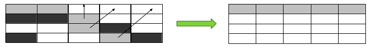


JVM将Heap 内存划分为新生代与老年代，又将新生代划分为Eden(伊甸园) 与2块Survivor Space(幸存者区，From和To两块区域)，然后在Eden –>Survivor Space 以及From Survivor Space 与To Survivor Space 之间实行Copying 算法。 不过jvm在应用coping算法时，并不是把内存按照1:1来划分的，这样太浪费内存空间了。一般的jvm都是8:1。也即是说,Eden区:From区:To区域的比例是8：1：1。

始终有90%的空间是可以用来创建对象的，而剩下的10%用来存放回收后存活的对象。


1. 当Eden区满的时候,会触发第一次young gc,把还活着的对象拷贝到Survivor From区；当Eden区再次触发young gc的时候,会扫描Eden区和From区域,对两个区域进行垃圾回收,经过这次回收后还存活的对象,则直接复制到To区域,并将Eden和From区域清空。
2. 当后续Eden又发生young gc的时候,会对Eden和To区域进行垃圾回收,存活的对象复制到From区域,并将Eden和To区域清空。
3. 可见部分对象会在From和To区域中复制来复制去,如此交换15次(由JVM参数MaxTenuringThreshold决定,这个参数默认是15),最终如果还是存活,就存入到老年代

注意：

```
万一存活对象数量比较多，那么To域的内存可能不够存放，这个时候会借助老年代的空间。
```

**现在商用的虚拟机都采用这种算法来回收新生代。**因为研究发现，新生代中的对象每次回收都基本上只有10%左右的对象存活，所以需要复制的对象很少，效率还不错。正如在博文[《JVM 内存模型概述》](http://blog.csdn.net/justloveyou_/article/details/71189093)中介绍的那样，实践中会将新生代内存分为一块较大的Eden（伊甸园）空间和两块较小的Survivor（幸存者）空间 (如下图所示)，每次使用Eden和其中一块Survivor。当回收时，将Eden和Survivor中还存活着的对象一次地复制到另外一块Survivor空间上，最后清理掉Eden和刚才用过的Survivor空间。HotSpot虚拟机默认Eden和Survivor的大小比例是 8:1，也就是每次新生代中可用内存空间为整个新生代容量的90% ( 80%+10% )，只有10% 的内存会被“浪费”。

　　　　　　　　　　　　　　　　

------

### **标记整理算法**

复制收集算法在对象存活率较高时就要进行较多的复制操作，效率将会变低。更关键的是，如果不想浪费50%的空间，就需要有额外的空间进行分配担保，以应对被使用的内存中所有对象都100%存活的极端情况，所以在老年代一般不能直接选用这种算法。**标记整理算法的标记过程类似标记清除算法，但后续步骤不是直接对可回收对象进行清理，而是让所有存活的对象都向一端移动，然后直接清理掉端边界以外的内存，类似于磁盘整理的过程，该垃圾回收算法适用于对象存活率高的场景（老年代）**，其作用原理如下图所示。

　　　　　　　　　　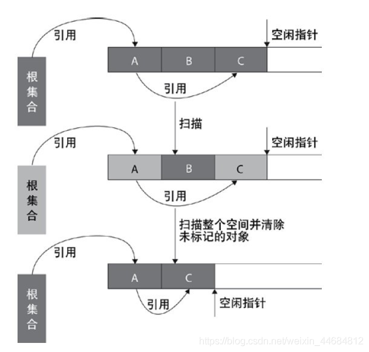

　　***标记整理算法与标记清除算法最显著的区别是：标记清除算法不进行对象的移动，并且仅对不存活的对象进行处理；而标记整理算法会将所有的存活对象移动到一端并对不存活对象进行处理，因此其不会产生内存碎片。标记整理算法的作用示意图如下：***

　　　　　　　　　　　　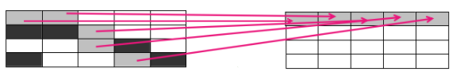

# 7.3 分代收集算法


# 7.4 Java内存空间

## 堆

堆主要存放Java在运行过程中**new出来的对象**，凡是通过new生成的对象都存放在堆中，对于堆中的对象生命周期的管理由Java虚拟机的垃圾回收机制GC进行回收和统一管理。

**类的非静态成员变量也放在堆区**，其中基本数据类型是直接保存值，而复杂类型是保存指向对象的引用，非静态成员变量在类的实例化时开辟空间并且初始化。类的几个时机，加载-连接-初始化-实例化。

**堆内存中的对象对所有线程可见，堆内存中的对象可以被所有线程访问**

## 栈

**栈主要存放在运行期间用到的一些局部变量（基本数据类型的变量）或者是指向其他对象的一些引用**，因为方法执行时，被分配的内存就在栈中，所以当然存储的局部变量就在栈中。当一段代码或者一个方法调用完毕后，栈中为这段代码所提供的基本数据类型或者对象的引用立即被释放；

**栈内存属于单个线程，每个线程都会有一个栈内存，其存储的变量只能在其线程中可见**

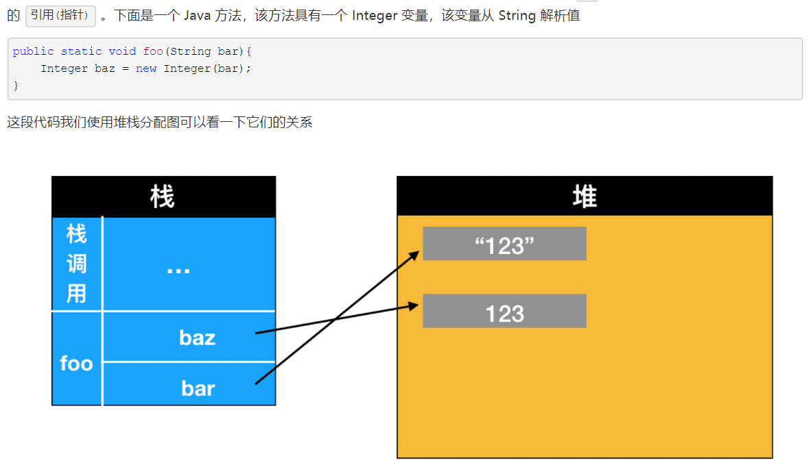

`foo()` 方法，这一行代码分配了一个新的 Integer 对象，JVM 尝试在堆空间中开辟一块内存空间。如果允许分配的话，就会调用 Integer 的构造方法把 String 字符串转换为 Integer 对象。JVM 将指向该对象的指针存储在变量 baz 中。

## 常量池

常量池是方法区的一部分内存。**常量池在编译期间就将一部分数据存放于该区域，包含基本数据类型以final声明的常量值如：int、long等和String字符串**，特别注意的是对于方法运行期位于栈中的局部变量String常量的值可以通过 String.intern()方法将该值置入到常量池中。

## 静态域

位于方法区的一块内存，存放**类中以static声明的静态成员变量**。

## 方法区

**是各个线程共享的内存区域，它用于存储class二进制文件，包含了虚拟机加载的类信息、常量、静态变量、即时编译后的代码等数据**。它有个名字叫做Non-Heap(非堆)，目的是与Java堆区分开。

方法区是线程安全的。由于所有的线程都共享方法区，所以，方法区里的数据访问必须被设计成线程安全的。例如，假如同时有两个线程都企图访问方法区中的同一个类，而这个类还没有被装入JVM，那么只允许一个线程去装载它，而其它线程必须等待 ！

## 总结

栈：为即时调用的方法开辟空间，存储局部变量值(基本数据类型)，局部变量引用。注意：局部变量必须手动初始化。
堆：存放引用类型的对象，即new出来的对象、数组值、类的非静态成员变量值(基本数据类型)、非静态成员变量引用。其中非静态成员变量在实例化时开辟空间初始化值。更具体点，个人感觉非静态成员变量是放在堆的对象中。
方法区：存放class二进制文件。包含类信息、静态变量，常量池（String字符串和final修饰的常量值等），类的版本号等基本信息。因为是共享的区域，所以如果静态成员变量的值或者常量值被修改了直接就会反应到其它类的对象中。

# 7.5 Java内存区域 -- 不同于Java内存模型

参考链接：

- https://blog.csdn.net/javazejian/article/details/72772461


Java虚拟机运行程序时，会将其自动管理的内存区域划分为：**方法区、堆、虚拟机栈、本地方法栈、程序计数器。**


注，便于记忆：

- 方法区（class二进制文件）、堆（引用类型的对象）   二者所有线程数据共享区域
- 栈，分为虚拟机栈、本地方法栈，其他还有程序计数器，这些都为线程私有数据区域

### 方法区 Method Area

**线程共享的内存区域，又称为Non-Heap（非堆），主要用于存储已被虚拟机加载的类信息、常量、静态变量、即时编译器编译后的代码等数据。**

当方法区无法满足内存分配需求时，将抛出OutOfMemoryError 异常。值得注意的是在方法区中存在一个叫运行时常量池(Runtime Constant Pool）的区域，它主要用于存放编译器生成的各种字面量和符号引用，这些内容将在类加载后存放到运行时常量池中，以便后续使用。

### JVM堆 Java Heap

**Java 堆也是属于线程共享的内存区域**，它在虚拟机启动时创建，是Java 虚拟机所管理的内存中最大的一块，**主要用于存放对象实例**，几乎所有的对象实例都在这里分配内存，注意**Java 堆是垃圾收集器管理的主要区域**，因此很多时候也被称做GC 堆，如果在堆中没有内存完成实例分配，并且堆也无法再扩展时，将会抛出OutOfMemoryError 异常。

### 程序计数器 Program Counter Register

**线程私有的数据区域**，是一小块内存空间，主要代表当前线程所执行的字节码行号指示器。字节码解释器工作时，通过改变这个计数器的值来选取下一条需要执行的字节码指令，分支、循环、跳转、异常处理、线程恢复等基础功能都需要依赖这个计数器来完成。

### 虚拟机栈 Java Virtual Machine Stacks

**属于线程私有的数据区域，与线程同时创建，总数与线程关联，代表Java方法执行的内存模型**。每个方法执行时都会创建一个栈桢来存储方法的的变量表、操作数栈、动态链接方法、返回值、返回地址等信息。每个方法从调用直结束就对于一个栈桢在虚拟机栈中的入栈和出栈过程，如下（图有误，应该为栈桢）：

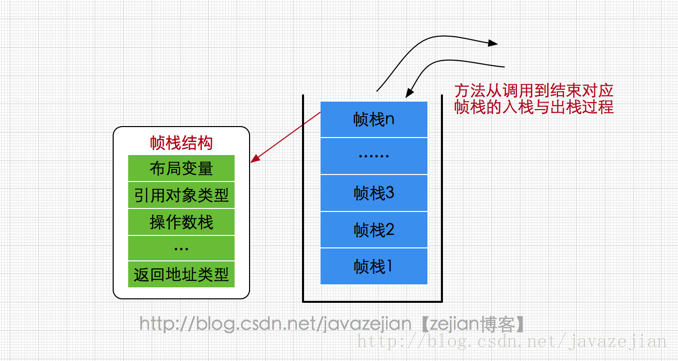


### 本地方法栈 Native Method Stacks

本地方法栈属于线程私有的数据区域，这部分主要与虚拟机用到的 Native 方法相关

# 7.6  Java内存模型 Java Memory Mode, JMM

本身是一种抽象的概念，并不真实存在，它描述的是一组规范或规则，通过这组规范**定义了程序中各个变量（包括实例字段、静态字段和构成数组对象的元素）的访问方式**。

<u>由于JVM运行程序的实体是线程，而每个线程创建时JVM都会为其创建一个工作内存</u>(有些地方称为栈空间)，用于存储线程私有的数据，而<u>Java内存模型中规定所有变量都存储在主内存，主内存是共享内存区域，所有线程都可以访问，但线程对变量的操作(读取赋值等)必须在工作内存中进行</u>，首先要将变量从主内存拷贝的自己的工作内存空间，然后对变量进行操作，操作完成后再将变量写回主内存，不能直接操作主内存中的变量，工作内存中存储着主内存中的变量副本拷贝，前面说过，工作内存是每个线程的私有数据区域，因此<u>不同的线程间无法访问对方的工作内存，线程间的通信(传值)必须通过主内存来完成</u>，其简要访问过程如下图：

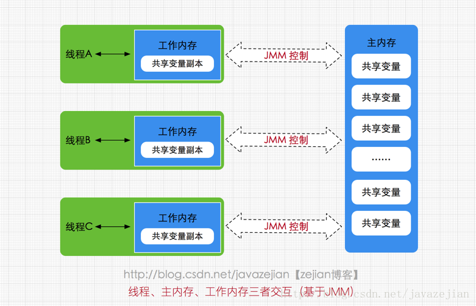

**JMM与Java内存区域的划分是不同的概念层次，更恰当说JMM描述的是一组规则，通过这组规则控制程序中各个变量在共享数据区域和私有数据区域的访问方式**，**JMM是围绕原子性，有序性、可见性**展开的。

- **主内存**

  *<u>主要存储的是Java实例对象</u>*，所有线程创建的实例对象都存放在主内存中，不管该**实例对象是成员变量还是方法中的本地变量(也称局部变量)**，当然也包括了共享的类信息、常量、静态变量。由于是共享数据区域，多条线程对同一个变量进行访问可能会出现线程安全问题。

- **工作内存**

  主要存储当前方法的所有本地变量信息(工作内存中存储着主内存中的变量副本拷贝)，每个线程只能访问自己的工作内存，即线程中的本地变量对其它线程是不可见的，就算是两个线程执行的是同一段代码，它们也会各自在自己的工作内存中创建属于当前线程的本地变量，当然也包括了字节码行号指示器、相关Native方法的信息。注意由于工作内存是每个线程的私有数据，线程间无法相互访问工作内存，因此存储在工作内存的数据不存在线程安全问题。

**对实例对象中的成员方法**而言，如果方法中包含本地变量是基本数据类型（boolean,byte,short,char,int,long,float,double），将直接存储在工作内存的帧栈结构中，但倘若本地变量是引用类型，那么该变量的引用会存储在工作内存的帧栈中，而对象实例将存储在主内存(共享数据区域，堆)中。

**对实例对象的成员变量**，不管它是基本数据类型或者包装类型(Integer、Double等)还是引用类型，都会被存储到堆区。至于static变量以及类本身相关信息将会存储在主内存中。需要注意的是，在主内存中的实例对象可以被多线程共享，倘若两个线程同时调用了同一个对象的同一个方法，那么两条线程会将要操作的数据拷贝一份到自己的工作内存中，执行完成操作后才刷新到主内存，简单示意图如下所示：


## 7.6.1 **JMM存在的必要性**

解决线程安全问题，JVM定义了一组规则，通过这组规则来决定一个线程对共享变量的写入何时对另一个线程可见，这组规则也称为Java内存模型（即JMM），JMM是围绕着程序执行的原子性、有序性、可见性展开的，下面我们看看这三个特性。

1. **原子性**

   原子性指的是一个操作是不可中断的，即使是在多线程环境下，一个操作一旦开始就不会被其他线程影响。

2. **有序性**

   代码的执行是按顺序依次执行的

3. **可见性**

   可见性指的是当一个线程修改了某个共享变量的值，其他线程是否能够马上得知这个修改的值。

## 7.6.2 JMM提供的解决方案

JVM自身提供的对基本数据类型读写操作的原子性外，对于方法级别或者代码块级别的原子性操作，可以使用synchronized关键字或者重入锁(ReentrantLock)保证程序执行的原子性。

工作内存与主内存同步延迟现象导致的可见性问题，可以使用synchronized关键字或者volatile关键字解决，它们都可以使一个线程修改后的变量立即对其他线程可见。对于指令重排导致的可见性问题和有序性问题，则可以利用volatile关键字解决，因为volatile的另外一个作用就是禁止重排序优化，关于volatile稍后会进一步分析。除了靠sychronized和volatile关键字来保证原子性、可见性以及有序性外，JMM内部还定义一套happens-before 原则来保证多线程环境下两个操作间的原子性、可见性以及有序性。

### 7.6.2.1 volatile

### 7.6.2.2 synchronized

### 7.6.2.3 happens-before原则

内容如下

- 程序顺序原则，即在一个线程内必须保证语义串行性，也就是说按照代码顺序执行。
- 锁规则 解锁(unlock)操作必然发生在后续的同一个锁的加锁(lock)之前，也就是说，如果对于一个锁解锁后，再加锁，那么加锁的动作必须在解锁动作之后(同一个锁)。
- volatile规则 volatile变量的写，先发生于读，这保证了volatile变量的可见性，简单的理解就是，volatile变量在每次被线程访问时，都强迫从主内存中读该变量的值，而当该变量发生变化时，又会强迫将最新的值刷新到主内存，任何时刻，不同的线程总是能够看到该变量的最新值。
- 线程启动规则 线程的start()方法先于它的每一个动作，即如果线程A在执行线程B的start方法之前修改了共享变量的值，那么当线程B执行start方法时，线程A对共享变量的修改对线程B可见
- 传递性 A先于B ，B先于C 那么A必然先于C
- 线程终止规则 线程的所有操作先于线程的终结，Thread.join()方法的作用是等待当前执行的线程终止。假设在线程B终止之前，修改了共享变量，线程A从线程B的join方法成功返回后，线程B对共享变量的修改将对线程A可见。
- 线程中断规则 对线程 interrupt()方法的调用先行发生于被中断线程的代码检测到中断事件的发生，可以通过Thread.interrupted()方法检测线程是否中断。
- 对象终结规则 对象的构造函数执行，结束先于finalize()方法


# 7.7

# 八、网络

# 8.1 HTTP和HTTPS区别

HTTPS和HTTP的区别主要如下：

　　1. https协议需要到CA（签证机构，Certificate Authority）申请证书，一般免费证书较少，因而需要一定费用。
        　　2. **http**是超文本传输协议，信息是明文传输，https则是具有安全性的ssl加密传输协议。
                　　3. http和https使用的是完全不同的连接方式，用的端口也不一样，前者是**80**，后者是**443**。
        　　4. http的连接很简单，是**无状态的**（对事务处理没有记忆能力，如果后续处理需要前面的信息，则它需要重传；另一方面，服务器不需要先前信息时它的应答就较快）；HTTPS协议是由SSL+HTTP协议构建的可进行加密传输、身份认证的网络协议，比http协议安全。

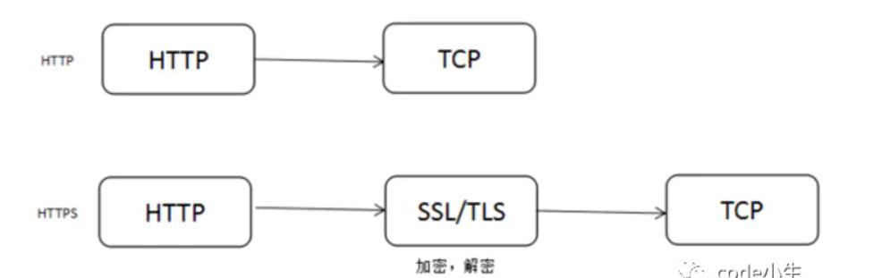


# 8.2 Cookie和session

## Cookie机制

在客户端保持状态的方案。

**生成**：正统的cookie分发通过拓展HTTP协议实现，服务器通过在HTTP的响应头上加一行特殊的指示以提示浏览器生成相应的cookie。

**使用**：由浏览器按照一定的原则在后台自动发送给服务器的，浏览器检查所有存储的cookie，如果某个cookie所声明的作用范围大于等于将要请求的资源所在的位置，则把该cookie附在请求资源的HTTP请求头上发送给服务器。

**内容**：包括**名字，值，过期时间，路径和域**。路径与域一起构成cookie的作用范围。

**过期时间**：若不设置过期时间，则表示这个cookie的生命期为浏览器会话期间，关闭浏览器窗口，cookie就消失。这种生命期为浏览器会话期的cookie被称为会话cookie。会话cookie一般不存储在硬盘上而是保存在内存里。若设置了过期时间，浏览器就会把cookie保存到硬盘上，关闭后再次打开浏览器，这些cookie仍然有效直到超过设定的过期时间。存储在硬盘上的cookie可以在不同的浏览器进程间共享，比如两个IE窗口。而对于保存在内存里的cookie，不同的浏览器有不同的处理方式。

## Session机制

session机制采用的是在服务器端保持状态的方案，借助Cookie来进行信息处理，进行请求处理时，服务器端会在客户端建立一个cookie。session机制是一种服务器端的机制，服务器使用一种类似于散列表的结构来保存信息。

**创建**：当程序需要为某个客户端的请求创建一个session时，服务器首先检查这个客户端的请求里是否已包含了一个session标识（称为session id），如果已包含则说明以前已经为此客户端创建过session，服务器就按照session id把这个session检索出来使用（检索不到，会新建一个），如果客户端请求不包含session id，则为此客户端创建一个session并且生成一个与此session相关联的session id，这个session id将被在本次响应中返回给客户端保存。保存这个session id的方式可以采用cookie，这样在交互过程中浏览器可以自动的按照规则把这个标识发送给服务器。一般这个cookie的名字都是类似于SEEESIONID。但cookie可以被人为的禁止，则必须有其他机制以便在cookie被禁止时仍然能够把session id传递回服务器。

经常被使用的一种技术叫做URL重写，就是把session id直接附加在URL路径的后面。还有一种技术叫做表单隐藏字段。就是服务器会自动修改表单，添加一个隐藏字段，以便在表单提交时能够把session id传递回服务器。比如： 

```html
<form name="testform" action="/xxx"> 
<input type="hidden" name="jsessionid" value="ByOK3vjFD75aPnrF7C2HmdnV6QZcEbzWoWiBYEnLerjQ99zWpBng!-145788764"> 
<input type="text"> 
</form>
```

实际上这种技术可以简单的用对action应用URL重写来代替。

## **cookie 和session 的区别**

- cookie数据存放在客户的浏览器上，session数据放在服务器上
- cookie不是很安全，别人可以分析存放在本地的COOKIE并进行COOKIE欺骗，考虑到安全应当使用session
- session会在一定时间内保存在服务器上。当访问增多，会占用服务器的性能， 考虑到减轻服务器性能方面，应当使用COOKIE
- 单个cookie保存的数据不能超过4K，很多浏览器都限制一个站点最多保存20个cookie

# 8.3 从输入URL到页面加载过程（一次完整的HTTP请求过程）

1. DNS解析
2. TCP连接 （TCP的3次握手，建立TCP连接）
3. 发送HTTP请求（建立TCP连接后，发起http请求）
4. 服务器处理请求并返回HTTP报文
5. 浏览器解析渲染页面（浏览器获取相关资源后，进行渲染，展现给用户）
6. 连接结束

## 8.3.1 DNS解析

Domain Name System（域名系统，域名与IP地址相互映射的分布式数据库）

将URL解析为IP地址（网址转换为IP地址），DNS解析是一个递归查询的过程。

查找www.google.com的IP地址过程。

1. 浏览器首先搜索自身的DNS缓存，看自身缓存中是否有对应URL的条目

2. 如果浏览器自身DNS缓存没有，会搜索操作系统本身的DNS缓存

3. 如果操作系统DNS缓存中也没有找到，尝试检索hosts文件

4. 如果hosts文件中没有找到对应的条目，浏览器会发起一个DNS系统调用。**首先在本地域名服务器**中查询IP地址，如果没有找到的情况下，本地域名服务器会向**根域名服务器**53号端口发送一个请求，如果根域名服务器也不存在该域名时，根域名返回顶级域名查询对应的顶级域域名的IP地址，本地域名会向com顶级域名服务器发送一个请求，依次类推下去。（本地 DNS 服务器没有缓存不能直接将域名转换为 IP 地址，需要采用递归或者迭代查询的方式依次向根域名服务器、顶级域名服务器、权威域名服务器发起查询请求，直至找到一个或一组 IP 地址，返回给浏览器。）。直到最后本地域名服务器得到google的IP地址并把它缓存到本地，供下次查询使用。

   可以看出网址的解析是一个从右向左的过程: com -> google.com -> www.google.com。但是你是否发现少了点什么，根域名服务器的解析过程呢？事实上，真正的网址是www.google.com.，并不是我多打了一个.，这个.对应的就是根域名服务器，默认情况下所有的网址的最后一位都是.，既然是默认情况下，为了方便用户，通常都会省略，浏览器在请求DNS的时候会自动加上，所有网址真正的解析过程为: . -> .com -> google.com. -> www.google.com.。


### DNS优化

DNS存在着多级缓存，从离浏览器的距离排序的话，有以下几种: 浏览器缓存，系统缓存，路由器缓存，IPS服务器缓存，根域名服务器缓存，顶级域名服务器缓存，主域名服务器缓存。

### DNS负载均衡

DNS可以返回一个合适的机器（一个URL有多个IP地址）的IP给用户，例如可以根据每台机器的负载量，该机器离用户地理位置的距离等等，这种过程就是DNS负载均衡，又叫做DNS重定向。大家耳熟能详的CDN(Content Delivery Network)就是利用DNS的重定向技术，DNS服务器会返回一个跟用户最接近的点的IP地址给用户，CDN节点的服务器负责响应用户的请求，提供所需的内容。

## 8.3.2 TCP连接

HTTP协议是使用TCP作为传输层协议的

### 发起TCP的3次握手

最开始的时候客户端和服务器都处于closed状态，主动打开的是客户端，被动打开的是服务器。

拿到域名对应的IP地之后，User-Agent（一般是指**浏览器**）会以一个**随机端口**（1024<端口<65535）向服务器的web程序（常用的有httpd，nginx等）80端口**发起TCP的连接请求**。这个连接请求（原始的http请求经过TCP/IP层模型层层包装）到达服务器后（这中间通过各种路由设备，局域网除外），进入到网卡，然后进入到内核的TCP/IP协议栈（用于识别这个连接请求，解封包，一层层剥开），还有可能要经过Netfilter防火墙（属于内核的模块）的过滤，最终到达web程序（本文就以Nginx为例）最终建立TCP/IP连接，如下图:

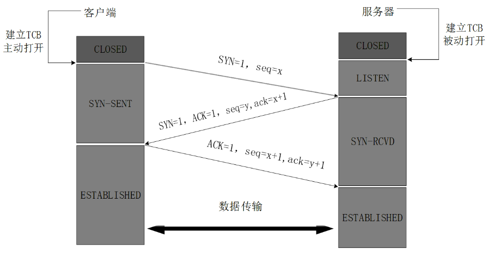

1. TCP服务器进程先创建传输控制块TCB，时刻准备接受客户进程的连接请求，此时服务器就进入了LISTEN（监听）状态；
2. TCP客户进程也是先创建传输控制块TCB，然后向服务器发出连接请求报文，这是报文首部中：**确认位ACK=0**，**同步位SYN=1**，选择一个**初始序列号 seq=x** ，此时，<u>TCP客户端进程进入了 SYN-SENT（同步已发送状态）状态。TCP规定，SYN报文段（SYN=1的报文段）不能携带数据，但需要消耗掉一个序号。</u>
3. TCP服务器收到请求报文后，如果同意连接，则发出确认报文。**确认报文中应该确认位ACK=1，同步位SYN=1，确认号是ack=x+1，同时也要为自己初始化一个序列号 seq=y**，此时，TCP服务器进程进入了SYN-RCVD（同步收到）状态。这个报文也不能携带数据，但是同样要消耗一个序号。
4. TCP客户进程收到确认后，还要向服务器给出确认。**确认报文的 确认位ACK=1，确认号 ack=y+1，自己的序列号seq=x+1，此时，TCP连接建立**，客户端进入ESTABLISHED（已建立连接）状态。TCP规定，ACK报文段可以携带数据，但是如果不携带数据则不消耗序号。
5. 当服务器收到客户端的确认后也进入ESTABLISHED状态，此后双方就可以开始通信了。

注：

1. **确认位ACK**，仅当ACK=1时，确认号字段才有效。TCP规定，在连接建立后所有报文的传输都必须把ACK置1；
2. **同步位SYN**，在连接建立时用来同步序号。当SYN=1，ACK=0，表明是连接请求报文，若同意连接，则响应报文中应该使SYN=1，ACK=1；

## 8.3.3 发送HTTP请求

请求行、请求报头、请求正文、请求参数

## 8.3.4 服务器处理请求并返回HTTP报文

后端从在固定的端口接收到TCP报文开始，这一部分对应于编程语言中的socket。它会对TCP连接进行处理，对HTTP协议进行解析，并按照报文格式进一步封装成HTTP Request对象，供上层使用。

## 8.3.5 浏览器解析渲染页面

## 8.3.6 连接结束

# 8.4 五层模型

五层体系结构包括：应用层、运输层、网络层、数据链路层和物理层。

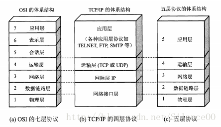


## 第五层——应用层(application layer) 

**应用层(application layer)：**是体系结构中的最高，直接为用户的应用进程（例如电子邮件、文件传输和终端仿真）提供服务。

应用层协议很多，如支持万维网应用的HTTP协议，支持电子邮件的SMTP协议，支持文件传送的FTP协议，DNS，POP3，SNMP，Telnet等等。

## 第四层——运输层(transport layer)

**运输层(transport layer)：**负责向两个主机中进程之间的通信提供服务。由于一个主机可同时运行多个进程，因此运输层有复用和分用的功能

- 复用，多个应用层进程可同时使用下面运输层的服务。
- 分用，把收到的信息分别交付给上面应用层中相应的进程。

**主要使用以下两种协议：** 
**传输控制协议TCP(Transmission Control Protocol)**：<u>面向连接的，数据传输的单位是报文段，能够提供可靠的交付。</u> 
**用户数据包协议UDP(User Datagram Protocol)：**<u>无连接的，数据传输的单位是用户数据报，不保证提供可靠的交付，只能提供“尽最大努力交付”。</u>

## 第三层——网络层(network layer)

- 网络层(network layer)主要包括以下两个任务：
  - 负责为分组交换网上的不同主机提供通信服务。在发送数据时，网络层把运输层产生的报文段或用户数据报封装成分组或包进行传送。在TCP/IP体系中，由于网络层使用IP协议，因此分组也叫做**IP数据报**，或简称为数据报。
  - 选中合适的路由，使源主机运输层所传下来的分组，能够通过网络中的路由器找到目的主机。
- 协议：IP,ICMP,IGMP,ARP,RARP （ARP协议在不同的模型中所处的层次不同）

## 第二层——数据链路层(data link layer)

- **数据链路层(data link layer)：**简称为链路层，两个主机之间的数据传输，总是在一段一段的链路上传送的，也就是说，在两个相邻结点之间传送数据是直接传送的(点对点)，这时就需要使用专门的链路层的协议。
- 在两个相邻结点之间传送数据时，数据链路层将网络层交下来的IP数据报组装成帧(framing)，在两个相邻结点之间的链路上“透明”地传送帧中的数据。
- 每一帧包括数据和必要的控制信息(如同步信息、地址信息、差错控制等)。典型的帧长是几百字节到一千多字节。
- ”透明”是一个很重要的术语。它表示，某一个实际存在的事物看起来却好像不存在一样。”在数据链路层透明传送数据”表示无论什么样的比特组合的数据都能够通过这个数据链路层。因此，对所传送的数据来说，这些数据就“看不见”数据链路层。或者说，数据链路层对这些数据来说是透明的。 
  (1)在接收数据时，控制信息使接收端能知道一个帧从哪个比特开始和到哪个比特结束。这样，数据链路层在收到一个帧后，就可从中提取出数据部分，上交给网络层。 
  (2)控制信息还使接收端能检测到所收到的帧中有无差错。如发现有差错，数据链路层就简单地丢弃这个出了差错的帧，以免继续传送下去白白浪费网络资源。如需改正错误，就由运输层的TCP协议来完成。

## 第一层——物理层(physical layer)

- **物理层(physical layer)：**在物理层上所传数据的单位是比特，其任务就是透明地传送比特流。

## 数据在各层之间的传递过程


# 8.5 7层模型

## **第七层：应用层** 

**HTTP、TFTP、SNMP、FTP、SMTP、DNS、Telnet**

定义了用于在网络中进行通信和数据传输的接口 - 用户程式；提供标准服务，比如虚拟终端、文件以及任务的传输和处理；

## **第六层：表示层**

掩盖不同系统间的数据格式的不同性； 指定独立结构的数据传输格式； 数据的编码和解码；加密和解密；压缩和解压缩

## **第五层：会话层**

管理用户会话和对话； 控制用户间逻辑连接的建立和挂断；报告上一层发生的错误

## **第四层：传输层** 

**报文段/用户数据报** **TCP、UDP**

管理网络中端到端的信息传送； 通过错误纠正和流控制机制提供可靠且有序的数据包传送；提供面向无连接的数据包的传送；

## **第三层：网络层** 

**数据报** **IP**、**ICMP**、RIP、OSPF、BGP、IGMP

定义网络设备间如何传输数据；根据唯一的网络设备地址路由数据包；提供流和拥塞控制以防止网络资源的损耗；

## **第二层：数据链路层**  

**帧**  SLIP、CSLIP、PPP、**ARP**(地址解析协议，根据IP地址获取物理地址）、**RARP**、MTU

定义操作通信连接的程序；封装数据包为数据帧；监测和纠正数据包传输错误

## **第一层：物理层** 

 **比特** ISO2110、IEEE802、IEEE802.2

定义通过网络设备发送数据的物理方式；作为网络媒介和设备间的接口；定义光学、电气以及机械特性。主要作用是传输比特流。

# 8.6 子网掩码

子网掩码是一种用来指明一个IP地址所标示的主机处于哪个子网中。子网掩码不能单独存在，它必须结合IP地址一起使用。**子网掩码只有一个作用，就是将某个IP地址划分成[网络地址](https://baike.baidu.com/item/网络地址)和[主机地址](https://baike.baidu.com/item/主机地址)两部分。**

子网掩码是一个32位地址，对于A类地址来说，默认的子网掩码是255.0.0.0；对于B类地址来说默认的子网掩码是255.255.0.0；对于C类地址来说默认的子网掩码是255.255.255.0。

# 8.7 POST GET区别

- 都包含请求头请求行，post多了\<request-body>。

- get多用来查询，请求参数放在url中，以？分割URL和传输数据，多个参数用&连接，不会对服务器上的内容产生作用。

  login.action?name=hyddd&password=idontknow&verify=%E4%BD%A0 %E5%A5%BD。如果数据是英文字母/数字，原样发送，如果是空格，转换为+，如果是中文/其他字符，则直接把字符串用BASE64加密，得出如： %E4%BD%A0%E5%A5%BD，其中％XX中的XX为该符号以16进制表示的ASCII。

  post用来提交，把提交的数据放置在HTTP包的包体\<request-body>中。

- GET是直接添加到URL后面的，直接就可以在URL中看到内容，而POST是放在报文内部的，用户无法直接看到。

- HTTP协议没有对传输的数据大小进行限制，HTTP协议规范也没有对URL长度进行限制

  GET提交的数据长度是有限制的，因为URL长度有限制，具体的长度限制视浏览器而定。而POST没有。

- POST的安全性高于GET的安全性

# 8.9 TCP

## 三次握手

最开始的时候客户端和服务器都处于closed状态，主动打开的是客户端，被动打开的是服务器。

拿到域名对应的IP地之后，User-Agent（一般是指**浏览器**）会以一个**随机端口**（1024<端口<65535）向服务器的web程序（常用的有httpd，nginx等）80端口**发起TCP的连接请求**。这个连接请求（原始的http请求经过TCP/IP层模型层层包装）到达服务器后（这中间通过各种路由设备，局域网除外），进入到网卡，然后进入到内核的TCP/IP协议栈（用于识别这个连接请求，解封包，一层层剥开），还有可能要经过Netfilter防火墙（属于内核的模块）的过滤，最终到达web程序（本文就以Nginx为例）最终建立TCP/IP连接，如下图:


1. TCP服务器进程先创建传输控制块TCB，时刻准备接受客户进程的连接请求，此时服务器就进入了LISTEN（监听）状态；
2. TCP客户进程也是先创建传输控制块TCB，然后向服务器发出连接请求报文，这是报文首部中：**确认位ACK=0**，**同步位SYN=1**，选择一个**初始序列号 seq=x** ，此时，<u>TCP客户端进程进入了 SYN-SENT（同步已发送状态）状态。TCP规定，SYN报文段（SYN=1的报文段）不能携带数据，但需要消耗掉一个序号。</u>
3. TCP服务器收到请求报文后，如果同意连接，则发出确认报文。**确认报文中应该确认位ACK=1，同步位SYN=1，确认号是ack=x+1，同时也要为自己初始化一个序列号 seq=y**，此时，TCP服务器进程进入了SYN-RCVD（同步收到）状态。这个报文也不能携带数据，但是同样要消耗一个序号。
4. TCP客户进程收到确认后，还要向服务器给出确认。**确认报文的 确认位ACK=1，确认号 ack=y+1，自己的序列号seq=x+1，此时，TCP连接建立**，客户端进入ESTABLISHED（已建立连接）状态。TCP规定，ACK报文段可以携带数据，但是如果不携带数据则不消耗序号。
5. 当服务器收到客户端的确认后也进入ESTABLISHED状态，此后双方就可以开始通信了。

注：

1. **确认位ACK**，仅当ACK=1时，确认号字段才有效。TCP规定，在连接建立后所有报文的传输都必须把ACK置1；
2. **同步位SYN**，在连接建立时用来同步序号。当SYN=1，ACK=0，表明是连接请求报文，若同意连接，则响应报文中应该使SYN=1，ACK=1；

## 四次挥手

四次挥手(Four-way handshake)，也叫做改进的三次握手。客户端或服务器均可主动发起挥手动作，在 socket 编程中，任何一方执行 `close()` 操作即可产生挥手操作。

- 第一次挥手(FIN=1，seq=x)

  假设客户端想要关闭连接，客户端发送一个 FIN 标志位置为1的包，表示自己已经没有数据可以发送了，但是仍然可以接受数据。

  发送完毕后，客户端进入 `FIN_WAIT_1` 状态。

- 第二次挥手(ACK=1，ACKnum=x+1)

  服务器端确认客户端的 FIN 包，发送一个确认包，表明自己接受到了客户端关闭连接的请求，但还没有准备好关闭连接。

  发送完毕后，服务器端进入 `CLOSE_WAIT` 状态，客户端接收到这个确认包之后，进入 `FIN_WAIT_2` 状态，等待服务器端关闭连接。

- 第三次挥手(FIN=1，seq=y)

  服务器端准备好关闭连接时，向客户端发送结束连接请求，FIN 置为1。

  发送完毕后，服务器端进入 `LAST_ACK` 状态，等待来自客户端的最后一个ACK。

- 第四次挥手(ACK=1，ACKnum=y+1)

  客户端接收到来自服务器端的关闭请求，发送一个确认包，并进入 `TIME_WAIT`状态，等待可能出现的要求重传的 ACK 包。

  服务器端接收到这个确认包之后，关闭连接，进入 `CLOSED` 状态。

  客户端等待了某个固定时间（**两个最大段生命周期**，2MSL，2 Maximum Segment Lifetime）之后，没有收到服务器端的 ACK ，认为服务器端已经正常关闭连接，于是自己也关闭连接，进入 `CLOSED` 状态。


## TCP状态

### 1. 三次握手的TCP状态

**LISTEN：侦听来自远方的TCP端口的连接请求**

有提供某种服务才会处于LISTEN状态，TCP状态的变化就是某个端口的状态变化，提供一个服务就打开一个端口。

**SYN-SENT：客户端的SYN_SENT 状态（同步已发送状态）**

在发送连接请求后等待匹配的连接请求

**SYN-RECEIVED：服务器端握手状态SYN_RCVD（同步已接收状态）**

在收到和发送一个连接请求后等待对方对连接请求的确认

**ESTABLISHED：代表一个打开的连接**

  ESTABLISHED状态是表示两台机器正在传输数据，观察这个状态最主要的就是看哪个程序正在处于ESTABLISHED状态。

### 2. 四次挥手的TCP状态

**FIN_WAIT_1**

等待远程TCP连接终端请求，或者先前的连接中断请求的确认。主动关闭端应用程序调用close，于是其TCP发出FIN请求主动关闭连接，之后进入FIN_WAIT1状态。

**FIN_WAIT_2**

主动关闭端接到ACK后，进入FIN_WAIT_2状态。在这个状态下，应用程序还有接受数据的能力，但是已经无法发送数据。

**CLOSE_WAIT**

被动关闭端TCP接到FIN后，就发出ACK以回应FIN请求，并进入CLOSE_WAIT状态。

**LAST_ACK**

被动关闭端一段时间后，接收到文件结束符的应用程序将调用CLOSE关闭连接，这导致它的TCP也发送一个FIN，等待对方的ACK，就进入了LAST_ACK状态。

**TIME_WAIT**

等待足够的时间以确保远程TCP接收到连接中断请求的确认，在主动关闭端接收到FIN后，TCP就发送ACK包，并进入TIME_WAIT状态。

**CLOSED**

被动关闭端在接收到ACK包后，就进入了closed状态

## TCP网络常用命令

1. `netstat -nat` 查看TCP各个状态的数量

   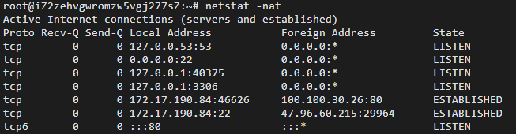

   

2. `lsof -i:port` 可以检测到打开套接字的状况

   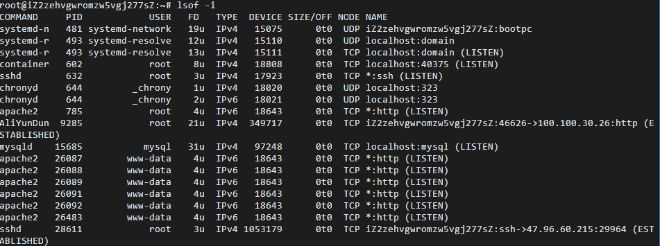

   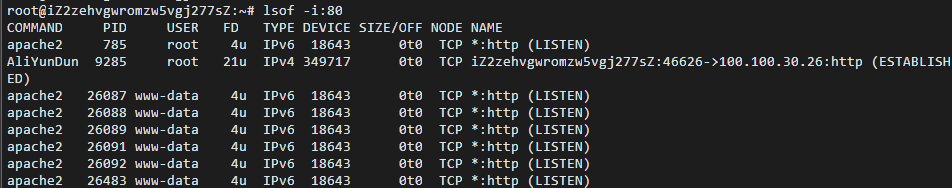

   

3. 

## TCP/UDP的区别

**对比**

|              | UDP                                        | TCP                                    |
| :----------- | :----------------------------------------- | :------------------------------------- |
| 是否连接     | 无连接                                     | 面向连接                               |
| 是否可靠     | 不可靠传输，不使用流量控制和拥塞控制       | 可靠传输，使用流量控制和拥塞控制       |
| 连接对象个数 | 支持一对一，一对多，多对一和多对多交互通信 | 只能是一对一通信                       |
| 传输方式     | 面向报文                                   | 面向字节流                             |
| 首部开销     | 首部开销小，仅8字节                        | 首部最小20字节，最大60字节             |
| 适用场景     | 适用于实时应用（IP电话、视频会议、直播等） | 适用于要求可靠传输的应用，例如文件传输 |

 **总结**

- TCP向上层提供面向连接的可靠服务 ，UDP向上层提供无连接不可靠服务。
- 虽然 UDP 并没有 TCP 传输来的准确，但是也能在很多实时性要求高的地方有所作为
- 对数据准确性要求高，速度可以相对较慢的，可以选用TCP

## TCP 如何保证传输可靠性

**TCP协议保证数据传输可靠性的方式主要有：校验和、序列号、确认应答、超时重传、连接管理、流量控制、拥塞控制**

- 校验和

  在数据传输的过程中，将发送的数据段都<u>当做一个16位的整数</u>。将这些整数加起来（数据划以16位进行划分，累加），并且前面的进位不能丢弃，补在后面，最后取反，得到校验和。
  发送方：在发送数据之前计算检验和，并进行校验和的填充。
  接收方：收到数据后，对数据以同样的方式进行计算，求出校验和，与发送方的进行比对。

  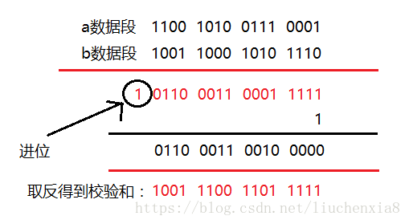

  注意：如果接收方比对校验和与发送方不一致，那么数据一定传输有误。但是**如果接收方比对校验和与发送方一致，数据不一定传输成功。**

  

- 序列号和确认应答

  序列号：TCP传输时将每个字节的数据都进行了编号，这就是序列号。
  确认应答：TCP传输的过程中，每次接收方收到数据后，都会对传输方进行确认应答。也就是发送ACK报文。这个ACK报文当中带有对应的确认序列号，告诉发送方，接收到了哪些数据，下一次的数据从哪里发。

  序列号的作用不仅仅是应答的作用，有了序列号能够将接收到的数据根据序列号排序，并且去掉重复序列号的数据。这也是TCP传输可靠性的保证之一。

  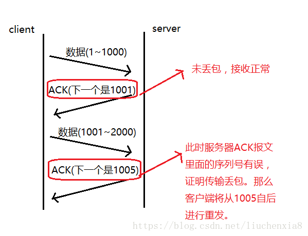

  

  

- 超时重传

  如果发送方发送完数据后，迟迟没有等到接收方的ACK报文，这该怎么办呢？而没有收到ACK报文的原因可能是什么呢？

  首先，发送方没有介绍到响应的ACK报文原因可能有两点：

  1. 数据在传输过程中由于网络原因等直接全体丢包，接收方根本没有接收到。
  2. 接收方接收到了响应的数据，但是发送的ACK报文响应却由于网络原因丢包了。

  TCP在解决这个问题的时候引入了一个新的机制，叫做超时重传机制。简单理解就是发送方在发送完数据后等待一个时间，时间到达没有接收到ACK报文，那么对刚才发送的数据进行重新发送。如果是刚才第一个原因，接收方收到二次重发的数据后，便进行ACK应答。如果是第二个原因，接收方发现接收的数据已存在（判断存在的根据就是序列号，所以上面说序列号还有去除重复数据的作用），那么直接丢弃，仍旧发送ACK应答。

  那么发送方发送完毕后等待的时间是多少呢？如果这个等待的时间过长，那么会影响TCP传输的整体效率，如果等待时间过短，又会导致频繁的发送重复的包。如何权衡？

  由于TCP传输时保证能够在任何环境下都有一个高性能的通信，因此这个最大超时时间（也就是等待的时间）是动态计算的。

  > 在Linux中（BSD Unix和Windows下也是这样）超时以500ms为一个单位进行控制，每次判定超时重发的超时时间都是500ms的整数倍。重发一次后，仍未响应，那么等待2*500ms的时间后，再次重传。等待4*500ms的时间继续重传。以一个指数的形式增长。累计到一定的重传次数，TCP就认为网络或者对端出现异常，强制关闭连接。

- 连接管理

  连接管理就是三次握手与四次挥手的过程

- 流量控制

  TCP根据接收端对数据的处理能力，决定发送端的发送速度，这个机制就是流量控制。

  **在TCP协议的报头信息当中，有一个16位字段的窗口大小**。窗口大小的内容实际上是接收端接收数据缓冲区的剩余大小。这个数字越大，证明接收端接收缓冲区的剩余空间越大，网络的吞吐量越大。接收端会在确认应答发送ACK报文时，将自己的即时窗口大小填入，并跟随ACK报文一起发送过去。而发送方根据ACK报文里的窗口大小的值的改变进而改变自己的发送速度。如果接收到窗口大小的值为0，那么发送方将停止发送数据。并定期的向接收端发送窗口探测数据段，让接收端把窗口大小告诉发送端。

  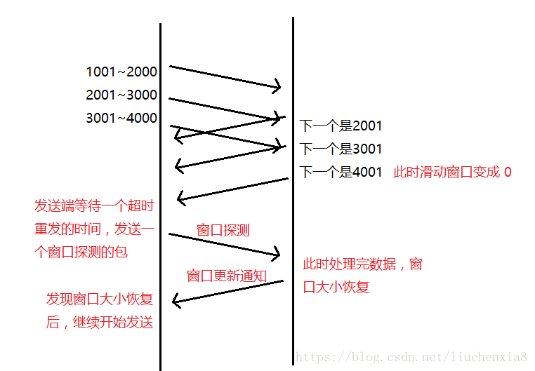

  

  注：16位的窗口大小最大能表示65535个字节（64K），但是TCP的窗口大小最大并不是64K。在TCP首部中40个字节的选项中还包含了一个窗口扩大因子M，实际的窗口大小就是16为窗口字段的值左移M位。每移一位，扩大两倍。

- 拥塞控制

  TCP传输的过程中，发送端开始发送数据的时候，如果刚开始就发送大量的数据，那么就可能造成一些问题。网络可能在开始的时候就很拥堵，如果给网络中在扔出大量数据，那么这个拥堵就会加剧。拥堵的加剧就会产生大量的丢包，就对大量的超时重传，严重影响传输。

- 拥塞控制方法：

  ```txt
  慢开始( slow-start )和拥塞避免( congestion avoidance )、快重传( fast retransmit )和快恢复( fast recovery )
  ```

  **方法一：慢开始+拥塞避免**

  先探测一下网络状态，即由小到大逐渐增大发送窗口，也就是说，由小到大逐渐增大拥塞窗口数值。通常在刚刚开始发送报文段时，先把拥塞窗口 cwnd（congestion avoidance）设置为一个最大报文段MSS的数值。<u>而在每收到一个对新的报文段的确认后</u>，把拥塞窗口增加至多一个MSS的数值。用这样的方法逐步增大发送方的拥塞窗口 cwnd ，可以使分组注入到网络的速率更加合理。

  

   

  每经过一个传输轮次，拥塞窗口 cwnd 就加倍。一个传输轮次所经历的时间其实就是往返时间RTT。不过“传输轮次”更加强调：把拥塞窗口cwnd所允许发送的报文段都连续发送出去，并收到了对已发送的最后一个字节的确认。

  慢开始的“慢”并不是指cwnd的增长速率慢，而是指在TCP开始发送报文段时先设置cwnd=1，使得发送方在开始时只发送一个报文段（目的是试探一下网络的拥塞情况），然后再逐渐增大cwnd（<u>以指数规律增长</u>）。

  为了防止拥塞窗口cwnd增长过大引起网络拥塞，还需要设置一个慢开始门限ssthresh状态变量。慢开始门限ssthresh的用法如下：

  - cwnd < ssthresh 时，使用上述的慢开始算法
  - cwnd > ssthresh 时，停止使用慢开始算法而改用拥塞避免算法
  - cwnd = ssthresh 时，既可使用慢开始算法，也可使用拥塞控制避免算法

  拥塞避免算法：让拥塞窗口cwnd缓慢地增大，即每经过一个往返时间RTT就把发送方的拥塞窗口cwnd加1，而不是加倍。这样拥塞窗口cwnd按<u>线性规律缓慢增长</u>，比慢开始算法的拥塞窗口增长速率缓慢得多。

  无论在慢开始阶段还是在拥塞避免阶段，只要发送方判断网络出现拥塞（其根据就是没有收到确认），就要把慢开始门限ssthresh设置为出现拥塞时的发送方窗口值的一半（但不能小于2）；然后把拥塞窗口cwnd重新设置为1，执行慢开始算法。这样做的目的就是要迅速减少主机发送到网络中的分组数，使得发生拥塞的路由器有足够时间把队列中积压的分组处理完毕。

  如下图，用具体数值说明了上述拥塞控制的过程。现在发送窗口的大小和拥塞窗口一样大。

  

  1. 当TCP连接进行初始化时，把拥塞窗口cwnd置为1。前面已说过，为了便于理解，图中的窗口单位不使用字节而使用报文段的个数。慢开始门限的初始值设置为16个报文段，即 cwnd = 16 。
  2. 在执行慢开始算法时，拥塞窗口 cwnd 的初始值为1。以后发送方每收到一个对新报文段的确认ACK，就把拥塞窗口值另1，然后开始下一轮的传输（图中横坐标为传输轮次）。因此拥塞窗口cwnd随着传输轮次按指数规律增长。当拥塞窗口cwnd增长到慢开始门限值ssthresh时（即当cwnd=16时），就改为执行拥塞控制算法，拥塞窗口按线性规律增长。
  3. 假定拥塞窗口的数值增长到24时，网络出现超时（这很可能就是网络发生拥塞了）。更新后的ssthresh值变为12（即变为出现超时时的拥塞窗口数值24的一半），拥塞窗口再重新设置为1，并执行慢开始算法。当cwnd=ssthresh=12时改为执行拥塞避免算法，拥塞窗口按线性规律增长，每经过一个往返时间增加一个MSS的大小。

  强调：“拥塞避免”并非指完全能够避免了拥塞。利用以上的措施要完全避免网络拥塞还是不可能的。“拥塞避免”是说在拥塞避免阶段将拥塞窗口控制为按线性规律增长，**使网络比较不容易出现拥塞。**

  **方法二：快重传和快恢复**

  如果发送方设置的超时计时器时限已到但还没有收到确认，那么很可能是网络出现了拥塞，致使报文段在网络中的某处被丢弃。这时，TCP马上把拥塞窗口 cwnd 减小到1，并执行慢开始算法，同时把慢开始门限值ssthresh减半。这是不使用快重传的情况。

  <u>快重传算法首先要求接收方每收到一个失序的报文段后就立即发出重复确认（为的是使发送方及早知道有报文段没有到达对方）而不要等到自己发送数据时才进行捎带确认。</u>

  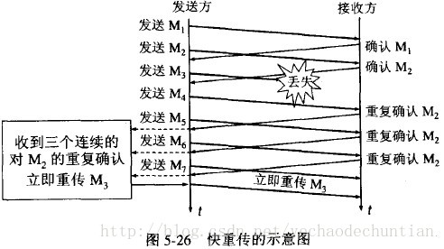

  接收方收到了M1和M2后都分别发出了确认。现在假定接收方没有收到M3但接着收到了M4。显然，接收方不能确认M4，因为M4是收到的失序报文段。根据可靠传输原理，接收方可以什么都不做，也可以在适当时机发送一次对M2的确认。但按照快重传算法的规定，接收方应及时发送对M2的重复确认，这样做可以让发送方及早知道报文段M3没有到达接收方。发送方接着发送了M5和M6。接收方收到这两个报文后，也还要再次发出对M2的重复确认。这样，发送方共收到了接收方的四个对M2的确认，其中后三个都是重复确认。快重传算法还规定，发送方只要一连收到三个重复确认就应当立即重传对方尚未收到的报文段M3，而不必继续等待M3设置的重传计时器到期。由于发送方尽早重传未被确认的报文段，因此采用快重传后可以使整个网络吞吐量提高约20%。

  与快重传配合使用的还有快恢复算法，其过程有以下两个要点：

  - 当发送方连续收到三个重复确认，就执行“乘法减小”算法，把慢开始门限ssthresh减半。这是为了预防网络发生拥塞。请注意：接下去不执行慢开始算法。


  - 由于发送方现在认为网络很可能没有发生拥塞，因此与慢开始不同之处是现在不执行慢开始算法（即拥塞窗口cwnd现在不设置为1），而是把cwnd值设置为慢开始门限ssthresh减半后的数值，然后开始执行拥塞避免算法（“加法增大”），使拥塞窗口缓慢地线性增大。


  下图给出了快重传和快恢复的示意图，并标明了“TCP Reno版本”。

  区别：新的 TCP Reno 版本在快重传之后采用快恢复算法而不是采用慢开始算法。

  

  也有的快重传实现是把开始时的拥塞窗口cwnd值再增大一点，即等于 ssthresh + 3 X MSS 。这样做的理由是：既然发送方收到三个重复的确认，就表明有三个分组已经离开了网络。这三个分组不再消耗网络的资源而是停留在接收方的缓存中。可见现在网络中并不是堆积了分组而是减少了三个分组。因此可以适当把拥塞窗口扩大了些。

  在采用快恢复算法时，慢开始算法只是在TCP连接建立时和网络出现超时时才使用。

  采用这样的拥塞控制方法使得TCP的性能有明显的改进。

  接收方根据自己的接收能力设定了接收窗口rwnd，并把这个窗口值写入TCP首部中的窗口字段，传送给发送方。因此，接收窗口又称为通知窗口。因此，从接收方对发送方的流量控制的角度考虑，发送方的发送窗口一定不能超过对方给出的接收窗口rwnd 。

  发送方窗口的上限值 = Min [ rwnd, cwnd ]

  当rwnd < cwnd 时，是接收方的接收能力限制发送方窗口的最大值。

  当cwnd < rwnd 时，则是网络的拥塞限制发送方窗口的最大值。

  

  

  注：拥塞控制是防止过多的数据注入到网络中，防止网络中的路由器或链路不致过载。**拥塞控制是全局性的过程**，涉及到所有的主机、路由器，以及与降低网络传输性能有关的所有因素。

  拥塞控制的代价：需要获得网络内部流量分布的信息。在实施拥塞控制之前，还需要在结点之间交换信息和各种命令，以便选择控制的策略和实施控制。这样就产生了额外的开销。拥塞控制还需要将一些资源分配给各个用户单独使用，使得网络资源不能更好地实现共享。

  流量控制是指点对点通信量的控制，是端到端的问题。流量控制要做的是一直发送端发送数据的速率，以便使接收端来得及接收。

# 九、数据结构

# 9.1 排序算法

**比较类排序**：通过比较来决定元素间的相对次序，由于其时间复杂度不能突破O(nlogn)，因此也称为非线性时间比较类排序。
**非比较类排序**：不通过比较来决定元素间的相对次序，它可以突破基于比较排序的时间下界，以线性时间运行，因此也称为线性时间非比较类排序。


### 算法复杂度


- **稳定**：如果a原本在b前面，而a=b，排序之后a仍然在b的前面。
- **不稳定**：如果a原本在b的前面，而a=b，排序之后 a 可能会出现在 b 的后面。
- **时间复杂度**：对排序数据的总的操作次数。反映当n变化时，操作次数呈现什么规律。
- **空间复杂度：**是指算法在计算机内执行时所需存储空间的度量，它也是数据规模n的函数。 

**堆排序、快速排序、希尔排序、直接选择排序**是**不稳定的排序算法**，而**基数排序、冒泡排序、直接插入排序、折半插入排序、归并排序是稳定的排序算法**。 

### 冒泡排序

**算法步骤**

比较相邻的元素。如果第一个比第二个大，就交换他们两个。

对**每一对相邻元素作同样的工作**，从开始第一对到结尾的最后一对。这步做完后，**最后的元素会是最大的数**。

针对所有的元素重复以上的步骤，除了最后一个。

持续每次对越来越少的元素重复上面的步骤，直到没有任何一对数字需要比较。


```java 
class Solution {
    public int[] sortArray(int[] nums) {
        int[] res=Arrays.copyOf(nums,nums.length);
		
        //i 循环次数
        for(int i=1;i<res.length;i++){
            //每次冒泡的起始位置
            for(int j=0;j<res.length-i;j++){
                if(res[j]>res[j+1]){
                    int tmp=res[j];
                    res[j]=res[j+1];
                    res[j+1]=tmp;
                }
            }
        }

        return res;
    }
}
```

### 选择排序Selection Sort

工作原理：首先在未排序序列中找到最小（大）元素，交换存放到排序序列的起始位置，然后，再从剩余未排序元素中继续寻找最小（大）元素，然后放到已排序序列的末尾。以此类推，直到所有元素均排序完毕。

表现最稳定的排序算法之一，因为无论什么数据进去都是O(n^2)的时间复杂度

**算法描述**

n个记录的直接选择排序可经过n-1趟直接选择排序得到有序结果。具体算法描述如下：

- 初始状态：无序区为R[1..n]，有序区为空；
- 第i趟排序(i=1,2,3…n-1)开始时，当前有序区和无序区分别为R[1..i-1]和R(i..n）。该趟排序从当前无序区中-选出关键字最小的记录 R[k]，将它与无序区的第1个记录R交换，使R[1..i]和R[i+1..n)分别变为记录个数增加1个的新有序区和记录个数减少1个的新无序区；
- n-1趟结束，数组有序化了。

**动图演示**


```java
//@author:TingHL

class Solution {
    public int[] sortArray(int[] nums) {
        if(nums.length==0||nums.length==1)return nums;

        int length=nums.length-1;
        for(int i=0;i<=length-1;i++){
            int minValue=i;
            for(int j=i;j<=length;j++){
                if(nums[minValue]<nums[j])minValue=j;
            }
            swap(nums,minValue,i);
        }
        return nums;
    }
    
    public void swap(int[] arr,int i,int j){
        int tmp=arr[i];
        arr[i]=arr[j];
        arr[j]=tmp;
    }
}
```

### 插入排序Insertion Sort

工作原理是通过构建有序序列，对于未排序数据，在已排序序列中从后向前扫描，找到相应位置并插入。

**算法描述**

一般来说，插入排序都采用in-place在数组上实现。具体算法描述如下：

- 从第一个元素开始，该元素可以认为已经被排序；
- 取出下一个元素，在已经排序的元素序列中从后向前扫描；
- 如果该元素（已排序）大于新元素，将该元素移到下一位置；
- 重复步骤3，直到找到已排序的元素小于或者等于新元素的位置；
- 将新元素插入到该位置后；
- 重复步骤2~5。

**动图演示**


```java
class Solution {
    public int[] sortArray(int[] nums) {
        if(nums.length==0||nums.length==1)return nums;
        int length=nums.length-1;

        for(int i=1;i<=length;i++){
            int current=nums[i];
            int j=i-1;
            while(j>=0&&nums[j]>current){
                nums[j+1]=nums[j];
                j--;
            }       
            nums[j+1]=current;     
        }

        return nums;
    }
}
```

### 归并排序Merge Sort

分治法（Divide and Conquer)，将已有序的子序列合并，得到完全有序的序列；即先使每个子序列有序，再使子序列段间有序。若将两个有序表合并成一个有序表，称为2-路归并。 

**算法描述**

- 把长度为n的输入序列分成两个长度为n/2的子序列；
- 对这两个子序列分别采用归并排序；
- 将两个排序好的子序列合并成一个最终的排序序列。

**动图演示**


```java
public class MergeSort implements IArraySort {
    @Override
    public int[] sort(int[] sourceArray) throws Exception {
        // 对 arr 进行拷贝，不改变参数内容
        int[] arr = Arrays.copyOf(sourceArray, sourceArray.length);

        if (arr.length < 2) {
            return arr;
        }
        int middle = (int) Math.floor(arr.length / 2);

        int[] left = Arrays.copyOfRange(arr, 0, middle);
        int[] right = Arrays.copyOfRange(arr, middle, arr.length);

        return merge(sort(left), sort(right));
    }

    protected int[] merge(int[] left, int[] right) {
        int[] result = new int[left.length + right.length];
        int i = 0;
        while (left.length > 0 && right.length > 0) {
            if (left[0] <= right[0]) {
                result[i++] = left[0];
                left = Arrays.copyOfRange(left, 1, left.length);
            } else {
                result[i++] = right[0];
                right = Arrays.copyOfRange(right, 1, right.length);
            }
        }

        while (left.length > 0) {
            result[i++] = left[0];
            left = Arrays.copyOfRange(left, 1, left.length);
        }

        while (right.length > 0) {
            result[i++] = right[0];
            right = Arrays.copyOfRange(right, 1, right.length);
        }

        return result;
    }

}
```

### 快速排序Quick Sort

**算法步骤**

1. 从数列中挑出一个元素，称为 "基准"（pivot）;
2. 重新排序数列，所有元素比基准值小的摆放在基准前面，所有元素比基准值大的摆在基准的后面（相同的数可以到任一边）。在这个分区退出之后，该基准就处于数列的中间位置。这个称为分区（partition）操作；
3. 递归地（recursive）把小于基准值元素的子数列和大于基准值元素的子数列排序；


```java
public class QuickSort implements IArraySort {

    @Override
    public int[] sort(int[] sourceArray) throws Exception {
        // 对 arr 进行拷贝，不改变参数内容
        int[] arr = Arrays.copyOf(sourceArray, sourceArray.length);

        return quickSort(arr, 0, arr.length - 1);
    }

    private int[] quickSort(int[] arr, int left, int right) {
        if (left < right) {
            int partitionIndex = partition(arr, left, right);
            quickSort(arr, left, partitionIndex - 1);
            quickSort(arr, partitionIndex + 1, right);
        }
        return arr;
    }

    private int partition(int[] arr, int left, int right) {
        // 设定基准值（pivot）
        int pivot = left;
        int index = pivot + 1;
        for (int i = index; i <= right; i++) {
            if (arr[i] < arr[pivot]) {
                swap(arr, i, index);
                index++;
            }
        }
        swap(arr, pivot, index - 1);
        return index - 1;
    }

    private void swap(int[] arr, int i, int j) {
        int temp = arr[i];
        arr[i] = arr[j];
        arr[j] = temp;
    }
}
```

### 堆排序Heap Sort

 **算法步骤**

1. 创建一个堆 H[0……n-1]；
2. 把堆首（最大值）和堆尾互换；
3. 把堆的尺寸缩小 1，并调用 shift_down(0)，目的是把新的数组顶端数据调整到相应位置；
4. 重复步骤 2，直到堆的尺寸为 1。


```java
public class HeapSort implements IArraySort {

    @Override
    public int[] sort(int[] sourceArray) throws Exception {
        // 对 arr 进行拷贝，不改变参数内容
        int[] arr = Arrays.copyOf(sourceArray, sourceArray.length);
        int len = arr.length;

        buildMaxHeap(arr, len);
        for (int i = len - 1; i > 0; i--) {
            swap(arr, 0, i);
            len--;
            heapify(arr, 0, len);
        }
        return arr;
    }

    private void buildMaxHeap(int[] arr, int len) {
        for (int i = (int) Math.floor(len / 2); i >= 0; i--) {
            heapify(arr, i, len);
        }
    }

    private void heapify(int[] arr, int i, int len) {
        int left = 2 * i + 1;
        int right = 2 * i + 2;
        int largest = i;

        if (left < len && arr[left] > arr[largest]) {
            largest = left;
        }

        if (right < len && arr[right] > arr[largest]) {
            largest = right;
        }

        if (largest != i) {
            swap(arr, i, largest);
            heapify(arr, largest, len);
        }
    }

    private void swap(int[] arr, int i, int j) {
        int temp = arr[i];
        arr[i] = arr[j];
        arr[j] = temp;
    }

}
```

### 计算排序Counting Sort

### 桶排序Bucket Sort

### 基数排序Radix Sort

# 十、Linux

# 10.1 Linux命令行

## 10.1.1 查看进程

```powershell
ps aux

ps命令查找与进程相关的PID号：
    ps a 显示现行终端机下的所有程序，包括其他用户的程序。
    ps -A 显示所有程序。
    ps c 列出程序时，显示每个程序真正的指令名称，而不包含路径，参数或常驻服务的标示。
    ps -e 此参数的效果和指定"A"参数相同。
    ps e 列出程序时，显示每个程序所使用的环境变量。
    ps f 用ASCII字符显示树状结构，表达程序间的相互关系。
    ps -H 显示树状结构，表示程序间的相互关系。
    ps -N 显示所有的程序，除了执行ps指令终端机下的程序之外。
    ps s 采用程序信号的格式显示程序状况。
    ps S 列出程序时，包括已中断的子程序资料。
    ps -t<终端机编号> 指定终端机编号，并列出属于该终端机的程序的状况。
    ps u 以用户为主的格式来显示程序状况。
    ps x 显示所有程序，不以终端机来区分。
```

## 10.1.2 杀死进程

```po
kill -9 xxx 
```

## 10.1.3 查看端口

#### lsof(list open files)

```powshell
lsof -i:端口号
lsof -i //需要root权限
```

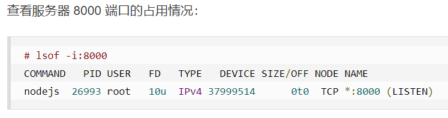


#### netstat

**netstat -tunlp** 用于显示 tcp，udp 的端口和进程等相关情况。

netstat 查看端口占用语法格式：

```powshell
netstat -tunlp | grep 端口号
```

- -t (tcp) 仅显示tcp相关选项
- -u (udp)仅显示udp相关选项
- -n 拒绝显示别名，能显示数字的全部转化为数字
- -l 仅列出在Listen(监听)的服务状态
- -p 显示建立相关链接的程序名

例如查看 8000 端口的情况，使用以下命令：

```powshell
# netstat -tunlp | grep 8000
tcp        0      0 0.0.0.0:8000            0.0.0.0:*               LISTEN      26993/nodejs   
```

更多命令：

```powshell
netstat -ntlp   //查看当前所有tcp端口
netstat -ntulp | grep 80   //查看所有80端口使用情况
netstat -ntulp | grep 3306   //查看所有3306端口使用情况
```

## 10.1.4 查看日志

1. tail

   显示一个文件最后的几行

   -n 显示行号，相当于nl命令

   ```shell
   tail -100f test.log //实时监控100行日志
   tail -n 10 test.log  //查询日志尾部最后10行的日志
   tail -n +10 test.log //查询10行之后的所有日志
   ```

2. head

   显示文件的前几行

   ```shell
   head -n 10 test.log //查询日志文件中的头10行日志
   head -n +10 test.log //查询日志文件除了最后10行的其他所有日志
   ```

3. cat

   concatenate files and print on the standard output

   ```shell
   cat -n test.log | grep "debug" //查询关键字的日志
   ```

4. tac

   concatenate and print files in reverse

5. echo

   在标准输出上显示一段字符

6. more

7. sed

   可以查找日志文件特定的一段，根据时间的一个范围查询，可以按照行号和时间范围查询

   ```shell
   sed -n '5,10p' filename //按照行号，只查看文件的第5行到第10行
   
   sed -n '/2014-12-17 16:17:20/,/2014-12-17 16:17:36/p' test.log
   ```

8. less

## 10.1.5 **chown**

**更改文件的所有者或组。**命令由单词change owner组合而成。

**1，更改文件的所有者：**

```
chown jim program.c 
文件 program.c 的所有者更改为 jim。作为所有者 jim 可以使用 chmod 命令允许或拒绝其他用户访问 program.c。
```

**2，更改目录的所有者：**

```
chown -R john:build /tmp/src

john:build 所有者：所在组

将目录 /tmp/src 中所有文件的所有者和组更改为用户 john 和组 build
- R 递归式地改变指定目录及其下的所有子目录和文件的拥有者。
- v 显示chown命令所做的工作。
```

## 10.1.6 chmod

改变文件和目录的权限

```
chmod [-cfvR] [--help] [--version] mode file ...
```

说明 : Linux/Unix 的文件权限分为三级 : **拥有者、群组、其他**。利用 chmod 控制文件如何被他人所调用。

```
参数 :
mode : 权限设定字串，格式如下 : [ugoa...][[+-=][rwxX]…][,...]，其中
u 表示该档案的拥有者，g 表示与该档案的拥有者属于同一个群体(group)者，o 表示其他以外的人，a 表示这三者皆是。

+ 表示增加权限、- 表示取消权限、= 表示唯一设定权限。

r 表示可读取，w 表示可写入，x 表示可执行，X 表示只有当该档案是个子目录或者该档案已经被设定过为可执行。
-c : 若该档案权限确实已经更改，才显示其更改动作
-f : 若该档案权限无法被更改也不要显示错误讯息
-v : 显示权限变更的详细资料
-R : 对目前目录下的所有档案与子目录进行相同的权限变更(即以递回的方式逐个变更)
–help : 显示辅助说明
–version : 显示版本
```

范例 :将档案 file1.txt 设为所有人皆可读取 

```
chmod ugo+r file1.txt 

chmod a+r file1.txt
```

将档案 file1.txt 与 file2.txt 设为该档案拥有者 与其所属同一个群体者可写入，但其他以外的人则不可写入 

```
chmod ug+w,o-w file1.txt file2.txt 
```

将 ex1.py 设定为只有该档案拥有者可以执行 

```
chmod u+x ex1.py 
```

将目前目录下的所有档案与子目录皆设为任何人可读取 

```shell
chmod -R a+r *
```

**chmod也可以用数字来表示权限如 chmod 777 file**

**语法为：chmod abc file**

**其中a,b,c各为一个数字，分别表示User、Group、及Other的权限。**

r=4，w=2，x=1 若要rwx属性则4+2+1=7； 若要rw-属性则4+2=6； 若要r-x属性则4+1=5。 范例： 

```shell
chmod a=rwx file 
chmod 777 file 
chmod ug=rwx,o=x file 
chmod 771 file 
```

若用chmod 4755 filename可使此程序具有root的权限

**nohup**

```markdown
不挂断执行命令

nohup Command [Arg ...] [&]

无论是否将 nohup 命令的输出重定向到终端，输出都将附加到当前目录的 nohup.out 文件中。
如果当前目录的 nohup.out 文件不可写，输出重定向到 $HOME/nohup.out 文件中。
如果没有文件能创建或打开以用于追加，那么 Command 参数指定的命令不可调用。
```

**scp**

Linux之间复制文件和目录

**语法**

```shell
scp [可选参数] file_source file_target

参数：
-C 允许压缩
-p 保留源文件
-r 递归复制整个目录
```

从本地复制到远程

```shell
scp local_file remote_username@remote_ip:remote_folder
```

从远程复制到本地

```shell
scp remote_username@remote_ip:remote_folder local_folder	
```

**wget**

下载文件

**ifconfig**

查看和配置Linux系统的网络接口

```
# 查看所有网络接口及其状态
ifconfig -a
```

**whereis**

查看某些命令的位置

```
# 查找命令位置
whereis ls
```

**tail**

显示文件内容

```
# 默认显示文件最后10行
tail filename.txt

# -n 指定要显示的行数
tail -n filename.txt
```

**cat**

查看文件内容

```
# 查看多个文件的内容
cat file1 file2

# -n 在每行的前面加上行号
cat -n file1 
```

**less**

显示文件内容

```
# 显示大型日志文件内容
less huge-log-file.log
```

**tee**

**more**

**dd**

**fdisk**

**grep**

在文件中查找字符串（不分区大小） -i

```shell
grep -i "待检索字段" 待检索文件
```

在文件夹中递归查询包含指定字符串的文件

```shell
grep -r "待检索字符" *	
```

输出成功匹配的行，以及该行之后的三行

```shell
grep -A 3 -i "待检索字符" 待检索文件	
```

**systemed**

**tar**

解压文件、创建文件

**压缩文件**

```shell
tar cvf 压缩生成的文件名.tar 待压缩文件
```

**解压文件**

```
tar xvf 压缩文件.tar
```

**查看压缩文件**

```
tar tvf 压缩文件.tar
```

**gzip**

创建和解压压缩文件

```
# 创建一个压缩文件
gzip test.txt

# 解压*.gz文件
gzip -d test.txt.gz
```

**unzip**

解压*.zip文件

```
unzip test.zip
```

**ps**

显示正在运行中的进程信息

```shell
-e # 显示所有
-f # Do full-format listing
-H # show process hierarchy
# 查看正在运行的所有进程  
ps -ef | more

# 以树状结构显示正在运行的进程
ps -efH | more
```

**free**

显示系统当前内存的使用情况，包括已用内存、可用内存和交换内存等情况

**ssh**

登录到远程主机

**sort**

对文件内容进行排序

```
# 以升序对文件内容排序
sort 文件
# 以降序对文件内容排序
sort -r 文件
```

**rm**

删除文件

```
# 删除文件前先确认 -i
rm -i 文件

# 递归删除文件夹下所有文件，并删除该文件夹
rm -r 文件
```

**cp**

**mv**

**kill**

终止一个进程，kill -9 终止该进程

**ls**

显示文件相关属性

**ll (ls -l)**

罗列出当前文件或目录的详细信息，含有时间、读写权限、大小、时间等信息 

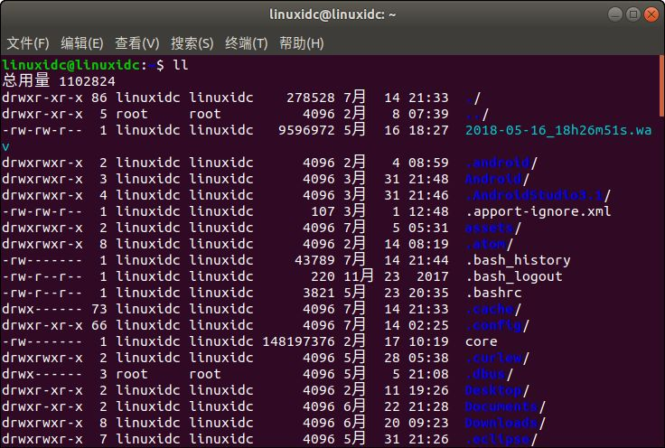

**pwd**

当前工作目录

**cd**

切换工作目录

**find**

查找指定文件名的文件

```shell
find -iname "MyProgram.c" # -i 不区分大小写 -name 文件名称	
```

```
# 对找到的文件执行某个命令
find -iname "MyProgram.c" -exec md5sum {} \;
```

# 10.2 Linux内核的CPU调度算法

## 10.2.1 先来先服务 FCFS: first come first service

如果早就绪的进程排在就绪队列的前面，迟就绪的进程排在就绪队列的后面，那么先来先服务总是把当前处于就绪队列之首的那个进程调度到运行状态。只考虑进程进入就绪队列的先后，而不考虑它的下一个CPU周期的长短及其他因素。

按照进程进入就绪队列的先后顺序调度并分配处理机执行。先来先服务调度算法是一种非抢占式的算法，先进入就绪队列的进程，先分配处理机运行。一旦一个进程占有了处理机，它就一直运行下去，直到该进程完成工作或者因为等待某事件发生而不能继续运行时才释放处理机。

1. 系统只要有按FIFO规则建立的后备作业队列或就绪进程队列即可，就是一个作业控制块JCB或进程控制块PCB加入队列时加在相应队列末尾。
2. 调度退出队列时从相应队列首开始顺序扫描，将相关的JCB或PCB调度移出相应队列。

**优点：有利于长作业以及CPU繁忙的作业**

**缺点：不利于短作业以及I/O繁忙的作业**

流程图：

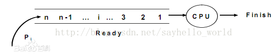

执行过程：

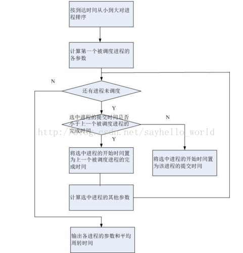

## 10.2.2 短作业(进程)优先调度算法

对预计执行时间短的作业（进程）优先分派处理机，通常后来的短作业不抢先正在执行的作业

优点：

- 比FCFS改善平均周转时间和平均带权周转时间，缩短作业的等待时间；

- 提高系统的吞吐量；

缺点：

- 对长作业非常不利，可能长时间得不到执行；
- 未能依据作业的紧迫程度来划分执行的优先级；
- 难以准确估计作业（进程）的执行时间，从而影响调度性能。

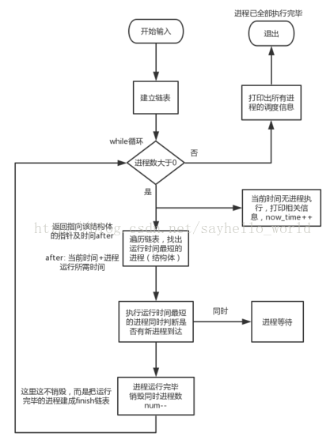

## 10.2.3 轮转法

让每个进程在就绪队列中的等待时间与享受服务的时间成正比例

时间片轮转法类似于“轮流坐庄”的思想，条件是：各作业近似认为“同时”到达，题中条件是后面作业依次比前一个作业迟到一个时间单位，分析时要严格按照RR调度算法的实现思想：系统把所有就绪进程按先入先出的原则排成一个队列。新来的进程加到就绪队列末尾。每当执行进程调度时，进程调度程序总是选出就绪队列的队首进程，让它在CPU上运行一个时间片的时间。当进程用完分给它的时间片后，调度程序便停止该进程的运行，并把它放入就绪队列的末尾。

流程图：

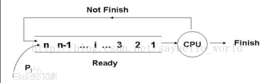

## 10.2.4 多级反馈队列算法

设置多个就绪队列，分别赋予不同的优先级，如逐级降低，队列1的优先级最高。每个队列执行时间片的长度也不同，规定优先级越低则时间片越长，如逐级加倍。

新进程进入内存后，先投入队列1的末尾，按FCFS算法调度；若按队列1一个时间片未能执行完，则降低投入到队列2的末尾，同样按FCFS算法调度；如此下去，降低到最后的队列，则按“时间片轮转”算法调度直到完成。

仅当较高优先级的队列为空，才调度较低优先级的队列中的进程执行。如果进程执行时有新进程进入较高优先级的队列，则抢先执行新进程，并把被抢先的进程投入原队列的末尾。

多级反馈队列调度算法又称反馈循环队列或多队列策略，主要思想是将就绪进程分为两级或多级，系统相应建立两个或多个就绪进程队列，较高优先级的队列一般分配给较短的时间片。处理器调度先从高级就绪进程队列中选取可占有处理器的进程，只有在选不到时，才从较低级的就绪进程队列中选取。

优点：

- 为提高系统吞吐量和缩短平均周转时间而照顾短进程。
- 为获得较好的I/O设备利用率和缩短响应时间而照顾I/O型进程。
- 不必估计进程的执行时间，动态调节

流程图：

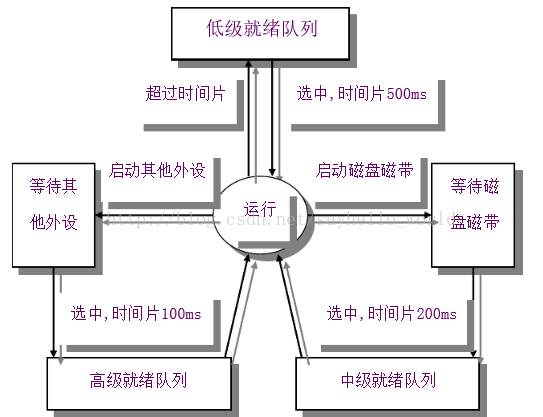

## 10.2.5 算法比较

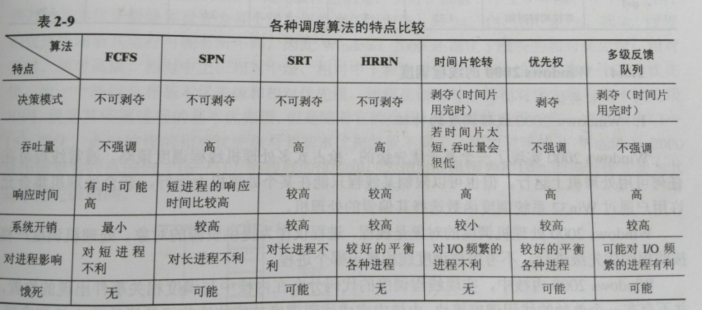


# 十一、设计模式

# 11.1 单例 多例

单例就是所有的请求都用一个对象来处理，比如我们常用的service和dao层的对象通常都是单例的，而多例则指每个请求用一个新的对象来处理，比如action; 

1. 单例模式和多例模式属于对象模式。
2. 单例模式的对象在整个系统中只有一份，多例模式可以有多个实例。
3. 它们都不对外提供构造方法，即构造方法都为私有。

# 11.2

## 十二、安全相关

# 12.1 PKI 

Public Key Infrastructure，公开密钥基础设施，三个概念：

1. 证明书
2. 认证机关
3. 证书库

PKI指的是证明书的制作和分发的一种机制。在这个机制的保障前提下，进行可信赖的网络通信。即安全的网路通信保障机制。


